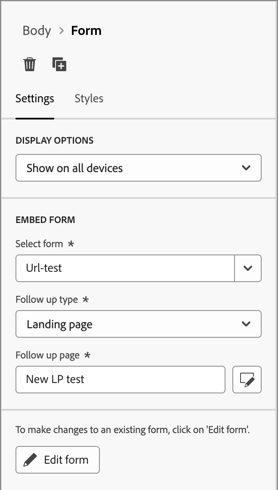

# 内容创作 — 添加表单

表单是可重复使用的组件，可由Adobe Journey Optimizer B2B edition中的多个登陆页面和登陆页面模板引用。 它是一个字段块和提交按钮，可以预先创建并快速插入该按钮，以使页面设计更快更一致。

以下示例概述了在设计页面时添加表单的步骤。

1. 在&#x200B;**[!UICONTROL 内容]**&#x200B;部分下，将&#x200B;**[!UICONTROL 表单]**&#x200B;项拖放到页面设计空间上的某个结构组件中。

   {width="600"}

   >[!TIP]
   >
   >要添加表单，使其占据电子邮件中的整个水平布局，请添加1:1列结构，然后将表单拖放到其中。

1. 单击组件工具栏中的&#x200B;_表单_&#x200B;图标，或使用右侧的&#x200B;**[!UICONTROL 嵌入表单]**&#x200B;属性选择发布的表单。

   {width="600"}

1. 如果要覆盖表单的默认&#x200B;**[!UICONTROL 跟进类型]**，请根据页面或模板的要求更改设置。

   这也称为表单的&#x200B;_感谢页面_，此设置确定访客提交表单时会发生什么情况：

   * **[!UICONTROL 停留在页面]** — 选择此选项可在提交表单时将访客停留在同一页面。

   * **[!UICONTROL 登陆页面]** — 选择此选项可选择任意Journey Optimizer B2B edition或Marketo Engage登陆页面作为跟进。

   * **[!UICONTROL 外部URL]** — 选择此选项可将任何URL指定为后续页面。 访客提交表单后，浏览器会加载指定的URL。

     >[!TIP]
     >
     >如果您希望使用表单下载文件，则可以指定托管文件的URL。 对于此配置，提交按钮将充当下载按钮。

   {width="280"}

1. 如果要按设备类型限制表单显示，请更改&#x200B;**[!UICONTROL 显示选项]**&#x200B;设置：

   * **[!UICONTROL 仅在桌面设备上显示]**
   * **[!UICONTROL 仅在移动设备上显示]**
   * **[!UICONTROL 在所有设备上显示]**（默认）

1. 如果需要，请选择右侧面板中的&#x200B;**[!UICONTROL 样式]**&#x200B;选项卡以设置页面中的表单边距。
