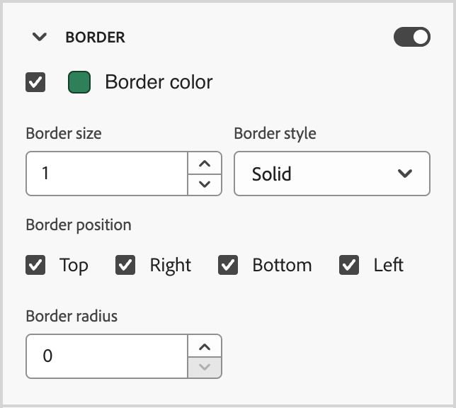

# 代码段

<!-- Content authoring steps for reuse -->

## 目的数据配置 {#intent-data-note}

>[!NOTE]
>
>为您的Journey Optimizer B2B edition实例配置目的数据后，即会包含目的数据。 还需要一个或多个已发布的历程&#x200B;**或**&#x200B;创建购买组。 有关意图检测模型以及如何提交关键字、产品和类别的详细信息，请参阅[意图数据](../user/admin/intent-data.md)。

## AEM Assets许可说明 {#aem-assets-licensing-note}

>[!NOTE]
>
>AEM Assets as a Cloud Service的许可证和Dynamic Media许可证是进行集成的先决条件。 确保启用了[Dynamic Media withOpen API](https://experienceleague.adobe.com/en/docs/experience-manager-cloud-service/content/assets/dynamicmedia/dynamic-media-open-apis/dynamic-media-open-apis-overview){target="_blank"}。 该集成仅限于&#x200B;_交付层_&#x200B;中的存储库。 如果您使用&#x200B;_创作层_&#x200B;并想要转换它，请与Adobe Experience Manager支持部门联系。 
>>根据您的合同和配置，在设计可视化内容时，可以直接从Adobe Experience Manager Assets B2B edition访问Adobe Journey Optimizer as a Cloud Service 。

## 内容创作 — 组件 — 结构步骤 {#structures-step}

1. 要开始内容设计，请从&#x200B;**[!UICONTROL 结构]**&#x200B;中拖动一个项，然后将其放到画布上。

   根据需要从&#x200B;_[!UICONTROL 结构]_&#x200B;添加任意数量的项，并编辑右侧窗格中每个项的设置。

   >[!TIP]
   >
   >选择&#x200B;_[!UICONTROL n:n列]_&#x200B;组件以定义您选择的列数（3到10之间）。 您还可以通过移动列下方的箭头来定义每列的宽度。

   {width="800" zoomable="yes"}

   每个列大小不能小于结构组件总宽度的10%。 只能删除空列。

## 内容创作 — 组件 — 内容步骤 {#contents-step}

1. 展开&#x200B;**[!UICONTROL 内容]**&#x200B;部分并将所需数量的元素添加到一个或多个结构组件中。

   {width="800" zoomable="yes"}
   <!--
   reference to the contents elements--->

## 内容创作 — 组件 — 设置步骤 {#settings-step}

1. 如果需要，您可以在&#x200B;_[!UICONTROL 设置]_&#x200B;或&#x200B;_[!UICONTROL 样式]_&#x200B;选项卡中为每个组件进行其他自定义。

   例如，可以更改每个组件的文本样式、填充或边距。

## 内容创作 — 资产步骤 {#assets-step}

1. 从&#x200B;_资产_&#x200B;选取器中，您可以直接选择存储在资产库中的资产。

   双击包含资产的文件夹。 将项目拖放到结构组件中。

   有关使用源类型中的资产的更多信息，请参阅[将资产添加到您的内容](../user/content/assets-overview.md#use-assets-for-content-authoring)。

   {width="800" zoomable="yes"}

## 内容创作 — 个性化步骤 {#personalization-step}

1. 插入个性化字段以根据用户档案属性、受众成员资格、上下文属性等自定义您的内容。

## 内容创作 — 启用条件内容步骤 {#dynamic-content-step}

1. 单击&#x200B;**[!UICONTROL 启用条件内容]**&#x200B;以添加动态内容，并根据条件规则将内容调整为目标配置文件。

## 内容创作 — 链接跟踪步骤 {#links-tracking-step}

1. 从左窗格中选择&#x200B;**[!UICONTROL 链接]**&#x200B;选项卡以显示您的内容中被跟踪的所有URL。

   您可以修改&#x200B;_跟踪类型_&#x200B;或&#x200B;_标签_，并根据需要添加标记。

## 内容组件 — 高级样式 {#styles-advanced}

若要使用值应用其他符合CSS的属性，请使用&#x200B;**[!UICONTROL 高级]**&#x200B;样式设置。 您可以更改现有属性的值或添加新属性。 样式使用父 — 子组件（元素）的CSS继承模型应用于组件。

显示的属性反映当前为组件定义的样式。 您可以根据[CSS定义](https://www.w3schools.com/CSSref/index.php){target="_blank"}更改值。 单击&#x200B;_添加_ (**+**)图标为组件添加新的样式属性。

{width="250"}

## 内容组件 — 水平对齐样式 {#styles-alignment-h}

展开&#x200B;**[!UICONTROL 对齐方式]**&#x200B;部分，然后选择要使用的水平对齐方式：左对齐、居中对齐或右对齐。 此样式将转换为标准`text-align` CSS样式，并影响该组件在容器组件中的放置方式。

{width="250"}

## 内容组件 — 垂直对齐样式 {#styles-alignment-v}

展开&#x200B;**[!UICONTROL 对齐方式]**&#x200B;部分，然后选择要使用的垂直对齐方式：顶部、中间或底部。 此样式将转换为标准`vertical-align` CSS样式，并影响容器组件中的位置。

{width="250"}

## 内容组件 — 水平和垂直对齐样式 {#styles-alignment-h-v}

展开&#x200B;**[!UICONTROL 对齐方式]**&#x200B;部分，然后选择要使用的水平和垂直对齐方式。 对齐样式会影响HTML组件在容器组件（结构或容器）中的放置方式。

水平对齐方式将转换为标准`text-align` CSS样式，您可以从左、中或右进行选择。 垂直对齐将转换为标准`vertical-align` CSS样式，您可以从顶部、中间或底部进行选择。

HTML组件的{width="300"}

## 内容组件 — 背景样式 {#styles-background}

在右侧面板中选择&#x200B;_[!UICONTROL 样式]_&#x200B;选项卡后，使用&#x200B;**[!UICONTROL 背景]**&#x200B;部分定义组件的背景颜色。

选中复选框，然后单击颜色方框以从选取器中选择颜色。 您可以通过输入已知的RGB、HSL、HSB或十六进制值来选择颜色。 或者，可以使用颜色滑块和颜色域来选择颜色。

{width="300"}

## 内容组件 — 边框样式 {#styles-border}

1. 在选择了&#x200B;_[!UICONTROL 样式]_&#x200B;选项卡的右侧面板上，展开&#x200B;**[!UICONTROL 边框]**&#x200B;部分并设置相应选项以显示组件的边框：

1. 将切换开关右移以启用边框显示选项，并根据您的设计标准进行设置：

   * 若要设置&#x200B;**[!UICONTROL 边框颜色]**，请选中该复选框，然后单击颜色正方形以从选取器中选择颜色。 您可以通过输入已知的RGB、HSL、HSB或十六进制值来选择颜色。 或者，可以使用颜色滑块和颜色域来选择颜色。

   {width="300"}

   * 要设置&#x200B;**[!UICONTROL 边框大小]** （线条宽度），请单击向上和向下箭头图标以增加或减少像素数。

   * 若要设置&#x200B;**[!UICONTROL 边框样式]**，请从标准CSS `border-style`值列表中选择一个值。

   * 要确定显示边框的位置，请选中每个&#x200B;**[!UICONTROL 边框位置]**&#x200B;复选框。

   {width="250"}

1. 对于&#x200B;**[!UICONTROL 边框半径]**，根据您想要的拐角曲线设置数值。

   值为0（默认）会产生一个方形角。

## 内容组件 — 边距样式 {#styles-margin}

在选择了&#x200B;_[!UICONTROL 样式]_&#x200B;选项卡的右侧面板上，展开&#x200B;**[!UICONTROL 边距]**&#x200B;部分并设置结构组件中的边距间距选项。 此样式复制CSS `margin`参数，该参数控制组件边框之外的空间，将其与其他组件分开。 它会在组件周围创建一个间隙，以影响其定位和周围内容的布局。

根据设计需要设置边距值（像素）。 您可以单独设置组件的所有边、上边框、左右边或每侧的边距：

* **所有边** — 若要设置一个值以应用于所有边，请清除每个边的&#x200B;**[!UICONTROL 不同边距]**&#x200B;复选框。 单击向上和向下箭头图标以增加或减少像素数。

  {width="250"}

* **上下** — 若要将上边距和下边距设置为相同的值，请设置上设置和下设置之间的&#x200B;_锁定_&#x200B;图标。 单击的向上和向下箭头图标可增加或减少像素数。

* **左右边距** — 若要将左右边距设置为相同的值，请设置左右设置之间的&#x200B;_锁定_&#x200B;图标。 单击的向上和向下箭头图标可增加或减少像素数。

  {width="250"}

* **独立** — 若要将每个边距设置为独立值，请在上下设置之间以及左右设置之间设置&#x200B;_Unlocked_&#x200B;图标。 对于每个设置，单击向上和向下箭头图标以增加或减少像素数。

  {width="250"}

## 内容组件 — 填充样式 {#styles-padding}

在选择了&#x200B;_[!UICONTROL 样式]_&#x200B;选项卡的右侧面板上，展开&#x200B;**[!UICONTROL 内边距]**&#x200B;部分，并设置结构组件内的内边距选项。 此样式将复制CSS `padding`参数，该参数是组件内容与其边框之间的空间。 内边距提供了内部间距，可用于控制内容与组件边框之间的距离。

根据设计需要设置以像素为单位的填充值。 您可以单独设置组件的所有边、上边框、左右边或每侧的边距：

* **所有边** — 若要设置一个值以应用于所有边，请清除&#x200B;**[!UICONTROL 每个边的不同边距]**&#x200B;复选框。 单击向上和向下箭头图标以增加或减少像素数。

  {width="250"}

* **Top-bottom** — 若要将顶边距和底边距设置为相同的值，请将&#x200B;_Locked_&#x200B;图标设置为介于顶设置和底设置之间。 单击的向上和向下箭头图标可增加或减少像素数。

* **左右边距** — 若要将左右边距设置为相同的值，请设置左右设置之间的&#x200B;_锁定_&#x200B;图标。 单击的向上和向下箭头图标可增加或减少像素数。

  {width="250"}

* **独立** — 若要将每侧的填充设置为独立值，请在顶部设置与底部设置之间以及左侧设置与右侧设置之间设置&#x200B;_已解锁_&#x200B;图标。 对于每个设置，单击向上和向下箭头图标以增加或减少像素数。

  {width="250"}

## 内容组件 — 大小样式 {#styles-size}

在选择了&#x200B;_[!UICONTROL 样式]_&#x200B;选项卡的右侧面板上，展开&#x200B;**[!UICONTROL 大小]**&#x200B;部分并设置组件高度和宽度的选项：

* **[!UICONTROL 高度]** — 单击向上和向下箭头图标以增加或减少像素数。 缺省值为空值(Auto)，并根据元素的内容调整元素的高度。

* **[!UICONTROL 宽度]** — 使用切换开关以像素或百分比设置宽度。

   * 对于百分比宽度，使用滑块设置百分比值。 百分比根据包含块的内容框确定元素大小，其中不包括填充和边框。 例如，如果值为50，则将元素宽度设置为其包含的块内容宽度的50%。

     使用百分比的{width="250"}

   * 对于基于像素的宽度，单击向上和向下箭头图标可增加或减少像素数。 缺省值为空值(Auto)，并根据元素的内容调整元素宽度。

     {width="250"}

## 内容组件 — 文本样式 {#styles-text}

在选择了&#x200B;_[!UICONTROL 样式]_&#x200B;选项卡的右侧面板上，展开&#x200B;**[!UICONTROL 文本]**&#x200B;部分并设置组件文本样式的选项：

* **[!UICONTROL 字体系列]** — 单击向下箭头图标，为组件中的文本选择字体系列。

* **[!UICONTROL 字体大小]** — 单击向上和向下箭头图标以增加或减小字体大小，或输入值。 对于输入的值，可以使用小数。

* **[!UICONTROL 行高]** — 单击向上和向下箭头图标以增加或减少行高，或输入值。 对于输入的值，可以使用小数。

  {width="250"}

* **[!UICONTROL 文本样式]** — 选择文本样式的图标： _粗体_、_斜体_、_下划线_&#x200B;或&#x200B;_删除线_。

* **[!UICONTROL 文本对齐方式]** — 选择水平文本对齐方式的图标： _左_、_居中_、_右_&#x200B;或&#x200B;_两端对齐_。

* **[!UICONTROL 字体颜色]** — 单击颜色正方形以从选取器中选择字体颜色。 您可以通过输入已知的RGB、HSL、HSB或十六进制值来选择颜色。 或者，可以使用颜色滑块和颜色域来选择颜色。

  {width="300"}

## 内容 — 图像选择 — Marketo DAM {#me-dam}

选择此类型以浏览并从Journey Optimizer B2B edition库或连接的Market Engage实例中选择图像资源。

{width="700" zoomable="yes"}

从该对话框中，您可以从所选存储库和工作区中选择图像。 单击&#x200B;**[!UICONTROL 选择]**&#x200B;以添加资产。

有多种工具可帮助您找到所需的资源：

* 单击左上角的&#x200B;_筛选器_&#x200B;图标以根据您的条件筛选显示的项目。

* 在&#x200B;_搜索_&#x200B;字段中输入文本，以筛选显示的项目以匹配资源名称。

  {width="700" zoomable="yes"}

## 内容 — 图像选择 — AEM Assets {#aem-assets-dam}

选择此类型以浏览并从[配置的Experience Manager Assets存储库](../user/admin/configure-aem-repositories.md)中选择图像资源。

从&#x200B;_[!UICONTROL 选择Assets]_&#x200B;对话框中，使用可用工具选择一个图像以查找所需的资源，然后单击&#x200B;**[!UICONTROL 选择]**：

* 更改右上角的&#x200B;**[!UICONTROL 存储库]**。

* 单击右上角的&#x200B;**[!UICONTROL 管理资源]**&#x200B;可在其他浏览器选项卡中打开Assets存储库并使用AEM Assets管理工具。

* 单击右上角的&#x200B;_视图类型_&#x200B;选择器以将显示更改为&#x200B;**[!UICONTROL 列表视图]**、**[!UICONTROL 网格视图]**、**[!UICONTROL 图库视图]**&#x200B;或&#x200B;**[!UICONTROL 瀑布视图]**。

* 单击&#x200B;_排序顺序_&#x200B;图标可在升序和降序之间更改排序顺序。

  {width="700" zoomable="yes"}

* 单击&#x200B;**[!UICONTROL 排序方式]**&#x200B;菜单箭头以将排序条件更改为&#x200B;**[!UICONTROL 名称]**、**[!UICONTROL 大小]**&#x200B;或&#x200B;**[!UICONTROL 修改时间]**。

* 单击左上角的&#x200B;_筛选器_&#x200B;图标以根据您的条件筛选显示的项目。

* 在&#x200B;_搜索_&#x200B;字段中输入文本，以筛选显示的项目以匹配资源名称。

  {width="700" zoomable="yes"}

## 内容 — 图像上传 {#image-upload}

选择此类型以从系统中选择一个文件，并将其导入Journey Optimizer B2B edition资源库。

在&#x200B;_[!UICONTROL 上传图像]_&#x200B;对话框中，将文件从您的系统拖放到文件框中。 最大文件大小为100 MB。

{width="450"}

对话框中显示所选图像的文件名。 资源文件名必须是唯一的（跨文件夹），如果具有该名称的文件已存在，则会显示一条消息。 名称最多可包含100个字符，并且不能包含特殊字符（如`;`、`:`、`\`和`|`）。

单击&#x200B;**[!UICONTROL 导入]**。

## 参与度得分活动 {#engagement-activities}

| 活动名称 | 描述 | 参与类型 | 每日最大频率计数 | 默认模型活动权重 |
| --- | --- | --- | --- | --- |
| [!UICONTROL 出席活动] | 成员参加了某个活动 | 活动 | 20 | 60 |
| 已单击[!UICONTROL 电子邮件] | 成员点击电子邮件中的链接 | 电子邮件 | 20 | 30 |
| [!UICONTROL 电子邮件已打开] | 成员打开一个电子邮件 | 电子邮件 | 20 | 30 |
| [!UICONTROL 表单已填写] | 成员在某个网页上填写并提交一份表单 | Web | 20 | 40 |
| [!UICONTROL 有趣的时刻] | 成员有一个有趣的时刻 | 策划的 | 20 | 60 |
| [!UICONTROL 链接点击次数] | 成员点击网页上的某个链接 | Web | 20 | 40 |
| [!UICONTROL 页面查看次数] | 成员查看网页 | Web | 20 | 40 |
| [!UICONTROL 注册事件] | 为事件注册的成员 | 活动 | 20 | 60 |
