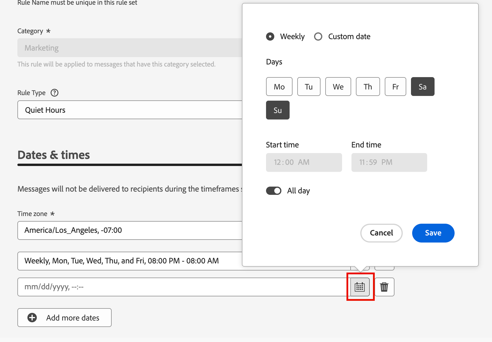

# 业务规则 {#business-rules}

>[!CONTEXTUALHELP]
>id="ajo-b2b-prime_business_rules_rule_sets"
>title="规则集"
>abstract="使用规则集对不同类型的营销通信应用频率上限或安静时间规则。 您还可以根据频率上限规则创建规则集，以将历程排除在部分受众之外。"

业务规则允许贵组织定义多个规则并将这些规则分组到规则集中，以便营销人员能够根据需要将它们应用于其电子邮件。 这提供了改进的粒度，以限制客户在特定时间范围内可进入的历程次数和频率，或根据通信类型控制用户接收消息的频率。

您可以创建两种类型的规则集：

* **渠道**&#x200B;规则集将规则应用于通信渠道。 它们允许您设置：

   * **频率上限规则** — 示例： *每天不发送多个电子邮件、短信、推送、直邮或WhatsApp通信。*
   * **无讯息小时规则** — 示例：*不在上午8点 — 晚上9点的时段之外发送电子邮件。*

* **历程**&#x200B;规则集将条目和并发上限规则应用于历程。 （Beta版本尚不支持。）

>[!PREREQUISITES]
>
>要使用业务规则，您需要以下CX Enterprise权限：
>
>* **[!UICONTROL 查看频率规则]**：访问和查看业务规则。
>* **[!UICONTROL 管理频率规则]**：创建、编辑或删除业务规则。

## 访问和管理规则集 {#access-manage}

要访问所有现有规则集，请在左侧导航中展开&#x200B;**[!UICONTROL 管理]**，然后选择&#x200B;**[!UICONTROL 业务规则]**。

{width="800" zoomable="yes"}

### 全局和自定义规则集 {#global-custom}

首次访问&#x200B;_规则集_&#x200B;时，默认规则集已预先创建并处于活动状态： **_[!UICONTROL 全局规则集]_**。 这是一个全局规则集，您可以应用它来控制用户在一个或多个渠道上接收消息的频率。 此规则集中定义的规则适用于所有选定渠道。

默认情况下，{width="700" zoomable="yes"}

除了此默认规则集外，您还可以创建自己的自定义规则集，并将其应用于历程或渠道节点以使用特定的上限和免打扰时间规则。

### 打开规则集 {#open-rule-set}

单击规则集名称可查看和编辑其规则定义。 将列出该规则集中包含的所有规则。 使用右上方的&#x200B;_更多菜单_ ( **...** )来激活、停用或删除它。

{width="700" zoomable="yes"}

### 编辑规则 {#edit-rules}

对于规则集中的任何草稿规则，单击规则名称旁边的&#x200B;_编辑_ （ ）图标以编辑规则设置。 您还可以单击&#x200B;_更多菜单_ ( **...** )图标以激活或删除规则。

{width="500" zoomable="yes"}

要停用规则，请单击活动规则旁边的&#x200B;_停用_ （ ）图标。 在确认对话框中，单击&#x200B;**[!UICONTROL 停用]**。 状态更改为&#x200B;**_[!UICONTROL 不活动]_**，并且该规则不适用于未来的消息执行。 当前正在执行的任何消息都不会受到影响。

>[!NOTE]
>
>停用规则或规则集不会影响或重置单个配置文件上的任何计数。

## 创建和激活自定义规则集 {#create}

>[!CONTEXTUALHELP]
>id="ajo-b2b-prime_rule_set_domain"
>title="规则集域"
>abstract="创建规则集时，您需要指定规则集中的规则是否会强制执行特定于通信渠道或历程的频次封顶规则。"

>[!CONTEXTUALHELP]
>id="ajo-b2b-prime_rule_sets_category"
>title="选择消息规则类别"
>abstract="在规则激活并应用到一条消息时，与所选类别匹配的所有频率规则将自动应用于该消息。 目前只有营销类别可用。"

>[!CONTEXTUALHELP]
>id="ajob2b-prime_rule_type"
>title="规则类型"
>abstract="为您的渠道规则集选择所需的规则类型：使用&#x200B;**频率上限**&#x200B;类型对通信渠道应用上限规则。 例如，每天不发送多个电子邮件或短信通信。 选择&#x200B;**静默时段**&#x200B;以定义基于时间的排除规则，确保在特定时间段内不会发送任何消息。"

>[!CONTEXTUALHELP]
>id="ajo-b2b-prime_rule_sets_duration"
>title="重置上限频率"
>abstract="选择用于重置上限计数器的日历期间：每小时、每天、每周或每月。 计数器会在每个新时段开始时自动重置为0。"

>[!CONTEXTUALHELP]
>id="ajo-b2b-prime_rule_set_rule_capping"
>title="规则频次封顶"
>abstract="设置规则的频次封顶。 根据规则集域和“规则类型”字段中的选择，该字段可以定义可以发送给某个轮廓的最大消息数，或者该轮廓可以同时进入或注册的最大历程数。"

>[!CONTEXTUALHELP]
>id="ajo-b2b-prime_journey_business_rules"
>title="规则集"
>abstract="选择要应用于自定义操作的规则集。"

>[!NOTE]
>
>您最多可以为渠道域创建10个规则集，为历程域创建10个规则集，总共有20个规则集。

1. 展开左侧导航栏中的&#x200B;**[!UICONTROL 管理]**，然后选择&#x200B;**[!UICONTROL 业务规则]**。

1. 在&#x200B;_[!UICONTROL 规则集]_&#x200B;列表页面上，单击右上角的&#x200B;**[!UICONTROL 创建规则集]**。

   {width="400"}

1. 输入规则集的唯一&#x200B;**[!UICONTROL Name]**（必需），并添加&#x200B;**[!UICONTROL Description]**（可选）。

1. 选择规则集&#x200B;**[!UICONTROL 域]**。

   * **[!UICONTROL 渠道]** — 对通信渠道应用上限规则或无提示小时数规则。
   * **[!UICONTROL 历程]** — 将登入和并发上限规则应用于历程。

   >[!IMPORTANT]
   >
   >此Beta版本中尚不支持历程规则。

1. 单击&#x200B;**[!UICONTROL 保存]**。

   {width="700" zoomable="yes"}

### 添加规则 {#add-rules}

创建规则集后，添加要包含的每个规则。

1. 单击&#x200B;**[!UICONTROL 添加规则]**。

1. 根据用途配置规则参数。

   可用于规则的参数取决于创建规则集时选择的规则集域。

   {width="700" zoomable="yes"}

   有关配置历程和渠道规则的详细信息，请参阅以下部分：

   <!-- * [Journey capping](../conflict-prioritization/journey-capping.md) -->
   * [根据渠道和通信类型设置频率上限](#frequency-capping)
   * [免打扰时间](#quiet-hours)

1. 单击&#x200B;**[!UICONTROL 创建规则]**&#x200B;以确认创建规则。

   新规则在规则集中列出，状态为&#x200B;_草稿_。

1. 重复上述步骤，根据需要为规则集添加任意数量的规则。

   创建规则后，该规则处于&#x200B;_[!UICONTROL 草稿]_&#x200B;状态，尚不能影响任何消息。

   {width="700" zoomable="yes"}

1. 要激活规则集的规则，请单击规则名称旁边的&#x200B;_更多菜单_ ( **...** )图标，然后选择&#x200B;**[!UICONTROL 激活]**。

   在确认对话框中，单击&#x200B;**[!UICONTROL 激活]**。

### 激活规则集 {#activate-rule-set}

激活规则集即可将其应用于历程或渠道消息。 当规则集处于活动状态时，无法向其添加更多规则。 您可以停用它以进行更改，然后再次激活它。

1. 从&#x200B;_规则集_&#x200B;列表页面打开规则集。

1. 单击右上方的&#x200B;_更多菜单_ ( **...** )，然后选择&#x200B;**[!UICONTROL 激活规则集]**。

   {width="700" zoomable="yes"}

1. 在确认对话框中，单击&#x200B;**[!UICONTROL 激活]**。

   >[!NOTE]
   >
   >完全激活规则或规则集最多可能需要10分钟。 您无需修改消息或重新发布历程，规则即可生效。

您可以将活动的规则集应用到消息或历程，具体取决于规则集的域设置。

## 按渠道设置频率上限 {#frequency-capping}

按渠道和通信类型设置频度上限以限制用户档案可以接收的消息数量，并避免具有类似通信的过度客户。 渠道规则集将上限规则应用于通信渠道。 例如，每天不发送多个电子邮件或短信通信。

利用渠道规则集，可设置按通信类型划分的频率封顶，以防止消息类似的客户超载。 例如，您可以创建一个规则集以限制发送给客户的&#x200B;_促销通信_&#x200B;的数量，并创建另一个规则集以限制发送给客户的&#x200B;_新闻稿_&#x200B;的数量。 然后，您可以选择应用促销通信或新闻稿规则集。

>[!IMPORTANT]
>
>要确保渠道级别上限正常工作，请确保在构建历程时选择最高优先级的命名空间。 在 [Platform 身份标识服务指南](https://experienceleague.adobe.com/zh-hans/docs/experience-platform/identity/features/identity-graph-linking-rules/namespace-priority){target="_blank"}中详细了解命名空间优先级

### 创建渠道频率上限规则 {#create-capping-rule}

>[!CONTEXTUALHELP]
>id="ajo-b2b-prime_rule_sets_channel"
>title="定义规则适用的渠道"
>abstract="请至少选择一个渠道。 对所有渠道的总计数应用频次封顶。"

1. 选择要添加上限规则的渠道规则集，或创建新的渠道规则集。

1. 在规则集页面中，单击&#x200B;**[!UICONTROL 添加规则]**&#x200B;并输入规则的唯一名称。

   >[!NOTE]
   >
   > _[!UICONTROL 类别]_&#x200B;字段指定规则的消息传送类别。 目前，此字段为只读字段，只有&#x200B;**[!UICONTROL Marketing]**&#x200B;类别可用。

1. 对于&#x200B;_[!UICONTROL 规则类型]_，请选择&#x200B;**[!UICONTROL 渠道上限]**。

   {width="700" zoomable="yes"}

1. 在&#x200B;**[!UICONTROL 上限计数]**&#x200B;字段中，设置规则的上限值。

   此值是根据您在其他字段中的选择，每月、每周、每天或每小时可以发送到单个用户配置文件的最大消息数。

1. 对于&#x200B;**[!UICONTROL 重置上限频率]**，请选择是否要应用上限。

   频率上限基于所选的日历期间。 它会在相应时间范围的开头重置。 选择计数器在每个时段内的到期时间：

   * **[!UICONTROL 小时]** — 频率上限对所选小时数有效。 计数器会在每个时间窗口的开头自动重置。 对于1小时的频率限制，它每小时重置一次，与UTC一小时的结束时间重合。
   * **[!UICONTROL 每日]** — 每日频率上限在23:59:59 UTC之前的该天有效，并在第二天开始时重置为0。
   * **[!UICONTROL 每周]** — 频率上限有效期到星期六23:59:59 UTC为止。 无论规则是在何时创建的，有效期都适用。 例如，如果规则是在星期四创建的，则此规则的有效期到星期六23:59:59。
   * **[!UICONTROL 每月]** — 频率上限在每月最后一天23:59:59 UTC之前有效。 例如，1月的每月到期时间为01-31 23:59:59 UTC。

   >[!IMPORTANT]
   >
   >* 为确保准确性，请确保在创作历程时选择最高优先级的命名空间。 在 [Platform 身份标识服务指南](https://experienceleague.adobe.com/zh-hans/docs/experience-platform/identity/features/identity-graph-linking-rules/namespace-priority){target="_blank"} 中详细了解命名空间优先级
   >
   >* 当传送通信时，配置文件计数器值将更新。 当您发送大量通信时请考虑这一点，因为吞吐量可能会导致收件人会在通信开始后几分钟甚至几小时内收到电子邮件（如果您同时发送数百万条通信）。 如果收件人收到两个彼此靠近的通信，则这一点很重要。 建议将通信间隔至少隔开两个小时（在可能的情况下），以便给收件人提供足够的时间，使其能够接收通信，并相应地更新计数器值。

1. 使用&#x200B;**[!UICONTROL Every]**&#x200B;字段设置上限规则在多个小时、天、周或月内的频率（具体取决于指定的时间范围）。

   请确保输入的值与选定的持续时间类型匹配： _小时_&#x200B;为1-23，_每日_&#x200B;为1-30，_每周_&#x200B;为1-4，_每月_&#x200B;为1-3。

   当新的时间窗口开始时，计数器自动重置为0。 对于两天的频率上限，此重置在UTC午夜每两天发生一次。

1. 选择要用于此规则的渠道：

   * **[!UICONTROL 电子邮件]**
   * **[!UICONTROL 短信]**（此Beta版本当前不支持）
   * **[!UICONTROL 推送通知]**（此Beta版本当前不支持）
   * **[!UICONTROL 直邮]** （此Beta版本当前不支持）
   * **[!UICONTROL WhatsApp]**（此Beta版本当前不支持）

   {width="700" zoomable="yes"}

   如果要将上限应用到所有选定渠道的总数，请选择多个渠道。

   例如，将上限设置为5，然后选择电子邮件和短信渠道。 如果某用户档案在选定时间段内已收到三封营销电子邮件和两封营销短信消息，则该用户档案会从任何营销电子邮件或短信消息的下一次投放中排除。

1. 单击&#x200B;**[!UICONTROL 保存]**&#x200B;以确认创建规则。

   频率规则已添加到状态为&#x200B;_[!UICONTROL 草稿]_&#x200B;的规则集。

1. 重复上述步骤，根据需要向规则集添加任意数量的规则。

1. 当上限规则准备就绪，可应用于消息时，激活规则和规则集。

### 应用渠道上限规则集 {#apply-capping-rule}

1. 创建历程时，为您为规则选择的渠道添加其中一个发送[操作节点](../marketing/action-nodes.md)，并编辑消息的内容。

1. 在&#x200B;_[!UICONTROL 操作]_&#x200B;选项卡上，使用频率上限规则将&#x200B;**[!UICONTROL 业务规则]**&#x200B;选项设置为规则集。

   {width="600" zoomable="yes"}

   >[!NOTE]
   >
   >列表中仅提供激活的规则集。

   <!--Messages where the category selected is **[!UICONTROL Transactional]** will not be evaluated against business rules.-->

1. 在激活历程之前，请确保将其计划在将来的至少10分钟后执行。

   这提供了在所选业务规则的配置文件中填充计数器值所需的时间。 如果立即激活历程，则规则集计数器值无法填充到收件人的用户档案中，并且消息不会计入其自定义规则集的频率上限规则中。

<!-- 
1. You can view the number of profiles excluded from delivery in the [Customer Journey Analytics report](../reports/report-gs-cja.md), and in the [Live report](../reports/live-report.md), where frequency rules will be listed as a possible reason for users excluded from delivery.

-->

>[!NOTE]
>
>同一渠道可以应用多个规则，但一旦到达下限，用户档案将从下次投放中排除。

测试频率规则时，建议使用新创建的测试用户档案，因为当达到用户档案的频率上限时，将无法重置计数器，直到下一时间段。 停用规则允许有上限的用户档案接收消息，但不会移除或删除任何计数器增量。

## 设置免打扰时间 {#quiet-hours}

**_安静时间_**&#x200B;允许您定义电子邮件、短信、推送和WhatsApp渠道的基于时间的排除项。 这可确保在特定时间段内不发送任何消息，从而帮助您尊重客户偏好并满足合规性要求。

>[!NOTE]
>
>在当前Beta版本中，历程仅支持电子邮件和WhatsApp渠道。

您可以通过规则集应用无提示小时数，并将其分配给历程中的单个渠道操作，以便精确控制。 通过简化这些标准，您可以增强客户体验、节省时间并确保遵守通信规则：

* **不要唤醒您的客户** - *正确的客户、正确的渠道、正确的时间*&#x200B;是许多营销人员的箴言，因此时间是客户历程的关键部分是有意义的。 通过设置免打扰时间规则，品牌可以更好地控制联系人接收消息的时间，确保他们在更有可能对您的消息采取行动时收到消息。
* **便利** — 在需要阻止受众接收消息而无需停止整个历程或营销活动时，可以轻松拦截营销活动和历程之间的通信。
* **节省时间** — 通过创建基于&#x200B;**时间的规则**&#x200B;在一个位置管理排除项，而不是通过自定义表达式添加多个条件节点。\
  <!--* **Extra Safeguard** - Benefit from an extra safeguard in case audience criteria or time-window configurations were incorrectly set, ensuring individuals are still excluded when they should be.-->

>[!BEGINSHADEBOX]

**护栏和限制**

* **传播延迟** — 对静默小时规则的更新可能需要长达12小时才能应用于已使用该规则的渠道操作。
* **高容量延迟** — 在大容量通信的情况下，系统可能需要额外的时间才能开始成功实施静默小时抑制。

>[!ENDSHADEBOX]

<!--* **Custom actions** – For custom actions, only quiet hours rules are enforced. If a rule set also includes other rules (e.g., frequency capping), those rules are ignored.-->
<!--* **Pre-suppression window** – The system begins suppressing communications 30 minutes before quiet hours start, ensuring that no messages are delivered once the quiet period begins.-->

### 创建免打扰时间规则 {#create-quiet-hour-rules}

>[!NOTE]
>
>安静时间只能在&#x200B;**_自定义规则集_**&#x200B;中定义。 全局规则集不支持quiet hours配置。

1. 选择要添加规则的渠道规则集，或创建新的渠道规则集。

1. 在规则集页面中，单击&#x200B;**[!UICONTROL 添加规则]**&#x200B;并输入规则的唯一名称。

   >[!NOTE]
   >
   > _[!UICONTROL 类别]_&#x200B;字段指定规则的消息传送类别。 目前，此字段为只读字段，只有&#x200B;**[!UICONTROL Marketing]**&#x200B;类别可用。

1. 对于&#x200B;_[!UICONTROL 规则类型]_，选择&#x200B;**[!UICONTROL 无讯息小时数]**。

   {width="700" zoomable="yes"}

1. 在&#x200B;**[!UICONTROL 日期和时间]**&#x200B;部分中，定义何时应用无提示小时数：

   * 对于&#x200B;**[!UICONTROL 时区]**，请为受众中的所有收件人选择标准时区，而不考虑他们各自的时区。

     若要使用每个配置文件中的时区字段，请选择&#x200B;**[!UICONTROL 使用收件人本地时区]**。

     >[!IMPORTANT]
     >
     >如果配置文件没有时区值，则不会对该配置文件强制实施无提示小时数。

   * 单击&#x200B;_日历_&#x200B;图标并指定应用免打扰时间的时间段。

      * **[!UICONTROL 每周]** — 选择一周中的特定日期和时间段。 您还可以强制实施规则&#x200B;**[!UICONTROL 全天]**。

      * **[!UICONTROL 自定义日期]** — 在日历和时隙中选择特定日期。 您还可以强制实施规则&#x200B;**[!UICONTROL 全天]**。

     {width="450"}的日历对话框

   * 单击&#x200B;**[!UICONTROL 添加更多日期]**&#x200B;按钮最多可添加五个单独的句点。

1. 在&#x200B;**[!UICONTROL 在免打扰时间处理操作]**&#x200B;部分中，选择在选定时间段内如何处理消息：

   

   * **[!UICONTROL 将消息排入队列]** — 消息在静默时段结束时发送，除非处于暂停状态。

     >[!NOTE]
     >
     >如果消息在配置文件的排队状态中保留超过7天，则将丢弃该消息。

   * **[!UICONTROL 放弃邮件]** — 从不发送邮件。

     >[!NOTE]
     >
     >如果选择&#x200B;**[!UICONTROL 放弃]**&#x200B;并将此规则应用于历程操作，则会从消息投放中删除该用户档案并将其从历程中退出。

1. 单击&#x200B;**[!UICONTROL 保存]**&#x200B;以确认创建规则。

   您的免打扰时间规则已添加到状态为&#x200B;_[!UICONTROL 草稿]_&#x200B;的规则集。

1. 重复上述步骤，根据需要向规则集添加任意数量的规则。

1. 当规则准备好应用于消息时，激活规则和规则集。

### 将安静时间应用于历程操作 {#apply-quiet-hours}

保存规则并激活规则集后，您可以将其应用于历程中的渠道操作。

1. 创建历程时，为您为规则选择的渠道添加其中一个发送[操作节点](../marketing/action-nodes.md)，并编辑消息的内容。

1. 在&#x200B;_[!UICONTROL 操作]_&#x200B;选项卡上，将&#x200B;**[!UICONTROL 业务规则]**&#x200B;选项设置为具有无讯息小时数规则的规则集。

   {width="600" zoomable="yes"}

   >[!NOTE]
   >
   >列表中仅提供激活的规则集。

1. 准备就绪后完成并发布历程。
