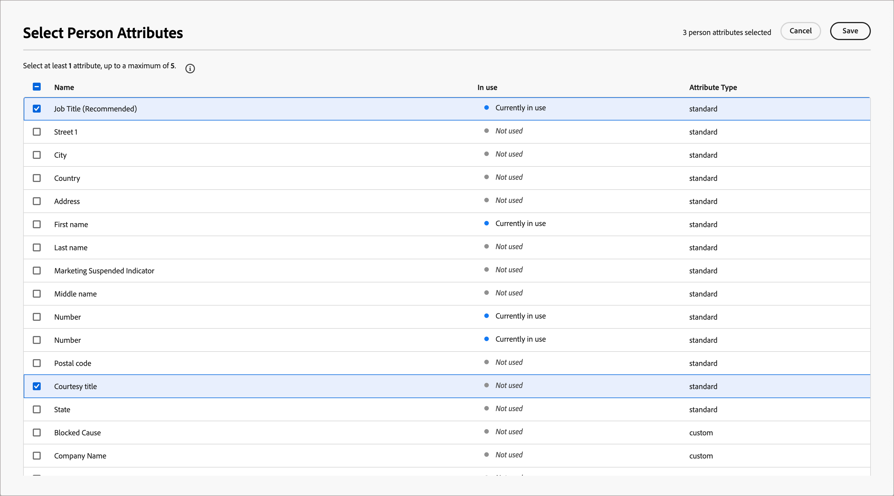

# 人物角色映射

<!-- not available until GA -->

角色是基于帐户的营销(ABM)方法中的关键方面，因为它们帮助营销人员根据目标帐户中个人的特定需求、偏好和棘手问题调整其策略。 营销人员可以为每个角色创建详细的配置文件，包括其背景、职责、棘手问题和首选通信渠道。 借助这些定义，管理员可以根据Journey Optimizer B2B Prime中的人员属性配置角色，以便人员列表和人员历程可以使用简化且一致的筛选来捕获这些角色。

在Journey Optimizer B2B Prime中，角色映射提供了超出角色模板条件的附加功能：您可以使用&#x200B;**[!UICONTROL 派生角色]**&#x200B;作为筛选条件来筛选[人员列表](../audiences/people-lists.md)和[人员历程](../marketing/person-journeys.md)。 _派生角色_&#x200B;是系统通过根据所有配置的角色定义评估其属性而推断的人员记录的角色。

角色定义和使用限制：

* 您最多可以在&#x200B;_[!UICONTROL 角色映射]_&#x200B;列表中定义20个角色。
* 每个角色在其定义中最多可以包含五个属性。
* 在所有定义的角色中，您最多可以使用10个不同的人员属性。

>[!BEGINSHADEBOX]

**用例：职务变体**

许多营销和销售团队使用职称作为识别帐户中不同角色的一种方式。 但联系人的标题可能会不一致，并且会为类似角色使用大量变体。 在构建人员列表过滤器或人员历程受众条件时，可能要求您为给定角色定义每个可能的相关职务。 您可以简化这些定义，并将具有类似职称的人员归入一个推断的角色下，然后通过筛选&#x200B;_派生角色是产品管理_&#x200B;而不是匹配单个职称值来定位该推断角色。

>[!ENDSHADEBOX]

## 访问配置的角色 {#access}

1. 在左侧导航中，选择&#x200B;**[!UICONTROL 管理]** > **[!UICONTROL 配置]**。

1. 单击中间面板上的&#x200B;**[!UICONTROL 角色映射]**&#x200B;以显示角色列表。

   {width="800" zoomable="yes"}

   在此页面中，您可以[创建](#create-a-persona)、[编辑](#edit-a-persona)或[删除](#delete-a-persona)角色。

   角色映射列表以表格形式组织，并在顶部显示最近更新的角色（按&#x200B;_[!UICONTROL 上次更新]_&#x200B;排序）。 您可以通过单击右上角的&#x200B;_列设置_ （  ）图标并选中或清除列复选框来自定义显示的表。

   要在角色映射列表中显示的{width="300"}

1. 要访问角色的详细信息，请单击名称。

### 默认角色

_角色映射_&#x200B;列表包含根据职务属性定义的五个默认角色。 您可以根据组织的需求编辑以下任何默认角色：

| 用户画像 | 职称 |
| ------- | ---------- |
| CXO / EVP - CXO /执行副总裁 | 首席执行官、首席信息官、首席技术官、首席运营官、首席财务官、战略执行副总裁 |
| SVP/VP — 高级副总裁/副总裁 | 营销部副总裁、销售部副总裁、运营部副总裁、产品部副总裁、 IT部副总裁 |
| 高级董事/董事 — 高级董事/董事 | 工程总监、高级产品总监、财务总监、客户成功总监 |
| 高级经理/经理 — 高级经理/经理 | 高级营销经理、IT经理、运营经理、销售经理、人力资源经理 |
| 个人贡献者 — 个人贡献者 | 客户主管、软件工程师、营销专家、客户成功代表 |
| 分析师 — 分析师 | 业务分析师、数据分析师、市场研究分析师、财务分析师、运营分析师 |
| 开发人员 — 开发人员 | 前端开发人员、后端开发人员、全栈开发人员、移动应用程序开发人员、开发运营工程师 |
| 专业人员 — 专业人员 | 人力资源专家、法律顾问、合规干事、项目经理、采购专家 |
| 顾问 — 顾问 | 管理顾问、IT顾问、业务流程顾问、营销顾问 |
| 其他 — 其他 | 行业专家、独立顾问、自由顾问、主题专家 |

### 列表筛选

要查找所需的角色，请在搜索栏中输入文本字符串，以按名称匹配角色。

{width="700" zoomable="yes"}

## 创建角色 {#create-a-persona}

1. 在左侧导航中，选择&#x200B;**[!UICONTROL 管理]** > **[!UICONTROL 配置]**。

1. 单击中间面板中的&#x200B;**[!UICONTROL 角色映射]**。

1. 单击&#x200B;**[!UICONTROL 创建角色]**。

1. 输入角色的唯一的&#x200B;**[!UICONTROL Name]**&#x200B;和&#x200B;**[!UICONTROL Description]**（可选）。

   {width="700" zoomable="yes"}

1. 选择用于匹配角色的属性。

   * 单击&#x200B;**[!UICONTROL 选择人员属性]**。

   * 在对话框中，选中要映射的每个属性的复选框（最多五个）。

     您可以通过单击右上角的&#x200B;_列设置_ （  ）图标来自定义显示的表。

     要按名称筛选属性列表，请在搜索栏中输入文本字符串。 您还可以单击左上角的&#x200B;_筛选器_（）图标，以按类型&#x200B;_标准_&#x200B;或&#x200B;_自定义_&#x200B;筛选显示的列表。

     {width="700" zoomable="yes"}

   * 单击&#x200B;**[!UICONTROL 保存]**。

     选定的属性填充在&#x200B;_[!UICONTROL 角色属性]_&#x200B;部分。

1. 对于每个属性，输入要与属性匹配的逗号分隔值。

1. 单击&#x200B;**[!UICONTROL 提交]**。

## 编辑角色 {#edit-a-persona}

单击角色名称以访问和编辑角色的详细信息。

您可以更改名称或说明、添加属性或更新属性值。 完成更改后，单击&#x200B;**[!UICONTROL 提交]**。

## 删除角色 {#delete-a-persona}

删除角色会将其从&#x200B;_角色映射_&#x200B;列表中删除，并且它不再作为人员列表或人员历程中的派生角色过滤器提供。

1. 在&#x200B;_[!UICONTROL 角色映射]_&#x200B;页面上，找到要删除的角色。

1. 在名称旁边，单击省略号(**...**) 图标并选择&#x200B;**[!UICONTROL 删除]**。

1. 在确认对话框中单击&#x200B;**[!UICONTROL 删除]**。

## 按派生角色过滤 {#derived-persona-filter}

配置角色后，Journey Optimizer B2B Prime通过根据定义的角色映射评估记录的属性，为每个人员记录派生角色。 在为人员列表或人员历程定义受众时，您可以使用推断的结果（_派生角色_）作为过滤器。

派生角色筛选器与其他推断的属性（如历程成员资格）一起显示在筛选器面板的&#x200B;**[!UICONTROL 特殊筛选器]**&#x200B;类别下。

### 人员列表

在静态人员列表中添加或删除成员时，或者为动态人员列表定义成员资格规则时，您可以按派生角色进行筛选，以定向其属性与特定配置角色匹配的所有人员。

**静态列表 — 添加成员**

1. 打开静态列表，然后单击右上方的&#x200B;**[!UICONTROL 添加人员]**。

1. 在筛选器对话框中，展开&#x200B;**[!UICONTROL 特殊筛选器]**，然后将&#x200B;**[!UICONTROL 派生角色]**&#x200B;拖到画布上。

1. 在筛选条件中，选择&#x200B;**[!UICONTROL 是]**，然后从列表中选择一个或多个角色。

1. 单击&#x200B;**[!UICONTROL 完成]**&#x200B;以应用筛选器并将匹配的人员限定在列表中。

**动态列表 — 设置成员资格规则**

1. 打开动态列表并选择&#x200B;**[!UICONTROL 规则]**&#x200B;选项卡。

1. 单击&#x200B;**[!UICONTROL 编辑规则]**。

1. 在筛选器对话框中，展开&#x200B;**[!UICONTROL 特殊筛选器]**，然后将&#x200B;**[!UICONTROL 派生角色]**&#x200B;拖到画布上。

1. 在筛选条件中，选择&#x200B;**[!UICONTROL 是]**，然后从列表中选择一个或多个角色。

1. 单击&#x200B;**[!UICONTROL 完成]**&#x200B;以保存规则。

   在根据规则评估人员记录时，成员资格会自动更新。

### 人员历程

在使用事件受众配置人员历程的受众时，您可以使用派生角色作为人员配置文件过滤器，以控制哪些人员进入历程。

1. 单击历程画布中的&#x200B;**[!UICONTROL 人员受众]**&#x200B;节点。

1. 在节点属性面板中，选择&#x200B;**[!UICONTROL 事件受众]**&#x200B;作为受众类型。

1. 在&#x200B;**[!UICONTROL 个人资料筛选器]**&#x200B;下，单击&#x200B;**[!UICONTROL 添加筛选器]**。

1. 展开&#x200B;**[!UICONTROL 特殊筛选器]**&#x200B;并将&#x200B;**[!UICONTROL 派生角色]**&#x200B;拖到筛选器画布上。

1. 在筛选条件中，选择&#x200B;**[!UICONTROL 是]**，然后从列表中选择一个或多个角色。

   只有其派生角色与选定值匹配的用户才有资格进入历程。
