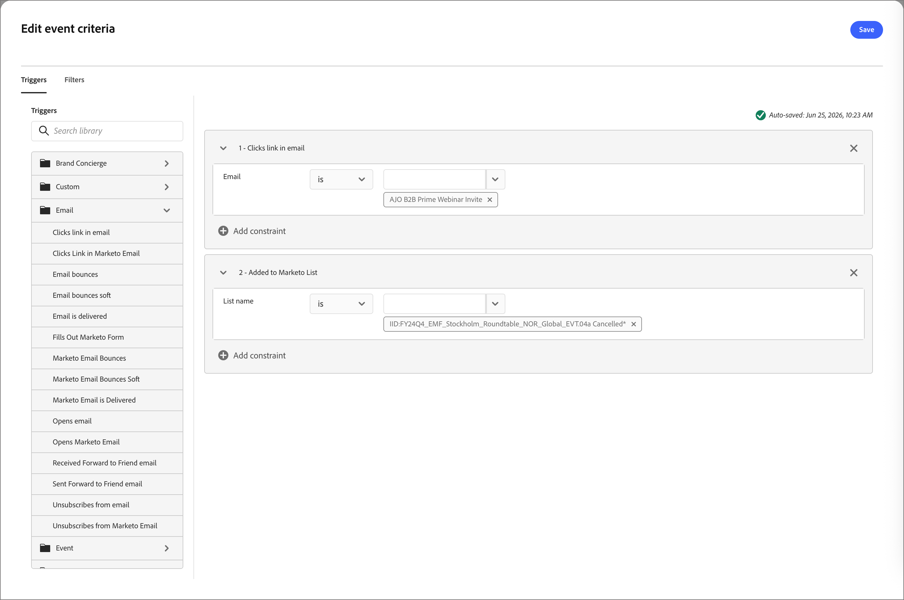

# 基于事件的受众

在[!DNL Adobe Journey Optimizer B2B Prime]中，基于&#x200B;_事件的受众_&#x200B;允许您在发生[!DNL Marketo Engage]活动时近乎实时地将受众成员添加到实时[人员历程](../marketing/person-journeys.md)。 您可以在历程画布的受众节点上配置基于事件的受众：

* 选择一个或多个[!DNL Marketo Engage]活动（标准或自定义）作为符合条件的事件。
* （可选）添加人员配置文件过滤器（如行业、区域或生命周期阶段）以缩小可输入的人员范围。
* （可选）定义活动属性约束（如特定表单、URL或程序）以缩小每个活动的符合条件的发生次数。

当符合条件的活动在[!DNL Marketo Engage]中登录潜在客户并复制到[!DNL Adobe Journey Optimizer B2B Prime]中时，系统会根据您配置的筛选器和约束评估相应的人员记录。 如果满足条件，人员会立即通过受众节点进入旅程。

为人员历程定义基于事件的受众(_T):_

1. 选择&#x200B;[_人员受众_&#x200B;节点](../marketing/person-audience-node.md)。

1. 在右侧的节点属性中，选择&#x200B;**[!UICONTROL 事件受众]**&#x200B;作为条目类型。

   {width="400"}

1. 单击&#x200B;**[!UICONTROL 添加事件条件]**。

1. 在&#x200B;_[!UICONTROL 编辑事件标准]_&#x200B;对话框中，添加一个或多个[!DNL Marketo Engage]活动作为符合条件的事件，例如：

   * _出席网络研讨会_
   * _电子邮件已送达_
   * _点击电子邮件中的链接_

   >[!NOTE]
   >
   >您还可以选择在关联的[!DNL Marketo Engage]实例中定义的自定义活动。

   设置每个活动的匹配运算符和值。

   针对基于事件的受众的{width="700" zoomable="yes"}

   当为该潜在客户记录了这些已配置活动中的任意活动时，即表明人员符合历程的条件。

1. （可选）要将事件和过滤器组合用于受众资格，请添加人员级别过滤器。

   * 选择&#x200B;**[!UICONTROL 筛选器]**&#x200B;选项卡。
   * 拖动每个筛选器并设置匹配条件。

   基于事件的受众的{width="700" zoomable="yes"}

   如果添加过滤器，则人员必须至少满足一个已配置活动条件和已配置过滤器。

1. 单击&#x200B;**[!UICONTROL 保存]**。
