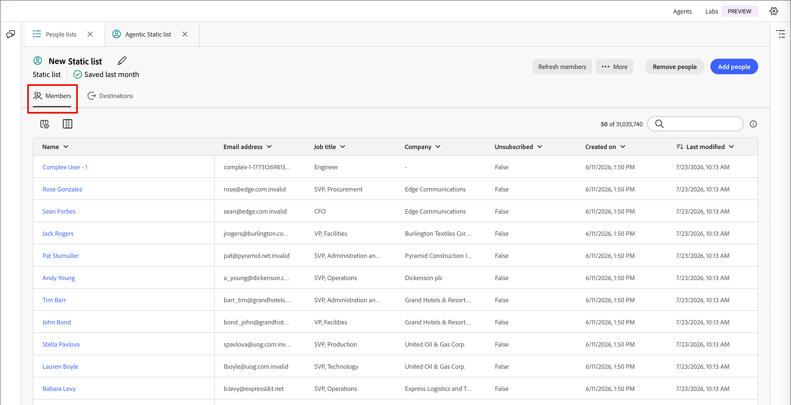
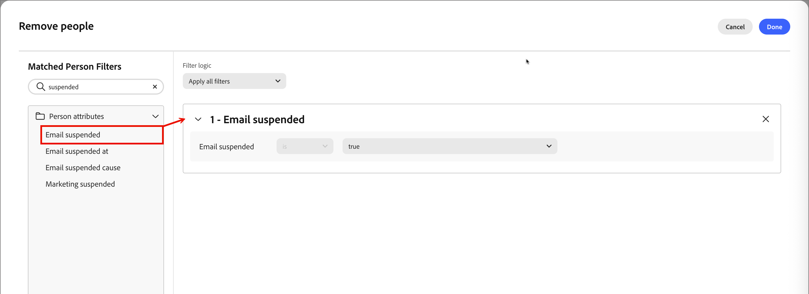
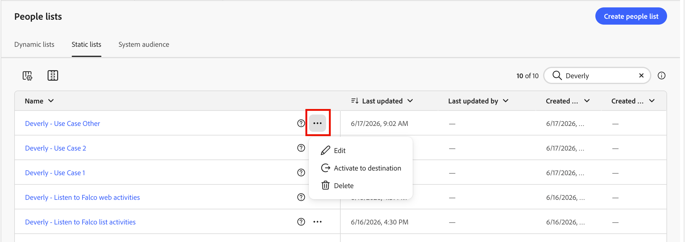
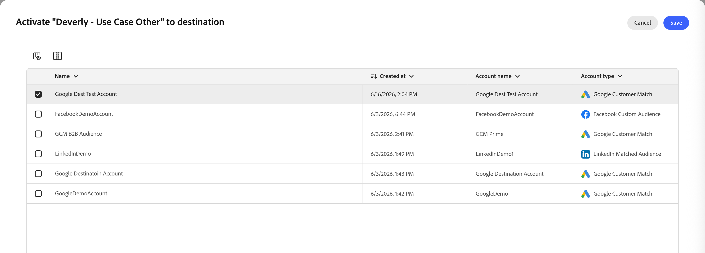

# 人员列表

在[!DNL Adobe Journey Optimizer B2B Prime]中，人员列表是用于定位和人员历程条目的人员级别受众容器，具有基于规则的实时资格的动态列表以及固定或历程管理成员资格的静态列表。

## 访问和浏览人员列表 {#access-browse}

1. 在左侧导航栏中，展开&#x200B;**[!UICONTROL 营销管理]**。

1. 在&#x200B;**[!UICONTROL 营销]**&#x200B;资源列表的右侧，选择&#x200B;**[!UICONTROL 人员列表]**。

   {width="800" zoomable="yes"}

该页面有两个选项卡，您可以在其中查看和管理&#x200B;**[!UICONTROL 动态列表]**&#x200B;和&#x200B;**[!UICONTROL 静态列表]**。 单击选项卡可在两种类型之间切换列表视图。

您可以在列表顶部的&#x200B;_搜索_&#x200B;工具中输入文本，以按名称筛选显示的列表。 使用列表工具自定义显示的列表：

* 单击&#x200B;_自定义表_ （）图标以控制显示的列。
* 单击&#x200B;_重置列_ （ ）图标可重置列宽。

您还可以在这个空间执行以下操作：

* 创建新的动态和静态列表
* 查看当前成员资格的访问列表
* 应用成员资格过滤器

<!--
## Audience Hub

The AI Audience Hub is a centralized, AI-driven starting point for all audience-related capabilities across [!DNL Adobe Journey Optimizer B2B Prime]. It is designed to accelerate first-time user success while progressively unlocking advanced intelligence, insights, and control for returning and power users.

The Hub acts as:

* A guided starting point for discovering, creating, and refining person lists, account lists, and buying groups

* A visibility layer for audience health, coverage, overlap, engagement patterns, and AI-driven insights

* A control center for audience governance, optimization, reuse, and readiness for activation across journeys and sales workflows

### High level structure

Prompt-based starting point - Quick Start prompts and freeform input to help users discover, create, or optimize audiences.

1. AI insights feed - Surfaces key audience signals such as overlap, gaps, saturation risk, and optimization opportunities.

1. Adaptive audience library - A personalized view of people lists, account lists, and buying groups that adapts based on usage, relevance, and activation.

1. Optimization and arbitration nudges - Guides users to refine, split, or reuse audiences before activation.

1. Audience visibility and reporting - High-level insight into audience health, engagement patterns, and usage across active journeys.

### Empty and Error States (High-Level)

No audiences / no data - Show Quick Start prompts to help first-time users create or import person lists

Low data or incomplete audience - Explain what's missing (e.g., insufficient contacts, missing persona coverage, or low engagement data) and suggest next steps.

AI insights unavailable - Provide a graceful fallback with a clear explanation, so users understand why insights aren't shown and what actions they can take manually.
-->

## 创建人员列表 {#create-people-list}

1. 单击&#x200B;_[!UICONTROL 人员列表]_&#x200B;页面右上角的&#x200B;**[!UICONTROL 创建列表]**。

1. 在对话框中，选择一个项目作为列表的&#x200B;**[!UICONTROL 父项]**。

1. 输入列表的&#x200B;**[!UICONTROL Name]**（必需）和&#x200B;**[!UICONTROL Description]**（可选）。

1. 选择列表&#x200B;**[!UICONTROL 类型]**：

   * [**[!UICONTROL 静态]**](#static-lists) — 成员资格由您在创建列表时评估的合格筛选器决定。 除非您手动使记录符合资格或取消符合资格，否则列表成员资格不会更新。
   * [**[!UICONTROL 动态]**](#dynamic-lists) — 成员资格由符合条件的筛选器动态确定。 列表成员资格将自动刷新。

   {width="450"}

1. 单击&#x200B;**[!UICONTROL 创建]**。

>[!NOTE]
>
>此Beta版本中的人员列表当前不支持删除和复制。

## 静态列表 {#static-lists}

静态列表成员资格由引用人员属性和活动的简单过滤器定义。 除非您手动授予成员资格或取消成员资格，否则成员资格不会更改。

>[!NOTE]
>
>在列表中添加或删除成员时，静态列表筛选器定义只应用一次。 定义的过滤器在之后不可用。 如果要使用过滤器维护一致的受众定义，请改用动态列表。

<!--
What internet says about Marketo static lists -- which of these is also true in AJO B2B Prime?

* Manual Targeting: Storing fixed cohorts, such as attendees of a specific webinar, people who purchased a certain product, or a list of competitors.
* Third-Party Syncing: Allowing external platforms (like Amplitude or Twilio Segment) to automatically sync and export groups of users directly into Marketo as targeted audiences.
* Status Tracking: Helping marketers organize leads into specific categories or track multi-value interests without needing to create new, permanent database fields.List 
* Segmentation: Acting as a reliable, unchanging recipient or suppression list for email campaigns and engagement programs. Unlike a Smart List—which dynamically adds or removes people based on changing criteria or rules—a static list serves as a reliable snapshot. People remain on the list until explicitly added or removed by you or a backend flow.

So far, activating to a destination is the only thing that they are used for that I have found.
-->

### 添加成员 {#static-list-add-members}

1. 打开静态列表，然后单击右上方的&#x200B;**[!UICONTROL 添加人员]**。

1. 在对话框中，通过从左侧拖放过滤器来定义用于限定商机的规则。

   您可以使用以下任意组合来筛选人员：

   * 活动历史记录
   * 公司属性
   * 人员属性
   * 历程成员资格等特殊过滤器

   对于您添加的每个筛选器，单击&#x200B;**[!UICONTROL 添加约束]**&#x200B;以细化筛选器的匹配条件。

   {width="700" zoomable="yes"}

1. 要保存更改，请单击&#x200B;**[!UICONTROL 完成]**。

1. 选择&#x200B;**[!UICONTROL 成员]**&#x200B;选项卡。

   经过一段时间后，符合条件的成员会出现在列表中。

   静态列表的{width="700" zoomable="yes"}

### 移除成员 {#static-list-remove-members}

1. 打开静态列表，然后单击右上方的&#x200B;**[!UICONTROL 删除人员]**。

1. 在&#x200B;_[!UICONTROL 删除人员]_&#x200B;对话框中，添加筛选器以匹配要取消资格的成员。

   {width="700" zoomable="yes"}

1. 要保存更改，请单击&#x200B;**[!UICONTROL 完成]**。

1. 选择&#x200B;**[!UICONTROL 成员]**&#x200B;选项卡。

   经过一段时间后，被取消资格的成员离开该列表。

### 激活到目标 {#static-list-activate}

激活静态列表后，该列表可在下游系统中操作，包括持续同步而不是手动导出。 这对于付费媒体定位、抑制和下游编排非常有用。

* 静态列表充当人员的容器。
* 激活会将该成员资格发送/同步到目标。
* 然后，目标可以对这些人执行一些操作，例如在LinkedIn中定位他们或从外部受众中删除他们。

由于激活模型是持久性的，而不是一次性导出：

* 以后添加到列表中的人员会自动传播。
* 以后删除的人员会自动停用。
* 营销人员可避免重复的CSV导出和手动上传。
* 历程可以随着时间的推移刷新受众，以进行持续编排。

>[!PREREQUISITES]
>
>您必须先为[!DNL Journey Optimizer B2B Prime]沙盒配置一个或多个[目标](./destinations.md)，然后才能将静态列表激活到目标。

1. 选择&#x200B;**[!UICONTROL 静态列表]**&#x200B;选项卡。

1. 找到要激活到目标的静态列表。

1. 单击列表旁边的&#x200B;_更多菜单_ ( **...** )图标，然后选择&#x200B;**[!UICONTROL 激活到目标]**。

   {width="450"}

   您还可以打开静态列表并使用右上方的&#x200B;_[!UICONTROL 更多]_&#x200B;菜单。

   <!-- which UI is it?  _Activate_ (  ) icon next to the static list name. -->

1. 选中已配置的目标连接的复选框。

   {width="600" zoomable="yes"}

1. 单击&#x200B;**[!UICONTROL 保存]**。

1. 单击&#x200B;**[!UICONTROL 激活]**，在&#x200B;_[!UICONTROL 激活到目标]_&#x200B;对话框中确认激活。

激活完成后，将显示确认消息（_目标已激活。_） 并且目标在列表的&#x200B;**[!UICONTROL 目标]**&#x200B;选项卡上列为&#x200B;**[!UICONTROL 活动]**。 静态列表可以一次激活到多个目标；成员资格同步到所有目标。

要查看静态列表激活到的目标，请打开该列表并选择&#x200B;**[!UICONTROL 目标]**&#x200B;选项卡。 默认情况下，新列表未连接目标。

#### 取消激活目标 {#deactivate-destination}

1. 打开静态列表并选择&#x200B;**[!UICONTROL 目标]**&#x200B;选项卡。

1. 单击要删除的目标行上的&#x200B;_减号_ ( **-** )图标。

1. 在&#x200B;_[!UICONTROL 停用目标]_&#x200B;对话框中确认。

取消激活会从列表中删除目标。 列表中的人员也会从连接的目标受众中删除。

## 动态列表 {#dynamic-lists}

动态列表成员资格是使用引用人员属性和活动的简单过滤器定义的。 通过根据筛选逻辑鉴别和取消潜在客户资格来自动维护成员资格。

### 设置成员资格规则 {#set-membership-rules}

1. 打开动态列表并选择&#x200B;**[!UICONTROL 规则]**&#x200B;选项卡。

1. 单击&#x200B;**[!UICONTROL 编辑规则]**。

   {width="550" zoomable="yes"}

1. 在对话框中，通过从左侧拖放过滤器来定义用于限定商机的规则。

   您可以使用以下任意组合来确定潜在客户是否符合列表的条件：

   * 活动历史记录
   * 公司属性
   * 人员属性
   * 历程成员资格等特殊过滤器

   对于您添加的每个筛选器，单击&#x200B;**[!UICONTROL 添加约束]**&#x200B;以细化筛选器的匹配条件。

   {width="700" zoomable="yes"}

1. 要保存更改，请单击&#x200B;**[!UICONTROL 完成]**。

1. 选择&#x200B;**[!UICONTROL 成员]**&#x200B;选项卡。

   经过一段时间后，符合条件的成员会出现在列表中。

   {width="700" zoomable="yes"}

   要打开[人员详细信息](./person-details.md)页面，您可以在其中查看摘要和近期活动，请单击列表中的人员姓名。

### 复制动态列表 {#duplicate-dynamic-list}

对于动态列表，复制操作类似于克隆函数。 使用此函数复制成员资格筛选并将其添加到其他程序。

1. 在&#x200B;_[!UICONTROL 动态列表]_&#x200B;选项卡中，单击列表旁边的&#x200B;_更多菜单_ ( **...** )图标，然后选择&#x200B;**[!UICONTROL 复制]**。

1. 在对话框中，为重复列表选择&#x200B;**[!UICONTROL 父]**&#x200B;程序。

1. 输入唯一的&#x200B;**[!UICONTROL Name]**（必需）和&#x200B;**[!UICONTROL Description]**（可选）。

   默认情况下，该对话框使用附加了`_copy`的原始列表的名称。 根据需要为列表输入其他唯一名称。

   {width="375"}

1. 单击&#x200B;**[!UICONTROL 复制]**。
