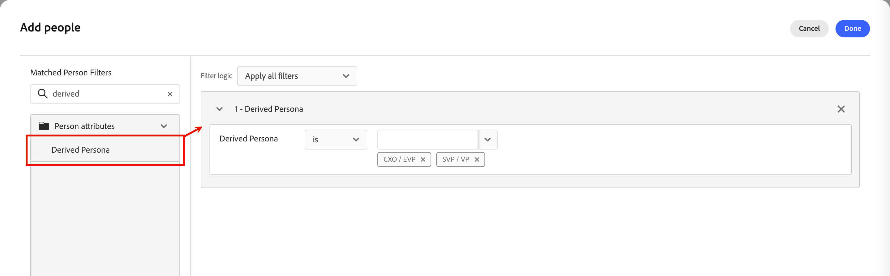
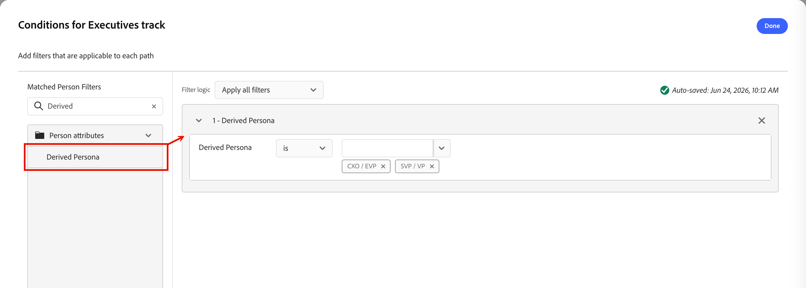

# 派生角色

角色分类将原始客户数据转换为语义购买者对人工智能的理解，用于生成上下文并推动每个渠道和历程的个性化决策。 此统一配置文件允许：

* _历程分支_ — 按角色、参与深度和角色拆分路径路由潜在客户
* _历程仲裁_ — 确定潜在客户当前属于哪个Nurture，避免并发程序间的消息冲突
* _内容个性化_ — 特定于角色的叙述（“对于执行人员”与“对于从业人员”）的内容
* _销售限定词上下文_ - BDR将获得一个屏幕摘要，其中显示“此人是谁，他们关心什么，他们在购买历程中的位置”

## 默认角色 {#default-ersonas}

对于Journey Optimizer B2B Prime的Beta版本，根据职务属性定义了以下默认角色：

| 用户画像 | 职称 |
| ------- | ---------- |
| [!UICONTROL CXO / EVP] | 首席执行官、首席信息官、首席技术官、首席运营官、首席财务官、战略执行副总裁 |
| [!UICONTROL SVP/VP] | 营销部副总裁、销售部副总裁、运营部副总裁、产品部副总裁、 IT部副总裁 |
| [!UICONTROL 高级经理/经理] | 高级营销经理、IT经理、运营经理、销售经理、人力资源经理 |
| [!UICONTROL 个人参与者] | 客户主管、软件工程师、营销专家、客户成功代表 |
| [!UICONTROL 分析师] | 业务分析师、数据分析师、市场研究分析师、财务分析师、运营分析师 |
| [!UICONTROL 开发人员] | 前端开发人员、后端开发人员、全栈开发人员、移动应用程序开发人员、开发运营工程师 |
| [!UICONTROL 专业员工] | 人力资源专家、法律顾问、合规干事、项目经理、采购专家 |
| [!UICONTROL 顾问] | 管理顾问、IT顾问、业务流程顾问、营销顾问 |
| [!UICONTROL 其他] | 行业专家、独立顾问、自由顾问、主题专家 |

>[!NOTE]
>
>在“一般可用性”版本中，您将能够根据组织的需求编辑这些默认角色中的任何一个。 它还将支持自定义角色定义和映射。

## 按派生角色过滤 {#derived-persona-filter}

Journey Optimizer B2B Prime通过根据定义的角色评估记录的属性，为每个人员记录派生角色。 在为人员列表定义受众或在人员历程中进行分段时，您可以使用推断的结果（_派生角色_）作为过滤器。

_[!UICONTROL 派生角色]_&#x200B;筛选器显示在&#x200B;**[!UICONTROL 人员属性]**&#x200B;类别下的筛选器面板中。

### 人员列表 {#people-lists}

在[静态人员列表](./people-lists.md#static-list)中添加或删除成员时，或者为[动态人员列表](./people-lists.md#dynamic-lists)定义成员资格规则时，您可以按派生角色进行筛选，以定位其属性与特定配置角色匹配的所有人员。

{width="750" zoomable="yes"}

**静态列表 — 添加成员**

1. 打开静态列表，然后单击右上方的&#x200B;**[!UICONTROL 添加人员]**。

1. 在筛选器对话框中，展开&#x200B;**[!UICONTROL 人员属性]**，并将&#x200B;**[!UICONTROL 派生角色]**&#x200B;拖到画布上。

1. 在筛选条件中，选择&#x200B;**[!UICONTROL 是]**，然后从列表中选择一个或多个角色。

1. 单击&#x200B;**[!UICONTROL 完成]**&#x200B;以应用筛选器并将匹配的人员限定在列表中。

**动态列表 — 设置成员资格规则**

1. 打开动态列表并选择&#x200B;**[!UICONTROL 规则]**&#x200B;选项卡。

1. 单击&#x200B;**[!UICONTROL 编辑规则]**。

1. 在筛选器对话框中，展开&#x200B;**[!UICONTROL 人员属性]**，并将&#x200B;**[!UICONTROL 派生角色]**&#x200B;拖到画布上。

1. 在筛选条件中，选择&#x200B;**[!UICONTROL 是]**，然后从列表中选择一个或多个角色。

1. 单击&#x200B;**[!UICONTROL 完成]**&#x200B;以保存规则。

   在根据规则评估人员记录时，成员资格会自动更新。

### 人员历程 {#person-journeys}

在&#x200B;[_拆分路径_&#x200B;节点](../marketing/split-merge-paths-nodes.md)中配置人员历程分段时，您可以使用派生角色作为人员配置文件过滤器来控制哪些人员进入历程路径。

针对拆分路径条件{width="750" zoomable="yes"}

1. 单击历程画布中的&#x200B;**[!UICONTROL 拆分路径]**&#x200B;节点。

1. 在右侧的节点属性面板中，单击路径的&#x200B;**[!UICONTROL 应用条件]**&#x200B;或&#x200B;**[!UICONTROL 编辑条件]**。

1. 在筛选器对话框中，展开&#x200B;**[!UICONTROL 人员属性]**，并将&#x200B;**[!UICONTROL 派生角色]**&#x200B;拖到画布上。

1. 在筛选条件中，选择&#x200B;**[!UICONTROL 是]**，然后从列表中选择一个或多个角色。

1. 单击&#x200B;**[!UICONTROL 完成]**&#x200B;保存路径的过滤器。
