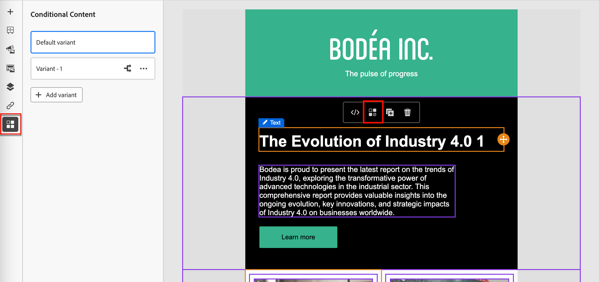
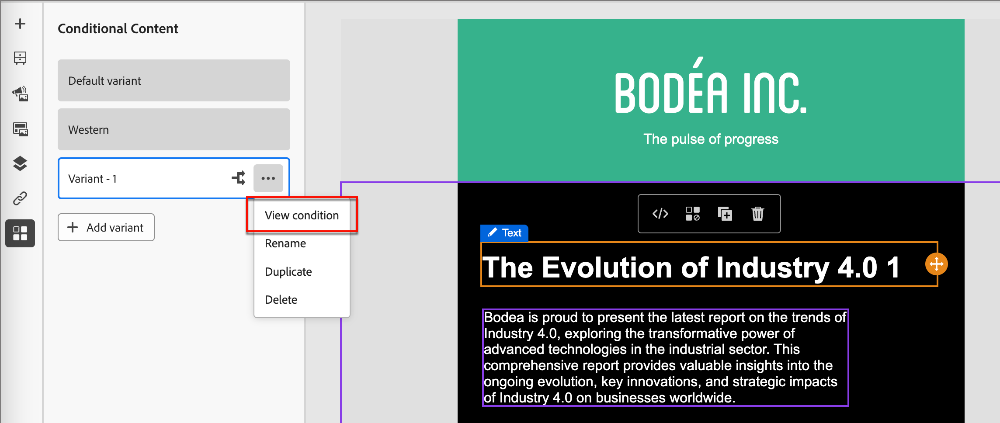
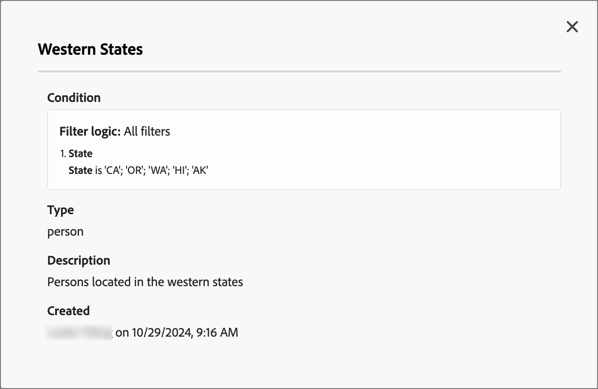

# 条件内容

条件内容允许您根据条件规则调整电子邮件和片段内容。 这些规则是使用配置文件属性或上下文事件定义的。 您可以在规则生成器中创建条件规则，并且可以存储这些规则以便在人员历程中重复使用。

要向片段和电子邮件添加条件内容，[!DNL Journey Optimizer B2B Prime]允许您应用存储在&#x200B;_条件_&#x200B;库中的条件规则。 在创作[电子邮件内容](./email-authoring.md)或[片段](./fragment-authoring.md)时在可视设计空间中应用条件规则。

## 添加条件内容 {#add-conditional-content}

>[!CONTEXTUALHELP]
>id="ajo-b2b-prime_conditional_content"
>title="条件内容"
>abstract="使用条件规则创建内容组件的多个变体。 如果在发送消息时不满足任何条件，则会显示默认变体中的内容。"

>[!CONTEXTUALHELP]
>id="ajo-b2b-prime_conditional_rule_select"
>title="条件内容"
>abstract="使用保存在库中的条件规则或创建新规则。"

在可视设计空间中创作[片段](./fragment-authoring.md)或[电子邮件](./email-authoring.md)时，请使用条件规则为内容组件定义多个变体。

1. 选择一个内容组件，然后单击组件工具栏中的&#x200B;**[!UICONTROL 启用条件内容]**&#x200B;图标。

   请参阅[内容组件工具栏](./content-components.md#content-component-toolbars)。

   该组件以橙色列出，表示它作为条件组件激活。 **[!UICONTROL 条件内容]**&#x200B;窗格显示在左侧，带有&#x200B;_默认变体_&#x200B;和&#x200B;_变体 — 1_。

   {width="700" zoomable="yes"}

   所选并激活的原始内容是默认内容，当您定义的任何变体都不满足任何条件规则时，将应用该内容。

   在此窗格中，您可以使用条件规则为所选内容组件定义多个变体。

1. 将鼠标悬停在第一个变体（_变体 — 1_）上，然后单击&#x200B;_选择条件_&#x200B;图标（）。

   {width="700" zoomable="yes"}选择条件

   _[!UICONTROL 选择条件]_&#x200B;对话框打开并显示条件库。

   如果要查看条件的详细信息以确保所需内容，请单击&#x200B;_更多菜单_&#x200B;图标(**...**) 并选择&#x200B;**[!UICONTROL 查看信息]**。

   {width="600" zoomable="yes"}

   如果所需的条件不存在，[通过单击&#x200B;**[!UICONTROL 新建]**&#x200B;创建一个条件规则](#create-conditional-rule)。

1. 选择条件规则并单击&#x200B;**[!UICONTROL 选择]**&#x200B;以将其与变体关联。

<!-- 

   You can review the associated condition by clicking the _More menu_ icon (**...**) for the variant and choosing **[!UICONTROL View condition]**.

   {width="600" zoomable="yes"}

   Click X at the top right to close the popup.

   {width="500"}

   -->

1. 为了提高可读性，请单击&#x200B;_更多菜单_&#x200B;图标(**...**)重命名变体 ，然后选择&#x200B;**[!UICONTROL 重命名]**。

   为变体输入一个有意义的名称，以帮助您识别变体及其意图。

   {width="600" zoomable="yes"}

1. 在左窗格中选择变体后，更改组件，以改变它在条件为true时消息中的显示方式。

   在此示例中，文本组件的变体根据收件人的区域使用不同的描述。

   {width="600" zoomable="yes"}

1. 如果需要，单击&#x200B;**[!UICONTROL 添加变体]**&#x200B;以定义另一个变体。

   重复步骤2 - 5以选择条件、重命名变体并更改变体的组件。

   您可以根据内容组件的需要添加任意数量的变体。 可随时在左窗格中更改选定的变体以检查条件中内容组件的显示方式。

   >[!IMPORTANT]
   >
   >条件内容将按照变体的列出顺序根据关联的规则进行评估。 组件的第一个变量具有评估为true的条件。
   >
   >如果在发送消息时未定义任何变体条件的计算结果为true，则内容组件将根据&#x200B;**[!UICONTROL 默认变体]**&#x200B;显示。

1. 要删除变体，请单击&#x200B;_更多菜单_&#x200B;图标(**...**) 为变体选择&#x200B;**[!UICONTROL 删除]**。

   在确认对话框中，单击&#x200B;**[!UICONTROL 删除]**。

## 条件规则 {#conditional-rules}

条件规则是一组条件表达式，可以计算为true或false。 使用这些规则可根据各种过滤器（如用户档案属性或上下文事件）确定要在消息中显示的内容变体。

规则存储在条件库中，可在电子邮件和片段内容中重复使用它们以供您的组织使用。

<!--
M1.5 info -- out of date?

### Condition filters {#condition-filters}

| Condition type | Filters | Description |
| -------------- | ------- | ----------- |
| **Account** | Account Attributes | Attributes from the account profile, including: <li>Annual revenue</li><li>City</li><li>Country</li><li>Employee size</li><li>Industry</li><li>Name</li><li>SIC code</li><li>State</li> |
| | [!UICONTROL Special filters] > [!UICONTROL Has Buying Group] | The account does or does not have members of buying groups. The filter can also be evaluated against one or more of the following criteria: <li>Solution Interest</li><li>Buying Group status</li><li>Completeness Score</li><li>Engagement Score</li> |
| **Person** | [!UICONTROL Activity history] > [!UICONTROL Email] | Email activities associated with the journey: <li>[!UICONTROL Clicked link in email]</li><li>Opened Email</li><li>Was delivered email</li><li>Was sent email</li> These conditions are evaluated using a selected email message from earlier in the journey. |
| | [!UICONTROL Person Attributes] | Attributes from the person profile, including: <li>City</li><li>Country</li><li>Date of birth</li><li>Email address</li><li>Email invalid</li><li>Email suspended</li><li>First name</li><li>Inferred state region</li><li>Job title</li><li>Last name</li><li>Mobile phone number</li><li>Phone number</li><li>Postal code</li><li>State</li><li>Unsubscribed</li><li>Unsubscribed reason</li> |
| | [!UICONTROL Special filters] > [!UICONTROL Member of Buying Group] | The person is or is not a buying group member evaluated against one or more of the following criteria: <li>Solution Interest</li><li>Buying Group status</li><li>Completeness Score</li><li>Engagement Score</li><li>Is Removed</li><li>Role</li> |
-->

### 创建条件规则 {#create-conditional-rule}

>[!CONTEXTUALHELP]
>id="ajo-b2b-prime_conditions_rule_editor"
>title="创建条件"
>abstract="结合属性和上下文事件来构建规则，确定在电子邮件消息中显示哪些内容变体。"

为组件变体选择条件时，从设计空间访问条件规则生成器。

1. 在&#x200B;_[!UICONTROL 选择条件]_&#x200B;对话框中，单击&#x200B;**[!UICONTROL 新建]**。

   {width="700" zoomable="yes"}

   此操作打开&#x200B;_[!UICONTROL 创建条件]_&#x200B;对话框。 使用对话框工具将属性组合到画布中（与Experience Platform中的区段构建体验类似）。 过滤器属性分为三个选项卡：

   * **[!UICONTROL 配置文件]** - B2B配置文件XDM架构列出了与Adobe Experience Platform中定义的Experience Data Model (XDM)架构关联的所有配置文件属性。

   * **[!UICONTROL 上下文]** — 在历程中使用消息时，可通过此选项卡使用上下文历程字段。

   * **[!UICONTROL 受众]** — 列出从Adobe Experience Platform分段服务中创建的区段定义生成的所有受众。

   {width="700" zoomable="yes"}

1. 根据需要构建条件规则。

   对于要包含在规则中的各个过滤器，请将该项目拖放到规则画布上。 展开过滤器并完成表达式。

   {width="700" zoomable="yes"}

   根据需要拖放其他过滤器。

   如果包含多个过滤器，则可以根据要应用过滤器的方式切换过滤器逻辑设置：

   * **[!UICONTROL And]** — 如果&#x200B;**所有**&#x200B;筛选器为true，则规则评估为true。
   * **[!UICONTROL 或]** — 如果筛选器中的&#x200B;**any**&#x200B;为true，则规则将评估为true。

   {width="700" zoomable="yes"}之间切换逻辑设置

1. 单击&#x200B;**[!UICONTROL 选择]**&#x200B;以对该条件使用自定义规则。

   如果要使规则可供重用，可以将其添加到库中。

### 向库添加条件 {#add-to-library}

1. 在创建条件对话框中，单击底部的&#x200B;**[!UICONTROL 保存条件]**。

1. 在右侧，输入规则的&#x200B;**[!UICONTROL Name]**（必需）和&#x200B;**[!UICONTROL Description]**（可选）。

   使用有意义的名称和有用的描述来帮助组织中的其他人重复使用它，而不是创建重复的条件。

   {width="700" zoomable="yes"}

1. 单击&#x200B;**[!UICONTROL 添加]**。

   条件规则将保存到库中，您可以为当前变体选择该规则。 它也包含在库中，以供人员历程中的任何其他动态内容变体使用。

>[!NOTE]
>
>您无法修改已保存到库的条件规则。 但是，您可以使用保存的规则创建新规则。 为此，请打开条件规则，进行所需的更改，然后使用新名称将其保存到库。

<!--

### Duplicate a rule {#duplicate-rule}

Conditional rules saved to the library cannot be modified. However, you can duplicate an existing rule and change it to create a new rule.

1. Click the _More menu_ icon (**...**) for the variant and choose **[!UICONTROL Duplicate]**.

   A duplicate of the rule opens in the rule builder. Use the duplicate as a starting point for the rule that you want to build.

   {width="600" zoomable="yes"}

1. In the rule builder, change, add, or delete conditions according to what you need.

1. Change the name and description to match the purpose or items in the rule.

1. When your conditional rule is complete, click **[!UICONTROL Save]**.
-->
