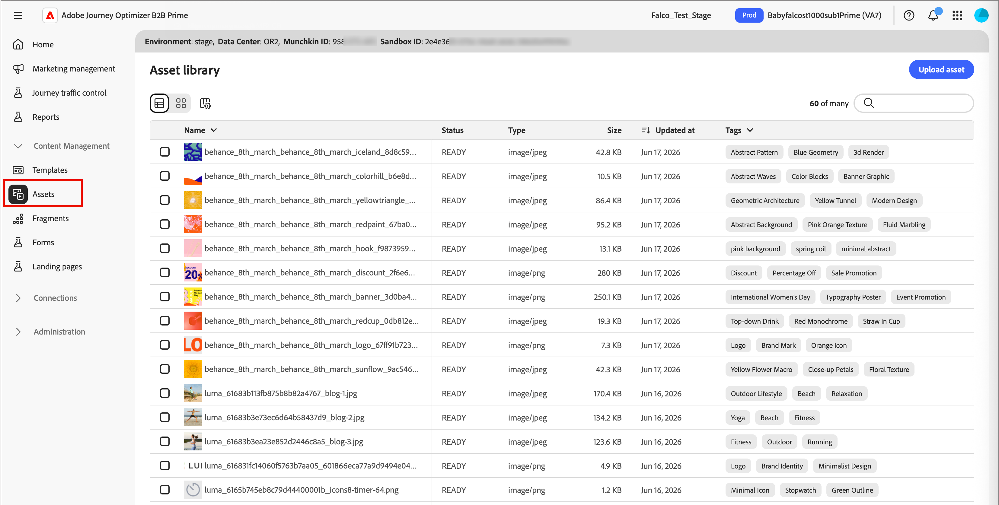
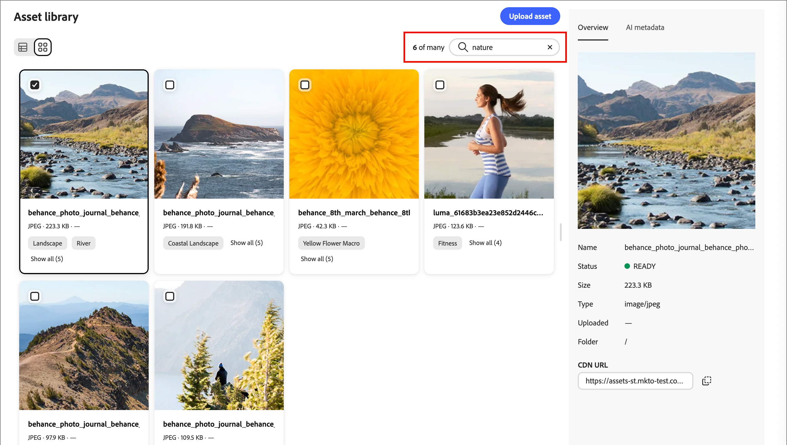
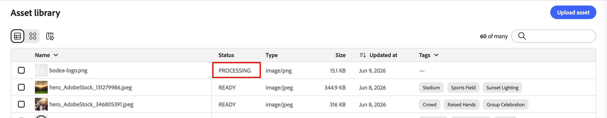

# 资产

在[!DNL Adobe Journey Optimizer B2B Prime]中，资产通常是设计内容以支持历程时使用的图像。 您可以从资产选择器的[电子邮件](email-authoring.md)、[电子邮件模板](templates.md)和[可视片段](email-authoring.md#visual-fragments)中使用这些图像，也可以在可视设计空间中使用简单的拖放界面。

支持的文件格式：JPG、JPEG、GIF、PNG、EPS、SVG 和 RGB

>[!NOTE]
>
>在此Beta版本中，您可以直接从电子邮件画布中的Marketo Engage资源库的一次性副本中选择图像和资源。 在初始副本为&#x200B;**且未在[!DNL Journey Optimizer B2B Prime]中反映**&#x200B;后，在Marketo Engage中修改资源。
>
>您可以从&#x200B;_[!UICONTROL Assets]_&#x200B;库或内容设计空间上传其他图像资源。 这些上传的资产只能在[!DNL Journey Optimizer B2B Prime]实例中使用。
>
>从外部系统导入资源以及访问预填充的资源库尚不可用。 预计未来版本将包括从现有系统导入资产、文件夹支持和扩展的资产管理功能。

<!-- You can [edit these assets using Adobe Express](./image-edit-adobe-express.md), and move them into folders to organize them for use across your emails, templates, and fragments. -->

**Assets**&#x200B;库提供对集中式存储库的访问权限，该存储库用于存储和管理图像和其他创意资源。 它包括AI支持的功能，可自动生成元数据并启用自然语言搜索。

在左侧导航中，展开&#x200B;**[!UICONTROL 内容管理]**&#x200B;并选择&#x200B;**[!UICONTROL Assets]**。

{width="800" zoomable="yes"}

>[!BEGINSHADEBOX]

首次访问&#x200B;_[!UICONTROL Assets]_&#x200B;库时，请查看[_[!UICONTROL 创作AI使用条款&#x200B;]_](https://www.adobe.com/cn/legal/licenses-terms/adobe-gen-ai-user-guidelines.html)，并确认您的协议。

{width="500"}

>[!ENDSHADEBOX]

库支持两种布局选项：

* **[!UICONTROL 列表]** — 单击&#x200B;_列表视图_ （）图标以在包含元数据列的可排序表中显示资源。
* **[!UICONTROL 图库]** — 单击&#x200B;_图库视图_ （  ）图标，将资产显示为可视缩略图网格。

## 搜索资源 {#find-assets}

使用&#x200B;_[!UICONTROL 搜索]_&#x200B;字段通过以自然语言描述所需内容来查找资源。 搜索结果基于人工智能生成的元数据，因此您不仅限于按文件名搜索。

**示例：**

* `team members`
* `nature`
* `exercise`

{width="700" zoomable="yes"}

## 查看资源详细信息 {#view-details}

在列表或库视图中选择任意资源以在右侧打开其详细信息视图，其中显示AI生成的描述、标记、关键字和其他元数据字段。 上传资产时，会自动生成此信息。 选择&#x200B;**[!UICONTROL AI元数据]**&#x200B;选项卡以查看生成的描述、标记和元数据。

{width="700" zoomable="yes"}

## 上传资源 {#upload}

1. 单击右上方的&#x200B;**[!UICONTROL 上传]**。

1. 在对话框中，从本地系统中拖放文件。

   {width="450"}

   或者，您可以单击&#x200B;**[!UICONTROL 从计算机中选择文件]**&#x200B;以使用本地文件系统查找并选择该文件。

1. 单击&#x200B;**[!UICONTROL 上载文件]**&#x200B;以确认文件并将其上载到存储库。

上传完成后，系统自动生成描述，分配标签和关键字，提取主题和设置等可视属性。 无需手动标记。 在此过程完成之前，新图像以&#x200B;_[!UICONTROL PROCESSING]_&#x200B;状态显示。

{width="700" zoomable="yes"}
