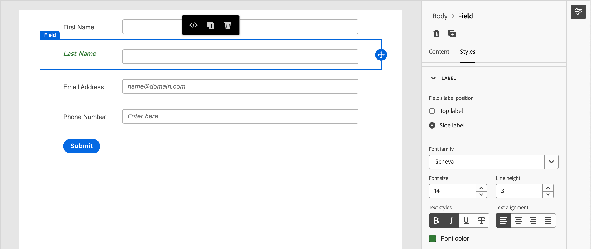
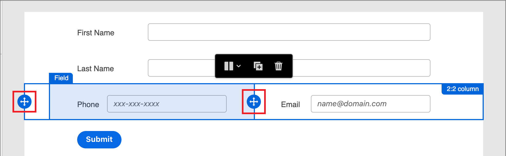

# 表单设计

在您[创建表单](./forms.md#create-forms)后，可视化设计空间将打开一个草稿，其中包含默认的基本表单定义。 在右侧的&#x200B;_[!UICONTROL 摘要]_&#x200B;面板中，单击&#x200B;**[!UICONTROL 编辑表单]**&#x200B;并使用可视设计空间定义表单样式和字段组件。

{width="700" zoomable="yes"}

默认情况下，_&#x200B;**提交**&#x200B;_&#x200B;按钮（页脚字段）是表单的一部分，无法删除。 您可以选择表单中的按钮/页脚组件以[更改按钮](#submit-button)的文本和样式。

## 字段 {#fields}

表单字段用于捕获人员配置文件数据，这些数据可用于定向人员并将他们与帐户和购买组关联。 使用字段设计工具构建一组字段和布局，用于收集基于帐户的营销活动所需的数据。

### 添加字段 {#add-field}

1. 在左侧的&#x200B;_[!UICONTROL 组件]_&#x200B;面板中，将&#x200B;**[!UICONTROL 字段]**&#x200B;内容组件拖放到画布上。

   {width="800" zoomable="yes"}

1. 对于&#x200B;_[!UICONTROL 选择字段属性]_，请选择一个选项并设置该字段的属性。

   * **[!UICONTROL 选择字段属性]** — 使用此选项可根据表单的预设中定义的数据集架构选择属性。

     在&#x200B;_[!UICONTROL 选择字段属性]_&#x200B;对话框中，选中要用于字段的属性的复选框，然后单击&#x200B;**[!UICONTROL 选择]**。

     {width="700" zoomable="yes"}

     例如，您可以设置电子邮件和公司。 当用户完成并提交表单时，输入的信息将保存到所选数据集。

     要将收集的数据与配置文件进行映射，请选择配置文件标识字段。 身份字段在属性列表中标记为&#x200B;**[!UICONTROL 必填]** — 您可以对其进行筛选。

   * **[!UICONTROL 添加自定义字段]**

     利用此选项，您可以定义自由字段，而无需将其映射到链接数据集中的字段。

     {width="600" zoomable="yes"}

   在画布上，将填充选定属性的默认字段标签。 **[!UICONTROL 字段详细信息]**&#x200B;将显示在右侧的面板中。

1. 如果需要，请更改&#x200B;**[!UICONTROL 标签]**&#x200B;文本。

   此文本显示在表单中的字段旁边。 默认文本填充自字段属性。

1. 根据字段的数据类型设置&#x200B;**[!UICONTROL 字段类型]**：

   | 字段类型 | 使用情况 |
   | ---------- | ----- |
   | **[!UICONTROL 复选框]** | 使用此类型，以便访客可以选择&#x200B;_true_（选中）或&#x200B;_false_（未选中）值。 |
   | **[!UICONTROL 复选框组]** | 使用此类型，以便访客可以为多个项目选择&#x200B;_true_（选中）或&#x200B;_false_（未选中）值。 |
   | **[!UICONTROL 货币]** | 使用此类型允许代表为[!DNL Journey Optimizer B2B Prime]实例选择的默认货币类型的浮动字段。 |
   | **[!UICONTROL 日期]** | 使用此类型可将输入限制为日期格式，并在字段中提供日历选择器。 |
   | **[!UICONTROL 双精度]** | 双精度浮点变量，存储为IEEE 64位（8字节）浮点数。 |
   | **[!UICONTROL 电子邮件]** | 使用此类型将输入限制为电子邮件地址格式。 |
   | **[!UICONTROL 数字]** | 使用此类型可将字段限制为某个数值。 |
   | **[!UICONTROL 单选按钮组]** | 使用此类型可允许访客选择一组选项中的一个。 |
   | **[!UICONTROL 选择]** | 使用此类型可允许访客使用下拉列表选择一组选项中的一个。 |
   | **[!UICONTROL 滑块]** | 使用此类型可允许访客使用滑块设置数值。 |
   | **[!UICONTROL 电话]** | 将此类型用于电话号码输入字段。 |
   | **[!UICONTROL 文本]** | 将此类型用于标准文本（字符串）输入字段。 |
   | **[!UICONTROL 文本区域]** | 使用此类型支持较长的文本输入。 |
   | **[!UICONTROL URL]** | 使用此类型可将文本输入限制为URL，包括标准URL协议。 |

1. 根据所选的字段类型，为字段输入和验证设置其他选项。

   {width="800" zoomable="yes"}

   例如，_Text_&#x200B;字段类型具有以下用于字段输入和验证的选项：

   * **[!UICONTROL 占位符]** — 为访客提供字段预期值的字段占位符值。

   * **[!UICONTROL 说明]** — 帮助访客完成该字段的说明性文本。 输入要显示为该字段的&#x200B;_悬停文本_&#x200B;的文本。

     >[!TIP]
     >
     >_说明与占位符文本_ 
     >
     >使用这两个属性来引导访客填写字段。 将指针悬停在字段上时，说明文本显示为工具提示/弹出文本。 占位符文本在字段中显示&#x200B;_灰显_，当访客在字段中输入其文本时，该文本将消失。 您可以使用这两种方法，也可以只使用一种方法。

   * **[!UICONTROL 默认值]** — 使用此选项为字段指定默认值。

   * **[!UICONTROL 验证消息]** — 使用此选项为字段指定验证消息。 如果访客为该字段输入无效值，则会显示此消息。 默认情况下，_[!UICONTROL Standard]_&#x200B;消息已设置。 选择&#x200B;**[!UICONTROL 自定义]**&#x200B;并输入您自己的消息。

   * **[!UICONTROL 最大长度]** — 输入可在字段中输入的最大字符数。

1. 根据需要设置&#x200B;**[!UICONTROL 字段行为]**：

   * **[!UICONTROL 必需]** — 选中此复选框可使提交表单所需的字段输入变为必需。

   * **[!UICONTROL 区分大小写]** — 选中该复选框可将该字段区分大小写。

   * **[!UICONTROL 预填已启用]** — 选中此复选框可从用户档案信息中填充该字段（如果可用）。

   * **[!UICONTROL 启用输入掩码]** — 选中此复选框可限制使用输入掩码从访客输入的内容。 例如，您可能希望访客以特定格式输入电话号码。 在对话框中，为任意数字使用`9`，为任意字母使用`a`，为任一数字使用`*`输入掩码。

     {width="550" zoomable="yes"}定义输入掩码

     单击&#x200B;**[!UICONTROL 保存]**&#x200B;以启用指定的输入掩码。

### 更改字段样式 {#field-styling}

选择右侧面板中的&#x200B;**[!UICONTROL 样式]**&#x200B;选项卡以更改所选字段的样式。

* **[!UICONTROL 背景]** — 选中此复选框可为字段应用背景颜色。 白色是默认颜色。 单击&#x200B;**[!UICONTROL 背景颜色]**&#x200B;方块以打开弹出式拾色器并选择字段背景的颜色。

  {width="600" zoomable="yes"}

* **[!UICONTROL 标签]** — 标签样式控制字段旁边显示的文本的可视特性。 选择相对于字段的顶部标签或侧标签显示。 可以设置字体大小、行高、文本样式和文本对齐方式。 单击&#x200B;**[!UICONTROL 字体颜色]**&#x200B;方块以打开弹出式拾色器并选择标签文本的颜色。

  {width="600" zoomable="yes"}

* **[!UICONTROL 边框]** — 单击&#x200B;**[!UICONTROL 边框颜色]**&#x200B;方块以打开弹出式拾色器并选择边框颜色。 您可以定义字段的边框，包括颜色和线宽。 清除复选框可删除显示的字段边框。 您还可以更改边角的边框大小（像素宽度）、样式和半径设置。

  {width="600" zoomable="yes"}

* **[!UICONTROL 大小]** — 选择大小设置以确定字段的显示宽度。 选择&#x200B;_[!UICONTROL 全宽]_、_[!UICONTROL 半宽]_&#x200B;或&#x200B;_[!UICONTROL 自动]_。

* **[!UICONTROL 边距]** — 设置字段周围的边距（像素）。 您可以在所有四个边上设置相同的边距，也可以选中&#x200B;**[!UICONTROL 每个边的不同边距]**&#x200B;复选框以分别设置水平边距和垂直边距。

* **[!UICONTROL 内边距]** — 设置字段周围的内边距（像素）。 您可以在所有四个边上设置相同的填充，也可以选中&#x200B;**[!UICONTROL 每个边的不同填充]**&#x200B;复选框以分别设置水平填充和垂直填充。

  {width="600" zoomable="yes"}

### 字段重新排序 {#field-reorder}

您可以在可视工作区中直接移动表单字段。 单击所选字段右边缘的&#x200B;_移动_&#x200B;工具，并将其拖动到新位置。

将[结构组件](./structure-components.md)添加到表单并将字段移动到列中以分组它们并更改布局。 单击所选列组件左边缘的&#x200B;_移动_&#x200B;工具，并将其拖动到表单中的新位置。

{width="500"}

### 删除或复制字段 {#field-delete-duplicate}

单击工具栏或右侧面板中的&#x200B;_删除_&#x200B;图标（）以删除选定的字段。 在确认对话框中单击&#x200B;**[!UICONTROL 删除]**。

单击工具栏或右侧面板中的&#x200B;_复制_&#x200B;图标（）以复制所选字段。 新字段显示在原始字段的正下方。 单击&#x200B;**[!UICONTROL 选择字段属性]**&#x200B;以设置该字段的属性。 根据需要设置字段类型、详细信息和样式。

{width="600" zoomable="yes"}

## “提交”按钮 {#submit-button}

默认情况下，提交按钮（页脚字段）是表单的一部分，无法删除。 选择表单中的按钮/页脚组件以更改按钮的文本和样式。

### 编辑按钮内容 {#button-content}

在右侧面板中显示&#x200B;_[!UICONTROL Content]_&#x200B;选项卡后，更改&#x200B;**[!UICONTROL 按钮文本]**&#x200B;字段中的文本。 调整按钮大小以适应文本的长度。

{width="600" zoomable="yes"}

### 设置提交按钮的样式 {#button-styles}

选择右侧面板中的&#x200B;**[!UICONTROL 样式]**&#x200B;选项卡以更改所选按钮/页脚组件的样式。

* **[!UICONTROL 背景]** — 选中此复选框可为按钮应用背景颜色。 蓝色是默认颜色。 单击&#x200B;**[!UICONTROL 背景颜色]**&#x200B;方块以打开弹出式拾色器并选择按钮背景的颜色。

  {width="600" zoomable="yes"}

* **[!UICONTROL 标签]** — 标签样式控制按钮内文本的可视特征。 可以设置字体大小、行高、文本样式和文本对齐方式。 单击&#x200B;**[!UICONTROL 字体颜色]**&#x200B;方块以打开弹出式拾色器并选择标签文本的颜色。

* **[!UICONTROL 边框]** — 单击&#x200B;**[!UICONTROL 边框颜色]**&#x200B;方块以打开弹出式拾色器并选择边框颜色。 您可以定义按钮的边框，包括颜色和线条宽度。 清除复选框可删除显示的按钮边框。 您还可以更改圆角的边框大小（像素宽度）、样式和半径设置。

* **[!UICONTROL 大小]** — 选择大小设置以确定按钮的显示宽度。 选择&#x200B;_[!UICONTROL 全宽]_、_[!UICONTROL 半宽]_&#x200B;或&#x200B;_[!UICONTROL 自动]_。 内边距会根据大小和对齐设置进行调整。

  {width="600" zoomable="yes"}

* **[!UICONTROL 按钮对齐方式]** — 当您选择按钮的&#x200B;_半宽_&#x200B;或&#x200B;_自动_&#x200B;大小时，请将对齐方式设置为左、右或居中。 内边距会根据大小和对齐设置进行调整。

* **[!UICONTROL 边距]** — 设置按钮周围的边距（以像素为单位）。 您可以在所有四个边上设置相同的边距，也可以选中&#x200B;**[!UICONTROL 每个边的不同边距]**&#x200B;复选框以分别设置水平边距和垂直边距。

* **[!UICONTROL 内边距]** — 设置按钮周围的内边距（以像素为单位）。 您可以在所有四个边上设置相同的填充，也可以选中&#x200B;**[!UICONTROL 每个边的不同填充]**&#x200B;复选框以分别设置水平填充和垂直填充。 如果更改大小和对齐设置，则填充会进行调整。

  {width="600" zoomable="yes"}

## 表单样式 {#form-styling}

当在结构或表单元件外部单击时，可以更改表单元区的样式。 表单组件（字段和按钮）将继承在顶级定义的&#x200B;_正文_&#x200B;样式，除非在字段或按钮/页脚级别定义了其他样式。

{width="600" zoomable="yes"}

### CSS样式 {#css-styles}

新表单使用默认的CSS进行样式设置。 如果要通过修改CSS来更改样式，可以复制样式，然后使用它来定义表单的自定义CSS。

为表单&#x200B;:_定义自定义CSS(_T)

1. 单击右侧面板中的&#x200B;**[!UICONTROL 查看CSS]**&#x200B;以查看CSS代码。

   {width="450" zoomable="yes"}

1. 在滚动窗口中选择CSS代码并将其复制到剪贴板。

1. 单击&#x200B;**[!UICONTROL 关闭]**。

1. （可选）将复制的代码粘贴到您收藏的CSS工具中，并编辑CSS以反映所需的样式。

1. 单击右侧面板中的&#x200B;**[!UICONTROL 添加自定义CSS]**。

1. 将CSS代码粘贴到窗口中。

   {width="450" zoomable="yes"}

   您可以在此窗口中编辑粘贴的文本。

1. 单击&#x200B;**[!UICONTROL 保存]**。

### 手动设置样式 {#manual-styling}

更改右侧面板中的设置以定义整个表单的显示。

* **[!UICONTROL 背景颜色]** — 选中此复选框可在表单区域周围应用背景颜色。 白色是默认颜色。 单击颜色方块以打开弹出式拾色器，并为表单背景选择颜色。

* **[!UICONTROL 视区背景]** — 选中此复选框以将背景颜色应用于所有表单组件。 缺省值为无颜色（继承自外部背景）。 单击颜色方块以打开弹出式拾色器，并为窗体结构组件选择颜色。

  {width="600" zoomable="yes"}

* **[!UICONTROL 文本]** — 为表单选择&#x200B;**[!UICONTROL 字体系列]**，这会影响表单字段的标签、提示和占位符文本。 它还会影响默认的提交按钮文本。

* **[!UICONTROL 大小]** — 更改表单的大小（宽度）（以像素为单位）。

* **[!UICONTROL 边距]** — 设置表单组件周围的边距（以像素为单位）。 您可以在所有四个边上设置相同的边距，也可以选中&#x200B;**[!UICONTROL 每个边的不同边距]**&#x200B;复选框以分别设置水平边距和垂直边距。

  {width="600" zoomable="yes"}
