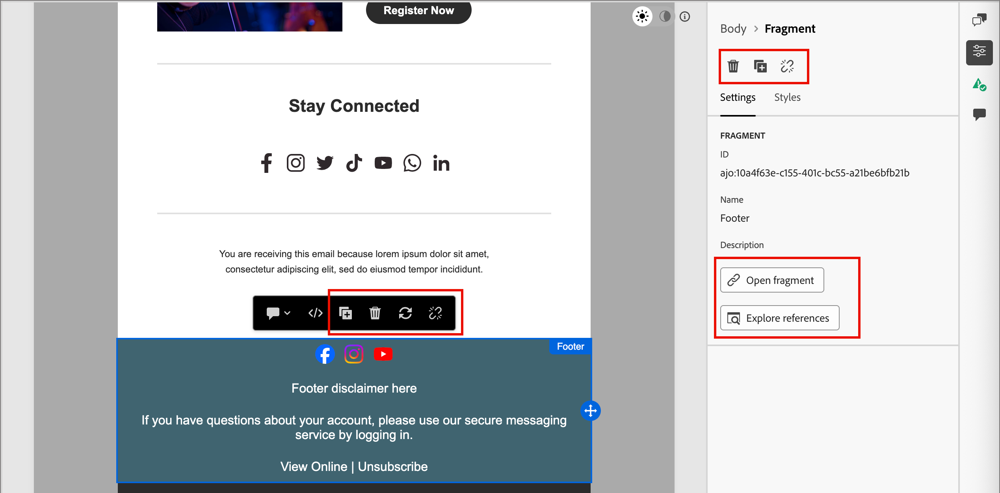

# 片段

片段是可重复使用的组件，可在[!DNL Journey Optimizer B2B Prime]中的一个或多个电子邮件和电子邮件模板中引用。 它通常是可以预先创建并快速插入到电子邮件或电子邮件模板中的内容块（文本、图像或两者）。 利用此功能，您可以预构建多个自定义内容块以供营销团队成员使用，以汇编电子邮件内容来改进设计过程。 常见用例包括电子邮件的页眉/页脚内容块、事件邀请横幅和季节性问候。

>[!BEGINSHADEBOX]

**可视片段**

可视化片段是使用可视化设计工具构建的预定义可视化块，您可以在多个电子邮件或电子邮件模板中重用这些可视化块。 [!DNL Journey Optimizer B2B Prime]的当前范围，并且此文档仅包含可视片段。

>[!NOTE]
>
>[!DNL Journey Optimizer B2B Prime]中尚不支持基于表达式的片段。

>[!ENDSHADEBOX]

要在工作流中充分利用片段，请执行以下操作：

* _创建您自己的片段_ — 从头开始创建可视化片段，或从可视化内容设计空间中将内容另存为片段。
* _重用片段_ — 在电子邮件或电子邮件模板内容中根据需要多次使用这些片段。

## 访问和管理片段 {#access-manage-fragments}

若要访问[!DNL Journey Optimizer B2B Prime]中的可视化片段，请转到左侧导航并展开&#x200B;**[!UICONTROL 内容管理]**。 然后选择&#x200B;**[!UICONTROL 片段]**。 此操作将打开一个列表页面，其中包含实例中创建的所有片段在表中列出。

{width="700" zoomable="yes"}

该表按&#x200B;_[!UICONTROL Modified]_&#x200B;列排序，最近更新的片段默认位于顶部。 单击列标题可在升序和降序之间更改。

左侧的文件夹结构允许您组织片段。 默认情况下，将显示所有片段。 选择文件夹时，仅显示选定文件夹中包含的片段和子文件夹。

### 片段状态 {#fragment-status}

片段状态决定其是否可用于电子邮件或电子邮件模板，以及您可以对其进行的更改。

| 状态 | 描述 |
| ------ | ----------- |
| 草稿 | 创建片段时，它处于草稿状态。 在您定义或编辑可视化设计空间时，它保持此状态，直到您发布它以用于电子邮件或电子邮件模板为止。 可用操作：  <ul><li>编辑所有详细信息<li>在可视设计空间中编辑<li>发布<li>重复<li>删除 |
| 实时 | 发布片段后，该片段将可用于电子邮件或电子邮件模板。 无法在可视设计空间中修改已发布的片段内容。 可用操作：  <ul><li>编辑描述<li>添加到电子邮件或模板<li>创建草稿版本<li>重复<li>删除（如果未使用） |
| 实时（含草稿） | 从实时片段创建草稿时，实时版本仍然可用于电子邮件或电子邮件模板中，并且可以在可视设计空间中修改草稿内容。 如果您发布草稿版本，它会替换当前实时版本，并且内容会在使用草稿的电子邮件和电子邮件模板中进行更新。 可用操作：  <ul><li>编辑描述<li>添加到电子邮件或模板<li>在可视设计空间中编辑草稿版本<li>发布草稿版本<li>重复<li>删除（如果未使用） |
| 已存档 | 片段已存档，未显示在&#x200B;_片段_&#x200B;列表中。 |

### 筛选片段列表 {#filter-list}

要按名称搜索片段，请在搜索栏中输入文本字符串以查找匹配项。 选择[文件夹](#folders)后，搜索将应用于该文件夹第一级层次结构中的所有片段或文件夹。

{width="500" zoomable="yes"}

单击&#x200B;_筛选器_&#x200B;图标（）以显示可用的筛选器选项并更改设置以根据指定的条件筛选显示的项。

### 自定义列显示 {#column-display}

通过单击右上角的&#x200B;_自定义表_&#x200B;图标（）自定义要在表中显示的列。

在对话框中，选择要显示的列，然后单击&#x200B;**[!UICONTROL 应用]**。

{width="300"}

### 批量操作 {#bulk-actions}

您可以使用复选框选择多个片段，并将批量操作应用于所有片段。 可用的操作将显示在列表页面底部的批量操作栏中。 可用的操作如下：

* **[!UICONTROL 移动到文件夹]** — 将选定的片段移动到文件夹中。
* **[!UICONTROL 存档]** — 存档选定的片段。

您还可以通过单击任何列标题对片段列表进行排序，并通过拖动列边框来调整列大小以适合您需要的数据。

## 创建片段 {#create-fragments}

您可以通过单击右上角的&#x200B;**[!UICONTROL 创建片段]**，在[!DNL Journey Optimizer B2B Prime]中创建新可视片段。

1. 在&#x200B;_[!UICONTROL 创建片段]_&#x200B;页面中，输入有用的&#x200B;**[!UICONTROL 名称]**（必需）和&#x200B;**[!UICONTROL 描述]**（可选）。

   * 名称 — 最多100个字符，必须唯一，不区分大小写

   * 描述 — 最多300个字符

   * 允许使用Alpha、数字和特殊字符

   * 保留字符为&#x200B;**_不允许_**： `\ / : * ? " < > |`

   {width="700" zoomable="yes"}

1. 单击&#x200B;**[!UICONTROL 创建]**。

   此时将打开可视化设计空间，并显示一个空画布。

1. 使用内容设计工具创建可视化片段内容：

   * [添加结构和内容](./fragment-authoring.md#design-fragment)
   * [添加资源](./fragment-authoring.md#add-assets)
   * [导航图层、设置和样式](./fragment-authoring.md#navigate-layers-settings-styles)
   * [个性化内容](./fragment-authoring.md#personalize-content)
   * [编辑链接的URL跟踪](./fragment-authoring.md#edit-linked-url-tracking)

1. 随时单击&#x200B;**[!UICONTROL 保存]**&#x200B;以保存草稿片段。

1. 准备好在电子邮件或电子邮件模板中使用片段时，单击&#x200B;**[!UICONTROL 发布]**。

## 查看片段详细信息 {#view-details}

单击列表页面中任何片段的名称以打开片段详细信息页面。 您可以选择编辑片段、重命名片段或更新片段描述。 进行更新，然后单击名称或描述字段外部以自动保存更改。

>[!NOTE]
>
>如果电子邮件或电子邮件模板正在使用已发布的片段，则无法更改名称或编辑内容。 如果要对片段进行更改，可以创建草稿版本。

{width="700" zoomable="yes"}

单击&#x200B;**[!UICONTROL 编辑片段]**&#x200B;以在可视内容编辑器中打开该片段。

单击左上角的&#x200B;_返回_&#x200B;箭头可随时退出视图，该箭头将返回到&#x200B;_片段_&#x200B;列表页面。

## 查看片段引用 {#references}

对于&#x200B;_实时_&#x200B;片段，您可以查看当前引用（使用）该片段的资源列表。

1. 在片段详细信息页面中，单击更多(**...**) 图标（位于右上方）。

1. 选择&#x200B;**[!UICONTROL 浏览引用]**。

   _[!UICONTROL 片段使用情况]_&#x200B;页面显示[!DNL Journey Optimizer B2B Prime]内、电子邮件和电子邮件模板中当前使用该片段的资源列表。

   >[!IMPORTANT]
   >
   >无法删除任何电子邮件或电子邮件模板当前正在使用的任何片段。

   根据类别显示引用： _电子邮件_&#x200B;或&#x200B;_电子邮件模板_。 [!DNL Journey Optimizer B2B Prime]中的每个电子邮件都在人员历程的&#x200B;_发送电子邮件_&#x200B;操作节点中定义，因此使用片段的电子邮件的父历程显示在引用中。

1. 单击链接以打开相应的电子邮件或电子邮件模板，其中使用该片段。

## 使用文件夹管理片段 {#folders}

要轻松导航片段，您可以使用文件夹更高效地将其整理到结构化层次结构中。 这使您能够根据组织需求对项目进行分类和管理。

选择&#x200B;_[!UICONTROL 根]_&#x200B;文件夹以显示所有片段，包括位于所有子文件夹中的片段。 选择结构中的任意文件夹以显示其内容。 选择文件夹后，单击创建片段，以在该文件夹中创建新片段。

### 创建文件夹 {#folders-create}

1. 选定父文件夹（根或其他文件夹）后，单击右上角的&#x200B;**[!UICONTROL 创建文件夹]**。

1. 为新文件夹输入&#x200B;**[!UICONTROL 名称]**，然后单击&#x200B;**[!UICONTROL 保存]**。

   新文件夹显示在选定父文件夹内列表的顶部。

   您可以单击“更多”菜单( **...** )图标来重命名、移动或删除文件夹。

### 移动文件夹 {#folders-move}

1. 单击&#x200B;_更多菜单_ (**...**) 图标（位于要移动的片段的名称旁）。

1. 选择&#x200B;**[!UICONTROL 移动到文件夹]**。

1. 在对话框中，导航文件夹结构并选择要将片段移动到的文件夹。

1. 单击&#x200B;**[!UICONTROL 移动]**。

### 删除文件夹 {#folders-delete}

1. 在文件夹结构中，选择要删除的文件夹的父文件夹。

1. 单击&#x200B;_更多菜单_ (**...**) 图标（在显示的要删除的子文件夹名称旁边）。

1. 选择&#x200B;**[!UICONTROL 删除文件夹]**。

## 编辑片段 {#edit-fragments}

对片段的编辑取决于其当前状态：

* 当片段处于&#x200B;_草稿_&#x200B;状态时，您可以编辑其任何详细信息和可视内容。
* 当片段处于&#x200B;_实时_&#x200B;状态时，您可以编辑片段描述，但不能编辑名称。 除非创建草稿，否则无法编辑可视化内容。
* 当片段处于具有现有草稿的&#x200B;_实时_&#x200B;状态时，编辑详细信息仅限于描述。 您还可以编辑草稿版本的可视内容。

>[!BEGINTABS]

>[!TAB 草稿]

1. 从&#x200B;_[!UICONTROL 片段]_&#x200B;列表页面，单击片段名称以将其打开。

   将显示可视内容的预览。

1. 如果需要，请修改说明。

   {width="600" zoomable="yes"}

1. 若要更改可视化设计空间中的内容，请单击右上方的&#x200B;**[!UICONTROL 编辑]**。

   根据需要使用可视化设计工具：

   * [添加结构和内容](./fragment-authoring.md#design-fragment)
   * [添加资源](./fragment-authoring.md#add-assets)
   * [导航图层、设置和样式](./fragment-authoring.md#navigate-layers-settings-styles)
   * [个性化内容](./fragment-authoring.md#personalize-content)
   * [编辑链接的URL跟踪](./fragment-authoring.md#edit-linked-url-tracking)

   单击&#x200B;**[!UICONTROL 保存]**，或单击&#x200B;**[!UICONTROL 保存并关闭]**&#x200B;以返回片段详细信息。

1. 如果片段符合您的条件并且您想在电子邮件或电子邮件模板中使用它，请单击&#x200B;**[!UICONTROL 发布]**。

>[!TAB 实时]

1. 从&#x200B;_[!UICONTROL 片段]_&#x200B;列表页面，单击片段名称以将其打开。

   随后将显示可视内容的预览，其中片段详细信息位于右侧。

1. 如果需要，请修改说明。

1. 如果要更新内容，请单击右上方的&#x200B;**[!UICONTROL 修改]**。

1. 在对话框中，单击&#x200B;**[!UICONTROL 确认]**&#x200B;以创建片段的草稿版本。

   {width="300"}

1. 单击右上方的&#x200B;**[!UICONTROL 编辑]**。

1. 根据需要使用可视化设计工具更新草稿中的内容：

* [添加结构和内容](./fragment-authoring.md#design-fragment)
* [添加资源](./fragment-authoring.md#add-assets)
* [导航图层、设置和样式](./fragment-authoring.md#navigate-layers-settings-styles)
* [个性化内容](./fragment-authoring.md#personalize-content)
* [编辑链接的URL跟踪](./fragment-authoring.md#edit-linked-url-tracking)

单击&#x200B;**[!UICONTROL 保存]**，或单击&#x200B;**[!UICONTROL 保存并关闭]**&#x200B;以返回片段详细信息。

1. 当草稿片段符合您的条件并且您想要使更改可用于电子邮件或电子邮件模板时，请单击&#x200B;**[!UICONTROL 发布]**。

   发布草稿版本时，草稿版本会替换当前实时版本，并且内容会更新到已使用该草稿的电子邮件和电子邮件模板中。

>[!TAB 实时（含草稿）]

有两种方法可以打开草稿版本以从&#x200B;_[!UICONTROL 片段]_&#x200B;列表页面进行编辑：

* 单击片段名称旁边的&#x200B;_草稿_&#x200B;图标（）。

* 单击片段名称以将其打开。 然后，单击右上方的&#x200B;_更多菜单_ (***...***)图标，然后选择&#x200B;**[!UICONTROL 打开草稿版本]**。

将显示草稿版本的可视内容预览。

更新草稿内容(_T):_

1. 单击右上方的&#x200B;**[!UICONTROL 编辑]**。

1. 根据需要使用可视化设计工具：

   * [添加结构和内容](./fragment-authoring.md#design-fragment)
   * [添加资源](./fragment-authoring.md#add-assets)
   * [导航图层、设置和样式](./fragment-authoring.md#navigate-layers-settings-styles)
   * [个性化内容](./fragment-authoring.md#personalize-content)
   * [编辑链接的URL跟踪](./fragment-authoring.md#edit-linked-url-tracking)

   单击&#x200B;**[!UICONTROL 保存]**，或单击&#x200B;**[!UICONTROL 保存并关闭]**&#x200B;以返回片段详细信息。

1. 当草稿片段符合您的条件并且您想要使更改可用于电子邮件或电子邮件模板时，请单击&#x200B;**[!UICONTROL 发布]**。

   发布草稿版本时，草稿版本会替换当前已发布的版本，并且内容会在电子邮件和电子邮件模板中更新（该模板已在使用中）。

>[!ENDTABS]

## 重复片段 {#duplicate-fragments}

您可以使用以下任一方法复制片段：

* 从&#x200B;_[!UICONTROL 片段]_&#x200B;列表页面，单击&#x200B;_更多_&#x200B;图标(**...**) 在片段名称旁边，然后选择&#x200B;**[!UICONTROL 复制]**。
* 在片段详细信息页面的右上方，单击&#x200B;_更多_ (**...**) 图标并选择&#x200B;**[!UICONTROL 复制]**。

在对话框中，输入有用的名称（唯一）和描述。 单击&#x200B;**[!UICONTROL 复制]**&#x200B;以完成操作。

然后，重复的（新）片段显示在同一文件夹中的&#x200B;_片段_&#x200B;列表中。

<!-- 

## Save a new fragment from email or template content {#save-as-fragment}

When you are creating/editing an email or email template in the visual content editor, you can choose to save all or parts of the content as a fragment so that it is available for reuse.

1. When you have some content to be saved as a fragment, click **[!UICONTROL More]** and choose **[!UICONTROL Save as Fragment]**.

1. Select the different elements to be included in the fragment.

   Select multiple structures by holding the Shift or Control button.

   You can only select structures that are adjacent to each other and the interface does not allow you to select non-adjacent elements.

1. With the content selected, click **[!UICONTROL Create]** at the top right.

1. In the dialog, enter a useful name and description for the fragment. Then click **[!UICONTROL Create]**.

   The new fragment is then displayed in the _Fragments_ listing page and is also available for use within emails and email templates.

-->

## 将可视化片段添加到您的电子邮件或模板内容 {#add-to-content}

片段设计为可重复使用，并且可以插入以用于电子邮件和电子邮件模板的创作。 您最多可以在电子邮件或模板中添加30个片段。 片段最多只能嵌套一个级别。

>[!BEGINTABS]

>[!TAB 向电子邮件添加片段]

1. 导航到人员历程并打开现有的&#x200B;_[!UICONTROL 发送电子邮件]_&#x200B;操作节点或[添加新操作节点](../marketing/action-nodes.md#add-an-action-node)。

1. 单击&#x200B;**[!UICONTROL 编辑电子邮件正文]**&#x200B;以打开或继续[创作电子邮件内容](./email-authoring.md)。

1. 从&#x200B;**[!UICONTROL 结构]**&#x200B;菜单拖放项以提供片段的&#x200B;_结构_。

1. 要打开已发布片段的列表，请单击&#x200B;_片段_&#x200B;图标。

   您可以：
   * 对列表进行排序。
   * 浏览、搜索和筛选列表。
   * 在卡片（缩略图）和列表视图之间切换。
   * 刷新列表以反映任何最近创建的片段。

   {width="600"}

1. 将任意片段拖放到结构组件占位符中。

   编辑器在电子邮件结构的部分/元素中呈现片段。

片段的内容在结构中动态更新，以呈现内容在电子邮件中如何显示的可视化。

>[!TIP]
>
>如果希望片段占据电子邮件中的整个水平布局，请添加[!UICONTROL 1:1列]结构，然后将片段拖放到其中。

保存电子邮件后，选择&#x200B;_[!UICONTROL 使用者]_&#x200B;选项卡时，该电子邮件会显示在片段详细信息页面中。 添加到电子邮件的片段在电子邮件或模板中不可编辑 — 已发布的源片段定义了内容。

>[!TAB 将片段添加到电子邮件模板]

1. 从左侧导航中，展开&#x200B;**[!UICONTROL 内容管理]**&#x200B;并选择&#x200B;**[!UICONTROL 模板]**。

1. [创建新模板](./templates-create.md)，或打开现有的电子邮件模板。

1. 在右侧的模板属性面板中，单击&#x200B;**[!UICONTROL 编辑电子邮件正文]**。

1. 从&#x200B;**[!UICONTROL Structures]**&#x200B;菜单拖放项以提供包含片段的&#x200B;_structure_。

1. 要打开片段列表，请单击左侧的&#x200B;_片段_&#x200B;图标。

   您可以：
   * 对列表进行排序。
   * 浏览、搜索和筛选列表。
   * 在卡片（缩略图）和列表视图之间切换。
   * 刷新列表以反映任何最近创建的片段。

   {width="600"}

1. 将片段拖放到结构组件中。

   编辑器在电子邮件模板结构的部分/元素中呈现片段。

>[!TIP]
>
>如果希望片段占据电子邮件模板内的整个水平布局，请添加&#x200B;_[!UICONTROL 1:1列]_&#x200B;结构，然后将片段拖放到其中。

保存电子邮件模板后，在选择&#x200B;_[!UICONTROL 使用者]_&#x200B;选项卡时，该模板会显示在片段详细信息页面中。 添加到电子邮件模板的片段在模板中不可编辑 — 已发布的源片段定义了内容。

>[!ENDTABS]

## 电子邮件和模板创作期间的片段操作 {#fragment-actions}

将片段添加到电子邮件或电子邮件模板时，无法在电子邮件或模板中编辑片段内容。 但是，您可以应用以下操作：

* **[!UICONTROL 删除]** — 此操作从当前电子邮件或电子邮件模板内容中删除片段（片段源不受影响）。
* **[!UICONTROL 刷新]** — 此操作刷新当前电子邮件或电子邮件模板中片段的内容。 当您想要反映在添加到电子邮件或电子邮件模板之后对片段进行的任何最近编辑时，刷新很有用。
* **[!UICONTROL 复制]** — 此操作在编辑器中复制同一电子邮件或电子邮件模板中的片段，这些片段具有相同的维度，并紧跟其下添加。
* **[!UICONTROL 打开片段]** — 此操作将打开一个新的浏览器选项卡，其中包含片段编辑器页面和详细信息。
* **[!UICONTROL 浏览引用]** — 此操作将打开片段使用情况页面，您可以在其中按类型查看片段的使用情况。
* **[!UICONTROL 中断继承]** — 此操作中断来自源的片段（及其更改）继承。 使用此操作可以在电子邮件或电子邮件模板中作为独立的可编辑内容使用片段内容。 此操作还会从原始片段的&#x200B;_Used By_&#x200B;引用中删除电子邮件或电子邮件模板。

在编辑器页面上选择片段时，可以从右侧的上下文工具栏和属性面板中执行这些操作。

{width="600" zoomable="yes"}
