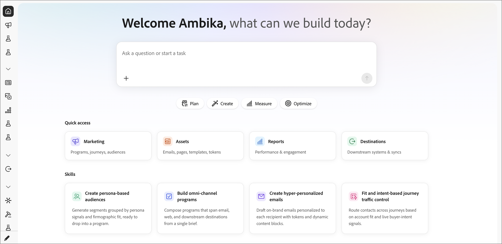

# 主页

_Home_&#x200B;页面是您在Adobe Journey Optimizer B2B Prime中的启动板。 选择左侧导航顶部的&#x200B;_主页_&#x200B;图标以将其打开。 该页面通过&#x200B;**欢迎[姓名]向您问候，我们今天可以构建什么？** 而且只需点击一下，就能将您的想法转化为行动。

{width="800" zoomable="yes"}

## 输入框

主页中心有一个大的&#x200B;_询问问题或启动任务_&#x200B;输入。 在此处输入任何内容以开始使用AI对话面板，或使用&#x200B;_附加_ (**+**)图标在发送之前添加文件（如营销活动简报或CSV）。 这是整个Marketing Management中提供的相同AI助手，但从此处开始可开启新对话。

## 意图按钮

在输入框下，四个快速启动按钮框出了要完成的任务：

| 按钮 | 使用情况 |
|--------|------------|
| **计划** | 形状策略 — 在构建之前规划营销活动、项目和受众。 |
| **创建** | 构建项目 — 程序、历程、电子邮件、人员列表。 |
| **度量值** | 查看性能 — 报告、参与度、发送时间结果。 |
| **优化** | 改进实时内容 — 流量控制、评分、个性化。 |

## 快速访问

您可以使用四个快捷方式卡直接快速跳转到工作区：

| 卡片 | 您可以访问的内容 |
|------|-----------------|
| **营销** | 项目、历程、受众（营销管理）。 |
| **资源** | 电子邮件、页面、模板、令牌。 |
| **报告** | 绩效和参与量度。 |
| **目标** | 下游系统和同步。 |

## 技能

一行&#x200B;_技能_&#x200B;卡片展示您可以立即启动的高价值AI工作流：

- **创建基于角色的受众** — 生成按角色信号分组的区段和固定适合度，可随时放入项目中。
- **构建全渠道程序** — 从单个简报撰写跨电子邮件、Web和下游目标的程序。
- **创建超个性化电子邮件** — 使用令牌和动态内容块为每个收件人草稿个性化的品牌上电子邮件。
- **适应和基于意图的历程流量控制** — 根据帐户适应和实时购买者意图信号跨历程路由联系人。

单击技能卡以开始为该工作流准备的对话。 技能与聊天面板中可用的构建块相同 — 卡片是可发现的入口点。
