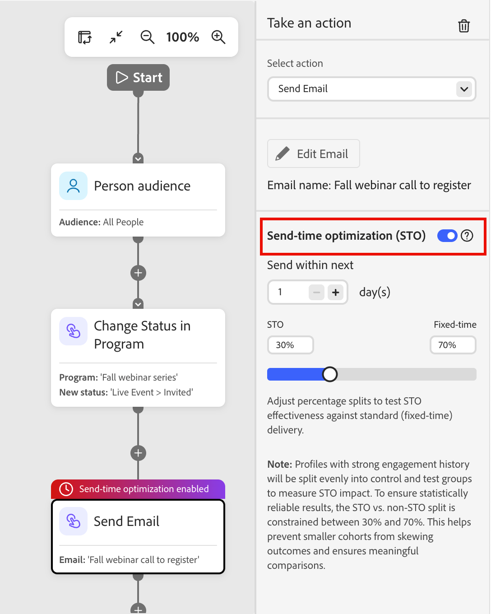

# 电子邮件发送时间优化

使用发送时间优化(STO)功能，通过预测每个用户档案最有可能参与的时间，为[个人历程](./person-journeys.md)个性化电子邮件投放时间。 STO使用历史电子邮件参与信号，而不是固定的发送时间，来安排每个收件人在最佳时间投放，从而提高整体参与度。

STO使用大型语言模型分析每个配置文件的历史参与。 它会预测潜在的发送时间并对这些时间进行排名，然后在优化窗口内将投放计划在排名最高的时间。

<!-- Performance insights, such as usage, engagement lift, and STO vs. non-STO comparisons, are available through natural language queries in the AI Assistant. -->

>[!BEGINSHADEBOX]

计划为STO提供许多&#x200B;**_未来增强功能_**：

* _[!UICONTROL 管理员]_&#x200B;区域中的全局STO配置
* 历程级别的STO启用
* 可配置的测试/控制拆分

>[!ENDSHADEBOX]

## 配置 {#configuration}

当您[将&#x200B;_[!UICONTROL 执行操作]_&#x200B;节点](./action-nodes.md)添加到人员历程并选择&#x200B;**[!UICONTROL 发送电子邮件]**&#x200B;操作时，您可以配置发送时间优化。

1. 选择&#x200B;_发送电子邮件_&#x200B;历程操作节点。

1. 在右侧的节点属性中，启用&#x200B;**[!UICONTROL 发送时间优化]**&#x200B;选项。

   {width="450" zoomable="no"}

1. 要指定窗口和测试分布，请设置STO选项：

   * **[!UICONTROL 下一个]**&#x200B;内发送 — 此值确定优化时段（以天为单位），该时间范围是可以投放电子邮件的时间范围。 例如，对于在五天后举行的网络研讨会，您可以设置一个四天或五天时段。 STO将为该窗口内的每个用户档案选择最佳的预测发送时间。

   * **STO/固定分配** - STO会自动创建&#x200B;_测试和控制拆分_，以将符合条件的配置文件在优化和固定发送时间之间进行划分。 通过拆分，可以直接比较性能。 （计划在将来的增强功能中允许自定义拆分百分比。）

   >[!NOTE]
   >
   >具有强参与历史记录的用户档案会平均拆分为控制和测试组，以测量STO影响。 为确保统计上可靠的结果，STO与非STO拆分的限制为30%到70%。 这有助于防止规模较小的同类群组扭曲结果，并确保进行有意义的比较。

1. 直接在&#x200B;_[!UICONTROL 发送电子邮件]_&#x200B;节点之后，[添加&#x200B;_等待_&#x200B;节点](./wait-nodes.md)。

   等待节点必须紧跟在启用STO的电子邮件操作之后。 添加此节点可确保配置文件保留在旅程中，直到清除完全优化窗口并完成所有STO发送。 如果忽略此节点，系统会将配置标记为无效。

1. 在您完成人员历程的其余部分后，请继续[发布](./person-journeys.md#publish)。

## 报告

