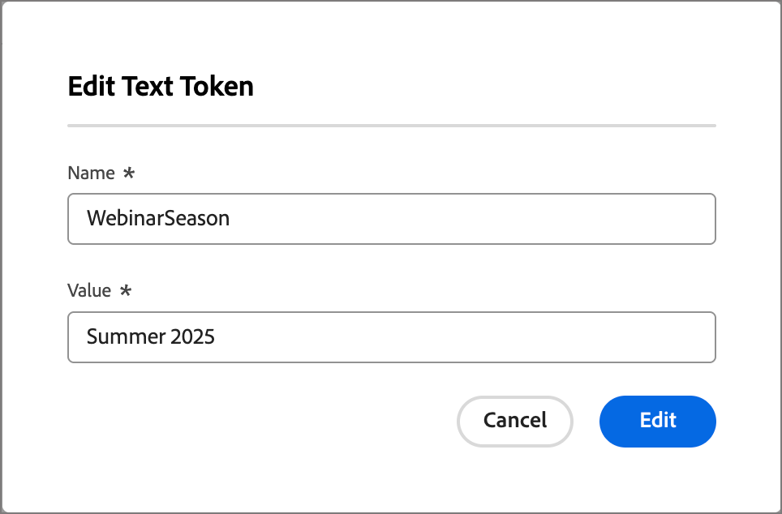

# 用于个性化的自定义令牌

内容个性化使用令牌作为生成内容工件时填充的占位符或变量。 标准个性化令牌可用于电子邮件、登陆页面、片段和模板。 您还可以使用特定于程序或文件夹的值定义一组自定义令牌。 这组自定义令牌称为&#x200B;_我的令牌_，其中的任何自定义令牌均可用于个性化。

向电子邮件添加自定义令牌时，会显示为`{{my.TokenName}}`。 例如，您可能创建了`{{my.EventDate}}`或`{{my.WebinarSpeaker}}`个令牌以管理与即将召开的网络研讨会相关的电子邮件内容。

除了特定于程序或文件夹的&#x200B;_我的令牌_&#x200B;之外，您还可以使用任何标准（内置）令牌进行个性化。

## 访问令牌

1. 在左侧导航栏中，展开&#x200B;**[!UICONTROL 营销管理]**。

1. 在&#x200B;**[!UICONTROL 营销]**&#x200B;资源列表的右侧，选择&#x200B;**[!UICONTROL 项目]**。

1. 在树结构中，选择程序或文件夹以在中心工作区中打开详细信息。

1. 单击&#x200B;**[!UICONTROL 令牌]**&#x200B;选项卡。

   所选程序中的{width="800" zoomable="yes"}

   该选项卡显示在该文件夹或程序中定义的所有自定义令牌，以及为父文件夹或程序定义的所有自定义令牌。

### 令牌类型 {#my-tokens}

_我的令牌_&#x200B;是您为程序或文件夹创建或修改的自定义变量。 此自定义令牌集支持以下令牌类型：

| 令牌类型 | 描述 |
| ---------- | ----------- |
| 文本 | 此类型包含标准文本字符串。 文本令牌的大小限制为524,288个字符(UTF-8)或2 MB。 |
| 日期 | 此类型包含日期值。 日期显示为月 — 日 — 年（例如，09-23-2026）。 |
| 日期和时间 | 此类型包含日期和时间值。 |
| 数字 | 此类型保存一个标准整数值。 |
| 电子邮件 | 此类型包含有效的电子邮件地址。 |
| 得分 | 使用此令牌可更改历程操作节点的分数。 |
| 布尔值 | 此类型包含标准布尔值，即true或false。 |
| 富文本 | 此类型保存带格式的文本。 |

### 令牌嵌套

在程序或文件夹中创建令牌时，该令牌可供其他子对象引用。

* 本地令牌 — 令牌在同一程序或文件夹中定义。
* 继承的令牌 — 令牌在父项目或文件夹中定义，在当前项目或文件夹的上一级或多级。
* 覆盖的令牌 — 令牌在父程序或文件夹中定义，但在当前程序或文件夹中定义了不同的值。 令牌状态更改为&#x200B;_已覆盖_，并且所有子文件夹、项目和营销项目都将继承新值。

{width="600" zoomable="yes"}

### 创建令牌

1. 在&#x200B;_[!UICONTROL 令牌]_&#x200B;选项卡中，单击&#x200B;**[!UICONTROL 创建]**。

1. 在对话框中，输入令牌的&#x200B;**[!UICONTROL 名称]**。

   {width="400"}

   令牌名称中不能使用空格或特殊字符。 您可以使用&#x200B;_驼峰式大小写_（如`EventType`）来使用易于识别的多词名称。

1. 为令牌选择&#x200B;**[!UICONTROL 类型]**。

1. 为令牌设置&#x200B;**[!UICONTROL 值]**。

1. 单击&#x200B;**[!UICONTROL 创建]**。

### 编辑令牌

您可以编辑任何定义的“我的令牌”的值。 这样做可覆盖继承令牌的值。

<!-- (How does this affect live person journeys? ) -->

1. 在&#x200B;_[!UICONTROL 令牌]_&#x200B;上，单击令牌名称旁边的&#x200B;_编辑_&#x200B;图标。

1. 在字段中，根据需要更改值。

   {width="400"}

1. 单击&#x200B;_保存_&#x200B;图标。

### 删除令牌

如果历程电子邮件内容当前未使用自定义令牌，您可以从列表中删除该令牌。

1. 在&#x200B;_[!UICONTROL 令牌]_&#x200B;上，单击令牌名称旁边的&#x200B;_删除_&#x200B;图标。

1. 在确认对话框中单击&#x200B;**[!UICONTROL 删除]**。

<!--

## Use custom tokens in your content

When you are authoring email content for your programs, you can use any of the tokens from the _My Tokens_ list when you use the personalization tools in the visual design space.

1. Select the text component and click the _Add personalization_ (  ) icon in the toolbar.

   {width="600"}

   This action opens the _Edit Personalization_ dialog. The dialog includes a _[!UICONTROL My tokens]_ folder in the _[!UICONTROL Personalization Tokens]_ library if there are custom tokens defined for the account journey.

1. To add one of your custom tokens to the blank space, expand the **[!UICONTROL My tokens]** folder, then click **+** or **...**.

   You can add any additional static text as needed.

   {width="700" zoomable="yes"}

1. Click **[!UICONTROL Save]**.

-->
