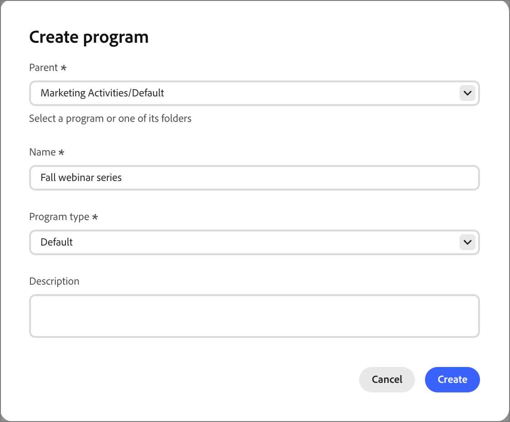

# 项目

计划旨在为营销宣传资料和历程提供共享上下文，因此您可以从单个位置管理营销工作的各个方面。 使用项目属性描述您的项目，并使用&#x200B;_项目成员_&#x200B;筛选器根据项目成员资格、成员状态和成功细分受众。 在“令牌”选项卡中，您可以管理本地&#x200B;_我的令牌_&#x200B;以及在文件夹结构中继承的令牌。

## 访问程序 {#access-programs}

每个项目都位于&#x200B;_[!UICONTROL 营销]_&#x200B;文件夹结构中，可以包含历程、列表和其他资源来组织您的营销工作。

1. 在左侧导航栏中，展开&#x200B;**[!UICONTROL 营销管理]**。

1. 在&#x200B;**[!UICONTROL 营销]**&#x200B;资源列表的右侧，选择&#x200B;**[!UICONTROL 项目]**。

1. 使用&#x200B;_搜索_&#x200B;和&#x200B;_筛选器_&#x200B;工具查找结构中的项。

1. 在结构中选择项目或文件夹，以在中心工作区中打开其详细信息。

   {width="800" zoomable="yes"}

   选择任意选项卡以访问程序或文件夹详细信息或内容。

## 创建项目 {#create-program}

>[!IMPORTANT]
>
>每个程序都基于[程序类型](../admin/program-types.md)，它定义了程序及其成员的重要方面。 在创建程序之前，请确保您定义了程序类型以支持该程序。

1. 单击程序树结构顶部的&#x200B;**[!UICONTROL 创建程序]**。

1. 在对话框中，选择“程序”结构中的&#x200B;**[!UICONTROL 父]**&#x200B;位置。

   这可以是根、文件夹或现有程序。

1. 输入唯一的&#x200B;**[!UICONTROL 名称]**（必需）。

   {width="400"}

1. 选择&#x200B;**[!UICONTROL 程序类型]**，这将确定程序属性和成员状态。

1. （可选）输入程序的&#x200B;**[!UICONTROL 描述]**。

   >[!TIP]
   >
   >包括描述是一种最佳实践，可使您的程序更易于访问和发现。

1. 单击&#x200B;**[!UICONTROL 创建]**。

## 属性 {#attributes}

每个程序都从其[程序类型](../admin/program-types.md)继承一组属性。 使用属性描述营销方案的重要方面，如事件日期和位置属性。

>[!NOTE]
>
>在Beta之后推出：项目作为令牌和项目约束成员属性

## 状态 {#statuses}

每个程序从其程序类型继承一组成员状态。 这些状态可以分配给项目群成员，以便使用项目群成员过滤器进行受众分段。

每个状态都分配给程序类型中的步骤，如1、2或3。 程序成员只能从具有相同步骤编号的状态（例如，从&#x200B;_No-Showed_&#x200B;到&#x200B;_Attended_）或具有较高步骤编号的状态（例如，从&#x200B;_Required_&#x200B;到&#x200B;_Registered_）。

在项目类型中，选择&#x200B;_[!UICONTROL 标记为成功]_&#x200B;的状态被视为成功。

### 更改项目状态 {#change-program-status}

若要将人员添加到计划或更改其状态，他们必须在历程[&#128279;](./action-nodes.md)中传递&#x200B;**_[!UICONTROL 更改计划状态]_** 操作。 这使其成为程序的成员，并在该程序中为其分配状态。

### 更正项目状态 {#correct-program-status}

如果错误地将人员分配给了某个状态，并且无法将其向前或横向移动到正确的状态，则可以通过先将人员设置为&#x200B;_不在计划中_，然后将他们设置为正确的状态来更正此问题。

## 成员 {#members}

**成员**&#x200B;选项卡显示项目群成员的清单。

<!-- How do they get there? I don't see this populated for any of the programs that I have reviewd -->

## 令牌 {#tokens}

使用&#x200B;_我的令牌_&#x200B;可轻松管理出现在许多位置的项目详细信息，如事件日期和位置、电子邮件页脚、会计年度和季度等。 这些特定于项目的令牌是特殊字符串，旨在跨历程或营销资产重复使用，以替换预先确定的值。 例如：

_您受邀参加`{{my.Event Date}}`的展览。_

如果您通过项目下的历程发送此电子邮件，且项目的&#x200B;_事件日期_&#x200B;我的令牌设置为`2026-01-01`，则收件人会看到：

_邀请您参加2026-01-01的博览会。_

我的令牌也可以在文件夹级别进行分配。文件夹和程序都会继承为树中的父项定义的任何“我的令牌”。 如果在较低级别定义了同一令牌的不同值，则可以覆盖继承的令牌。 例如，您可以在文件夹结构顶部定义电子邮件页脚，但更改与合作伙伴联合营销活动的版权语言，或更改产品特定项目的促销横幅URL。

有关定义和使用“我的令牌”的更多信息，请参阅[个性化的自定义令牌](./personalization-my-tokens.md)。

## 项目筛选器成员 {#member-of-program}

_项目群成员_&#x200B;是一个过滤器，允许您根据某人是否为项目群成员、他们处于什么状态以及他们是否成功参与该项目来细分动态列表。 同时使用&#x200B;**_程序_**&#x200B;和&#x200B;**_状态_**&#x200B;约束时要小心 — 将匹配类型与用于筛选器的程序一起使用，否则可能会无意中创建不能有任何成员的受众。
