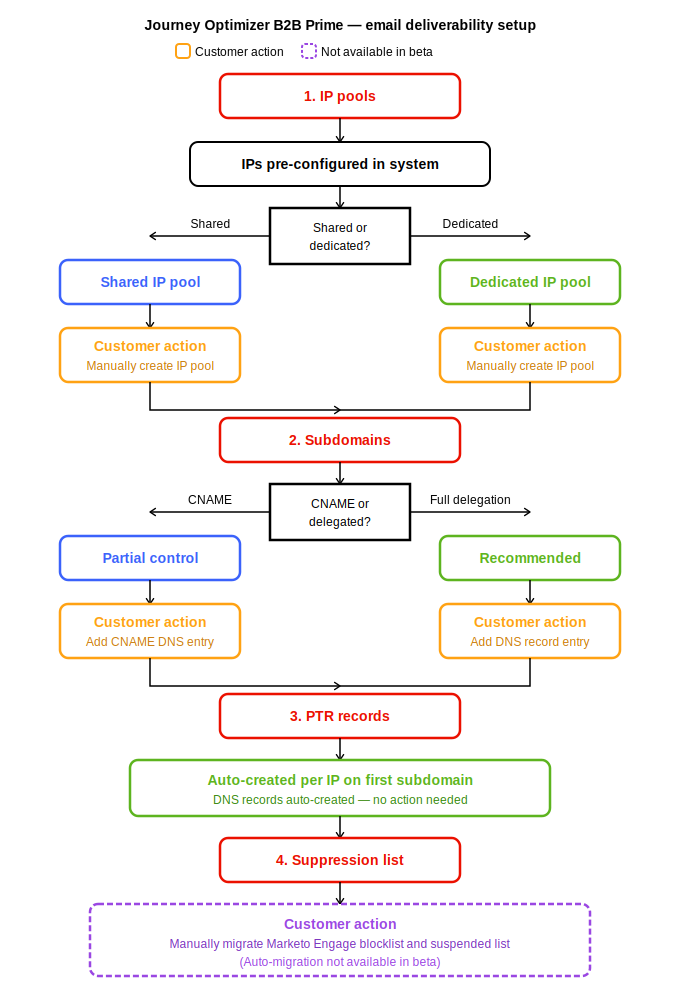

# 电子邮件送达率

以下信息适用于配置发送基础架构以支持营销人员和电子邮件内容创建者的管理员。 它描述了可投放性功能以及如何配置子域、身份验证和IP池。 有关电子邮件渠道的其他信息，请参阅以下主题：

* 配置电子邮件渠道 — [电子邮件渠道配置](../admin/email-channel-configuration.md)
* 创建电子邮件 — [向历程添加电子邮件](../marketing/email-channel.md)
* 设计电子邮件内容 — [电子邮件内容创作](../content/email-authoring.md)。

[!DNL Journey Optimizer B2B Prime]中的电子邮件可投放性是一组基础架构和身份验证配置，可帮助电子邮件到达收件人的收件箱，而不是垃圾邮件文件夹，并且不会被ISP（Internet服务提供商）阻止。

它使用以下构建基块，这些构建基块由管理员配置，通常按以下顺序配置：

1. [将一个或多个子域](#subdomain-delegation)委派给Adobe。
1. [在每个子域上配置DMARC、SPF和DKIM记录](#dmarc-spf-dkim)。
1. [确认用于发送子域电子邮件的IP池](#ip-pools)。
1. [创建一个或多个绑定子域、IP池和发件人标识的电子邮件通道配置](../admin/email-channel-configuration.md#create-email-channel-configuration)。

{width="450" zoomable="yes"}

>[!TIP]
>
>将可投放性和渠道设置视为一次性管理员活动。 配置后，营销人员和电子邮件作者无需重新访问它。

## 当前限制 {#limitations}

* 子域委派的&#x200B;**自定义委派方法**&#x200B;尚不可用 — 请使用“完全委派”或CNAME。 自定义委派面向GA。
* 在Beta中，**专用IP池**&#x200B;不可用。 共享IP池是唯一选项。 在GA提供专用IP ，包括IP预热计划和PTR记录管理。

## 重要概念 {#key-concepts}

在配置电子邮件之前，请查看以下适用于电子邮件渠道可投放性功能的概念：

| 概念 | 在[!DNL Journey Optimizer B2B Prime]中的含义 |
| ------- | ---------------------- |
| **_子域_** | 发送域的委派部分（例如，`mail.contoso.com`），用于通过Prime发送电子邮件。 子域可将您的B2B营销声誉与公司邮件或事务性邮件隔离。 |
| **_IP池_** | 与一个或多个子域关联的一组IP地址。 在此版本中，Prime支持由Adobe管理的共享IP池；专用IP池列在GA路线图中。 |
| **_渠道配置_** | 可重用的一组电子邮件发送设置（发件人身份、回复地址、子域、IP池、电子邮件类型和跟踪），可附加到历程中的电子邮件操作中。 您可以为不同的品牌、业务部门或发送类型使用多个命名渠道配置。 |

<!--

## Roles and permissions {#roles-permissions}

[!DNL Journey Optimizer B2B Prime] uses role-based access control (RBAC) for email features. Permissions are managed in the Adobe Admin Console (IMS) and synced at login. Product administrators assign granular permissions to product profiles, and then attach those product profiles to users.

Access to email functionality in [!DNL Journey Optimizer B2B Prime] is gated by two layers:

1. **Feature flag (LD).** A LaunchDarkly flag controls whether the entire feature is turned on for your organization. Email authoring and deliverability are gated by `dx_ajo_btob_channel_foundation`. Without this flag, the feature is hidden regardless of permissions.
2. **Functional permission.** A user-level permission that controls whether a specific user can read or write within a feature.

Most email features follow a `view-*` (read) and `manage-*` (write) pattern. A user needs the read permission to see a feature in the navigation, and the write permission to create, edit, or delete within it.

### Email authoring permissions {#email-authoring-permissions}

| Capability | Permission | What it allows |
| ---------- | ---------- | -------------- |
| **View emails** | `view-b2b-emails` | View the email list, open emails, view content (read-only). |
| **Create / edit / delete emails** | `manage-b2b-emails` | All read access plus create, edit, duplicate, and delete emails. Required to author email content within a journey. |
| **View templates** | `view-b2b-templates` | Browse and preview templates in the Templates gallery (read-only). |
| **Create / edit / delete templates** | `manage-b2b-templates` | All read access plus create, edit, and delete saved templates. |
| **View fragments** | `view-b2b-fragments` | Browse and preview visual fragments (read-only). |
| **Create / edit fragments** | `manage-b2b-fragments` | All read access plus create and edit visual fragments. |
| **Publish fragments** | `publish-b2b-fragments` | Publish a fragment so it becomes available to email authors across the organization. |
| **Manage shared assets and library items** | `manage-b2b-library-items` | Manage the underlying shared library used by templates, fragments, and emails. Often granted alongside the template/fragment manage permissions. |
| **Manage usage labels** | `manage-b2b-delete-usage-labels` | Manage data usage labels (DULE) attached to library items for governance. |
| **Manage packages** | `manage-b2b-packages` | Bundle and move templates, fragments, and emails between sandboxes. |
| **View assets (Marketo Design Studio assets in Prime)** | `view-b2b-assets` | Browse the asset picker and preview images. Read-only. |
| **Manage assets** | `manage-b2b-assets` | All read access plus future asset-management actions (Beta scope). |
| **Export message data** | `manage-b2b-message-export` | Export email-level message data and reports. |

Within a person journey, the **Send email** action requires `manage-b2b-person-journeys` (to add the action and activate the journey). A user with only email permissions can author content but cannot add an email to a journey.

### Email deliverability permissions {#email-deliverability-permissions}

Deliverability features (subdomains, DMARC, IP pools, suppression lists, allowed lists, IP warmup plans, and seed lists) are administrator-level configuration. They are governed by two permissions covering the entire **[!UICONTROL Channels]** > **[!UICONTROL Email settings]** area:

| Capability | Permission | What it allows |
| ---------- | ---------- | -------------- |
| **View email settings** | `view-b2b-email-settings` | View subdomains, PTR records, IP pools, suppression list, allowed list, IP warmup plans, and seed lists (read-only). |
| **Manage email settings** | `manage-b2b-email-settings` | All read access plus delegate subdomains, configure DMARC, manage suppression and allowed lists, manage IP warmup plans and seed lists. |

Some sub-features within Email settings are gated by additional LaunchDarkly flags — Suppression list (`enable-suppression`), Allowed list (`enable-allow-list`), Seed lists (`enable-seedlist-ui`). If a sub-feature is not visible in your organization, check with your Adobe representative on flag enablement.

### Channel configuration permissions {#channel-configuration-permissions}

Channel configurations sit under **[!UICONTROL Channels]** → **[!UICONTROL General settings]**. They tie deliverability primitives (subdomain, IP pool, sender identity) to a reusable object that journey authors reference. They are governed by a single permission:

| Capability | Permission | What it allows |
| ---------- | ---------- | -------------- |
| **Manage channel configurations** | `manage-b2b-channels-configurations` | View, create, edit, and delete email channel configurations. |

-->

## 子域委派 {#subdomain-delegation}

子域委派会告知Internet已授权Adobe代表域的特定子域（例如，`mail.contoso.com`）发送电子邮件。 委派专用子域（而不是根域）可保护您的公司邮件并提供以下好处：

* **信誉隔离。** 营销发送与公司邮件分开。 如果营销信誉下降，您的交易邮件和公司邮件不会受到影响。
* **更快的IP预热速度。** 专用子域有助于在ISP中更快地建立积极的发件人信誉。
* **新式身份验证。** SPF、DKIM和DMARC可以按子域进行干净设置，而不会影响其他邮件流。
* **合规性。** 帮助满足Gmail、Yahoo和其他主要ISP的批量发件人要求。

>[!NOTE]
>
>Prime中的每个子域只能由一个Adobe产品使用。 您不能在Prime和其他产品（如Adobe Marketo Engage或Adobe Campaign）之间共享相同的发送子域，您必须使用不同的子域。

### 支持的方法 {#supported-methods}

Prime支持此Beta版本中的三种子域委派方法中的两种。 第三种方法（自定义委派）正在制定中。

| 方法 | 使用时间 | 它包含的内容 |
| ------ | ----------- | ---------------- |
| **已完全委派** | 推荐 | 将子域的完整DNS特权委派给Adobe。 Adobe创建并维护MX、SPF、DKIM、DMARC、A和CNAME记录。 操作开销最低。 Adobe会为您处理DNS更改。 |
| **CNAME** | 对于受限策略 | 保留DNS权限，并创建指向Adobe管理的记录的CNAME记录。 当贵组织的DNS策略不允许完全委派时，使用此选项。 您负责维护DNS记录。 |
| **自定义委派** | 路线图(GA) | 维护DNS和SSL证书的完全所有权。 提供最大程度的控制，包括使用您自己的证书的能力。 这是针对GA版本进行的。 |

### 委派子域（完全委派方法） {#delegate-fully-delegated}

>[!PREREQUISITES]
>
>* 决定子域命名约定（例如，`mail.contoso.com`表示营销，`alerts.contoso.com`表示事务型）。
>* 与您的IT/DNS团队确认，他们可以将子域（NS记录）委派给Adobe。
>* 在DNS提供商中创建新的子域，然后等待24-48小时以进行DNS传播，然后再委派给Adobe。
>* 确认您在Prime中具有“管理员”角色。

1. 在[!DNL Adobe Journey Optimizer B2B Prime]左侧导航中，展开&#x200B;**[!UICONTROL 管理]**&#x200B;并选择&#x200B;**[!UICONTROL 渠道]**。
1. 在面板中，展开&#x200B;**[!UICONTROL 电子邮件设置]**&#x200B;并选择&#x200B;**[!UICONTROL 子域]**。
1. 单击&#x200B;**[!UICONTROL 设置子域]**。
1. 输入完整的子域名（例如，`mail.contoso.com`）。
1. 选择&#x200B;**[!UICONTROL 完全委派]**&#x200B;作为委派方法。
1. 为子域配置DMARC（请参阅[DMARC、SPF和DKIM](#dmarc-spf-dkim)）。

   至少应使用开始策略`none`设置DMARC记录，以便您可以在不影响投放的情况下监视报告。

1. 查看要由Adobe管理的DNS记录列表。

   这些记录通常包括MX、SPF、DKIM、DMARC、A和CNAME记录（用于跟踪和镜像页面URL）。

1. 使用&#x200B;**[!UICONTROL 下载记录]**&#x200B;按钮将DNS记录下载为CSV文件。 与您的DNS团队共享此文件。

1. 您的DNS团队会添加域托管解决方案中的NS记录，该解决方案可将子域委派给Adobe。

1. 在您的DNS团队确认记录已到位后，返回到[!DNL Journey Optimizer B2B Prime]并选中确认您已在托管网站上创建所需记录的框。

1. 单击&#x200B;**[!UICONTROL 提交]**&#x200B;以启动一系列验证检查（预验证、MX、SPF、DKIM、DMARC、FBL注册）。

1. 等待子域状态更改为&#x200B;**[!UICONTROL 成功]**。

   DNS传播完成后，这通常需要几分钟的时间。

>[!NOTE]
>
>如果验证失败，则状态将更改为&#x200B;**[!UICONTROL 失败]**，[!DNL Journey Optimizer B2B Prime]将显示原因（例如，未找到NS记录、MX记录缺失或DMARC配置错误）。 请修复基本DNS问题，然后重试提交。

### 委派子域（CNAME方法） {#delegate-cname}

仅当贵组织的DNS策略禁止完全委派时，才使用此方法。 使用CNAME，您可以保留DNS记录。

1. 在[!DNL Adobe Journey Optimizer B2B Prime]左侧导航中，展开&#x200B;**[!UICONTROL 管理]**&#x200B;并选择&#x200B;**[!UICONTROL 渠道]**。
1. 在面板中，展开&#x200B;**[!UICONTROL 电子邮件设置]**&#x200B;并选择&#x200B;**[!UICONTROL 子域]**。
1. 单击&#x200B;**[!UICONTROL 设置子域]**。
1. 输入完整的子域名。
1. 选择&#x200B;**[!UICONTROL CNAME]**&#x200B;作为委派方法。
1. 为子域（[DMARC、SPF和DKIM](#dmarc-spf-dkim)）配置DMARC。
1. 查看要生成的CNAME记录列表。 这些功能可将子域的组件指向Adobe管理的记录。
1. 以CSV格式下载记录并与您的DNS团队共享。
1. 您的DNS团队将每个CNAME记录添加到您的DNS托管解决方案。
1. 当记录已到位并传播时，返回到[!DNL Adobe Journey Optimizer B2B Prime]并进行确认。
1. 单击&#x200B;**[!UICONTROL 提交]**。
1. 等待状态达到&#x200B;**[!UICONTROL 成功]**。

>[!IMPORTANT]
>
>使用CNAME，Adobe无法帮助您更改、维护子域的DNS或对其进行故障排除。 任何未来的更改（例如为功能更新添加新的CNAME）都必须由您的DNS团队进行。

### 子域护栏 {#subdomain-guardrails}

* **默认限制：**&#x200B;每个组织10个子域。 如果您需要更多（最多100个，具体取决于合同），请联系您的Adobe代表。
* **DNS传播：**&#x200B;允许24-48小时让更改在全球传播。 验证可能会失败，原因只是DNS尚未传播。
* **子域重用：**&#x200B;其他Adobe产品(Marketo Engage、Adobe Campaign)已使用的子域不能在Prime中重用。

## DMARC、SPF和DKIM {#dmarc-spf-dkim}

DMARC、SPF和DKIM是电子邮件身份验证标准。 它们共同向接收邮件服务器证明您的邮件确实代表您的域发送，并且未被欺骗。 现代ISP(Gmail、Yahoo、Microsoft)要求批量发件人遵守这些标准。

| 记录 | 表示 | 用途 |
| ------ | ---------- | ------- |
| **SPF** | 发件人策略框架 | 列出允许从域发送邮件的邮件服务器IP。 接收服务器拒绝来自此列表以外的IP的邮件。 当您委派子域（完全委派）时，Adobe会自动创建并维护SPF记录。 |
| **DKIM** | 域密钥标识的邮件 | 向每个出站电子邮件中添加了加密签名。 接收服务器根据DNS中发布的公钥验证签名。 Adobe在子域委派期间自动生成DKIM密钥和DNS记录。 |
| **DMARC** | 基于域的消息验证、报告和符合性 | 告知接收服务器如果SPF或DKIM失败该怎么做，并提供有关身份验证结果的报告。 DMARC具有三种策略模式：无、隔离和拒绝。 |

### DMARC策略模式 {#dmarc-policy-modes}

| 策略 | 操作 | 使用时间 |
| ------ | ------ | ----------- |
| `none` | 监测 | 如果DMARC失败，接收服务器不执行任何操作，但仍会发送报表。 在首次委派子域以确认身份验证工作正常且不会丢失消息时，请使用此选项。 |
| `quarantine` | 隔离 | 接收服务器将失败邮件放入垃圾邮件/垃圾邮件文件夹中。 |
| `reject` | 拒绝 | 接收服务器拒绝（退回）身份验证失败的消息。 最严格的模式。 一旦您对身份验证设置充满信心，则建议使用。 |

### 配置DMARC {#configure-dmarc}

DMARC在委派子域时进行配置，但您也可以为已委派的子域添加或更新DMARC 。

1. 在[!DNL Adobe Journey Optimizer B2B Prime]左侧导航中，展开&#x200B;**[!UICONTROL 管理]**&#x200B;并选择&#x200B;**[!UICONTROL 渠道]**。

1. 在面板中，展开&#x200B;**[!UICONTROL 电子邮件设置]**&#x200B;并选择&#x200B;**[!UICONTROL 子域]**。

1. 在子域列表中，找到您的子域，并检查DMARC记录列。

   如果缺少记录，则会显示警报。

1. 打开子域并滚动到DMARC记录部分。

   * 如果父域上已存在DMARC记录，[!DNL Journey Optimizer B2B Prime]将自动获取值。 您可以保留或覆盖。
   * 如果不存在记录，请选择&#x200B;**[!UICONTROL 使用Adobe管理]**，Adobe将创建并托管DMARC记录。

1. 设置策略： `none`、`quarantine`或`reject`。 除非您的父域上已有成熟的DMARC状态，否则请以`none`开始。

1. （可选）配置其他DMARC标记（子域策略为`sp`，百分比为`pct`，报表地址为`rua`和`ruf`）。

1. 如果使用完全委派，请单击&#x200B;**[!UICONTROL 保存]**。

   Adobe会自动应用记录。 如果使用CNAME，请复制DNS记录并让您的DNS团队添加它，然后在[!DNL Journey Optimizer B2B Prime]中确认。

1. 允许DNS传播长达48小时，然后验证子域页面上的DMARC状态指示器是否绿色/正常。

>[!TIP]
>
>从`policy=none`开始监视身份验证报告，然后进展到`quarantine`，最后在报告显示健康的SPF和DKIM对齐时再进展到`reject`。 直接移至`reject`而不进行监视可能会导致合法邮件被拒绝。

## IP池 {#ip-pools}

IP池是用于发送电子邮件的已命名IP地址组。 IP池对发件人的信誉至关重要：每个池在ISP中都有自己的信誉，因此一个池的问题（例如，触发垃圾邮件投诉的营销突发）不会污染另一个池（例如，事务确认）。

### 池类型 {#pool-types}

| 池类型 | 可用性 | 描述 |
| --------- | ------------ | ----------- |
| **共享IP池** | 可在Beta上获取 | 由Adobe管理并在多个客户之间共享的IP地址池。 Adobe在整个池中维护声誉。 最适合中低级电子邮件数量和不想管理IP预热的客户。 |
| **专用IP池** | 路线图(GA) | 专门分配给贵组织的一个或多个IP地址。 名声归你所有。 建议大容量发件人使用。 包括IP预热计划和PTR记录管理。 |

### 查看和分配IP池 {#review-ip-pool}

在此版本中，为您的组织预配置了IP池。 在创建电子邮件渠道配置时分配IP池。

1. 在[!DNL Adobe Journey Optimizer B2B Prime]左侧导航中，展开&#x200B;**[!UICONTROL 管理]**&#x200B;并选择&#x200B;**[!UICONTROL 渠道]**。
1. 在面板中，展开&#x200B;**[!UICONTROL 电子邮件设置]**&#x200B;并选择&#x200B;**[!UICONTROL IP池]**。
1. 确认您的组织可以使用状态为&#x200B;**[!UICONTROL 活动]**&#x200B;的IP池。
1. 将鼠标悬停在池上以查看IP地址及其PTR记录（反向DNS）。
1. 如果您的组织有多个业务部门或品牌，请在创建渠道配置之前规划如何使用IP池（例如，营销池与网络研讨会池）。

>[!IMPORTANT]
>
>即使共享池可用，也不要在同一IP池上混合使用营销和事务性流量。 渠道配置中的电子邮件类型设置（营销型与事务型）可控制禁止行为，但您的渠道配置仍应尽可能使用不同的池。

<!--

### Frequently asked questions {#faq}

| Question | Answer |
| -------- | ------ |
| **Can I reuse the subdomain I already use in Marketo Engage?** | No. A subdomain can only be associated with one Adobe product at a time. Create a new subdomain (for example, mail2.contoso.com) for Prime. |
| **Why does my channel configuration show Failed?** | The most common reasons are: MX record validation failed (your subdomain DNS isn't fully configured); DMARC misalignment; or an IP pool that is in Processing and has never been associated with the selected subdomain. Open the configuration to see the specific reason. |
| **What happens if a personalization token has no value at send time?** | If you defined a fallback with the Handlebars `default` helper, the fallback is used. If not, the token resolves to an empty string. Prime warns you when a token has no fallback and the underlying attribute is not guaranteed by the audience definition. |
| **Can I personalize using account-level attributes?** | Not in this release. Personalization in Prime today supports profile attributes only. |
| **What's the maximum email size?** | 100 KB is the recommended best-practice cap for inbox rendering. Prime warns you in the editor if you exceed it. |
| **Can I migrate existing Marketo email templates into Prime?** | A guided self-serve migration tool — including Velocity-to-Handlebars conversion — is delivered at GA. In this release, you can manually rebuild templates or paste raw HTML. |
| **Will my updates to Marketo assets show up in Prime?** | No. Asset availability in Prime is based on a one-time copy from Marketo Design Studio. Re-uploaded or modified Marketo assets are not reflected in Prime today. Native asset upload and management within Prime is on the Beta roadmap. |

## Glossary {#glossary}

| Term | Definition |
| ---- | ---------- |
| **DKIM** | DomainKeys Identified Mail — cryptographic email signature. |
| **DMARC** | Domain-based Message Authentication, Reporting & Conformance. |
| **FBL** | Feedback Loop — a service ISPs offer to receive spam-complaint reports back to senders. |
| **Handlebars** | JavaScript templating language used in Prime for personalization expressions. |
| **IP pool** | Group of IP addresses used to send email. |
| **MX record** | Mail Exchange DNS record — directs incoming mail to the correct mail servers. |
| **NS record** | Name Server DNS record — used to delegate a subdomain. |
| **PTR record** | Pointer record — reverse DNS that maps an IP address back to a hostname. |
| **RBAC** | Role-Based Access Control. |
| **SPF** | Sender Policy Framework — DNS record listing authorized sending IPs. |
| **Subdomain delegation** | Granting Adobe authority over a portion of your domain (a subdomain) for sending email. |

-->

