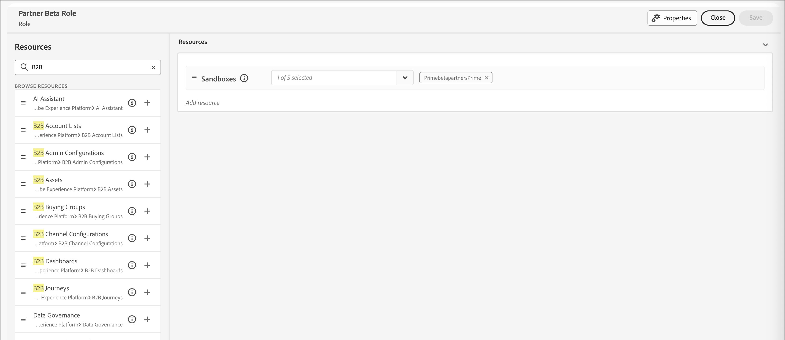

# 用户访问和权限

完成配置并绑定沙盒后，请完成以下步骤以为您的团队和用户提供对Adobe Journey Optimizer B2B edition的访问权限。

1. [在Admin Console中创建Adobe Journey Optimizer B2B edition产品配置文件](#create-profile)（仅限一次性/初始设置）。
1. 在Admin Console中[添加用户组](#add-user-group)。
1. [编辑内置角色](#edit-roles-for-product-permissions)或[在Adobe Experience Platform权限中创建具有Journey Optimizer B2B edition权限的自定义角色](#create-a-custom-role)。
1. [将用户](#add-users-to-a-role)或[组](#add-user-groups-to-a-role)添加到Adobe Experience Platform中的角色。

## 配置产品配置文件 {#config-profile}

作为管理员，您可以在Adobe Admin Console中完成这些任务，这是管理您的Adobe产品许可证和用户的中心位置。 在Admin Console中，您可以在单个位置而不是在各种单独的解决方案中创建和管理用户。 要了解有关其功能和功能的更多信息，请参阅[Admin Console概述](https://helpx.adobe.com/cn/enterprise/using/admin-console.html)页面。

### 访问Admin Console

在使用Admin Console管理团队中的用户之前，您需要确保可以访问Admin Console并具有适当的权限。

1. 作为系统管理员，您应在载入流程中收到来自Adobe的多封电子邮件。

   查找欢迎电子邮件，其中提供了有关您被授予访问权限的组织名称的信息。

1. 单击欢迎电子邮件中的&#x200B;**[!UICONTROL 开始使用]**&#x200B;链接以导航到Admin Console。

   如果找不到电子邮件，请直接打开浏览器访问Admin Console，网址为[https://adminconsole.adobe.com](https://adminconsole.adobe.com)。

1. 使用您的Adobe ID登录。

   成功登录后，您会看到Adobe Admin Console的&#x200B;_概述_&#x200B;页面。

1. 如果您有权访问多个组织，请确保您已登录到正确的组织。

   要更改您的组织，请单击右上角的组织名称，然后选择您需要访问的组织。

1. 从&#x200B;_[!UICONTROL 用户]_&#x200B;信息卡中选择&#x200B;**[!UICONTROL 管理员]**&#x200B;以验证您是系统管理员。

   {width="800" zoomable="yes"}

1. 通过输入您的Adobe ID电子邮件、用户名、名字或姓氏进行搜索。

   * 如果您的访问权限配置正确，搜索将返回您的记录。

   * 如果&#x200B;**[!UICONTROL 管理员角色]**&#x200B;列中的值显示`System`，则表示您自己（或显示的用户）是系统管理员。

### 创建Adobe Journey Optimizer B2B edition产品配置文件 {#create-profile}

授予用户访问Adobe解决方案的权限时，您不一定要授予他们完全访问权限。 产品配置文件使每个解决方案都有自己的用户权限集。 使用Admin Console分配产品配置文件。

有关将产品配置文件用于用户权限的详细信息，请参阅Admin Console文档中的&#x200B;[_管理企业用户的产品配置文件_](https://helpx.adobe.com/enterprise/using/manage-product-profiles.html){target="_blank"}。

{width="30"}系统管理员或Adobe Journey Optimizer B2B edition产品管理员可以从[https://adminconsole.adobe.com](https://adminconsole.adobe.com)中执行以下步骤。

1. 选择&#x200B;**[!UICONTROL 产品]**&#x200B;选项卡。

1. 打开要添加配置文件的Adobe Journey Optimizer B2B edition实例，然后单击&#x200B;**[!UICONTROL 新建配置文件]**。

   {width="600" zoomable="yes"}

1. 输入产品配置文件名称，如&#x200B;_B2B用户_。

1. 单击&#x200B;**[!UICONTROL 下一步]**，然后单击&#x200B;**[!UICONTROL 保存]**。

### 添加用户群组 {#add-user-group}

用户组是获得一组共享权限的用户集合。 您可以在用户组中添加或删除用户。 当组内的用户发生更改时，组权限保持不变。

有关如何使用用户组管理权限的更多信息，请参阅Admin Console文档中的[管理用户组](https://helpx.adobe.com/cn/enterprise/using/user-groups.html){target="_blank"}。

{width="30"}系统管理员可以从[https://adminconsole.adobe.com](https://adminconsole.adobe.com)中执行以下步骤。

1. 选择&#x200B;**[!UICONTROL 用户]**&#x200B;选项卡。

1. 在左侧导航中选择&#x200B;**[!UICONTROL 用户组]**。

1. 单击右上方的&#x200B;**[!UICONTROL 新建用户组]**。

1. 输入用户组的名称，如&#x200B;_B2B历程用户_，然后单击&#x200B;**[!UICONTROL 保存]**。

   {width="600" zoomable="yes"}

### 分配产品配置文件 {#assign-profile}

{width="30"}产品管理员可以从[https://adminconsole.adobe.com](https://adminconsole.adobe.com)中执行以下步骤。

1. 单击您创建的用户组。

1. 选择&#x200B;**[!UICONTROL 已分配的产品配置文件]**&#x200B;选项卡，然后单击&#x200B;**[!UICONTROL 分配配置文件]**。

1. 单击&#x200B;**+**&#x200B;并添加以下产品的每个实例：

   * [!UICONTROL Adobe Journey Optimizer B2B edition — 用户配置文件]
   * [!UICONTROL Adobe Experience Platform - AEP-Default-All-Users]
   * [!UICONTROL Adobe Experience Platform数据收集 — 默认数据收集所有访问]
   * [!UICONTROL Adobe Experience Platform — 默认的生产所有访问]

   {width="600" zoomable="yes"}

1. 单击&#x200B;**[!UICONTROL 保存]**。

### 将用户添加到新组 {#add-users}

有关用户管理的信息，请参阅Admin Console文档中的&#x200B;[_Adobe Admin Console用户_](https://helpx.adobe.com/cn/enterprise/using/users.html){target="_blank"}。

{width="30"}系统管理员或产品管理员可以从[https://adminconsole.adobe.com](https://adminconsole.adobe.com)中执行以下步骤。 产品管理员只能添加其组织中已存在的用户。

1. 如果用户还不是您组织的成员，请添加每个用户：

   * 在&#x200B;_[!UICONTROL 快速链接]_&#x200B;下，单击&#x200B;**[!UICONTROL 添加用户]**。

   * 输入用户的电子邮件地址，然后单击&#x200B;**[!UICONTROL 添加为新用户]**。

     {width="600" zoomable="yes"}

   * 输入名字和姓氏，然后单击&#x200B;**[!UICONTROL 保存]**。

1. 将每个用户添加到组：

   * 单击用户名。

   * 在用户详细信息页面中，滚动到&#x200B;**[!UICONTROL 用户组]**。

   * 单击左侧的&#x200B;_更多_ ( **...** )图标，然后选择&#x200B;**[!UICONTROL 编辑用户组]**。

   * 单击&#x200B;**[!UICONTROL 用户组]**&#x200B;下方的&#x200B;_添加_ (**+**)图标。

     {width="600" zoomable="yes"}

   * 选择您之前创建的用户组，然后单击&#x200B;**[!UICONTROL 应用]**。

   * 单击&#x200B;**[!UICONTROL 保存]**&#x200B;以查看用户更改。

## 编辑产品权限的角色 {#edit-roles-for-product-permissions}

权限是单一的权利，可用于定义分配给产品配置文件的授权。 每个权限都分组在功能（如历程或购买群组）下，代表Journey Optimizer B2B edition中的功能。

在Adobe Experience Platform的&#x200B;_权限_&#x200B;区域，管理员可以定义用户角色和访问策略，以管理产品应用程序内功能和对象的访问权限。 在此应用程序中，您可以创建和管理角色，并为这些角色分配所需的资源权限。 权限还允许您管理与特定角色关联的沙盒和用户。

有关Experience Platform中角色权限的更多信息，请参阅Experience Platform文档中的[管理角色的权限](https://experienceleague.adobe.com/en/docs/experience-platform/access-control/abac/permissions-ui/permissions){target="_blank"}。

1. 转到[experience.adobe.com](https://experience.adobe.com/)。

1. 在&#x200B;_[!UICONTROL 快速访问]_&#x200B;面板中，选择&#x200B;**[!UICONTROL 权限]**。

   >[!NOTE]
   >
   >如果您没有看到&#x200B;_[!UICONTROL 权限]_，您可能需要单击&#x200B;**[!UICONTROL 查看全部]**&#x200B;并从可用应用程序中选择它。

   {width="700" zoomable="yes"}

<!--

### B2B product permissions {#b2b-product-permissions}

The following permissions govern access to Journey Optimizer B2B Edition capabilities:

| Category | Description | Permissions |
| -------- | ----------- | ---------- |
| B2B Account Lists | Configure, manage, view, and publish permissions for B2B account lists. These permissions include actions such as add, remove, import, and delete accounts from account lists. | <li>Manage B2B Account Lists |
| B2B Admin Configurations | Configure, manage, and view permissions for B2B administrative configurations. These permissions include digital asset management connections, asset repositories, and events. | <li>Manage B2B Admin Configurations |
| B2B Assets | Configure, manage, and view permissions for B2B assets. These permissions include emails, SMS, landing pages, fragments, templates, and images. | <li>Manage B2B Assets <li>Manage B2B Templates <li>Manage B2B Fragments <li>Manage B2B Emails |
| B2B Buying Groups | Configure, manage, and view permissions for B2B buying groups. These permissions include solution interests, roles templates, and buying group status. | <li>Manage B2B Buying Groups <li>Manage B2B Solution Interests <li>Manage B2B Role Templates <li>Manage B2B Stages <li>View B2B Buying Groups |
| B2B Channel Configurations | Configure, manage, and view permissions for B2B channel configurations. These permissions include settings for communication limits, API credentials, and security settings. | <li>Manage B2B Channels Configurations |
| B2B Dashboards | Configure and view permissions for B2B dashboards. These permissions include account engagement, buying group stages, surging accounts, and contact coverage. | <li>View B2B Engagement Dashboard |
| B2B Journeys | Configure, manage, view, and publish permissions for B2B journeys. These permissions include account and person actions, event listeners, and split paths. | <li>Manage B2B Account Journeys |
| Journey Optimizer Rules | Access and configure frequency rules (communication limits). These permissions should be limited to product administrators. | <li>View Frequency Rules <li>Manage Frequency Rules |

### B2B built-in roles {#b2b-built-in-roles}

When your organization has the Journey Optimizer B2B Edition product provisioned, Experience Platform includes a set of built-in (default) roles that you can use to manage access to the product capabilities:

| Role | Permissions |
| ---- | ----------- |
| B2B Journey Manager | <li>Manage B2B Journeys <li>Manage B2B Buying Groups <li>Manage B2B Account Lists <li>View B2B Engagement Dashboard <li>View B2B Insights Dashboard |
| B2B Channel Manager | <li>Manage B2B Assets <li>Manage B2B Templates <li>Manage B2B Fragments |
| B2B System Administrator | <li>Manage B2B Channels Configurations <li>Manage B2B Admin Configurations |
| B2B Sales User | <li>View B2B Engagement Dashboard <li>View B2B Buying Groups <li>Access In-CRM Insights |

-->

### 编辑角色权限 {#edit-role-permissions}

对于内置或自定义角色，您可以随时决定添加或删除权限。 如果修改默认或自定义角色，则会影响分配给该角色的每个用户。

在以下示例中，您要为分配给B2B历程管理员角色的用户添加与B2B角色资源相关的权限。 此更改还允许该角色的用户管理帐户历程。

>[!NOTE]
>
>Admin Console系统管理员可以执行这些步骤。

更改角色&#x200B;:_的权限(_T)

1. 在左侧导航中选择&#x200B;**[!UICONTROL 角色]**。

1. 单击&#x200B;**_B2B渠道管理器_**&#x200B;角色名称。

1. 在详细信息页面中，单击右上方的&#x200B;**[!UICONTROL 编辑]**。

   {width="700" zoomable="yes"}

   在角色编辑器中，_[!UICONTROL 资源]_&#x200B;菜单显示应用于Experience Cloud - Platform支持的应用程序产品的资源列表。

   您可以在搜索工具中输入&#x200B;_B2B_&#x200B;以筛选B2B产品权限列表。

1. 单击B2B历程资源的&#x200B;_添加_&#x200B;图标(**+**)。

   {width="700" zoomable="yes"}

1. 在&#x200B;_[!UICONTROL B2B历程]_&#x200B;权限卡中，选择&#x200B;**[!UICONTROL 管理B2B帐户历程]**。

1. 单击&#x200B;**[!UICONTROL 保存]**。

   <!-- {width="700" zoomable="yes"} -->

1. 单击&#x200B;**[!UICONTROL 关闭]**&#x200B;以返回详细信息页面。

### 将用户添加到角色 {#add-users-to-a-role}

{width="30"}系统管理员或AEP产品管理员可以执行以下步骤。

1. 打开角色详细信息并选择&#x200B;**[!UICONTROL 用户]**&#x200B;选项卡。

   此选项卡显示分配给该角色的所有用户的列表。

1. 单击&#x200B;**[!UICONTROL 添加用户]**。

   {width="700" zoomable="yes"}

1. 在&#x200B;_[!UICONTROL 添加用户]_&#x200B;对话框中，找到并选择要添加到该角色的用户。

   * 您可以使用搜索工具来筛选用户列表。

   * 选中每个用户的复选框。

   {width="600" zoomable="yes"}

1. 选择您要添加的所有用户后，单击&#x200B;**[!UICONTROL 保存]**。

### 将用户组添加到角色 {#add-user-groups-to-a-role}

有关用户管理的信息，请参阅Admin Console文档中的&#x200B;[_Adobe Admin Console用户_](https://helpx.adobe.com/cn/enterprise/using/users.html){target="_blank"}。

{width="30"}系统管理员或AEP产品管理员可以执行以下步骤。

1. 打开角色详细信息并选择&#x200B;**[!UICONTROL 用户组]**&#x200B;选项卡。

   此选项卡显示分配给该角色的所有用户组的列表。

1. 单击&#x200B;**[!UICONTROL 添加群组]**。

   {width="700" zoomable="yes"}

1. 在&#x200B;_[!UICONTROL 添加组]_&#x200B;对话框中，找到并选择要添加到该角色的组。

   * 您可以使用搜索工具筛选用户组列表。

   * 选中每个用户组的复选框。

   {width="600" zoomable="yes"}

1. 选择您要添加的所有组后，单击&#x200B;**[!UICONTROL 保存]**。

### 创建自定义角色 {#create-a-custom-role}

{width="30"}系统管理员或AEP产品管理员可以执行以下步骤。

1. 在左侧导航中选择&#x200B;**[!UICONTROL 角色]**，然后选择&#x200B;**[!UICONTROL 创建角色]**。

1. 在&#x200B;_[!UICONTROL 创建新角色]_&#x200B;对话框中，输入角色的名称和描述（可选），例如&#x200B;_B2B营销人员_。

1. 单击&#x200B;**[!UICONTROL 确认]**。

1. 选择您的沙箱。

   {width="700" zoomable="yes"}

1. 添加B2B产品权限：

   <!-- To determine which product capabilities that you want for the role, refer to the list of [B2B product permissions](#b2b-product-permissions). -->

   在左侧的&#x200B;_[!UICONTROL 资源]_&#x200B;列表中，找到B2B项目并单击&#x200B;_添加_ (**+**)图标以添加要为该角色启用的每个属性。

   您可以在搜索工具中输入&#x200B;_B2B_&#x200B;以筛选B2B产品权限列表。

   {width="700" zoomable="yes"}

1. 单击右上方的&#x200B;**[!UICONTROL 保存]**。

1. 转到角色详细信息并选择&#x200B;**[!UICONTROL 用户组]**&#x200B;选项卡。

1. 单击&#x200B;**[!UICONTROL 添加群组]**。

   {width="700" zoomable="yes"}

1. 选中您之前在Admin Console中创建的用户组旁边的复选框。

1. 单击&#x200B;**[!UICONTROL 保存]**。

您的自定义角色已配置，并且分配组中的用户现在可以访问您选择的Journey Optimizer B2B edition功能。
