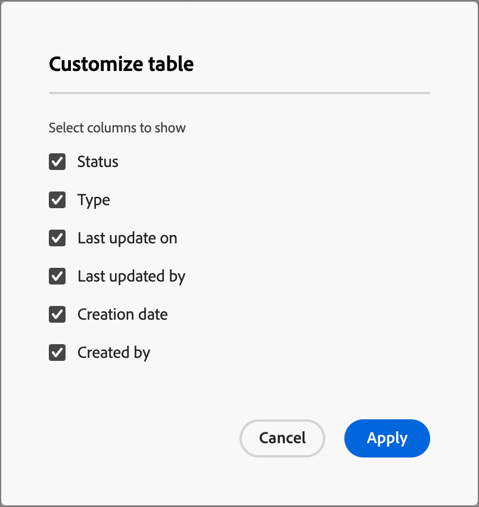
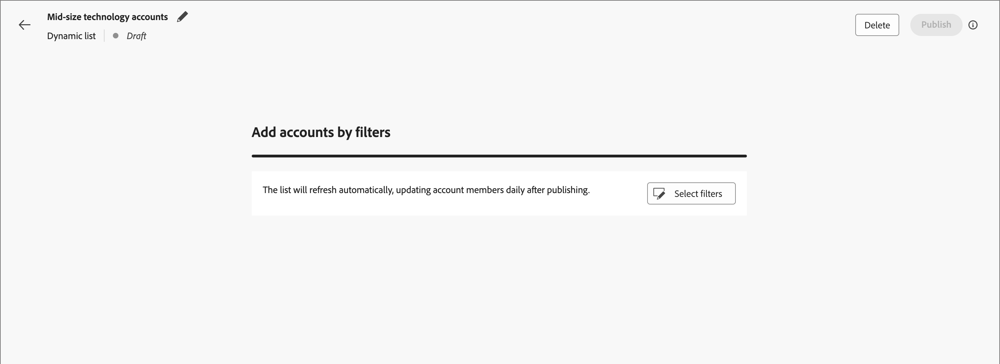

# 帐户列表

在Journey Optimizer B2B edition中，帐户列表是营销人员可用于进行目标历程编排的指定帐户集合。 帐户列表可以根据您定义的条件（如行业、位置或公司规模）来定位指定帐户。 帐户列表有两种类型：

* **静态** — 使用静态帐户列表时，该列表仅在您添加帐户时更改。 您可以通过应用过滤器集以根据当前帐户数据填充列表来手动添加帐户，或通过帐户历程添加和删除帐户。
* **动态** — 使用动态帐户列表，您可以定义用于自动策划列表的过滤器集。 系统使用此筛选器集根据帐户信息的更改添加和删除帐户。 此列表管理类似于Real-time Customer Data Platform[中的](https://experienceleague.adobe.com/zh-hans/docs/experience-platform/rtcdp/segmentation/b2b){target="_blank"}受众分段。

当帐户列表处于&#x200B;_实时_（已发布）状态时，它可用于[在帐户历程和Marketo Engage程序中使用](./account-lists-journeys.md)。

{width="30"} [观看视频概述](#overview-video)

>[!NOTE]
>
>帐户列表利用Marketo Engage中的帐户数据创建帐户区段和列表。 这意味着，如果Adobe Experience Platform中的某个帐户区段未主动同步到Marketo Engage，则该Experience Platform区段中的帐户可能在Journey Optimizer B2B edition帐户列表中不可用。 随后，Experience Platform区段中未同步到Marketo Engage的帐户中的任何人员，都不会包含在人员会员计数中，也不会计入触发事件中。

## 访问和浏览帐户列表

在左侧导航栏中，展开&#x200B;**[!UICONTROL 帐户]**，然后单击&#x200B;**[!UICONTROL 帐户列表]**。

{width="800" zoomable="yes"}

显示的&#x200B;_[!UICONTROL 帐户列表]_&#x200B;页包括以下列：

* [!UICONTROL 名称] （单击帐户列表名称以查看详细信息）
* [!UICONTROL 状态]
* [!UICONTROL 类型]
* [!UICONTROL 上次更新时间：]
* [!UICONTROL 上次更新者]
* [!UICONTROL 创建日期]
* [!UICONTROL 创建者]

此表包括按名称搜索的功能。 排序功能当前不可用。

您可以通过单击右上角的&#x200B;_列设置_ （  ）图标并选择或清除复选框来自定义显示的表。

{width="300"}

要查看帐户列表的描述，请单击名称旁边的&#x200B;_信息_ （  ）图标。

## 创建帐户列表

在创建帐户列表时，您可以定义一组筛选条件来生成该列表。 例如，您可以使用它生成行业为医疗保健且收入超过1亿美元的客户列表。

1. 在&#x200B;_[!UICONTROL 帐户列表]_&#x200B;页面中，单击该页面右上角的&#x200B;**[!UICONTROL 创建帐户列表]**。

   {width="700" zoomable="yes"}

1. 在&#x200B;_[!UICONTROL 创建帐户列表]_&#x200B;对话框中，输入唯一的&#x200B;**[!UICONTROL 名称]**（必需）和&#x200B;**[!UICONTROL 描述]**（可选）。

1. 为帐户列表&#x200B;_[!UICONTROL 静态]_&#x200B;或&#x200B;**[!UICONTROL 动态]**&#x200B;选择&#x200B;**[!UICONTROL 类型]**。

   {width="380"}

1. 单击&#x200B;**[!UICONTROL 创建]**。

   此时将打开一个新的静态帐户列表，其中包含一个空的帐户列表。 此时将打开新的动态帐户列表，该列表中包含&#x200B;_[!UICONTROL 按筛选器添加帐户]_&#x200B;面板。

## 将帐户添加到帐户列表

对于静态列表，您可以继续发布空帐户列表并通过帐户历程添加帐户。 您还可以在发布之前通过应用筛选器集手动添加帐户。

对于动态帐户列表，在发布列表之前，必须添加要用于自动管理列表的过滤器集。

>[!BEGINTABS]

>[!TAB 静态帐户列表]

创建静态帐户列表后，可以通过应用过滤器集来填充该列表。 您还可以应用筛选器集在静态帐户列表发布后(_Live_)将帐户添加到静态帐户列表。

>[!NOTE]
>
>如果您希望帐户列表以空形式开始，请不要选择任何过滤器，而只需发布帐户列表。 当您计划通过帐户历程操作添加成员时，最好从空列表开始（请参阅[执行操作节点 — 添加到帐户](#take-an-action-node---add-to-account)）。

1. 单击&#x200B;**[!UICONTROL 添加帐户]**。

   {width="700" zoomable="yes"}

   您可以在空列表页面或右上角访问此函数。

1. 在&#x200B;_[!UICONTROL 按筛选器添加帐户]_&#x200B;对话框中，使用&#x200B;**[!UICONTROL 帐户筛选器]**&#x200B;菜单添加要用于构造筛选器集的属性和活动：

   过滤器将嵌套到类别文件夹中。 您可以展开每个文件夹并滚动浏览可用过滤器列表。 或者，使用顶部的&#x200B;_搜索_&#x200B;工具来查找所需的过滤器。

   * 将筛选器从左侧菜单拖放到筛选器定义空间。
   * 完成匹配评估定义。
   * 对要包含的每个过滤器重复这些操作。

     {width="700" zoomable="yes"}

   * 可以通过在顶部应用&#x200B;**[!UICONTROL 筛选器逻辑]**&#x200B;来优化条件。 您可以选择匹配所有属性条件或任何条件。

     {width="450"}

1. 筛选器集和逻辑完成后，单击&#x200B;**[!UICONTROL 填充帐户]**。

   填充过程可能需要一些时间，具体取决于要评估和填充的帐户数量（数据库的大小和您选择的筛选条件）。 帐户填充到您的列表中最多可能需要两个小时。

您可以继续发布列表，以使其可用于帐户历程中的添加和删除操作。

>[!TAB 动态帐户列表]

创建动态帐户列表后，定义用于在列表&#x200B;_处于活动状态_（已发布）时管理该列表（添加/删除帐户）的筛选器集。 您不能通过帐户历程添加/删除帐户，但它是一个已发布的动态帐户列表，可用于起始帐户受众节点。

1. 单击&#x200B;**[!UICONTROL 选择筛选器]**。

   {width="700" zoomable="yes"}

1. 在&#x200B;_[!UICONTROL 按筛选器添加帐户]_&#x200B;对话框中，使用&#x200B;**[!UICONTROL 帐户筛选器]**&#x200B;菜单添加要用于构造筛选器集的属性和特殊筛选器：

   过滤器将嵌套到类别文件夹中。 您可以展开每个文件夹并滚动浏览可用过滤器列表。 或者，使用顶部的&#x200B;_搜索_&#x200B;工具来查找所需的过滤器。

   * 将筛选器从左侧菜单拖放到筛选器定义空间。
   * 完成匹配评估定义。
   * 对要包含的每个过滤器重复这些操作。

     {width="700" zoomable="yes"}

   * 可以通过在顶部应用&#x200B;**[!UICONTROL 筛选器逻辑]**&#x200B;来优化条件。 您可以选择匹配所有属性条件或任何条件。

     {width="450"}

1. 筛选器集和逻辑完成后，单击&#x200B;**[!UICONTROL 完成]**。

   如果您对筛选器集感到满意，可以继续[发布列表](#publish-an-account-list)，使其可用于帐户历程中的起始[帐户受众节点](#account-audience-node)。

   >[!NOTE]
   >
   >在发布动态帐户列表后，您无法更新该列表的筛选器。

   填充过程可能需要一些时间，具体取决于要评估和填充的帐户数量（数据库的大小和您选择的筛选条件）。 帐户填充到您的列表中最多可能需要两个小时。

>[!ENDTABS]

## 发布帐户列表

筛选器集完成后，您可以继续发布帐户列表。

>[!BEGINTABS]

>[!TAB 静态帐户列表]

1. 单击右上方的&#x200B;**[!UICONTROL 发布]**。

   {width="700" zoomable="yes"}

1. 在&#x200B;_[!UICONTROL 发布静态帐户列表]_&#x200B;对话框中，单击&#x200B;**[!UICONTROL 发布]**&#x200B;以进行确认。

   {width="400"}

静态帐户列表的状态更改为&#x200B;_[!UICONTROL Live]_，它可用于[在帐户历程](#account-list-usage-in-account-journeys)中使用。

>[!TAB 动态帐户列表]

筛选器集完成后，您可以继续发布动态帐户列表。 在帐户列表处于“实时”状态后，便可在帐户受众历程节点中选择。

1. 单击右上方的&#x200B;**[!UICONTROL 发布]**。

   {width="700" zoomable="yes"}

1. 在&#x200B;_[!UICONTROL 发布动态帐户列表]_&#x200B;对话框中，单击&#x200B;**[!UICONTROL 发布]**&#x200B;以进行确认。

   {width="400"}

动态帐户列表的状态更改为&#x200B;_[!UICONTROL 实时]_，并且可在帐户历程[中](#account-list-usage-in-account-journeys)使用。

>[!ENDTABS]

## 概述视频

>[!VIDEO](https://video.tv.adobe.com/v/3448636/?learn=on)
