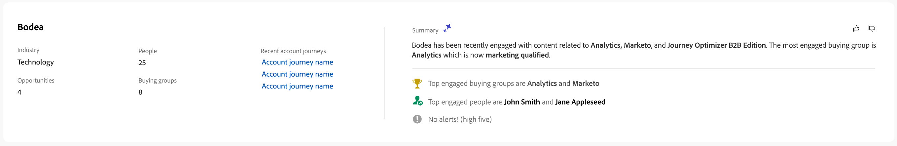

# 个人详细信息

当您从Journey Optimizer B2B edition中的任何位置单击人员名称时，都会显示人员详细信息页面。 此页面包含与帐户或购买组关联的人员的有用信息，包括高亮和意图数据的创作AI摘要（如果已配置）。<!-- There are also [actions](#person-actions) that you can execute for the person. -->

{width="800" zoomable="yes"}

通过单击[智能仪表板](../dashboards/intelligent-dashboard.md)、[购买群组详细信息页面](../buying-groups/buying-group-details.md)或[帐户详细信息页面](./account-details.md)中显示的名称，您可以访问此页面。

人员详细信息页面由以下四个部分组成：

## 人员概述

{zoomable="yes"}

页面顶部的人员概览部分包含以下信息：

* 名称
* 标题
* 电子邮件
* 电话号码
* 参与度评分
* 摘要

## 活动

此部分提供与人员相关的最新电子邮件、Web、表单填写和有趣时刻的列表（最多20个）。 这些项将作为活动类型以及日期和时间列出。

{width="700" zoomable="yes"}

## 基于参与度得分购买群组

此部分包括购买组，该人员是其中的成员，并根据参与度分数排序。 每张购物卡都包含以下购买群组信息：

* 名称 — 单击名称以打开[购买团体详细信息](../buying-groups/buying-group-details.md)。
* 参与度评分
* 完整性评分
* 阶段
* 成员

{width="700" zoomable="yes"}

## 意图数据

在Journey Optimizer B2B edition中，意图检测模型根据人员的活动预测具有足够高置信度的感兴趣解决方案/产品。 它还利用了其他帐户共同成员的活动，以及标记的内容。 个人的意图可以解释为对产品感兴趣的可能性。

{{intent-data-note}}

{width="700" zoomable="yes"}

* 意图级别
* 意图信号类型 — 关键字、产品和解决方案

<!-- ## Person actions -->
