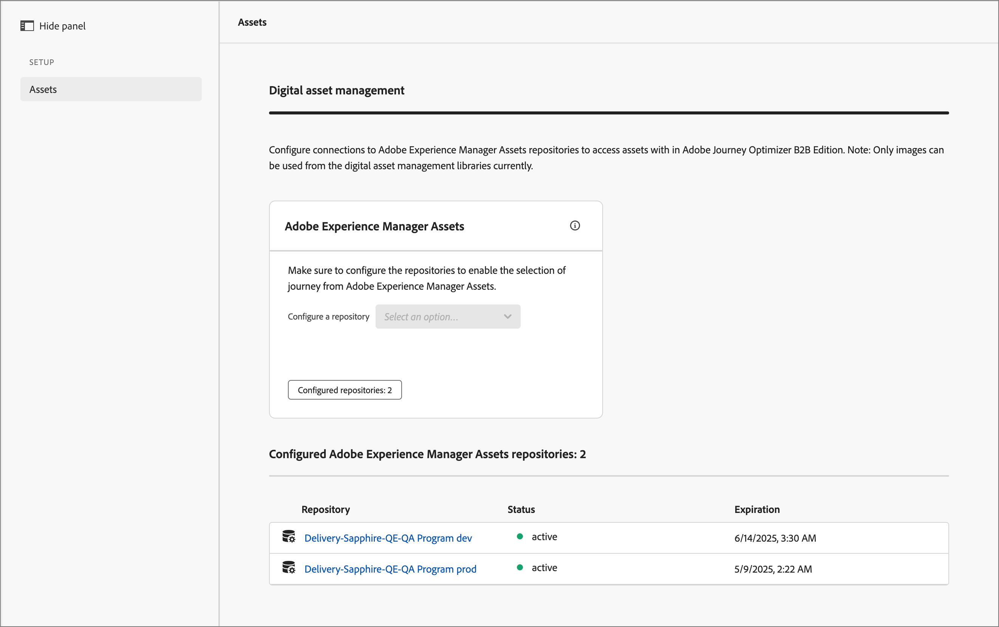

# 配置Experience Manager资源存储库

[!DNL Adobe Journey Optimizer B2B Edition]与[!DNL Adobe Experience Manager Assets as a Cloud Service]集成，允许在您的电子邮件内容中使用资产。 它通过与[!DNL Experience Manager Assets]交换信息确保透明度。 配置与[!DNL Adobe Experience Assets]的连接以启用此功能。

Adobe Experience Manager Cloud Manager分为多个项目，每个项目都有多个环境和存储库（[了解详情](https://experienceleague.adobe.com/en/docs/experience-manager-cloud-service/content/implementing/using-cloud-manager/programs/program-types){target="_blank"}）。 在Adobe Journey Optimizer B2B edition中配置Adobe Experience Manager Assets时，您需要设置与要用于访问数字资源的每个存储库的连接。

{{aem-assets-licensing-note}}

## 先决条件

* 在AEM Headless Developer Console上为所需的环境生成服务凭据（[了解更多](https://experienceleague.adobe.com/en/docs/experience-manager-learn/getting-started-with-aem-headless/authentication/service-credentials#generate-service-credentials){target="_blank"}）。
* 获取连接所需的证书。 作为最佳实践，请确保证书在过期前至少还有六个月。 证书每365天过期一次。
* Adobe Journey Optimizer B2B edition支持一次访问一个数字资产管理源。 切换之前，请确保所需的资源在Adobe Experience Manager中可用。

>[!IMPORTANT]
>
>服务凭据是真实的，并包含私钥。 必须根据贵组织的IT和安全策略存储、管理和访问这些凭据。

## 添加存储库连接

1. 在左侧导航中，选择&#x200B;**[!UICONTROL 管理]** > **[!UICONTROL 配置]**。

1. 单击中间面板上的&#x200B;**[!UICONTROL Assets]**。

   {width="700" zoomable="yes"}

<!--   The default digital asset management option is configured as `Adobe Marketo Engage`.
-->
在这里，您可以逐一配置与每个AEM环境存储库的连接。

1. 在&#x200B;_[!UICONTROL Adobe Experience Manager Assets]_&#x200B;框中，单击&#x200B;**[!UICONTROL 配置存储库]**&#x200B;旁边的箭头并选择存储库。

   {width="500"}

1. 单击&#x200B;**[!UICONTROL 添加证书]**&#x200B;并使用对话框工具上载文件。

   您可以通过将某个.json文件拖到对话框上来上传该文件。 您还可以单击链接以查找并从系统中选择文件。

   {width="500"}

   上传后，证书将显示在底部。

   >[!NOTE]
   >
   >如果使用无效文件，对话框底部会显示错误。

   单击&#x200B;**[!UICONTROL 添加]**&#x200B;以完成证书。

1. 单击“上一步(←)”箭头返回主配置页。

   配置的存储库将显示在选择面板下的表格中。 您可以通过重复步骤3-4来添加另一个存储库。

   {width="600" zoomable="yes"}

配置完存储库后，团队成员可以在创作内容时选择[!DNL Adobe Experience Manager Assets]。

>[!NOTE]
>
>Adobe Journey Optimizer B2B edition支持在创作内容时一次访问一个数字资产管理源。 

## 替换证书

证书自创建日期起每365天过期。 要确保您的团队可以继续访问资产，请在证书过期之前替换证书。

>[!NOTE]
>
>[!DNL Adobe Journey Optimizer B2B Edition]与[!DNL Experience Manager Assets]通信以了解使用信息。 连接必须保持活动状态才能可靠使用数据同步并防止数据差异。 管理员通过应用程序内通知接收有关过期证书的通知。 过期日期还显示在&#x200B;_管理_&#x200B;区域的&#x200B;_[!UICONTROL Assets]_&#x200B;子部分中。

1. 在数字资产管理页面上，找到已配置存储库的列表。

1. 单击所需的存储库以替换证书。

1. 单击证书文件的省略号(**...**)图标，显示对其执行操作的选项。

   {width="600" zoomable="yes"}

1. 选择&#x200B;**[!UICONTROL 替换]**&#x200B;打开文件上载对话框。

1. 通过将文件拖到对话框上或使用链接上传文件。 确保文件为JSON类型。

   {width="500"}

1. 单击&#x200B;**[!UICONTROL 替换]**&#x200B;以确认上载。

## 查看证书

您可以查看与存储库连接关联的证书JSON文件。

1. 在数字资产管理页面上，找到已配置存储库的列表。

1. 单击连接的存储库。

1. 单击证书文件的省略号(**...**)图标，显示对其执行操作的选项。

1. 选择&#x200B;**[!UICONTROL 视图]**。

   {width="600"}

1. 单击&#x200B;**[!UICONTROL 关闭]**&#x200B;以返回到“配置存储库”页面。

## 删除存储库连接

删除存储库会移除用户对Journey Optimizer B2B edition中Experience Manager Assets环境的访问权限。

1. 在&#x200B;_[!UICONTROL 数字资源管理]_&#x200B;页面上，找到已配置的资源存储库列表。

1. 单击所需的存储库名称以编辑连接。

1. 单击证书文件的省略号(**...**)图标，显示对其执行操作的选项。

1. 选择&#x200B;**[!UICONTROL 删除]**。

1. 在确认对话框中单击&#x200B;**[!UICONTROL 删除]**。
<!--

## Switch back to Adobe Marketo Engage Assets

Select Adobe Marketo Engage digital asset management in the Assets section.

After the confirmation, the Adobe Marketo Engage assets library is available for users.
-->
