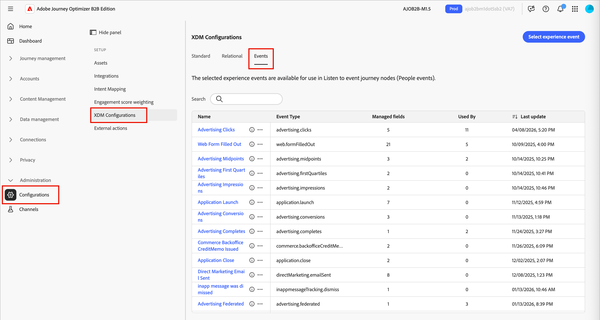

# 选择体验事件和字段

管理员可以在Experience Event合并架构中选择特定的[AEP Experience Events](https://experienceleague.adobe.com/en/docs/experience-platform/xdm/classes/experienceevent){target="_blank"}及其关联字段。 选择后，用户可以配置决策规则以侦听这些Experience事件，以基于近乎实时的事件数据启用动态和针对性的营销活动操作。

<!-- {width="30"} [Watch the video overview](#overview-video) -->

>[!PREREQUISITES]
>
>在Journey Optimizer B2B edition中使用Experience Events和字段需要启用配置文件的Experience Event架构。 有关详细信息，请参阅Experience Platform教程中的[启用实时客户个人资料](https://experienceleague.adobe.com/en/docs/platform-learn/getting-started-for-data-architects-and-data-engineers/enable-profiles){target="_blank"}。

在历程中使用AEP体验事件包括两个步骤：

1. 管理员[在AEP B2B edition配置中添加了Journey Optimizer Experience事件和字段](#add-an-event)。

1. 在历程中，营销人员通过以下两种方式之一使用配置的事件：

   * 添加&#x200B;_侦听事件_&#x200B;节点，[选择体验事件](../journeys/listen-for-event-nodes.md#listen-for-an-experience-event)以根据历程期间的实时事件活动触发历程进展。
   * 添加&#x200B;_按人员拆分路径_&#x200B;节点，并在&#x200B;**[!UICONTROL Event history]**&#x200B;文件夹中的事件](../journeys/split-merge-paths-nodes.md#experience-event-history-filtering)上配置[筛选器的路径。

>[!BEGINSHADEBOX]

## 准则和限制 {#guidelines-and-limitations}

在选择符合组织目标的事件时，请考虑以下事项：

* 您最多可以选择50个事件，每个事件最多可以选择100个字段。

* 历程可以收听使用Experience Platform流功能（如Web SDK或HTTP API）引入的Experience事件。

* 当事件存在于Journey Optimizer B2B edition数据库中时，人员的历史体验事件数据开始累积。 对于首次配置事件类型时已存在的人员，回填从配置时开始。 对于新人，积累始于首次添加此人（其以前的历史不可追溯获得）。

* 当前没有为累积的事件历史记录提供删除机制。 长期保留策略可能会发生更改。

* 当您使用体验事件并发布历程时，您可以添加更多字段，但无法删除之前已选择的字段。

* 您可以在多个历程中引用体验事件，或在同一历程中多次使用它。

>[!ENDSHADEBOX]

## 管理体验事件 {#manage-experience-events}

1. 在左侧导航中，选择&#x200B;**[!UICONTROL 管理]** > **[!UICONTROL 配置]**。

1. 单击中间面板上的&#x200B;**[!UICONTROL XDM配置]**，然后单击&#x200B;**[!UICONTROL 事件]**&#x200B;选项卡以显示可用事件的列表。

   {width="800" zoomable="yes"}

   该列表根据&#x200B;_[!UICONTROL 上次更新]_&#x200B;列显示，最近更新的事件默认位于顶部。

   在此页面中，您可以[选择](#add-an-event)和[编辑](#edit-an-event)事件以在历程中使用。

   要访问选定事件的详细信息，请单击事件名称。

### 筛选事件列表 {#filter-the-event-list}

在&#x200B;_[!UICONTROL 搜索]_&#x200B;字段中输入文本以筛选显示的事件以匹配事件名称。

{width="600" zoomable="yes"}

### 添加事件 {#add-an-event}

要使体验事件可用于历程中的&#x200B;_侦听事件_&#x200B;节点，请选择该事件和支持的字段。

1. 单击右上方的&#x200B;**[!UICONTROL 选择体验事件]**。

   此时将显示事件详细信息页面。 在此页中，您可以选择事件类型和字段。

   新事件的{width="700" zoomable="yes"}

1. 选择事件类型。

   * 单击&#x200B;**[!UICONTROL 选择事件类型]**。

   * 在对话框中，选择事件类型。

     使用&#x200B;_[!UICONTROL 搜索]_&#x200B;字段按名称筛选显示的列表。 使用&#x200B;**[!UICONTROL 仅显示选定字段]**&#x200B;滑块查看当前选择。

     {width="450" zoomable="yes"}

   * 单击&#x200B;**[!UICONTROL 选择]**。

1. 为事件类型选择一个或多个字段。

   * 单击&#x200B;**[!UICONTROL 选择字段]**。

   * 在该对话框中，选择要用作匹配事件的约束条件的字段。

     使用&#x200B;_[!UICONTROL 搜索]_&#x200B;字段按名称筛选显示的列表。 使用&#x200B;**[!UICONTROL 仅显示选定字段]**&#x200B;滑块查看当前选择。

     {width="450" zoomable="yes"}

   * 单击&#x200B;**[!UICONTROL 选择]**。

1. 在事件详细信息页面中，单击&#x200B;**[!UICONTROL 保存]**。

_[!UICONTROL 事件]_&#x200B;选项卡上的列表显示已保存的事件。

### 编辑事件 {#edit-an-event}

要更改字段，请编辑事件详细信息。

1. 单击事件名称，或单击&#x200B;_更多菜单_ (**...** )图标并选择&#x200B;**[!UICONTROL 编辑]**。

   {width="500" zoomable="yes"}

1. 单击&#x200B;**[!UICONTROL 编辑字段]**&#x200B;以打开&#x200B;_[!UICONTROL 选择字段]_&#x200B;对话框并添加更多字段。

   您无法删除在发布使用此事件的历程后先前选择的字段。

1. 单击&#x200B;**[!UICONTROL 选择]**&#x200B;以保存您的选择。

### 删除事件 {#remove-an-event}

要防止在历程中的&#x200B;_侦听事件_&#x200B;节点中使用体验事件，请删除该事件。 如果处于&#x200B;_已计划_、_实时_&#x200B;或&#x200B;_已完成_&#x200B;状态的历程使用某个事件，则无法删除该事件。

1. 单击事件名称旁边的&#x200B;_更多菜单_ ( **...** )图标，然后选择&#x200B;**[!UICONTROL 删除]**。

1. 在确认对话框中，单击&#x200B;**[!UICONTROL 删除]**。

   {width="500" zoomable="yes"}

## 事件和字段 {#events-and-fields}

对于[!DNL Journey Optimizer B2B Edition]，某些人员级别的活动被捕获为[!DNL Experience Platform]体验事件。 这些事件存储在使用XDM体验事件架构的系统数据集中，其中包括特定于历程的字段组。 您可以在[!UICONTROL Journey Optimizer B2B edition]中像任何其他体验事件一样使用这些事件。

每个事件都公开一组定义的字段，这些字段可用于历程&#x200B;_侦听事件_&#x200B;节点（基于事件进行决策）。 要确定在这些历程节点中使用的事件和字段，请查看可用的事件类型及其字段：

### 电子邮件已发送 {#email-sent}

此事件可跟踪营销电子邮件何时发送给人员。

事件类型： `directMarketing.emailSent`

+++字段

| 显示名称 | 路径 |
| ------------ | ---- |
| 标识符 | `_id` |
| 事件类型 | `eventType` |
| 时间戳 | `timestamp` |
| 人员 ID | `personID` |
| 人员源ID | `personKey.sourceID` |
| 人员来源类型 | `personKey.sourceType` |
| 人员源实例ID | `personKey.sourceInstanceID` |
| 人员源密钥 | `personKey.sourceKey` |
| 电子邮件源ID | `directMarketing.emailSent.mailingKey.sourceID` |
| 电子邮件源类型 | `directMarketing.emailSent.mailingKey.sourceType` |
| 电子邮件源实例ID | `directMarketing.emailSent.mailingKey.sourceInstanceID` |
| 电子邮件源密钥 | `directMarketing.emailSent.mailingKey.sourceKey` |
| 邮件名称 | `directMarketing.emailSent.mailingName` |
| 历程ID | `_experience.journeyOrchestration.stepEvents.journeyID` |
| 节点Id | `_experience.journeyOrchestration.stepEvents.nodeID` |

+++

### 电子邮件已投放 {#email-delivered}

此事件跟踪电子邮件何时成功发送到人员的电子邮件服务。

事件类型： `directMarketing.emailDelivered`

+++字段

| 显示名称 | 路径 |
| ------------ | ---- |
| 标识符 | `_id` |
| 事件类型 | `eventType` |
| 时间戳 | `timestamp` |
| 人员 ID | `personID` |
| 人员源ID | `personKey.sourceID` |
| 人员来源类型 | `personKey.sourceType` |
| 人员源实例ID | `personKey.sourceInstanceID` |
| 人员源密钥 | `personKey.sourceKey` |
| 邮件源ID | `directMarketing.mailingKey.sourceID` |
| 邮件源类型 | `directMarketing.mailingKey.sourceType` |
| 邮件源实例ID | `directMarketing.mailingKey.sourceInstanceID` |
| 邮件源密钥 | `directMarketing.mailingKey.sourceKey` |
| 邮件名称 | `directMarketing.mailingName` |
| 历程ID | `_experience.journeyOrchestration.stepEvents.journeyID` |
| 节点Id | `_experience.journeyOrchestration.stepEvents.nodeID` |

+++

### 电子邮件已打开 {#email-opened}

此事件可跟踪人员何时打开营销电子邮件。

事件类型： `directMarketing.emailOpened`

+++字段

| 显示名称 | 路径 |
| ------------ | ---- |
| 标识符 | `_id` |
| 事件类型 | `eventType` |
| 时间戳 | `timestamp` |
| 人员 ID | `personID` |
| 人员源ID | `personKey.sourceID` |
| 人员来源类型 | `personKey.sourceType` |
| 人员源实例ID | `personKey.sourceInstanceID` |
| 人员源密钥 | `personKey.sourceKey` |
| 邮件源ID | `directMarketing.mailingKey.sourceID` |
| 邮件源类型 | `directMarketing.mailingKey.sourceType` |
| 邮件源实例ID | `directMarketing.mailingKey.sourceInstanceID` |
| 邮件源密钥 | `directMarketing.mailingKey.sourceKey` |
| 邮件名称 | `directMarketing.mailingName` |
| 是移动设备 | `device.isMobileDevice` |
| 设备型号 | `device.model` |
| 用户代理 | `environment.browserDetails.userAgent` |
| Operating system | `environment.operatingSystem` |
| 历程ID | `_experience.journeyOrchestration.stepEvents.journeyID` |
| 节点Id | `_experience.journeyOrchestration.stepEvents.nodeID` |

+++

### 已单击电子邮件 {#email-clicked}

此事件可跟踪用户何时单击营销电子邮件中的链接。

事件类型： `directMarketing.emailClicked`

+++字段

| 显示名称 | 路径 |
| ------------ | ---- |
| 标识符 | `_id` |
| 事件类型 | `eventType` |
| 时间戳 | `timestamp` |
| 人员 ID | `personID` |
| 人员源ID | `personKey.sourceID` |
| 人员来源类型 | `personKey.sourceType` |
| 人员源实例ID | `personKey.sourceInstanceID` |
| 人员源密钥 | `personKey.sourceKey` |
| 邮件源ID | `directMarketing.mailingKey.sourceID` |
| 邮件源类型 | `directMarketing.mailingKey.sourceType` |
| 邮件源实例ID | `directMarketing.mailingKey.sourceInstanceID` |
| 邮件源密钥 | `directMarketing.mailingKey.sourceKey` |
| 邮件名称 | `directMarketing.mailingName` |
| 链接URL | `directMarketing.linkURL` |
| 是移动设备 | `device.isMobileDevice` |
| 模型 | `device.model` |
| 用户代理 | `environment.browserDetails.userAgent` |
| Operating system | `environment.operatingSystem` |
| 历程ID | `_experience.journeyOrchestration.stepEvents.journeyID` |
| 节点Id | `_experience.journeyOrchestration.stepEvents.nodeID` |

+++

### 电子邮件已退回 {#email-bounced}

此事件可跟踪发送给人员的电子邮件何时退回。

事件类型： `directMarketing.emailBounced`

+++字段

| 显示名称 | 路径 |
| ------------ | ---- |
| 标识符 | `_id` |
| 事件类型 | `eventType` |
| 时间戳 | `timestamp` |
| 人员 ID | `personID` |
| 人员源ID | `personKey.sourceID` |
| 人员来源类型 | `personKey.sourceType` |
| 人员源实例ID | `personKey.sourceInstanceID` |
| 人员源密钥 | `personKey.sourceKey` |
| 邮件源ID | `directMarketing.mailingKey.sourceID` |
| 邮件源类型 | `directMarketing.mailingKey.sourceType` |
| 邮件源实例ID | `directMarketing.mailingKey.sourceInstanceID` |
| 邮件源密钥 | `directMarketing.mailingKey.sourceKey` |
| 邮件名称 | `directMarketing.mailingName` |
| 电子邮件 | `directMarketing.email` |
| 电子邮件退回代码 | `directMarketing.emailBouncedCode` |
| 电子邮件退回详细信息 | `directMarketing.emailBouncedDetails` |
| 历程ID | `_experience.journeyOrchestration.stepEvents.journeyID` |
| 节点Id | `_experience.journeyOrchestration.stepEvents.nodeID` |

+++

### 电子邮件软退回 {#email-bounced-soft}

此事件可跟踪发送给人员的电子邮件何时软退回。

事件类型： `directMarketing.emailBouncedSoft`

+++字段

| 显示名称 | 路径 |
| ------------ | ---- |
| 标识符 | `_id` |
| 事件类型 | `eventType` |
| 时间戳 | `timestamp` |
| 人员 ID | `personID` |
| 人员源ID | `personKey.sourceID` |
| 人员来源类型 | `personKey.sourceType` |
| 人员源实例ID | `personKey.sourceInstanceID` |
| 人员源密钥 | `personKey.sourceKey` |
| 邮件源ID | `directMarketing.mailingKey.sourceID` |
| 邮件源类型 | `directMarketing.mailingKey.sourceType` |
| 邮件源实例ID | `directMarketing.mailingKey.sourceInstanceID` |
| 邮件源密钥 | `directMarketing.mailingKey.sourceKey` |
| 邮件名称 | `directMarketing.mailingName` |
| 电子邮件 | `directMarketing.email` |
| 电子邮件退回代码 | `directMarketing.emailBouncedCode` |
| 电子邮件退回详细信息 | `directMarketing.emailBouncedDetails` |
| 历程ID | `_experience.journeyOrchestration.stepEvents.journeyID` |
| 节点Id | `_experience.journeyOrchestration.stepEvents.nodeID` |

+++

### 电子邮件已取消订阅 {#email-unsubscribed}

此事件跟踪人员何时取消订阅营销电子邮件。

事件类型： `directMarketing.emailUnsubscribed`

+++字段

| 显示名称 | 路径 |
| ------------ | ---- |
| 标识符 | `_id` |
| 事件类型 | `eventType` |
| 时间戳 | `timestamp` |
| 人员 ID | `personID` |
| 人员源ID | `personKey.sourceID` |
| 人员来源类型 | `personKey.sourceType` |
| 人员源实例ID | `personKey.sourceInstanceID` |
| 人员源密钥 | `personKey.sourceKey` |
| 邮件源ID | `directMarketing.mailingKey.sourceID` |
| 邮件源类型 | `directMarketing.mailingKey.sourceType` |
| 邮件源实例ID | `directMarketing.mailingKey.sourceInstanceID` |
| 邮件源密钥 | `directMarketing.mailingKey.sourceKey` |
| 邮件名称 | `directMarketing.mailingName` |
| 历程ID | `_experience.journeyOrchestration.stepEvents.journeyID` |
| 节点Id | `_experience.journeyOrchestration.stepEvents.nodeID` |

+++

### 访问网页 {#visit-web-page}

此事件类型是将点击标记为页面查看的标准方法。

事件类型： `web.webpagedetails.pageViews`

+++字段

| 显示名称 | 路径 |
| ------------ | ---- |
| 标识符 | `_id` |
| 事件类型 | `eventType` |
| 时间戳 | `timestamp` |
| 人员 ID | `personID` |
| 人员源ID | `personKey.sourceID` |
| 人员来源类型 | `personKey.sourceType` |
| 人员源实例ID | `personKey.sourceInstanceID` |
| 人员源密钥 | `personKey.sourceKey` |
| 网页源ID | `web.webPageDetails.webPageKey.sourceID` |
| 网页源类型 | `web.webPageDetails.webPageKey.sourceType` |
| 网页源实例ID | `web.webPageDetails.webPageKey.sourceInstanceID` |
| 网页源密钥 | `web.webPageDetails.webPageKey.sourceKey` |
| 网页名称 | `web.webPageDetails.name` |
| 网页URL | `web.webPageDetails.URL` |
| 网页查询参数 | `web.webPageDetails.queryParameters` |
| 网页ID | `web.webPageDetails.webPageID` |
| 用户代理 | `environment.browserDetails.userAgent` |
| 反向链接URL | `web.webReferrer.URL` |

+++

### 表单已填写 {#form-filled-out}

此事件跟踪人员在网页上填写表单的时间。

事件类型： `web.formFilledOut`

+++字段

| 显示名称 | 路径 |
| ------------ | ---- |
| 标识符 | `_id` |
| 事件类型 | `eventType` |
| 时间戳 | `timestamp` |
| 人员 ID | `personID` |
| 人员源ID | `personKey.sourceID` |
| 人员来源类型 | `personKey.sourceType` |
| 人员源实例ID | `personKey.sourceInstanceID` |
| 人员源密钥 | `personKey.sourceKey` |
| Web窗体源ID | `web.fillOutForm.webFormKey.sourceID` |
| Web窗体源类型 | `web.fillOutForm.webFormKey.sourceType` |
| Web窗体源实例ID | `web.fillOutForm.webFormKey.sourceInstanceID` |
| Web窗体源密钥 | `web.fillOutForm.webFormKey.sourceKey` |
| Web窗体ID | `web.fillOutForm.webFormID` |
| Web窗体名称 | `web.fillOutForm.webFormName` |
| 网页查询参数 | `web.webPageDetails.queryParameters` |
| 网页ID | `web.webPageDetails.webPageID` |
| 用户代理 | `environment.browserDetails.userAgent` |
| 反向链接URL | `web.webReferrer.URL` |

+++

### 已单击Web链接 {#web-link-clicked}

事件表示Web SDK自动记录了链接点击。

事件类型： `web.webinteraction.linkClicks`

+++字段

| 显示名称 | 路径 |
| ------------ | ---- |
| 标识符 | `_id` |
| 事件类型 | `eventType` |
| 时间戳 | `timestamp` |
| 人员 ID | `personID` |
| 人员源ID | `personKey.sourceID` |
| 人员来源类型 | `personKey.sourceType` |
| 人员源实例ID | `personKey.sourceInstanceID` |
| 人员源密钥 | `personKey.sourceKey` |
| Web交互源ID | `web.webInteraction.webInteractionKey.sourceID` |
| Web交互源类型 | `web.webInteraction.webInteractionKey.sourceType` |
| Web交互源实例ID | `web.webInteraction.webInteractionKey.sourceInstanceID` |
| Web交互源密钥 | `web.webInteraction.webInteractionKey.sourceKey` |
| Web交互链接ID | `web.webInteraction.linkID` |
| Web交互链接URL | `web.webInteraction.linkURL` |
| 网页查询参数 | `web.webPageDetails.queryParameters` |
| 网页ID | `web.webPageDetails.webPageID` |
| 用户代理 | `environment.browserDetails.userAgent` |
| 反向链接URL | `web.webReferrer.URL` |

+++

### 有趣的时刻 {#interesting-moment}

此事件跟踪何时为人员录制了有趣的时刻。

事件类型： `leadOperation.interestingMoment`

+++字段

| 显示名称 | 路径 |
| ------------ | ---- |
| 标识符 | `_id` |
| 事件类型 | `eventType` |
| 时间戳 | `timestamp` |
| 人员 ID | `personID` |
| 人员源ID | `personKey.sourceID` |
| 人员来源类型 | `personKey.sourceType` |
| 人员源实例ID | `personKey.sourceInstanceID` |
| 人员源密钥 | `personKey.sourceKey` |
| 时刻日期 | `leadOperation.interestingMoment.date` |
| 时刻描述 | `leadOperation.interestingMoment.description` |
| 力矩源 | `leadOperation.interestingMoment.source` |
| 力矩类型 | `leadOperation.interestingMoment.type` |
| 历程ID | `_experience.journeyOrchestration.stepEvents.journeyID` |
| 节点Id | `_experience.journeyOrchestration.stepEvents.nodeID` |

+++

<!--
 ## Overview video

>[!VIDEO](https://video.tv.adobe.com/v/3448637/?learn=on) 
-->