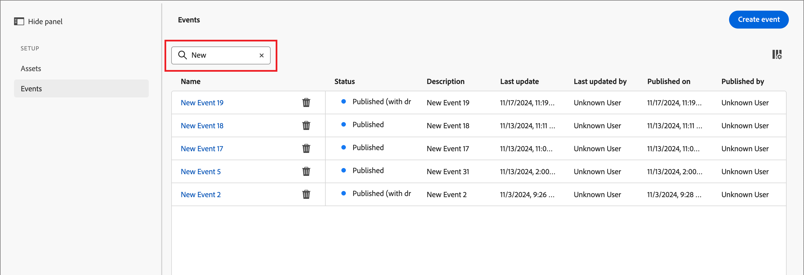

# 配置Experience Platform事件定义

管理员可以配置基于Adobe Experience Platform (AEP)的事件定义，这些定义使营销人员能够创建对[AEP Experience Events](https://experienceleague.adobe.com/en/docs/experience-platform/xdm/classes/experienceevent){target="_blank"}做出反应的帐户历程。

{width="30"} [观看视频概述](#overview-video)

在帐户历程中使用AEP体验事件包括两个步骤：

1. 创建和发布AEP事件定义。

2. 在帐户历程中，添加&#x200B;_侦听事件_&#x200B;节点并[选择AEP事件定义作为人员事件](../journeys/listen-for-event-nodes.md#listen-for-an-experience-event)。

每个事件定义都需要以下Experience Platform输入值：

* **_架构_** — 定义Experience Event数据结构的XDM架构。 必须基于体验事件并且必须启用配置文件。

  >[!NOTE]
  >
  >要确保定义所需的架构，请与工程团队协调。 [创建XDM架构](https://experienceleague.adobe.com/en/docs/experience-platform/xdm/schema/composition){target="_blank"}是一个复杂的过程，由数据工程师根据您组织中的用例要求执行。

* **_事件类型_** - XDM ExperienceEvent eventType（每个事件定义最多20个）。

* **_字段_** — 架构中存在的XDM字段（每个事件定义最多20个）

* **_名称_** — 事件定义的唯一名称。

* **_描述_** — 事件定义的描述。

## 限制和防护

在创建和管理事件定义以满足组织目标时，请牢记以下几点：

* Journey Optimizer B2B edition支持最多50个事件定义。

* 帐户历程可以侦听使用AEP流功能(如Web SDK或HTTP API)引入的AEP Experience事件。

* 只有一个AEP事件定义可以使用组合架构和事件类型集。 当您使用架构（例如`My Schema`）和事件类型（例如`Web Webpagedetails Page Views`）创建事件定义时，任何其他事件定义都不能使用`My Schema`和`Web Webpagedetails Page Views`的组合。

* 事件定义可以在多个帐户历程中使用。

* AEP Experience Events可用于帐户历程中的决策目的，但不保留。 因此，在AEP B2B edition中无法利用Journey Optimizer Experience事件的历史记录。

* 不支持活动&#x200B;_的_&#x200B;日期和&#x200B;_最小次数_&#x200B;的约束。

* 发布事件定义后，无法修改架构和名称。 但是，您可以通过创建草稿版本并再次发布来添加事件类型和字段。

* 无法删除已发布历程中使用的事件定义。

## 访问和管理事件定义

1. 在左侧导航中，选择&#x200B;**[!UICONTROL 管理]** > **[!UICONTROL 配置]**。

1. 单击中间面板上的&#x200B;**[!UICONTROL 事件]**&#x200B;以显示事件定义列表。

   从该页面中，您可以[创建](#create-an-event-definition)、[发布](#publish-an-event-defintion)、[编辑](#edit-an-event-definition)和[删除](#delete-an-event-definition)事件定义。

   {width="800" zoomable="yes"}

   该表按&#x200B;_[!UICONTROL Modified]_&#x200B;列排序，最近更新的定义在顶部作为默认值。<!-- Click the column title to change between ascending and descending.-->

1. 要访问事件定义的详细信息，请单击名称。

### 事件定义状态和生命周期

在&#x200B;_[!UICONTROL 事件定义]_&#x200B;列表中，**[!UICONTROL 状态]**&#x200B;列指示每个定义的当前状态。 状态决定了其可用于帐户历程的情况，以及您可以对其进行的更改。

| 状态 | 描述 |
| -------------------- | ----------- |
| 草稿 | 创建事件定义时，该定义处于草稿状态。 在您发布它以用于帐户历程之前，它一直保持此状态。 可用操作：  <li>编辑所有详细信息<li>发布<li>删除 |
| 发布日期 | 发布事件定义时，它将在帐户历程中使用。 无法修改详细信息。 可用操作：  <li>可用于&#x200B;_侦听事件_&#x200B;历程节点<li>创建草稿版本<li>删除（如果未使用） |
| 已发布（草稿） | 从已发布的事件定义创建草稿时，已发布的版本仍可用于帐户历程，并且可以修改草稿版本。 如果您发布草稿版本，它将替换当前已发布的版本，并且事件定义会针对尚未执行的帐户历程进行更新。 可用操作：  <li>编辑所有详细信息<li>发布草稿版本<li>放弃草稿版本<li>删除（如果未使用） |

{zoomable="yes"}

### 筛选事件定义列表

要按名称搜索事件定义，请在搜索栏中输入文本字符串以查找匹配项。

{width="700" zoomable="yes"}

## 创建事件定义

1. 在左侧导航中，选择&#x200B;**[!UICONTROL 管理]** > **[!UICONTROL 配置]**。

1. 单击中间面板上的&#x200B;**[!UICONTROL 事件]**&#x200B;以显示事件定义列表。

1. 单击右上方的&#x200B;**[!UICONTROL 创建事件]**。

1. 输入&#x200B;**[!UICONTROL Name]**（必需）和&#x200B;**[!UICONTROL Description]**（可选）。

   {width="600" zoomable="yes"}

1. 设置要用于事件定义的&#x200B;**[!UICONTROL 架构]**。

   您选择的架构决定了可添加到定义的字段。 然后，您添加的字段可用作帐户历程中&#x200B;_侦听事件_&#x200B;节点的约束。

   * 单击&#x200B;**[!UICONTROL 选择架构]**。
   * 在对话框中，从基于Experience Event的架构列表中选择架构。
   * 单击&#x200B;**[!UICONTROL 选择]**。

   {width="600" zoomable="yes"}

1. 选择要用于事件定义的&#x200B;**[!UICONTROL 事件类型]**。

   您选择的[事件类型](https://experienceleague.adobe.com/en/docs/experience-platform/xdm/classes/experienceevent#eventType){target="_blank"}决定了可用作帐户历程中&#x200B;_侦听事件_&#x200B;节点的约束的事件。

   * 单击&#x200B;**[!UICONTROL 选择事件类型]**。
   * 在对话框中，从列表中选择一个或多个事件类型（最多20个）。
   * 单击&#x200B;**[!UICONTROL 选择]**。

   {width="600" zoomable="yes"}

1. 选择要用于事件定义的&#x200B;**[!UICONTROL 字段]**。

   您选择的字段决定了当该事件用于帐户历程中的&#x200B;_侦听事件_&#x200B;节点时可用的约束。

   >[!NOTE]
   >
   >`eventType`字段为必填项，且已自动选定。

   * 单击&#x200B;**[!UICONTROL 选择字段]**。
   * 在对话框中，从列表中选择一个或多个字段（最多20个）。
   * 单击&#x200B;**[!UICONTROL 选择]**。

   {width="600" zoomable="yes"}

1. 完成架构、事件类型和字段后，单击&#x200B;**[!UICONTROL 创建]**。

   创建后，将显示列表页面，并且新事件位于列表顶部，具有&#x200B;_草稿_&#x200B;状态。

   {width="700" zoomable="yes"}上

## 发布事件定义

如果您对草稿事件定义的完整性和正确性感到满意，则可以发布该草稿事件定义。 随后，发布的事件定义便可用于帐户历程。 发布事件定义后，如果需要进行更改，可以创建草稿版本。 但是，您不能更改架构，并且只能添加事件类型和字段（不能删除它们）。

1. 在左侧导航中，选择&#x200B;**[!UICONTROL 管理]** > **[!UICONTROL 配置]**。

1. 单击中间面板上的&#x200B;**[!UICONTROL 事件]**&#x200B;以显示事件定义列表。

1. 在&#x200B;_[!UICONTROL 事件定义]_&#x200B;列表中，单击草稿事件定义的名称以打开详细信息页面。

   {width="600" zoomable="yes"}

   如果需要，请在发布之前查看设置。 如果草稿[不符合您的要求，您可以](#edit-an-event-definition)对其进行编辑。

1. 单击右上方的&#x200B;**[!UICONTROL 发布]**。

1. 在确认对话框中，单击&#x200B;**[!UICONTROL 发布]**。

   {width="300"}

   事件定义的状态更改为&#x200B;_已发布_，现在[可在帐户历程](../journeys/listen-for-event-nodes.md#listen-for-an-experience-event)中使用。

   {width="700" zoomable="yes"}上更新

## 编辑事件定义

1. 在左侧导航中，选择&#x200B;**[!UICONTROL 管理]** > **[!UICONTROL 配置]**。

1. 单击中间面板上的&#x200B;**[!UICONTROL 事件]**&#x200B;以显示事件定义列表。

   对事件定义的编辑取决于其当前状态：

   * 当事件定义处于&#x200B;_草稿_&#x200B;状态时，可以编辑其任何详细信息。
   * 当事件定义处于&#x200B;_已发布_&#x200B;状态时，无法对其进行编辑。 您可以创建一个可编辑的草稿版本，然后替换已发布的版本。
   * 当事件定义处于&#x200B;_已发布（具有草稿）_&#x200B;状态时，您可以更改草稿版本（编辑描述，并添加事件类型和字段）。

   {width="700" zoomable="yes"}上

1. 从&#x200B;_[!UICONTROL 事件定义]_&#x200B;列表页中，单击事件定义名称以将其打开。

根据状态执行以下步骤：

>[!BEGINTABS]

>[!TAB 草稿]

1. 根据需要更改任何事件定义详细信息。

   {width="600" zoomable="yes"}

   遵循用于[创建事件定义](#create-an-event-definition)的相同准则。

   更改会自动保存在草稿中。

1. 当事件定义符合您的条件并且您希望可用于帐户历程时，请单击&#x200B;**[!UICONTROL 发布]**。

1. 在确认对话框中，单击&#x200B;**[!UICONTROL 发布]**。

   事件定义的状态更改为&#x200B;_已发布_，现在可在帐户历程中使用。

>[!TAB 已发布]

1. 要更新事件定义，请单击右上角的&#x200B;**[!UICONTROL 创建草稿版本]**。

   {width="600" zoomable="yes"}

1. 在确认对话框中，单击&#x200B;**[!UICONTROL 创建草稿]**&#x200B;以打开草稿版本。

   {width="300"}

   此操作创建草稿版本并返回到列表页面，其中事件定义现在处于&#x200B;_已发布（草稿）_&#x200B;状态。

1. 单击事件定义名称以将其打开。

   对于&#x200B;_Published （含草稿）_&#x200B;事件定义，_[!UICONTROL Published]_&#x200B;版本选项卡被选为默认值。

1. 选择&#x200B;**[!UICONTROL 草稿]**&#x200B;版本选项卡。

   {width="600" zoomable="yes"}

1. 根据需要更改任何可编辑的详细信息（**[!UICONTROL 描述]**、**[!UICONTROL 事件类型]**&#x200B;和&#x200B;**[!UICONTROL 字段]**）。

   遵循用于[创建事件定义](#create-an-event-definition)的相同准则。

   更改会自动保存在草稿中。

1. 如果草稿事件定义符合您的条件，并且您希望替换当前已发布的版本以便在帐户历程中使用，请单击&#x200B;**[!UICONTROL 发布草稿]**。

1. 在确认对话框中，单击&#x200B;**[!UICONTROL 发布]**。

   {width="300"}

   发布草稿版本时，草稿版本会替换当前已发布的版本，并且会更新已使用但尚未执行的帐户历程的事件定义。

>[!TAB 已发布（含草稿）]

打开&#x200B;_Published （含草稿）_&#x200B;事件定义时，将选择&#x200B;_[!UICONTROL Published]_&#x200B;版本选项卡作为默认选项卡。

1. 选择&#x200B;**[!UICONTROL 草稿]**&#x200B;版本选项卡。

   {width="600" zoomable="yes"}

1. 根据需要更改任何可编辑的详细信息（**[!UICONTROL 描述]**、**[!UICONTROL 事件类型]**&#x200B;和&#x200B;**[!UICONTROL 字段]**）。

   遵循用于[创建事件定义](#create-an-event-definition)的相同准则。

   更改会自动保存在草稿中。

1. 如果草稿事件定义符合您的条件，并且您希望替换当前已发布的版本以便在帐户历程中使用，请单击&#x200B;**[!UICONTROL 发布草稿]**。

1. 在确认对话框中，单击&#x200B;**[!UICONTROL 发布]**。

   {width="300"}

   发布草稿版本时，草稿版本会替换当前已发布的版本，并且会更新已使用但尚未执行的帐户历程的事件定义。

>[!ENDTABS]

## 删除事件定义

如果已发布的帐户历程未使用事件定义，则可以删除该定义。

>[!CAUTION]
>
>请谨慎使用此操作。 删除事件定义后无法撤销。

1. 在左侧导航中，选择&#x200B;**[!UICONTROL 管理]** > **[!UICONTROL 配置]**。

1. 单击中间面板上的&#x200B;**[!UICONTROL 事件]**&#x200B;以显示事件定义列表。

1. 在列表中找到事件定义，然后单击名称右侧的&#x200B;_删除_ （ ）图标。

1. 在确认对话框中单击&#x200B;**[!UICONTROL 删除]**。

   {width="300"}

## 概述视频

>[!VIDEO](https://video.tv.adobe.com/v/3448637/?learn=on)