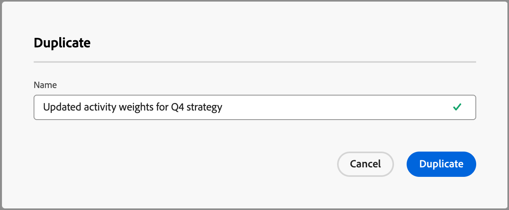

# 配置自定义参与度得分权重

购买团体参与度得分通过评估为购买团体成员记录的各种活动来反映参与度级别。 通过自定义得分权重，营销运营团队可以灵活地定义自己的模型，以便权重确定对参与最有意义的活动。 自定义评分模型通过在销售过程中优先处理最准确地表明购买意图的行为，生成更准确的管道反映。

作为管理员，您可以为组织定义多个参与度得分模型，但在任何时候只能有一个模型处于活动状态。 根据应用于每个参与度评分活动的权重，可定义评分模型。

## 访问参与度得分加权模型

1. 在左侧导航中，选择&#x200B;**[!UICONTROL 管理]** > **[!UICONTROL 配置]**。

1. 单击中间面板上的&#x200B;**[!UICONTROL 参与度得分权重]**&#x200B;以显示评分模型列表。

   在此页面中，您可以[创建（重复）](#create-an-engagement-score-model)、[激活](#activate-a-score-model)和[编辑](#change-the-engagement-weighting-settings)参与度得分模型。

   {width="800" zoomable="yes"}

   该表顶部显示最近更新的模型（按&#x200B;_[!UICONTROL 上次更新时间]_&#x200B;排序），并包括按&#x200B;_[!UICONTROL 名称]_&#x200B;进行搜索的功能。 您可以通过单击右上角的&#x200B;_列设置_ （  ）图标并选中或清除列复选框来自定义显示的表。

要在参与度得分加权列表中显示的{width="300"}

1. 要访问参与度分数模型的详细信息，请单击名称。

### 默认得分模型

系统创建一个名为&#x200B;_活动权重模型1_&#x200B;的初始参与度得分模型，在您创建并激活自己的自定义模型之前，该模型为活动模型。 激活自定义模型后，默认模型将更改为&#x200B;_已存档_&#x200B;状态。 如果您决定恢复为默认参与度得分模型，或将其用作其他自定义模型的起点，则可以复制该模型。

{width="600" zoomable="yes"}

### 删除草稿模型

如果您决定以后不想激活草稿参与度得分模型，则可以将其删除。 单击列表中草稿分数模型名称旁边的&#x200B;_更多菜单_ (***...***)图标，然后选择&#x200B;**[!UICONTROL 删除]**。

{width="350"}

在确认对话框中单击&#x200B;**[!UICONTROL 删除]**。

## 创建自定义参与度评分模型

要创建自定义参与度得分模型，请复制默认模型或已创建的其他自定义模型。 您可以复制当前&#x200B;_活动_&#x200B;模型、_草稿_&#x200B;模型或&#x200B;_已存档_&#x200B;模型。 然后，根据您的需要编辑重复模型。

1. 单击模型名称以打开模型详细信息页面，然后单击右上角的&#x200B;**[!UICONTROL 复制]**。

   {width="600" zoomable="yes"}

   您还可以单击列表中得分模型名称旁边的&#x200B;_更多菜单_ (***...***)图标，然后选择&#x200B;**[!UICONTROL 复制]**。

   {width="325"}

1. 在&#x200B;_复制_&#x200B;对话框中，为复制的模型输入唯一名称，然后单击&#x200B;**[!UICONTROL 复制]**。

   {width="500"}

   重复的模型显示在状态为&#x200B;_草稿_&#x200B;的列表中。 单击名称以打开得分模型详细信息并进行更改。

### 更改参与权重设置

权重设置定义您可以分配给模型中每个活动的频带。 您可以更改区段以反映组织用于评估参与的策略。 例如，如果要为正常活动分配较高的值，可以将&#x200B;_正常_&#x200B;加权范围调整为65。 或者，您可以添加用于捕获介于&#x200B;_正常_&#x200B;和&#x200B;_重要_&#x200B;之间的活动的加权频带。 在这种情况下，您可以添加一个频带，并将其标记为&#x200B;_重要_，并为其分配权重频带值75。

1. 在得分模型详细信息页面中，单击顶部的&#x200B;**[!UICONTROL 参与权重设置]**。

   {width="600" zoomable="yes"}

1. 对于每个权重范围，请根据需要调整一个或多个名称：

   * 更改&#x200B;_[!UICONTROL 加权频带]_&#x200B;字段中的名称。
   * 输入新值。 您还可以单击&#x200B;**&amp;amp；加号；**&#x200B;或&#x200B;**−**&#x200B;来增加或减少值。

   {width="500"}

1. 如果需要，请添加另一个加权范围：

   单击列表底部的&#x200B;**[!UICONTROL +添加加权带]**。 此操作在列表底部插入一个空白的加权带。

   输入名称，并设置带值。 确保使用唯一的名称和值。

1. 如果需要，请删除加权带，然后单击加权带行的&#x200B;_删除_ （）图标。

1. 完成更改后，单击&#x200B;**[!UICONTROL 保存]**。

### 更改活动权重

每个得分模型都包含受支持的参与得分活动的完整列表：

{{engagement-activities}}

对于列表中的每个活动，设置要分配给每个活动实例的值。 单击&#x200B;**[!UICONTROL 权重]**&#x200B;字段中的向下箭头，然后选择参与权重设置中定义的权重范围。

{width="500"}

如果不希望参与度得分计算使用活动，请将权重设置为零(0)值。

您的更改会自动保存。

## 激活得分模型

激活拔模分数模型时，它会替换当前活动的模型。 当前活动的模型会自动存档。

1. 打开草稿得分模型以查看详细信息页面。

1. 单击&#x200B;**[!UICONTROL 激活]**。

1. 在确认对话框中，单击&#x200B;**[!UICONTROL 激活]**。

   {width="400"}
