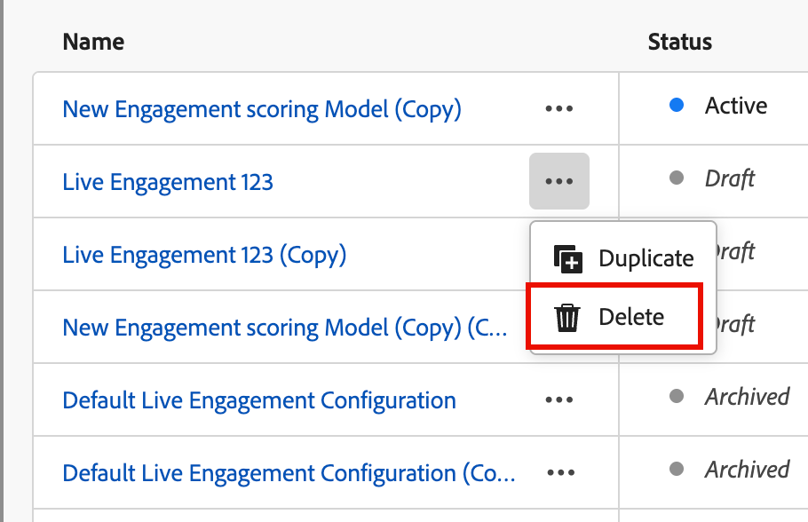
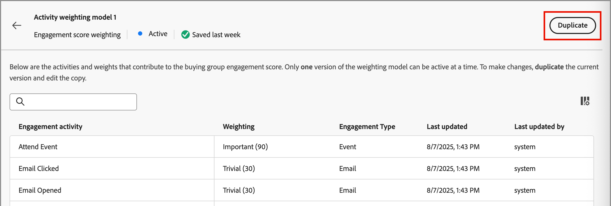
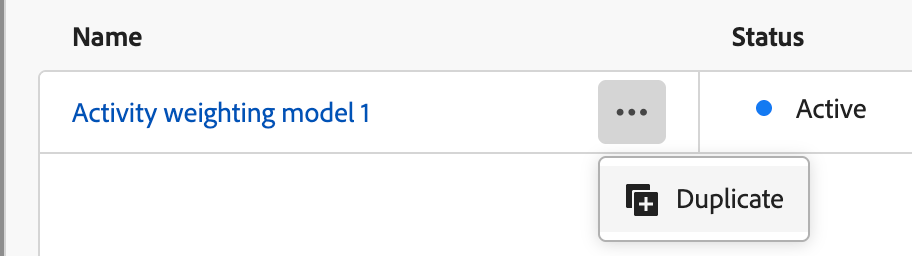
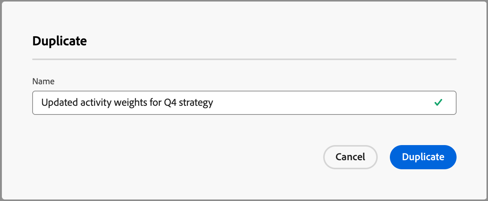
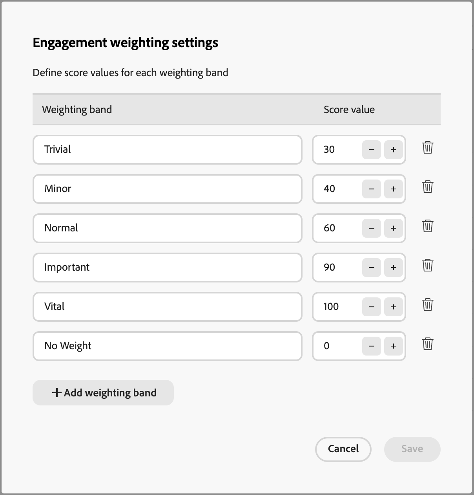

# 配置自定义参与度得分权重

[购买团体参与度分数](../buying-groups/engagement-scores.md)通过评估为购买团体成员记录的各种活动来反映参与度级别。 通过自定义得分权重，营销运营团队可以灵活地定义自己的模型，以便对活动进行权重。 自定义评分模型通过在销售过程中优先处理最准确地表明购买意图的行为，生成更准确的管道反映。

作为管理员，您可以为组织定义多个参与度得分模型，但在任何时候只能有一个模型处于活动状态。 根据应用于每个参与度评分活动的权重，可定义评分模型。

>[!PREREQUISITES]
>
>要定义和激活参与度得分权重模型，您必须具有&#x200B;_[!UICONTROL 管理B2B管理员配置]_ [产品权限](./user-management.md#b2b-product-permissions)。

## 访问参与度得分加权模型

打开&#x200B;_[!UICONTROL 参与度得分权重]_&#x200B;列表以查看活动、草稿和已存档的模型：

1. 在左侧导航中，选择&#x200B;**[!UICONTROL 管理]** > **[!UICONTROL 配置]**。

1. 单击中间面板上的&#x200B;**[!UICONTROL 参与度得分权重]**&#x200B;以显示评分模型列表。

   在此页面中，您可以[创建（重复）](#create-an-engagement-score-model)、[激活](#activate-a-score-model)和[编辑](#change-the-engagement-weighting-settings)参与度得分模型。

   {width="800" zoomable="yes"}

   该列表顶部显示最近更新的模型（按&#x200B;_[!UICONTROL 上次更新时间]_&#x200B;排序），并包括按&#x200B;_[!UICONTROL 名称]_&#x200B;进行搜索的功能。

   您可以通过单击右上角的&#x200B;_列设置_ （  ）图标并选中或清除列复选框来自定义显示的表。

   要在参与度得分加权列表中显示的{width="300"}

1. 要访问参与度分数模型的详细信息，请单击名称。

### 默认得分模型

系统创建一个名为&#x200B;_活动权重模型1_&#x200B;的初始参与度得分模型。 参与活动基于标准和自定义Experience Platform事件。 默认情况下，所有活动的权重为0。

{width="600" zoomable="yes"}

<!-- **Standard architecture (legacy)** - If your environment still uses the standard architecture, the connected [!DNL Marketo Engage] instance is the source for the engagement activity data. The default model is active until you create a custom version and activate it. -->

<!-- {width="600" zoomable="yes"} -->

激活自定义模型后，活动模型将更改为&#x200B;_已存档_&#x200B;状态。 如果您决定恢复为默认参与度得分模型，则可以复制原始默认模型，然后激活它或将其用作另一个自定义模型的起点。

### 删除草稿模型

如果您决定以后不想激活草稿参与度得分模型，则可以将其删除。 单击列表中草稿分数模型名称旁边的&#x200B;_更多菜单_ (***...***)图标，然后选择&#x200B;**[!UICONTROL 删除]**。

{width="350"}

在确认对话框中单击&#x200B;**[!UICONTROL 删除]**。

## 创建自定义参与度评分模型

要创建自定义参与度得分模型，请复制默认模型或已创建的其他自定义模型。 您可以复制当前&#x200B;_活动_&#x200B;模型、_草稿_&#x200B;模型或&#x200B;_已存档_&#x200B;模型。 然后，根据您的需要编辑重复模型。

1. 单击模型名称以打开模型详细信息页面，然后单击右上角的&#x200B;**[!UICONTROL 复制]**。

   {width="600" zoomable="yes"}

   您还可以单击列表中得分模型名称旁边的&#x200B;_更多菜单_ (***...***)图标，然后选择&#x200B;**[!UICONTROL 复制]**。

   {width="325"}

1. 在&#x200B;_复制_&#x200B;对话框中，为复制的模型输入唯一名称，然后单击&#x200B;**[!UICONTROL 复制]**。

   {width="500"}

   重复的模型显示在状态为&#x200B;_草稿_&#x200B;的列表中。 单击名称以打开得分模型详细信息并进行更改。

### 更改参与权重设置

权重设置定义您可以分配给模型中每个活动的频带。 您可以更改区段以反映组织用于评估参与的策略。 例如，如果要为正常活动分配较高的值，可以将&#x200B;_正常_&#x200B;加权范围调整为65。 或者，您可以添加用于捕获介于&#x200B;_正常_&#x200B;和&#x200B;_重要_&#x200B;之间的活动的加权频带。 在这种情况下，您可以添加一个频带，并将其标记为&#x200B;_重要_，并为其分配权重频带值75。

1. 在得分模型详细信息页面中，单击顶部的&#x200B;**[!UICONTROL 参与权重设置]**。

   {width="600" zoomable="yes"}

1. 对于每个权重范围，请根据需要调整一个或多个名称：

   * 更改&#x200B;_[!UICONTROL 加权频带]_&#x200B;字段中的名称。
   * 输入新值。 您还可以单击&#x200B;**&amp;plus；**&#x200B;或&#x200B;**−**&#x200B;来增加或减少值。

   {width="500"}

1. 如果需要，请添加另一个加权范围：

   单击列表底部的&#x200B;**[!UICONTROL +添加加权带]**。 此操作在列表底部插入一个空白的加权带。

   输入名称，并设置带值。 确保使用唯一的名称和值。

1. 要删除加权频带，请单击加权频带行的&#x200B;_删除_ （ ）图标。

1. 完成更改后，单击&#x200B;**[!UICONTROL 保存]**。

### 更改活动权重

每个得分模型都包含受支持的参与得分活动的完整列表。

+++Experience Platform活动的相关内容

Experience Platform事件的默认模型包括Experience Platform跟踪的活动。 每个活动的权重为零(0)（不使用），直到您为其分配权重为止。 所有活动的最大每日频率也是20，您不能对其进行更改。

<table style="table-layout: fixed; width: 100%; border: 0;">
<tbody>
<tr style="border: 0;">
<td>
<ul><li>Advertising单击次数 </li><li>Advertising完成 </li><li>Advertising转化 </li><li>Advertising Federated </li><li>Advertising第一个四分位数 </li><li>Advertising展示次数 </li><li>Advertising中点 </li><li>Advertising开始 </li><li>Advertising第三个四分位点 </li><li>Advertising已播放时间 </li><li>应用程序关闭 </li><li>应用程序启动 </li><li>更改参与活动节奏 </li><li>Commerce Backoffice已发出贷项通知单 </li><li>Commerce Backoffice订单已取消 </li><li>已下达Commerce后台订单 </li><li>Commerce Backoffice订单已发运的项目 </li><li>Commerce Backoffice发运已完成 </li><li>Commerce结账次数 </li><li>Commerce产品列表（购物车）添加次数 </li><li>Commerce产品列表（购物车）打开 </li><li>Commerce产品列表（购物车）移除次数 </li><li>Commerce产品列表（购物车）重新打开 </li><li>Commerce产品列表（购物车）视图 </li><li>Commerce产品查看次数 </li><li>Commerce购买次数 </li><li>Commerce保存留待后用 </li><li>决策建议取消 </li><li>决策建议显示 </li><li>决策建议Interact </li></ul>
</td>
<td>
<ul><li>决策建议发送 </li><li>决策建议触发器 </li><li>投放反馈 </li><li>直接营销电子邮件退回 </li><li>直接营销电子邮件软退回 </li><li>已单击直接营销电子邮件 </li><li>直接营销电子邮件已投放 </li><li>直接营销电子邮件已打开 </li><li>直接营销电子邮件已发送 </li><li>直接营销电子邮件已取消订阅 </li><li>应用程序内消息已取消 </li><li>已显示应用程序内消息 </li><li>与应用程序内消息进行了交互 </li><li>潜在客户操作添加到营销活动 </li><li>潜在客户操作调用Webhook </li><li>潜在客户操作更改营销活动流 </li><li>潜在客户工序转化潜在客户 </li><li>潜在客户操作有趣时刻 </li><li>潜在客户工序合并潜在客户 </li><li>潜在客户工序新潜在客户 </li><li>商机运营收入阶段已更改 </li><li>商机运营得分已更改 </li><li>营销活动进程中的潜在客户工序状态已更改 </li></ul>
</td>
<td>
<ul><li>潜在客户操作添加到列表 </li><li>潜在客户操作从列表中删除 </li><li>位置退出 </li><li>Media adBreakComplete </li><li>Media adBreakStart </li><li>Media adcomplete </li><li>媒体adSkip </li><li>Media adStart </li><li>媒体比特率更改 </li><li>媒体缓冲开始 </li><li>媒体章节结束 </li><li>Media chapterSkip </li><li>Media chapterStart </li><li>媒体自定义跟踪 </li><li>媒体下载内容 </li><li>媒体错误 </li><li>Media pauseStart </li><li>媒体Ping </li><li>Media play </li><li>媒体会话结束 </li><li>媒体会话结束 </li><li>媒体会话开始 </li><li>媒体状态更新 </li><li>消息反馈 </li><li>消息渲染数据 </li><li>消息跟踪 </li><li>Opportunity Event Add to Opportunity </li><li>机会事件机会已更新 </li><li>从机会中删除机会事件 </li><li>推送跟踪应用程序已打开 </li><li>推送跟踪自定义操作 </li><li>Web窗体已填写 </li><li>Web Web交互链接点击次数 </li><li>Web网页详细信息页面查看次数</li></ul>
</td>
</tbody>
</table>

+++

+++标准架构的活动

标准体系结构的默认模型包括[!DNL Marketo Engage]个具有关联默认权重的跟踪活动。 复制该模型时，可以根据需要更改权重。 您不能更改最大每日频率。

{{engagement-activities-me}}

+++

对于列表中的每个活动，设置要分配给每个活动实例的值。 单击&#x200B;**[!UICONTROL 权重]**&#x200B;字段中的向下箭头，然后选择参与权重设置中定义的权重范围。

{width="600" zoomable="yes"}

如果不希望参与度得分计算使用活动，请将权重设置为零(0)值。

您的更改会自动保存。

## 激活得分模型

激活拔模分数模型时，它会替换当前活动的模型。 当前活动的模型会自动存档。

1. 打开草稿得分模型以查看详细信息页面。

1. 单击&#x200B;**[!UICONTROL 激活]**。

1. 在确认对话框中，单击&#x200B;**[!UICONTROL 激活]**。

   {width="400"}
