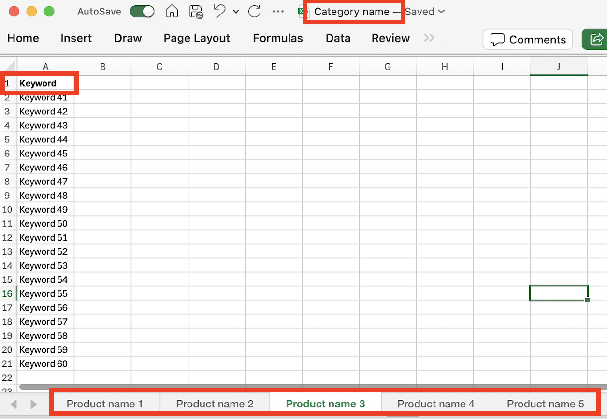

# 目的数据

在Journey Optimizer B2B edition中，意图检测模型根据商机活动预测具有足够高置信度的感兴趣解决方案/产品。 它还利用了其他帐户共同成员的活动，以及标记的内容。 个人的意图可以解释为对产品感兴趣的可能性。

* 意图级别 — 在已知潜在客户、客户和购买组级别上可用。
* 意图信号类型 — 关键字、产品和解决方案

{width="700" zoomable="yes"}

要激活此功能，您可以向Adobe客户经理提交电子表格中的关键字列表。 这些关键字用于内容标记。

一组关键字（最多20个）可以与产品相关联。 一组产品（最多20个）可以与类别关联。 您最多可以有20个类别。 整个模型是通过一个简单的电子表格实现的，该电子表格被摄取。 电子表格可以包含与产品名称关联的单个选项卡，也可以包含与关键字列表关联的一列。

{width="500" zoomable="yes"}

您可以添加多个选项卡，每个选项卡都具有产品名称，并且整个电子表格可以与类别关联。

{width="500" zoomable="yes"}