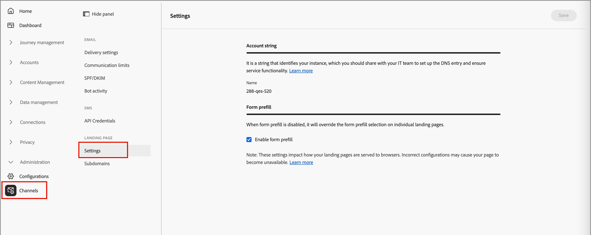

# 登陆页面配置

管理员应确保为创作和发布这些页面的营销人员配置登陆页面设置。

## 设置

若要查看登陆页面配置，请转到&#x200B;**[!UICONTROL 管理]** > **[!UICONTROL 渠道]**。 在导航面板中的&#x200B;_[!UICONTROL 登录页面]_&#x200B;下，选择&#x200B;**[!UICONTROL 设置]**。

{width="800" zoomable="yes"}

### 帐户字符串 {#account-string}

>[!CONTEXTUALHELP]
>id="ajo-b2b_landing_pages_account_string"
>title="登陆页面帐户字符串"
>abstract="帐户字符串用于标识托管登录页面的 Adobe Journey Optimizer B2B Edition 实例。"

帐户字符串标识托管登陆页面的Adobe Journey Optimizer B2B edition实例。 确保您的系统团队添加并配置DNS条目。

### 表单预填充 {#form-prefill}

>[!CONTEXTUALHELP]
>id="ajo-b2b_landing_pages_form_prefill"
>title="登陆页面表单预填充设置"
>abstract="您可以启用表单预填充选项，允许登陆页面中的表单使用已知用户的预填充信息。"

启用&#x200B;**[!UICONTROL 表单预填充]**&#x200B;选项，以允许登陆页面中的表单使用已知用户的预填充信息。 禁用此选项后，登陆页面作者将无法包含预填的表单字段。

### 数据流 {#datastream}

>[!CONTEXTUALHELP]
>id="ajo-b2b_landing_pages_datastream"
>title="数据流要求"
>abstract="需要数据流从此域上的登陆页收集页面事件。"

>[!CONTEXTUALHELP]
>id="ajo-b2b_landing_pages_missing_datastream"
>title="缺少数据流 ID"
>abstract="子域缺少数据流ID，这是正确路由所必需的。 在“设置”中配置以继续"

设置&#x200B;**[!UICONTROL 数据流]**&#x200B;选项以配置用于登陆页面事件收集的数据流。

## 子域 {#add-subdomain}

>[!CONTEXTUALHELP]
>id="ajo-b2b_landing_pages_add_subdomain"
>title="添加登陆页面子域"
>abstract="最多可以添加 50 个子域。为您要在 Adobe Journey Optimizer B2B Edition 上托管的每个唯一品牌 URL 设置一个新的子域。"

>[!CONTEXTUALHELP]
>id="ajo-b2b_landing_pages_configure_subdomain"
>title="配置登陆页面子域"
>abstract="需要配置子域才能发布登陆页面。可使用已委派给 Adobe 的子域或创建新的子域。"

登陆页面子域应该有助于识别内容类型、产品名称或促销活动，并强化页面真实性。 在配置子域之前，请定义一个或多个CNAME以用于登陆页面。 例如：

* **产品**。[公司域].com
* **转到**。[公司域].com
* **注册**。[公司域].com

在这些示例中，第一部分（粗体部分）是`LandingPageCNAME`。

为您要托管在Adobe Journey Optimizer B2B edition上的每个唯一品牌URL添加新子域。 最多可以添加50个子域。

>[!IMPORTANT]
>
>不允许将无效子域委派给Adobe。 请确保输入贵组织拥有的有效子域，如&#x200B;_marketing.yourcompany.com_。

若要查看子域并添加新子域，请转到&#x200B;**[!UICONTROL 管理]** > **[!UICONTROL 渠道]**。 在导航面板中的&#x200B;_[!UICONTROL 登陆页面]_&#x200B;下，选择&#x200B;**[!UICONTROL 子域]**。

{width="800" zoomable="yes"}

添加登陆页子域&#x200B;:_(_T)

1. 单击右上方的&#x200B;**[!UICONTROL 添加子域]**。

1. 在&#x200B;_[!UICONTROL 子域详细信息]_&#x200B;中，输入子域信息：

   * **[!UICONTROL 子域]** — 要使用的子域URL，如`marketing.yourcompany.com`
   * **[!UICONTROL 默认页面]** — 默认子域页面的URL，如`marketing.yourcompany.com/products`
   * **[!UICONTROL 备用页面]** — 如果子域上的登陆页面不处于活动状态（如`marketing.yourcompany.com/expired`），则使用备用页面的URL

   {width="700" zoomable="yes"}

1. 单击&#x200B;**[!UICONTROL 保存]**。
