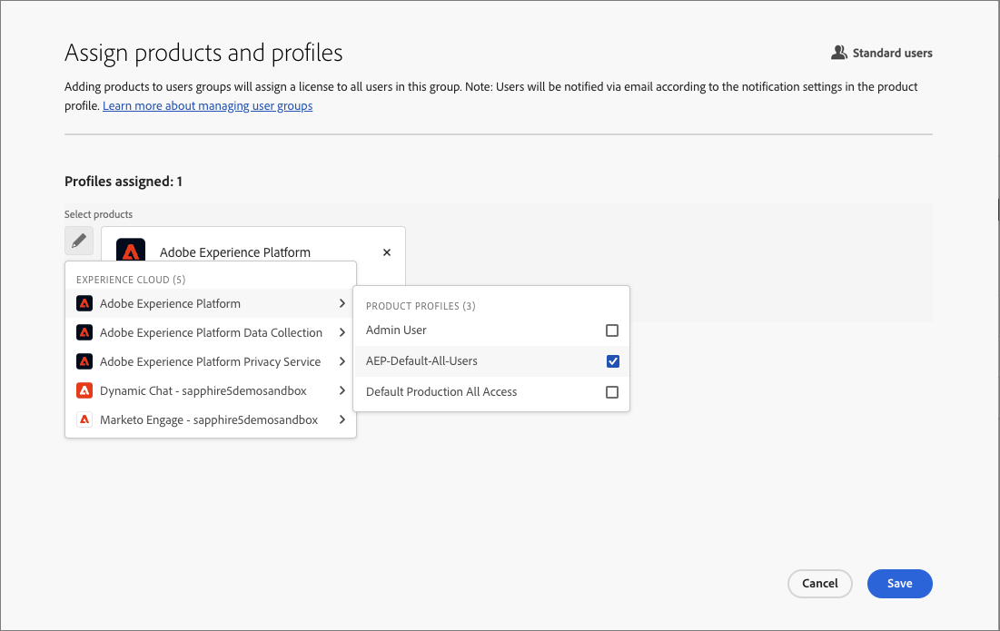
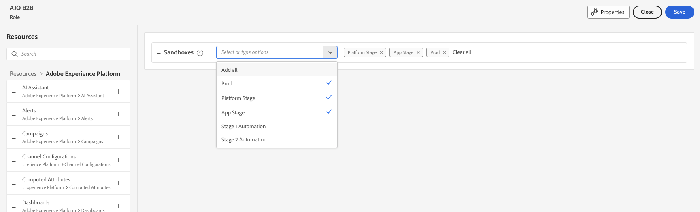

# 用户管理

完成配置并绑定沙盒后，请完成以下步骤以为您的团队和用户提供对Adobe Journey Optimizer B2B edition的访问权限。

1. [在Admin Console中创建Marketo Engage产品配置文件](#marketo-engage-profile)(仅限新的Marketo Engage实例)。
1. 在Admin Console中[创建用户组](#create-user-group)。
1. [编辑内置角色](#edit-roles)或[创建具有Journey Optimizer B2B edition权限的自定义角色](#create-a-custom-role)。
1. [将用户](#add-users)或[组](#add-user-groups-to-a-role)添加到角色。

作为管理员，您可以在Adobe Admin Console中完成这些任务，这是管理您的Adobe产品许可证和用户的中心位置。 在Admin Console中，您可以在单个位置而不是在各种单独的解决方案中创建和管理用户。 请参阅[Admin Console概述](https://helpx.adobe.com/cn/enterprise/using/admin-console.html)页面，了解有关其功能和功能的更多信息。

## 访问Admin Console

在使用Admin Console管理团队中的用户之前，您需要确保可以访问Admin Console并具有适当的权限。

1. 作为系统管理员，您应在载入流程中收到来自Adobe的多封电子邮件。

   查找欢迎电子邮件，其中提供了有关您被授予访问权限的组织名称的信息。

1. 单击欢迎电子邮件中的&#x200B;**[!UICONTROL 开始使用]**&#x200B;链接以导航到Admin Console。

   如果找不到电子邮件，请直接打开浏览器访问Admin Console，网址为[https://adminconsole.adobe.com](https://adminconsole.adobe.com)。

1. 使用您的Adobe ID登录。

   成功登录后，您会看到Adobe Admin Console的&#x200B;_概述_&#x200B;页面。

1. 如果您有权访问多个组织，请确保您已登录到正确的组织。

   要更改您的组织，请单击右上角的组织名称，然后选择您需要访问的组织。

1. 从&#x200B;_[!UICONTROL 用户]_&#x200B;信息卡中选择&#x200B;**[!UICONTROL 管理员]**&#x200B;以验证您是系统管理员。

   {width="700" zoomable="yes"}

1. 通过输入您的Adobe ID电子邮件、用户名、名字或姓氏进行搜索。

   * 如果您的访问权限配置正确，搜索将返回您的记录。

   * 如果&#x200B;**[!UICONTROL 管理员角色]**&#x200B;列中的值显示`System`，则表示您自己（或显示的用户）是系统管理员。

## 创建Marketo Engage产品配置文件 {#marketo-engage-profile}

授予用户访问Adobe解决方案的权限时，您不一定要授予他们完全访问权限。 产品配置文件使每个解决方案都有自己的用户权限集。 使用Admin Console分配产品配置文件。

有关将产品配置文件用于用户权限的详细信息，请参阅Admin Console文档中的[管理企业用户的产品配置文件](https://helpx.adobe.com/cn/enterprise/using/manage-product-profiles.html){target="_blank"}。
<!--
>[!BEGINSHADEBOX]

When you add a user to the Marketo Engage product profile, they are subsequently added to the _Standard User_ role within the Default workspace of the Marketo Engage subscription. This role grants them all _Standard User_ permissions for Marketo Engage in that workspace. Currently, all Journey Optimizer B2B Edition users are required to be Marketo Engage users. A Marketo Engage administrator can restrict access by updating the permissions for the _Standard User_ role or by moving the user to a different Marketo Engage user role with more restrictive permissions.

For more information about managing these permissions within Marketo Engage, see [Managing User Roles and Permissions](https://experienceleague.adobe.com/zh-hans/docs/marketo/using/product-docs/administration/users-and-roles/managing-user-roles-and-permissions){target="_blank"} in the Marketo Engage documentation.

>[!ENDSHADEBOX]-->

{width="30"}系统管理员或Marketo Engage产品管理员可以执行以下步骤。

1. 登录到[https://adminconsole.adobe.com](https://adminconsole.adobe.com)。

1. 选择&#x200B;**[!UICONTROL 产品]**&#x200B;选项卡。

1. 打开要添加配置文件的Marketo Engage实例，然后单击&#x200B;**[!UICONTROL 新建配置文件]**。

   {width="700" zoomable="yes"}

1. 输入产品配置文件名称，如&#x200B;_标准用户_。

1. 单击&#x200B;**下一步**，然后单击&#x200B;**保存**。

## 创建用户组 {#create-user-group}

用户组是指一组被授予共享权限的用户。 您可以在用户组中添加或删除用户。 当组内的用户发生更改时，组权限保持不变。

有关如何使用用户组管理权限的更多信息，请参阅Admin Console文档中的[管理用户组](https://helpx.adobe.com/cn/enterprise/using/user-groups.html){target="_blank"}。

{width="30"}系统管理员可以执行以下步骤。

1. 登录到[https://adminconsole.adobe.com](https://adminconsole.adobe.com)。

1. 选择&#x200B;**[!UICONTROL 用户]**&#x200B;选项卡。

1. 在左侧导航中选择&#x200B;**[!UICONTROL 用户组]**。

1. 单击右上方的&#x200B;**[!UICONTROL 新建用户组]**。

1. 输入用户组的名称，如&#x200B;_标准用户_，然后单击&#x200B;**[!UICONTROL 保存]**。

1. 单击刚刚创建的用户组。

1. 选择&#x200B;**[!UICONTROL 已分配的产品配置文件]**&#x200B;选项卡，然后单击&#x200B;**[!UICONTROL 分配配置文件]**。

1. 单击&#x200B;**+**&#x200B;并添加以下产品的每个实例：

   * [!UICONTROL Marketo Engage]
   * [!UICONTROL Adobe Experience Platform - AEP-Default-All-Users]
   * [!UICONTROL Adobe Experience Platform数据收集]
   * [!UICONTROL 数据收集所有访问权限]

   {width="700" zoomable="yes"}

1. 单击&#x200B;**[!UICONTROL 保存]**。

## 将用户添加到组

有关用户管理的信息，请参阅Admin Console文档中的[Admin Console用户](https://helpx.adobe.com/cn/enterprise/using/user-groups.html)。

{width="30"}系统管理员或产品管理员可以执行以下步骤。 产品管理员只能添加其组织中已存在的用户。

1. 转到[https://adminconsole.adobe.com](https://adminconsole.adobe.com)。

1. 在&#x200B;_[!UICONTROL 快速链接]_&#x200B;下，单击&#x200B;**[!UICONTROL 添加用户]**。

1. 添加每个用户：

   * 输入用户的电子邮件地址、名字和姓氏。

     {width="600" zoomable="yes"}

   * 对于&#x200B;**[!UICONTROL 用户组]**，单击&#x200B;**+**。

   * 选择您之前创建的用户组。

   * 单击&#x200B;**[!UICONTROL 应用]**。

1. 单击&#x200B;**[!UICONTROL 保存]**。

## 编辑产品权限的角色 {#edit-roles}

权限是单一的权利，可用于定义分配给产品配置文件的授权。 每个权限都是通过某种功能（如历程或购买群组）收集而得，该功能代表Journey Optimizer B2B edition中的不同功能或对象。

在Adobe Experience Platform的&#x200B;_权限_&#x200B;区域，管理员可以定义用户角色和访问策略，以管理产品应用程序内功能和对象的访问权限。 在此应用程序中，您可以创建和管理角色，并为这些角色分配所需的资源权限。 权限还允许您管理与特定角色关联的沙盒和用户。

有关Experience Platform中角色权限的更多信息，请参阅Experience Platform文档中的[管理角色的权限](https://experienceleague.adobe.com/zh-hans/docs/experience-platform/access-control/abac/permissions-ui/permissions){target="_blank"}。

### B2B产品权限

以下权限可管理对Journey Optimizer B2B edition功能的访问：

| 类别 | 描述 | 权限 |
| -------- | ----------- | ---------- |
| B2B帐户列表 | 配置、管理、查看和发布B2B帐户列表的权限。 这些权限包括从帐户列表中添加、删除、导入和删除帐户等操作。 | <li>管理B2B帐户列表 |
| B2B管理配置 | 配置、管理和查看B2B管理配置的权限。 这些权限包括数字资产管理连接、资产存储库和事件。 | <li>管理B2B管理配置 |
| B2B Assets | 配置、管理和查看B2B资源的权限。 这些权限包括电子邮件、短信、登陆页面、片段、模板和图像。 | <li>管理B2B Assets <li>管理B2B模板 <li>管理B2B片段 |
| B2B购买团体 | 配置、管理和查看B2B购买群组的权限。 这些权限包括解决方案兴趣、角色模板和购买群组状态。 | <li>管理B2B购买组 |
| B2B渠道配置 | 配置、管理和查看B2B渠道配置的权限。 这些权限包括通信限制设置、API凭据和安全设置。 | <li>管理B2B渠道配置 |
| B2B仪表板 | 配置和查看B2B仪表板的权限。 这些权限包括帐户参与、购买团体阶段、激增的帐户和联系范围。 | <li>管理B2B仪表板 |
| B2B历程 | 为B2B历程配置管理、查看和发布权限。 这些权限包括帐户和人员操作、事件侦听器以及拆分路径 | <li>管理B2B历程 |

### B2B内置角色

当您的组织配置了Journey Optimizer B2B edition产品时，Experience Platform包含一组内置（默认）角色，您可以使用这些角色来管理对产品功能的访问：

| 角色 | 权限 |
| ---- | ----------- |
| B2B历程管理器 | <li>管理B2B历程 <li>管理B2B购买组 <li>管理B2B帐户列表 <li>查看B2B参与仪表板 <li>查看B2B分析仪表板 |
| B2B渠道管理器 | <li>管理B2B Assets <li>管理B2B模板 <li>管理B2B片段 |
| B2B系统管理员 | <li>管理B2B渠道配置 <li>管理B2B管理配置 |
| B2B销售用户 | <li>查看B2B参与仪表板 |

### 编辑角色权限

对于内置或自定义角色，您可以随时决定添加或删除权限。 如果修改默认或自定义角色，则会影响分配给该角色的每个用户。

在以下示例中，您要为分配给B2B历程管理员角色的用户添加与B2B角色资源相关的权限。 此更改还允许该角色的用户管理帐户历程。

>[!NOTE]
>
>Admin Console系统管理员可以执行这些步骤。

_要更改角色的权限：_

1. 转到[experience.adobe.com](https://experience.adobe.com/)。

1. 在&#x200B;_[!UICONTROL 快速访问]_&#x200B;面板中，选择&#x200B;**[!UICONTROL 权限]**。

   >[!NOTE]
   >
   >如果您没有看到&#x200B;_[!UICONTROL 权限]_，您可能需要单击&#x200B;**[!UICONTROL 查看全部]**&#x200B;并从可用应用程序中选择它。

   {width="700" zoomable="yes"}

1. 在左侧导航中选择&#x200B;**[!UICONTROL 角色]**。

1. 单击&#x200B;**_B2B渠道管理器_**&#x200B;角色名称。

1. 在详细信息页面中，单击右上方的&#x200B;**[!UICONTROL 编辑]**。

   {width="700" zoomable="yes"}

   在角色编辑器中，_[!UICONTROL 资源]_&#x200B;菜单显示应用于Experience Cloud - Platform支持的应用程序产品的资源列表。

   您可以在搜索工具中输入&#x200B;_B2B_&#x200B;以筛选B2B产品权限列表。

1. 单击B2B历程资源的&#x200B;_添加_&#x200B;图标(**+**)。

   {width="700" zoomable="yes"}

1. 在&#x200B;_[!UICONTROL B2B历程]_&#x200B;权限卡中，选择&#x200B;**[!UICONTROL 管理B2B帐户历程]**。

1. 单击&#x200B;**[!UICONTROL 保存]**。

   {width="700" zoomable="yes"}

1. 单击&#x200B;**[!UICONTROL 关闭]**&#x200B;以返回详细信息页面。

### 将用户添加到角色

{width="30"}系统管理员或AEP产品管理员可以执行以下步骤。

1. 打开角色详细信息并选择&#x200B;**[!UICONTROL 用户]**&#x200B;选项卡。

   此选项卡显示分配给该角色的所有用户的列表。

1. 单击&#x200B;**[!UICONTROL 添加用户]**。

   {width="700" zoomable="yes"}

1. 在&#x200B;_[!UICONTROL 添加用户]_&#x200B;对话框中，找到并选择要添加到该角色的用户。

   * 您可以使用搜索工具来筛选用户列表。

   * 选中每个用户的复选框。

   {width="600" zoomable="yes"}

1. 选择您要添加的所有用户后，单击&#x200B;**[!UICONTROL 保存]**。

### 将用户组添加到角色

有关用户管理的信息，请参阅Admin Console文档中的[Admin Console用户](https://helpx.adobe.com/cn/enterprise/using/user-groups.html)。

{width="30"}系统管理员或AEP产品管理员可以执行以下步骤。

1. 打开角色详细信息并选择&#x200B;**[!UICONTROL 用户组]**&#x200B;选项卡。

   此选项卡显示分配给该角色的所有用户组的列表。

1. 单击&#x200B;**[!UICONTROL 添加群组]**。

   {width="700" zoomable="yes"}

1. 在&#x200B;_[!UICONTROL 添加组]_&#x200B;对话框中，找到并选择要添加到该角色的组。

   * 您可以使用搜索工具筛选用户组列表。

   * 选中每个用户组的复选框。

   {width="600" zoomable="yes"}

1. 选择您要添加的所有用户后，单击&#x200B;**[!UICONTROL 保存]**。

## 创建自定义角色

{width="30"}系统管理员或AEP产品管理员可以执行以下步骤。

1. 在左侧导航中选择&#x200B;**[!UICONTROL 角色]**，然后选择&#x200B;**[!UICONTROL 创建角色]**。

1. 在&#x200B;_[!UICONTROL 创建新角色]_&#x200B;对话框中，输入角色的名称和描述（可选），例如&#x200B;_B2B营销人员_。

1. 单击&#x200B;**[!UICONTROL 确认]**。

1. 选择您的沙箱。

   {width="700" zoomable="yes"}

1. 添加配置文件权限：

   * 在左侧的&#x200B;_[!UICONTROL 资源]_&#x200B;列表中，找到&#x200B;**[!UICONTROL 配置文件管理]**&#x200B;项目，然后单击&#x200B;_添加_ (**+**)图标以添加该属性。

   * 对于属性，添加以下权限：
      * [!UICONTROL 查看区段]
      * [!UICONTROL 管理区段]
      * [!UICONTROL 查看配置文件]
      * [!UICONTROL 管理配置文件]
      * [!UICONTROL 查看B2B配置文件]
      * [!UICONTROL 管理B2B配置文件]

   {width="700" zoomable="yes"}

1. 添加B2B产品权限：

   请参阅[B2B产品权限](#b2b-product-permissions)列表，确定您希望该角色具有哪些产品功能。

   在左侧的&#x200B;_[!UICONTROL 资源]_&#x200B;列表中，找到&#x200B;**[!UICONTROL B2B]**&#x200B;项，然后单击&#x200B;_添加_ (**+**)图标以添加要为该角色启用的每个属性。

   您可以在搜索工具中输入&#x200B;_B2B_&#x200B;以筛选B2B产品权限列表。

1. 单击右上方的&#x200B;**[!UICONTROL 保存]**。

1. 转到角色详细信息并选择&#x200B;**[!UICONTROL 用户组]**&#x200B;选项卡。

1. 单击&#x200B;**[!UICONTROL 添加群组]**。

   {width="700" zoomable="yes"}

1. 选中您之前在Admin Console中创建的用户组旁边的复选框。

1. 单击&#x200B;**[!UICONTROL 保存]**。
