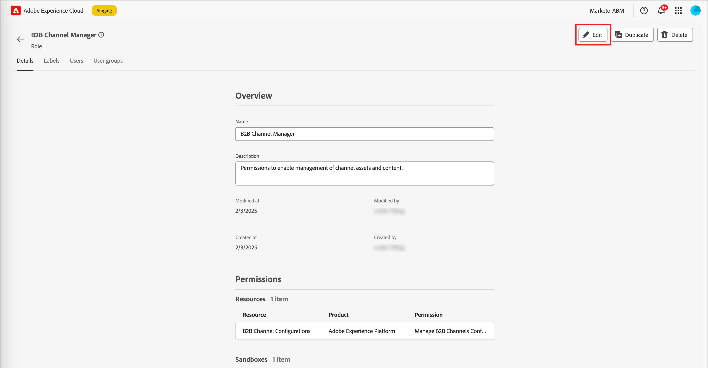

# 用户管理

完成配置并绑定沙盒后，请完成以下步骤以为您的团队和用户提供对Adobe Journey Optimizer B2B edition的访问权限。

1. [在Admin Console中创建Marketo Engage产品配置文件](#marketo-engage-profile)(仅限新的Marketo Engage实例)。
1. 在Admin Console中[创建用户组](#create-user-group)。
<!-- 1. [Edit built-in roles](#edit-roles) or [create a custom role](#create-a-custom-role) with Journey Optimizer B2B Edition permissions. -->
1. [将用户](#add-users)或[组](#add-user-groups-to-a-role)添加到角色。

作为管理员，您可以在Adobe Admin Console中完成这些任务，这是管理您的Adobe产品许可证和用户的中心位置。 在Admin Console中，您可以在单个位置而不是在各种单独的解决方案中创建和管理用户。 请参阅[Admin Console概述](https://helpx.adobe.com/cn/enterprise/using/admin-console.html)页面，了解有关其功能和功能的更多信息。

## 访问Admin Console

在使用Admin Console管理团队中的用户之前，您需要确保可以访问Admin Console并具有适当的权限。

1. 作为系统管理员，您应在载入流程中收到来自Adobe的多封电子邮件。

   查找欢迎电子邮件，其中提供了有关您被授予访问权限的组织名称的信息。

1. 单击欢迎电子邮件中的&#x200B;**[!UICONTROL 开始使用]**&#x200B;链接以导航到Admin Console。

   如果找不到电子邮件，请直接打开浏览器访问Admin Console，网址为[https://adminconsole.adobe.com](https://adminconsole.adobe.com)。

1. 使用您的Adobe ID登录。

   成功登录后，您会看到Adobe Admin Console的&#x200B;_概述_&#x200B;页面。

1. 如果您有权访问多个组织，请确保您已登录到正确的组织。

   要更改您的组织，请单击右上角的组织名称，然后选择您需要访问的组织。

1. 从&#x200B;**[!UICONTROL 用户]**&#x200B;信息卡中选择&#x200B;_[!UICONTROL 管理员]_&#x200B;以验证您是系统管理员。

   {width="700" zoomable="yes"}

1. 通过输入您的Adobe ID电子邮件、用户名、名字或姓氏进行搜索。

   * 如果您的访问权限配置正确，搜索将返回您的记录。

   * 如果&#x200B;**[!UICONTROL 管理员角色]**&#x200B;列中的值显示`System`，则表示您自己（或显示的用户）是系统管理员。

## 创建Marketo Engage产品配置文件 {#marketo-engage-profile}

授予用户访问Adobe解决方案的权限时，您不一定要授予他们完全访问权限。 产品配置文件使每个解决方案都有自己的用户权限集。 使用Admin Console分配产品配置文件。

有关将产品配置文件用于用户权限的详细信息，请参阅Admin Console文档中的[管理企业用户的产品配置文件](https://helpx.adobe.com/enterprise/using/manage-product-profiles.html){target="_blank"}。

>[!BEGINSHADEBOX]

将用户添加到Marketo Engage产品配置文件后，这些用户随后将添加到Marketo Engage订阅的默认工作区中的&#x200B;_标准用户_&#x200B;角色。 此角色将授予该工作区中Marketo Engage的所有&#x200B;_标准用户_&#x200B;权限。 目前，所有Journey Optimizer B2B edition用户都必须是Marketo Engage用户。 Marketo Engage管理员可以通过更新&#x200B;_Standard User_&#x200B;角色的权限或使用更严格的权限将用户移动到其他Marketo Engage用户角色来限制访问。

有关在Marketo Engage中管理这些权限的详细信息，请参阅Marketo Engage文档中的[管理用户角色和权限](https://experienceleague.adobe.com/en/docs/marketo/using/product-docs/administration/users-and-roles/managing-user-roles-and-permissions){target="_blank"}。

>[!ENDSHADEBOX]

{width="30"}系统管理员或Marketo Engage产品管理员可以执行以下步骤。

1. 登录到[https://adminconsole.adobe.com](https://adminconsole.adobe.com)。

1. 选择&#x200B;**[!UICONTROL 产品]**&#x200B;选项卡。

1. 打开要添加配置文件的Marketo Engage实例，然后单击&#x200B;**[!UICONTROL 新建配置文件]**。

   {width="700" zoomable="yes"}

1. 输入产品配置文件名称，如&#x200B;_标准用户_。

1. 单击&#x200B;**下一步**，然后单击&#x200B;**保存**。

## 创建用户组 {#create-user-group}

用户组是指一组被授予共享权限的用户。 您可以在用户组中添加或删除用户。 当组内的用户发生更改时，组权限保持不变。

有关如何使用用户组管理权限的更多信息，请参阅Admin Console文档中的[管理用户组](https://helpx.adobe.com/cn/enterprise/using/user-groups.html){target="_blank"}。

{width="30"}系统管理员可以执行以下步骤。

1. 登录到[https://adminconsole.adobe.com](https://adminconsole.adobe.com)。

1. 选择&#x200B;**[!UICONTROL 用户]**&#x200B;选项卡。

1. 在左侧导航中选择&#x200B;**[!UICONTROL 用户组]**。

1. 单击右上方的&#x200B;**[!UICONTROL 新建用户组]**。

1. 输入用户组的名称，如&#x200B;_标准用户_，然后单击&#x200B;**[!UICONTROL 保存]**。

1. 单击刚刚创建的用户组。

1. 选择&#x200B;**[!UICONTROL 已分配的产品配置文件]**&#x200B;选项卡，然后单击&#x200B;**[!UICONTROL 分配配置文件]**。

1. 单击&#x200B;**+**&#x200B;并添加以下产品的每个实例：

   * [!UICONTROL Marketo Engage]
   * [!UICONTROL Adobe Experience Platform - AEP-Default-All-Users]
   * [!UICONTROL Adobe Experience Platform数据收集]
   * [!UICONTROL 数据收集所有访问权限]

   {width="700" zoomable="yes"}

1. 单击&#x200B;**[!UICONTROL 保存]**。

## 将用户添加到组

有关用户管理的信息，请参阅Admin Console文档中的[Admin Console用户](https://helpx.adobe.com/cn/enterprise/using/user-groups.html)。

{width="30"}系统管理员或产品管理员可以执行以下步骤。 产品管理员只能添加其组织中已存在的用户。

1. 转到[https://adminconsole.adobe.com](https://adminconsole.adobe.com)。

1. 在&#x200B;_[!UICONTROL 快速链接]_&#x200B;下，单击&#x200B;**[!UICONTROL 添加用户]**。

1. 添加每个用户：

   * 输入用户的电子邮件地址、名字和姓氏。

     {width="600" zoomable="yes"}

   * 对于&#x200B;**[!UICONTROL 用户组]**，单击&#x200B;**+**。

   * 选择您之前创建的用户组。

   * 单击&#x200B;**[!UICONTROL 应用]**。

1. 单击&#x200B;**[!UICONTROL 保存]**。

<!-- ## Edit roles for product permissions {#edit-roles}

Permissions are unitary rights that allow you to define the authorizations assigned to a product profile. Each permission is gathered under a capability, such as journeys or buying groups, which represents the different functionalities or objects in Journey Optimizer B2B Edition.

The _Permissions_ area of Adobe Experience Platform is where administrators can define user roles and access policies to manage access permissions for features and objects within a product application. In this app, you can create and manage roles, as well as assign the desired resource permissions for these roles. Permissions also allow you to manage the sandboxes and users associated with a specific role.

For more information about role permissions in Experience Platform, see [Manage permissions for a role](https://experienceleague.adobe.com/en/docs/experience-platform/access-control/abac/permissions-ui/permissions){target="_blank"} in the Experience Platform documentation.

### B2B product permissions

The following permissions govern access to Journey Optimizer B2B Edition capabilities:

| Category | Description | Permissions |
| -------- | ----------- | ---------- |
| B2B Account Lists | Configure, manage, view, and publish permissions for B2B account lists. These permissions include actions such as add, remove, import, and delete accounts from account lists. | <li>Manage B2B Account Lists |
| B2B Admin Configurations | Configure, manage, and view permissions for B2B administrative configurations. These permissions include digital asset management connections, asset repositories, and events. | <li>Manage B2B Admin Configurations |
| B2B Assets | Configure, manage, and view permissions for B2B assets. These permissions include emails, SMS, landing pages, fragments, templates, and images. | <li>Manage B2B Assets <li>Manage B2B Templates <li>Manage B2B Fragments|
| B2B Buying Groups | Configure, manage, and view permissions for B2B buying groups. These permissions include solution interests, roles templates, and buying group status. | <li>Manage B2B Buying Groups |
| B2B Channel Configurations | Configure, manage, and view permissions for B2B channel configurations. These permissions include settings for communication limits, API credentials, and security settings. | <li>Manage B2B Channels Configurations |
| B2B Dashboards |Configure and view permissions for B2B dashboards. These permissions include account engagement, buying group stages, surging accounts, and contact coverage. | <li>Manage B2B Dashboards |
| B2B Journeys | Configure manage, view, and publish permissions for B2B journeys. These permissions include account and person actions, event listeners, and split paths | <li>Manage B2B Journeys |

### B2B built-in roles

When your organization has the Journey Optimizer B2B Edition product provisioned, Experience Platform includes a set of built-in (default) roles that you can use to manage access to the product capabilities:

| Role | Permissions |
| ---- | ----------- |
| B2B Journey Manager | <li>Manage B2B Journeys <li>Manage B2B Buying Groups <li>Manage B2B Account Lists <li>View B2B Engagement Dashboard <li>View B2B Insights Dashboard |
| B2B Channel Manager | <li>Manage B2B Assets <li>Manage B2B Templates <li>Manage B2B Fragments |
| B2B System Administrator | <li>Manage B2B Channels Configurations <li>Manage B2B Admin Configurations |
| B2B Sales User | <li>View B2B Engagement Dashboard |

### Edit role permissions

For built-in or custom roles, you can decide at any time to add or delete permissions. If you modify a default or custom role, it impacts every user assigned to the role.

In the following example, you want to add permissions related to the B2B Journeys resource for users assigned to the B2B Channel Manager role. This change enables users for that role to manage account journeys also.

>[!NOTE]
>
>An Admin Console system administrator can perform these steps.

_To change the permissions for a role:_

1. Go to [experience.adobe.com](https://experience.adobe.com/).

1. In the _[!UICONTROL Quick access]_ panel, select **[!UICONTROL Permissions]**.

   >[!NOTE]
   >
   >If you don't see _[!UICONTROL Permissions]_, you may need to click **[!UICONTROL View all]** and select it from the available applications.

   {width="700" zoomable="yes"}

1. Select **[!UICONTROL Roles]** in the left navigation.

1. Click the **_B2B Channel Manager_** role name.

1. In the details page, click **[!UICONTROL Edit]** at the top right.

   {width="700" zoomable="yes"}

   In the role editor, the _[!UICONTROL Resources]_ menu displays the list of resources that apply to the Experience Cloud - Platform powered applications products.

   You can enter _B2B_ in the search tool to filter the list for the B2B product permissions. 
   
1. Click the _Add_ icon (**+**) for the B2B Journeys resource.

   {width="700" zoomable="yes"}

1. In the _[!UICONTROL B2B Journeys]_ permissions card, select **[!UICONTROL Manage B2B Account Journeys]**.

1. Click **[!UICONTROL Save]**.

   {width="700" zoomable="yes"}

1. Click **[!UICONTROL Close]** to return to the details page.

### Add users to a role

{width="30"} A system administrator or AEP product administrator can perform the following steps. 

1. Open the role details and select the **[!UICONTROL Users]** tab.

   This tab displays a list of all users assigned to the role.

1. Click **[!UICONTROL Add users]**.

   {width="700" zoomable="yes"}

1. In the _[!UICONTROL Add users]_ dialog, locate and select the users that you want to add to the role.

   * You can use the Search tool to filter the list of users. 

   * Select the checkbox for each user.

   {width="600" zoomable="yes"}

1. Click **[!UICONTROL Save]** when you have selected all the users that you want to add.

### Add user groups to a role

For information about user management, see [Admin Console users](https://helpx.adobe.com/enterprise/using/user-groups.html) in the Admin Console documentation.

{width="30"} A system administrator or AEP product administrator can perform the following steps. 

1. Open the role details and select the **[!UICONTROL User groups]** tab.

   This tab displays a list of all user groups assigned to the role. 

1. Click **[!UICONTROL Add Groups]**.

   {width="700" zoomable="yes"}

1. In the _[!UICONTROL Add groups]_ dialog, locate and select the groups that you want to add to the role.

   * You can use the Search tool to filter the list of user groups. 

   * Select the checkbox for each user group.

   {width="600" zoomable="yes"}

1. Click **[!UICONTROL Save]** when you have selected all the users that you want to add. -->

## 创建自定义角色

{width="30"}系统管理员或AEP产品管理员可以执行以下步骤。

1. 在左侧导航中选择&#x200B;**[!UICONTROL 角色]**，然后选择&#x200B;**[!UICONTROL 创建角色]**。

1. 在&#x200B;_[!UICONTROL 创建新角色]_&#x200B;对话框中，输入角色的名称和描述（可选），例如&#x200B;_B2B营销人员_。

1. 单击&#x200B;**[!UICONTROL 确认]**。

1. 选择您的沙箱。

   {width="700" zoomable="yes"}

1. 添加配置文件权限：

   * 在左侧的&#x200B;_[!UICONTROL 资源]_&#x200B;列表中，找到&#x200B;**[!UICONTROL 配置文件管理]**&#x200B;项目，然后单击&#x200B;_添加_ (**+**)图标以添加该属性。

   * 对于属性，添加以下权限：
      * [!UICONTROL 查看区段]
      * [!UICONTROL 管理区段]
      * [!UICONTROL 查看配置文件]
      * [!UICONTROL 管理配置文件]
      * [!UICONTROL 查看B2B配置文件]
      * [!UICONTROL 管理B2B配置文件]

   {width="700" zoomable="yes"}

1. 添加B2B产品权限：

   请参阅[B2B产品权限](#b2b-product-permissions)列表，确定您希望该角色具有哪些产品功能。

   在左侧的&#x200B;_[!UICONTROL 资源]_&#x200B;列表中，找到&#x200B;**[!UICONTROL B2B]**&#x200B;项，然后单击&#x200B;_添加_ (**+**)图标以添加要为该角色启用的每个属性。

   您可以在搜索工具中输入&#x200B;_B2B_&#x200B;以筛选B2B产品权限列表。

1. 单击右上方的&#x200B;**[!UICONTROL 保存]**。

1. 转到角色详细信息并选择&#x200B;**[!UICONTROL 用户组]**&#x200B;选项卡。

1. 单击&#x200B;**[!UICONTROL 添加群组]**。

   {width="700" zoomable="yes"}

1. 选中您之前在Admin Console中创建的用户组旁边的复选框。

1. 单击&#x200B;**[!UICONTROL 保存]**。
