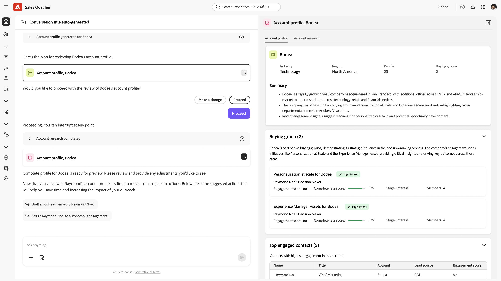
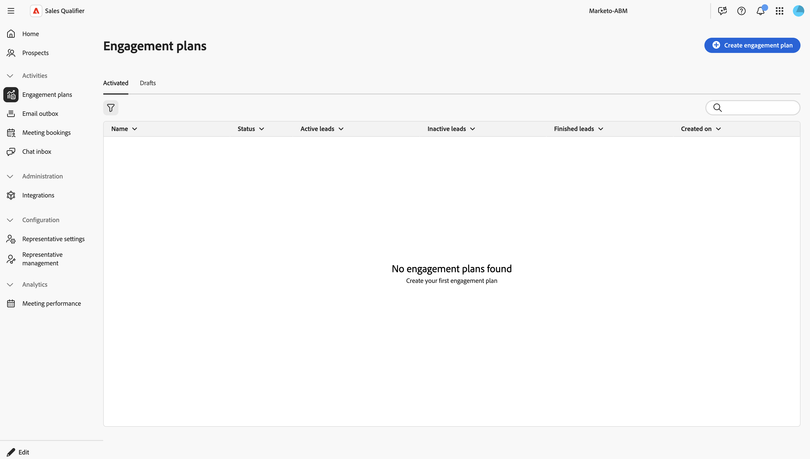
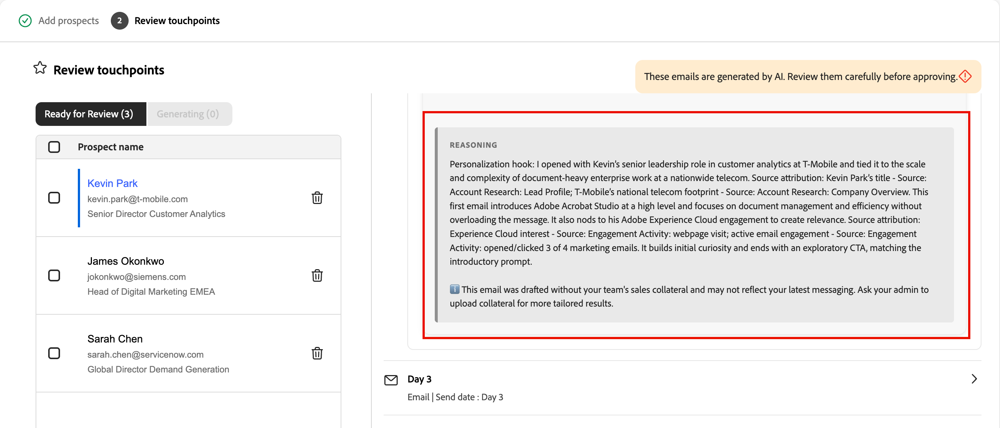
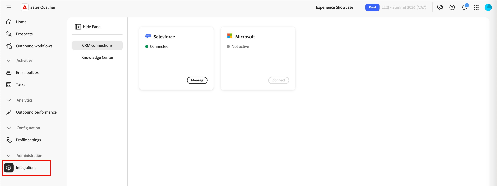

# 销售限定词

Sales Qualifier是一个人工智能驱动的应用程序，可与Adobe Journey Optimizer B2B edition一起使用。 它实施了Account Qualification Agent，旨在简化业务开发代表(BDR)的工作流。 Sales Qualifier跨渠道自动执行潜在客户鉴别、外联和买方参与工作流程。 它减少了手动BDR负载，加快了企业B2B公司的管道速度。

BDR可以使用浏览器和电子邮件插件直接在CRM或Outlook中访问商业智能。 以下视频简要演示了Sales Qualifier和Account Qualification Agent。

>[!VIDEO](https://video.tv.adobe.com/v/3476550)

## 应用程序主页

销售限定符包含在[!UICONTROL Journey Optimizer B2B edition]中，但它是Adobe Experience Platform中的单独应用程序。

{width="800" zoomable="yes"}

### Account Qualification 代理

Account Qualification Agent (AQA)是Sales Qualifier的核心。 AQA使用人工智能读取您的帐户，并确定哪些帐户已准备好执行下一步。 当您的组织已连接CRM（只读）时，它有助于研究、电子邮件草稿和了解CRM的上下文。

{width="800" zoomable="yes"}

* **潜在客户研究**

  使用自动检索和显示关键潜在客户信息（如职务、最近工作、购买组成员资格）来进行潜在客户研究，以在几秒钟内提供完整的概况。

* **帐户研究**

  使用自动检索和显示有关潜在客户组织的详细信息来执行客户调查。 此信息包括公司重要信息、最新新闻、战略优先顺序以及最受关注的会员。

* **草稿电子邮件**

  通过综合来自潜在客户和客户洞察的研究生成电子邮件草稿，以根据BDR目标生成相关的个性化单个电子邮件内容。

* **参与计划电子邮件**

  创建针对BDR定义的外联节奏的每个步骤进行个性化的参与计划电子邮件草稿，确保整个序列都是个性化的。

<!--
## Edit the left navigation bar

At the bottom left of the application, click the _Edit_ (  ) icon to control which elements are visible in the left navigation. You can also drag and drop them to reorder as you want.
-->

### 基本代理使用情况

Adobe AI代理使用&#x200B;_自然语言查询_，这意味着他们在文本提示中使用与您与某人交谈时相同的语言。 你越详细，结果就越好。

使用自然语言，您可以要求代理：

* `Show me my assigned leads with no engagement yet`
* `Show me all my leads that are not part of any autonomous engagement`
* `Give me a detailed summary on Acme company, including their buying group, recent intent signals, and our past engagement.`

您可以立即了解哪些客户和潜在客户最活跃并显示最高的意图，这样您可以将精力集中到最具影响力的地方。

通过优化提示以获取所需结果来循环访问您的历程。 例如：

* _从收入电话或报告等上下文中起草跟进电子邮件。 最多120字。 主题行：引人入胜，包含关键主题。 简介：用上下文源中的直接引号挂接。 正文：连接到棘手问题和价值主张。 CTA：建议拨打一个短电话以进一步探索。_

* _此电子邮件的目标是开始对话并建立可信度。 起草一封有120个字的电子邮件，其语气具有咨询性和同理心。 请确保避免过于熟悉或销售方法，并且不要使用“希望您一切正常”、“登记入住”或“请”等短语。_

### 产品访问和用户组

对Sales Qualifier功能的访问通过Adobe Admin Console中的用户组进行管理。 产品管理员必须先设置相应的用户组，用户才能访问该应用程序。

#### 产品管理员

需要访问[集成](#integrations)功能的产品管理员必须是`Sales Qualifier Admins`用户组的成员。

1. 在Adobe Admin Console中，创建一个名为`Sales Qualifier Admins`的用户组。
1. 添加需要配置CRM连接和知识库设置的用户。

#### 标准BDR用户

标准BDR用户必须是`Sales Qualifier users`用户组的成员才能访问Sales Qualifier。

1. 在Adobe Admin Console中，创建一个名为`Sales Qualifier users`的用户组。
1. 将&#x200B;**默认的生产所有访问权限** AEP配置文件分配给组。
1. 将用户添加到组。

>[!NOTE]
>
>用户组名必须与上一步骤中所示完全匹配。

## 潜在客户

在左侧导航中选择&#x200B;**[!UICONTROL 潜在客户]**&#x200B;以查看您可以访问的所有潜在客户列表。 它可快速检查各项指标，如商机状态和上次活动。

{width="800" zoomable="yes"}

单击&#x200B;_筛选器_ 图标可按潜在客户状态筛选显示的列表。

<!--
## Engagement plans

This window provides details about any defined Engagement plans.



To make a new Engagement plan, click **[!UICONTROL Create engagement plan]**.

1. In the _Details_ stage, provide a name and optional description. Click **[!UICONTROL Save and Continue]**.
1. In the _Select prospects_ stage, select the leads that should belong in this plan.
1. In the _Define cadence_ stage, set the parameters for the plan.
1. In the _Preview_ stage, ensure that everything is working as expected.
-->

## 出站工作流

>[!NOTE]
>
>产品管理员创建的出站工作流会与组织中的所有用户共享。

_出站工作流_&#x200B;是Sales Qualifier用于运行目标驱动电子邮件序列的结构。 您定义外联目标和定位标准，AI将建议多点接触节奏并为每个潜在客户编写个性化的电子邮件内容。 在注册激活序列之前，您可以审核并批准每封电子邮件，以便消息仅在配置的窗口内发送。

出站工作流会连接四个元素：

* **目标** — 您要从推广中获得的结果（例如，预订发现电话或驾驶事件注册）。
* **定位过滤器** — 确定哪些潜在客户符合条件的条件。
* **接触点的节奏** — 步骤的有序顺序，每个步骤在计划的一天完成。 接触点可以是&#x200B;**电子邮件**、**电话**&#x200B;或&#x200B;**LinkedIn InMails**。
* **个性化电子邮件内容** — 对于每个电子邮件接触点，AI将使用潜在客户个人资料、帐户上下文、参与历史记录和最近新闻来草稿内容。

目标驱动下游所有内容：AI使用它来建议定位过滤器、设计节奏、草稿接触点提示并为每个生成的电子邮件塑造个性化。

{width="800" zoomable="yes"}

### 重要概念

| 概念 | 描述 |
| --- | --- |
| **工作流** | 由目标、定向过滤器、节奏和设置定义的可重用出站活动。 |
| **目标** | 外联工作应该取得什么成果。 |
| **接触点** | 序列中的一个步骤（电子邮件、电话或LinkedIn InMail），计划为相对于注册。 |
| **接触点提示** | 在生成潜在客户的电子邮件正文和主题时，AI将遵循相关说明，包括语调、时长、焦点和call to action。 |
| **节奏** | 接触点的完整序列：数量、顺序以及日期。 |
| **定位筛选器** | 将工作流限制为潜在客户子集的条件。 |
| **草稿** | 已生成准备好进行审查但尚未批准的电子邮件。 |
| **推理** | AI对其如何撰写给定电子邮件（使用的信号和数据源）的解释。 |
| **注册** | 批准目标客户的草稿，这将激活节奏并在工作流的发送窗口将电子邮件排入队列，以便发送。 |

以下各节描述了整个生命周期：在向导中创建工作流、审查生成的电子邮件、批准潜在客户以及管理随时间变化的工作流。

### 创建出站工作流

工作流创建是一个五步向导：**目标**、**定位**、**生成接触点**、**设置**&#x200B;和&#x200B;**添加潜在客户**。 每个步骤都建立在最后一步之上，您定义的目标是首先影响之后的每个决策。

1. 在左侧导航中，选择&#x200B;**[!UICONTROL 出站工作流]**。

1. 在&#x200B;**[!UICONTROL 浏览]**&#x200B;选项卡上，单击右上角的&#x200B;**[!UICONTROL +创建工作流]**。

#### 步骤1：定义目标

目标是最重要的输入：它告知AI成功的外观，并锚定定位、节奏和电子邮件生成。

1. 选择&#x200B;**[!UICONTROL 从头开始]**&#x200B;以编写您自己的目标，或选择&#x200B;**[!UICONTROL 从模板开始]**&#x200B;以使用已保存的模板。

   {width="700" zoomable="yes"}

1. 选择&#x200B;**[!UICONTROL 推荐目标]**&#x200B;之一作为起点，或输入您自己的目标。

1. 单击&#x200B;**[!UICONTROL 下一步：定位]**。

目标在陈述&#x200B;**具体结果**&#x200B;时效果最佳，而不仅仅是主题。 例如，`Book a 15-minute discovery call with marketing leaders evaluating campaign automation`为AI提供了比`Promote campaign automation`更多的处理能力。

#### 步骤2：配置定位过滤器

定位过滤器定义哪些潜在客户符合条件。 当您稍后添加潜在客户时，只有符合这些筛选条件的那些客户才会显示在选择列表中。

1. 单击向下箭头以显示&#x200B;**[!UICONTROL 添加筛选器]**&#x200B;列表并选择要应用的筛选器。

   {width="700" zoomable="yes"}

1. 设置筛选器的值。

1. 如果需要缩小受众，请添加更多过滤器。

   {width="600" zoomable="yes"}

1. 单击&#x200B;**[!UICONTROL 下一步：生成接触点]**。

#### 步骤3：生成并查看接触点

设置定位后，AI将构建&#x200B;**_节奏_**：它会分析您的目标和定位，定义接触点序列，并为每个步骤编写&#x200B;**_接触点提示_**。 在特定的一天中，您会看到每个接触点出现多步频率。 节奏可以混合使用电子邮件、电话和LinkedIn InMail步骤。

{width="700" zoomable="yes"}

展开电子邮件接触点以读取其提示，这是AI在编写每个潜在客户的实际电子邮件（语调、时长、焦点和call to action）时遵循的说明。

**重新生成节奏**

如果节奏不是您想要的，请单击&#x200B;**[!UICONTROL 重新生成]**&#x200B;并输入精简指令。 例如：

* `Make it 3 touchpoints across 2 weeks`
* `Lead with an executive briefing offer in the first email`
* `Add a nurture touch focused on a relevant case study`

AI会根据您的指令重写整个节奏。

要调整单个电子邮件接触点而不重新生成整个节奏，请直接在其文本区域中编辑提示文本。

当节奏和提示看起来正确时，单击&#x200B;**[!UICONTROL 下一步：设置]**。

在生成潜在客户之前优化接触点提示很重要：这些提示是AI以后用于每个潜在客户的核心指令。 此处逗留时间可缩放到所有生成的电子邮件。

#### 步骤4：配置工作流设置

**设置**&#x200B;步骤控制工作流的运行方式。

{width="700" zoomable="yes"}

1. 查看&#x200B;**[!UICONTROL 工作流名称]**，如果想要更清晰的标签，请更改该名称。
1. 在&#x200B;**[!UICONTROL 每个工作流的最大潜在客户数]**&#x200B;中，确认工作流可以同时管理多少潜在客户的上限。
1. 设置&#x200B;**[!UICONTROL 发送窗口]**&#x200B;为允许发送出站电子邮件的小时数。
1. 确认&#x200B;**[!UICONTROL 包含选择退出链接]**，以便每个电子邮件都可以包含选择退出链接。
1. 确认&#x200B;**[!UICONTROL 时区]**&#x200B;与您的受众匹配。
1. 单击&#x200B;**[!UICONTROL 保存并添加潜在客户]**。

#### 步骤5：添加潜在客户并开始生成电子邮件

保存将打开潜在客户选择视图，该视图已被您的步骤2目标定位所过滤。

{width="700" zoomable="yes"}

1. 查看列表。

   行通常包括潜在客户名称、帐户、电子邮件、职务、参与状态和潜在客户状态。

1. 如果需要展开或缩小列表，请在此处调整筛选器。
1. 使用复选框选择潜在客户。
1. 单击&#x200B;**[!UICONTROL 下一步：查看接触点]**&#x200B;以开始&#x200B;**每个潜在客户**&#x200B;电子邮件生成。

AI会为节奏中&#x200B;**每个电子邮件接触点**&#x200B;的每个所选潜在客户生成个性化电子邮件。 电话和LinkedIn InMail接触点将按计划步骤保留在序列中。 生成可在后台运行 — 如果要在完成时继续其他工作，请使用&#x200B;**[!UICONTROL 准备就绪时通知]**。

对于每个潜在客户，AI将每个接触点提示与特定于潜在客户的数据（人员、帐户、参与历史记录、最近新闻）组合在一起，以产生主题行和正文。

### 查看和优化生成的电子邮件

生成完成后，工作流详细信息视图会显示用于审阅草稿的横幅。 需要审阅，在获得批准之前不会发送任何内容。

{width="700" zoomable="yes"}

1. 在工作流详细信息视图中，单击横幅中的&#x200B;**[!UICONTROL 审核草稿]**。
1. **[!UICONTROL 查看接触点]**&#x200B;步骤有两个选项卡：
   * **[!UICONTROL 准备好审查]** — 已完成生成的电子邮件。
   * **[!UICONTROL 正在生成]** — 仍在写入电子邮件。
1. 在左侧的目标客户列表中，单击某个名称以在右侧加载该目标客户的接触点。
1. 在接触点上使用V形(**>**)展开并读取完整的主题行和正文。

#### 阅读AI推理

对于每个生成的电子邮件，**[!UICONTROL 推理]**&#x200B;将解释AI如何创建该消息，包括信号、属性和来源，它们决定了内容和call to action。 在批准之前，请查看此信息以验证个性化。

{width="600" zoomable="yes"}

#### 直接编辑电子邮件

对于少量编辑（措辞、语调、单句）：

1. 在展开的接触点上，单击&#x200B;_编辑_&#x200B;图标以打开编辑器。
1. 编辑主题行或正文。
1. 单击&#x200B;**[!UICONTROL 保存]**。

#### 使用AI优化电子邮件

对于较大的更改（重新构建、转移强调或重新设置消息框架），请使用&#x200B;**[!UICONTROL 使用AI生成]**。 AI代理重写电子邮件，同时保留个性化上下文。

1. 在电子邮件编辑器中，单击&#x200B;**[!UICONTROL 使用AI生成]**。

   {width="600" zoomable="yes"}

1. 输入明确的指令，例如：
   * `Make it shorter and more direct. Keep it under 100 words.`
   * `Focus more on the prospect's role and how the solution helps them specifically.`
   * `Change the call-to-action to suggest a 15-minute introductory call instead.`
1. 查看修订版，并根据需要手动调整。
1. 单击&#x200B;**[!UICONTROL 保存]**。

>[!TIP]
>
>直接编辑套装的措辞和语气。 _[!UICONTROL 使用AI生成]_&#x200B;的效果更好，因为您最好从头开始重写电子邮件。

### 批准和注册潜在客户

审批可激活目标客户的节奏。 在潜在客户获得批准和注册之前，系统不会向他们发送电子邮件。

1. 在左边的目标客户列表中，选择您审查并准备发送其电子邮件的目标客户。
1. 单击&#x200B;**[!UICONTROL 批准并注册潜在客户]** （右下角）。

{width="700" zoomable="yes"}

在每个接触点相对于注册的预定日期内，在配置好的&#x200B;**时区**&#x200B;的工作流&#x200B;**发送窗口**&#x200B;期间发送的已批准电子邮件队列。 在您采取行动之前，您未批准的潜在客户将保留在&#x200B;**[!UICONTROL 准备审核]**&#x200B;中。 批准后，工作流将根据您定义的节奏运行。

### 管理现有工作流

在&#x200B;_[!UICONTROL 出站工作流]_&#x200B;页面上，**[!UICONTROL 浏览]**&#x200B;选项卡列出了每个工作流。 每个信息卡都会显示目标、配置的接触点和性能指标。 使用此视图可监视活动的工作流、返回仍需要审核的草稿，或打开工作流以添加更多潜在客户。

### 出站工作流最佳实践

* **投资目标。** 下游定位、节奏和电子邮件都会追溯到目标。 具体的、以结果为重点的目标要优于模糊的目标。
* **在每个潜在客户生成之前完成接触点提示。** 在批量生成之后，通常一次只对一个潜在客户进行更改。
* **使用推理作为质量检查。** 如果强调了错误的信号（或明显缺少信号），请编辑电子邮件或重新访问接触点提示并重新生成频率。
* **将编辑工具与更改匹配。** 直接编辑文字和语调；**[!UICONTROL 使用AI生成]**&#x200B;以进行重组或重新定格。
* **仅批准您审查的内容。** 在注册之前，先展开接触点、阅读内容并在必要时对其进行优化。

## 电子邮件发件箱

电子邮件发件箱面板列出了您发送的所有自动电子邮件。

<!--
## Meeting bookings

This panel displays all meetings set up through automation.

## Chat inbox

This panel displays all your chat threads.


You can interact with clients, and see summaries for the contact and the thread so that you can quickly know where you are in the thread.

-->

## 任务

销售鉴定表中的&#x200B;_任务_&#x200B;区域为业务开发代表(BDR)提供了一个专用空间，用于管理和处理其出站工作流操作。 任务由出站工作流引擎自动生成，并表示BDR需要对每个潜在客户执行的特定操作 — 电话呼叫、LinkedIn InMails和电子邮件审核。

任务管理体验设计为&#x200B;**处理队列**，而不仅仅是待办事项列表。 您可以打开任务、执行操作、标记任务完成并移至下一个任务 — 所有这些操作都无需离开页面。

在左侧导航栏中选择&#x200B;**[!UICONTROL 任务]**&#x200B;以打开完整的“任务”页面。 这是逐个处理任务的主要工作区。

{width="800" zoomable="yes"}

<!--
**Homepage feed** - The homepage displays a running feed of your most urgent tasks, with overdue items at the top followed by today's tasks. Each item in the feed has an "Open" button that takes you directly to that task in the Tasks page with the detail panel already loaded.
-->

### 任务类型

所有任务都与出站工作流步骤相关联。 有三种类型：

**电话呼叫** — 在工作流序列到达电话呼叫步骤时创建。 任务面板显示座席生成的提示点以及用于捕获呼叫备注的内联备注字段。

**LinkedIn InMail** — 序列到达LinkedIn InMail步骤时创建。 任务面板会显示建议的InMail内容，您可以在产品外部复制和发送这些内容。

**电子邮件审阅** — 在系统完成为已注册工作流中的潜在客户生成个性化电子邮件后创建。 您可以在出站开始之前，审核并批准该潜在客户的电子邮件。 每个潜在客户都会获得一个单独的电子邮件审核任务；如果您在工作流中注册了10个潜在客户，则当生成完成时，您将看到最多10个电子邮件审核任务。

### 任务管理

“任务”页面分为两个面板：

* **左 — 任务列表：**&#x200B;您的任务队列，根据您选择的查看和排序设置排序和过滤。
* **右 — 任务工作面板：**&#x200B;选定任务的详细信息，包括目标客户信息、工作流上下文、任务特定的内容（要点、建议的副本、电子邮件草稿）和操作控件。

在左侧面板中选择任何任务都会将其详细信息加载到右侧面板，而无需导航离开页面。

#### 队列控件

工作面板包含按顺序在任务队列中移动的&#x200B;**Next**&#x200B;和&#x200B;**Previous**&#x200B;控件。 队列会遵循您应用于列表的任何排序和过滤设置。 因此，如果您正在处理按截止日期排序的逾期电话呼叫任务，则&#x200B;_下一个_&#x200B;和&#x200B;_上一个_&#x200B;将完全按照该设置移动。

将任务标记为完成时，面板会自动前进到队列中的下一个任务。

#### 注释

对于“电话通话”和LinkedIn Mail任务，工作面板中提供了内联注释字段。 注释会在您单击离开时自动保存，这样当您在标记当前任务完成之前导航到其他任务时，便不会丢失注释。

#### 任务操作

使用以下操作管理您的任务：

* **[!UICONTROL 标记完成]** — 主要操作。 在执行任务后使用此功能 — 进行调用、发送InMail或审核并批准电子邮件。 完成后，任务被记录为&#x200B;**已完成**，队列自动前进。

* **[!UICONTROL 跳过接触点]** — 可从工作面板的溢出菜单访问。 当您无法完成此特定步骤但潜在客户仍然是有效的目标并且应保留在工作流中时，使用此项。

  当您跳过接触点时：
   * 潜在客户会前进到序列中的下一步。 未来的任务仍按计划生成。
   * 您必须选择一个原因：*联系人信息错误*、*计时错误*、*内容不相关*&#x200B;或&#x200B;*其他*（使用自由文本字段）。
   * 任务状态设置为&#x200B;**已跳过**，并使用原因和时间戳进行记录。
   * 如果这是工作流中的最后一个步骤，则潜在客户的工作流运行将结束。 该任务仍记录为“已跳过（未删除）”。

* **[!UICONTROL 从工作流中删除]** — 可从工作面板的溢出菜单访问。 当目标客户根本不应再处于此工作流中时，请使用此项。

  从工作流中删除潜在客户时：
   * 此工作流中该潜在客户的所有待定和未来任务都已取消。
   * 潜在客户的注册状态更改为&#x200B;**由BDR**&#x200B;删除。
   * 您必须选择一个原因：*离开公司*、*重复*、*调整错误*、*已转换*&#x200B;或&#x200B;*其他*（使用文本字段）。
   * 出现确认对话框： *&quot;这将取消[工作流名称]中[潜在客户]的所有其余接触点。 是否继续？&quot;*
   * 任务状态设置为&#x200B;**已删除**。 所有已取消的同级任务也标记为&#x200B;**已移除**。

>[!NOTE]
>
>跳过和删除馈送到Analytics中的原因数据 — 按渠道的跳过率、按工作流的删除率以及主要原因。 这有助于提高工作流质量，并会随着时间的推移通知性能分析。

### 任务状态

每个任务都会经历以下状态：

| 状态 | 描述 |
|---|---|
| **挂起** | 已创建，但尚未完成上一个工作流步骤。 在您的任务列表中不可见。 |
| **即将推出** | 上一步已完成，但到期日期是将来的日期。 可见和可操作 — 如果时机正确，您可以提前完成它。 |
| **打开** | 今天到期。 可见且可操作。 |
| **过期** | 过期日期，尚未完成。 可见、可操作并具有视觉标记。 |
| **已完成** | 您已执行任务并将任务标记为完成。 |
| **跳过** | 您已跳过此接触点。 工作流中的潜在客户前进。 |
| **已删除** | 您已从工作流中删除潜在客户。 已取消所有同级任务。 |
| **已取消** | 由于工作流更改或潜在客户移除而取消系统。 |

### 列表视图

使用任务列表顶部的选项卡在视图之间切换：

* **今天** *（默认）* — 今天到期的任务尚未完成。

* **超期** — 到期日期已过，且仍未结束的任务。 先解决这些问题。

* **即将开始** — 具有未来到期日期的任务，其中已完成上一个工作流步骤。 这些消息会提前显示，以便您能够在时机正确时提前计划或提前采取行动（例如，如果您已经在与潜在客户通话）。 将显示计划的到期日期，以便您了解预期的时间。

* **已完成** — 您已完成、跳过或删除的任务的记录。 用于审查和审计目的。

### 筛选和搜索

有多种方法可筛选任务列表：

* 使用多选列表按任务类型筛选。 选择多个类型会显示与所选类型中的&#x200B;*任意*&#x200B;匹配的任务（例如，电话呼叫&#x200B;**或**&#x200B;电子邮件审核）。

* 按任务状态筛选。 选择多个状态会显示与任意选定状态匹配的任务。

* 使用&#x200B;**AND**&#x200B;逻辑跨组筛选。 例如，`Type = Phone Call and Status = Overdue`只显示过期呼叫任务。

使用搜索栏按潜在客户名称、公司名称或预订名称查找任务。 搜索与任何活动的过滤器一起应用。 仅文本匹配 — 精确的部分匹配，无模糊搜索。

### 排序

使用&#x200B;**排序依据**&#x200B;控件选择任务列表的排序方式。 排序还可确定下一个和上一个在队列中的移动顺序。

| 排序选项 | 行为 |
|---|---|
| **到期日期（升序）** *（默认）* | 最早到期日期在前。 超期任务显示在今天的任务之前。 |
| **到期日期（降序）** | 最晚到期日期在前。 |
| **创建日期（最新）** | 首先显示最近创建的任务。 |
| **创建日期（最早）** | 最先创建的任务最旧。 |
| **任务类型** | 按类型按顺序分组：电话呼叫→LinkedIn InMail→电子邮件审核。 在每个组内，按到期日期升序排序。 |

### 超期任务

如果任务尚未完成，则会在到期日后的第二天过期。 超期任务：

* 显示在&#x200B;**过期**&#x200B;视图中，并位于主页信息源的顶部。
* 在任务列表中显示为“过期”标记。
* 保持完全可操作 — 您可以完成、跳过或删除它们。

### 近期任务

即使下一个步骤到期日期仍在未来，仍会在潜在客户完成工作流步骤时创建即将执行的任务。 这使您能够提前了解您的管道，以便您可以提前规划或在机会出现时提前采取行动。

近期任务会显示其计划的截止日期，因此您始终知道应何时解决这些任务。 完全支持提前完成即将到来的任务 — 工作流引擎记录实际完成日期并正常提前潜在客户。

### 任务完成

任务完成不限于任务页面。

**参与的潜在客户视图：**&#x200B;参与潜在客户页面上的接触点预览包括&#x200B;_标记完成_&#x200B;操作，以及内容预览和可选注释字段。 在此处完成任务会立即在“任务”页面中更新其状态。 此视图不会触发自动前进行为 — 它是一个视图和操作界面，而不是队列处理界面。

**Salesforce （CRM插件）：** Salesforce中的Sales Qualifier插件在出站工作流信息卡中显示任务状态（即将执行、挂起、已完成、过期、跳过）。 在当前版本中，CRM卡是&#x200B;**只读** — 您可以看到任务状态，但必须从Sales Qualifier中完成任务。

### 空状态

* **今天没有任务：**&#x200B;您看到一封&#x200B;_您今天已全部完成_&#x200B;邮件。 如果存在即将执行的任务，则提示将显示为&#x200B;_您有[N]即将执行的任务 — 查看即将执行的任务_。
* **存在逾期任务：**&#x200B;出现提示时，建议您先处理逾期任务。

## 集成

通过集成，销售限定词可以使用您的CRM，这样Account Qualification Agent (AQA)和出站工作流就可以在Salesforce或Microsoft Dynamics 365中共享商机、客户、联系人、活动和所有者的一致视图。 CRM集成与&#x200B;**只读**&#x200B;访问权限连接，因此AQA可以检索CRM销售数据和活动（例如电子邮件、呼叫、任务和约会）以丰富见解。 CRM数据用于应用程序中洞察信息和提高运营效率。 它不用于通过此连接修改您的CRM记录。

>[!IMPORTANT]
>
>访问Sales Qualifier中的集成需要`Sales Qualifier Admins`用户组的成员资格。

### CRM访问范围

CRM连接是&#x200B;**_只读_**。 使用的典型实体包括用户、联系人、所有者映射、潜在客户、客户、商机和活动。 您的CRM管理员已在Salesforce或Dynamics中准备API访问权限。 然后，在应用程序中连接Sales Qualifier并映射入站字段。

### 在CRM中准备凭据

在连接Sales Qualifier之前，请与CRM管理员合作。 下面总结了通常在每个系统中创建的内容。

#### Microsoft Dynamics 365 (Dataverse / Power Platform)

1. 在Azure Active Directory中，注册应用程序（**[!UICONTROL 应用程序注册]**）。

   记下&#x200B;**客户端ID**&#x200B;和&#x200B;**租户ID**，并创建&#x200B;**客户端密钥**。

1. 在&#x200B;**[!UICONTROL Power Platform管理中心]**&#x200B;中，打开您的环境，然后转到&#x200B;**[!UICONTROL 设置]** > **[!UICONTROL 用户+权限]** > **[!UICONTROL 应用程序用户]**。

1. 创建链接到该Azure AD应用程序的应用程序用户。

1. 分配一个安全角色，该角色授予对实体Sales Qualifier需求（例如潜在客户、联系人、帐户、商机和活动）的&#x200B;**读取**&#x200B;访问权限。

   如果没有角色，应用程序将无法读取数据。

在连接Dynamics时要提供的&#x200B;**信息：**

* 客户端 ID
* 客户端密码
* 租户 ID
* Dynamics实例URL（组织URL）

#### Salesforce

在Salesforce中，[创建启用了OAuth的外部客户端应用程序](https://help.salesforce.com/s/articleView?id=xcloud.create_a_local_external_client_app.htm)（或&#x200B;_连接的应用程序_），以及允许API访问标识和数据的范围，并遵循组织的安全标准。 集成用户（例如，使用客户端凭据样式配置时）必须具有对对象（如潜在客户、客户、联系人、任务、事件、商机和相关商机对象）的读取权限。 管理任务通常要求具有&#x200B;**[!UICONTROL 管理连接的应用程序]**（及其他权限）的用户在创建后查看使用者密钥和密钥。

>[!PREREQUISITES]
>
>要创建外部客户端应用程序，您应该成为系统管理员，并验证是否已启用（从配置文件或权限集中）以下内容：
>
>* 自定义应用程序
>* 查看设置和配置
>* 修改所有数据
>* 管理连接的应用程序（重要信息）
>
>   如果未启用&#x200B;_管理连接的应用程序_，则在创建外部客户端应用程序后，可能无法查看客户端ID和客户端密钥。

创建外部客户端应用程序时，启用OAuth并授予权限。 同时启用以下客户端凭据：

* 访问身份URL服务（id、个人资料、电子邮件、地址、电话）
* 通过API (api)管理用户数据
* 访问唯一用户标识符(openid)

创建应用程序后，请再次启用客户端凭据流并使用联系电子邮件作为用户名。  启用客户端凭据后，将用户配置为&#x200B;_运行身份_。

确保配置的用户对以下对象具有读取权限：

* 潜在客户
* 帐户
* 联系人
* 任务
* 事件
* 机会
* Opportuncontactroles
* OpportunityLineItems

在Sales Qualifier中连接Salesforce时要提供的&#x200B;**信息：**

* 客户端 ID（消费方密钥）
* 客户端密码（使用者密码）
* 回调URL（在连接的应用程序上配置）
* Salesforce实例URL

>[!IMPORTANT]
>
>不要通过电子邮件发送客户端密钥。 使用您组织批准的安全渠道与在Sales Qualifier中输入凭据的人员共享凭据。

### 连接到您的CRM

1. 登录到Sales Qualifier ，并确认选择了正确的沙盒或环境。

1. 在左侧导航中，展开&#x200B;**[!UICONTROL 管理]**&#x200B;并选择&#x200B;**[!UICONTROL 集成]**。

   您应该会看到Salesforce和Microsoft Dynamics的信息卡。

   {width="800" zoomable="yes"}

1. 单击您使用的CRM的&#x200B;**[!UICONTROL 连接]**。

1. 输入您的CRM管理员提供的客户端ID、密钥、租户或回调值以及&#x200B;**实例URL**。

1. 成功连接后，卡片显示&#x200B;**[!UICONTROL 已连接]**。

### 实例URL准则

**实例URL**&#x200B;必须是您的CRM用于API和集成配置的环境基本URL，而不是仅限UI的主机名。

**Salesforce**

1. 从浏览器地址栏登录并记下您的组织&#x200B;_我的域_&#x200B;子域（`{{mydomain}}`值）。

1. 对于Sales Qualifier ，请使用规范形式： `https://{{mydomain}}.my.salesforce.com` 。

   请&#x200B;**不**&#x200B;使用`lightning.force.com` URL作为实例URL。

**Microsoft Dynamics 365**

1. 在浏览器中打开CRM，并从地址栏复制基本URL。

   其格式通常为`https://{{org}}.crm.dynamics.com`。

### 映射CRM字段（入站映射）

连接CRM后，在集成上打开&#x200B;**[!UICONTROL 管理]**&#x200B;以使用&#x200B;**[!UICONTROL CRM入站映射]**。

1. 单击&#x200B;**[!UICONTROL 添加部分]**&#x200B;并输入名称、可选说明和实体类型（例如潜在客户）。

1. 选择要导入的CRM字段、预览映射并保存。

   部分显示在集客映射选项卡下方。

1. 映射的目标客户字段显示在目标客户的&#x200B;**[!UICONTROL 人员]**&#x200B;选项卡上：
   * 帐户视图中的帐户字段。
   * 客户体验的opportunity领域中与opportunity相关的字段。

### 参考：示例API参数

您的CRM团队可以使用这些示例来确认是否返回预期的潜在客户字段。

**动态（OData样式摘录）**

```text
$select=fullname,_ownerid_value,leadid,emailaddress1,jobtitle,statuscode,createdon,modifiedon,statecode
$filter=_ownerid_value eq '<crmUserId>' [AND additional filters]
$expand=Lead_ActivityPointers(...),parentaccountid(...)
$orderby=modifiedon desc
```

**Salesforce （SOQL摘录）**

```sql
SELECT Id, Salutation, FirstName, LastName, Name, Title, Company, Email,
  LeadSource, Status, OwnerId, LastModifiedDate, LastActivityDate, CreatedDate,
  (SELECT Id, Subject, ActivityDate, Status FROM Tasks ORDER BY ActivityDate DESC LIMIT 1),
  (SELECT Id, Subject, ActivityDateTime FROM Events ORDER BY ActivityDateTime DESC LIMIT 1)
FROM Lead
WHERE OwnerId = '<crmUserId>' AND IsDeleted = false
ORDER BY LastModifiedDate DESC
```

### 知识中心

_[!UICONTROL 知识中心]_&#x200B;允许AQA访问客户文档和关联的知识，以便销售鉴定表可以使用您自己的资料生成更好的研究和资格鉴定见解。 上传要用于生成电子邮件的内容和信息资源。

{width="700" zoomable="yes"}

## 轮廓设置

配置文件设置指定与您本人相关的信息，包括个人详细信息、电子邮件和日历设置以及聊天可用性。

### 电子邮件设置

在&#x200B;**[!UICONTROL 电子邮件设置]**&#x200B;选项卡中，设置您的电子邮件连接。


* **[!UICONTROL 电子邮件连接]** — 单击&#x200B;**[!UICONTROL 连接]**&#x200B;并遵循Microsoft登录过程。

* **[!UICONTROL 电子邮件签名]** — 配置在自动生成电子邮件中使用的电子邮件签名。

### 日程表配置

在&#x200B;**[!UICONTROL 日历配置]**&#x200B;选项卡上，设置您的时区和可用性。

<!-- 

-->

* **[!UICONTROL 日历连接]** — 单击&#x200B;**[!UICONTROL 连接]**&#x200B;并按照Microsoft登录过程集成您的日历。

* **[!UICONTROL 会议确认电子邮件]** — 当客户确认与您进行会议时，他们将收到确认电子邮件作为回复。 使用这些设置定义电子邮件主题和正文。

* **[!UICONTROL 首选项]** — 设置您的默认会议时长，以及您希望在连续会议之间间隔的时间。

如果断开日历：

* 有效禁用了活动的预订链接。
* 预订页面显示友好的暂时不可用状态。
* 重新连接会保留设置。

### 日历可用性

您在销售限定词中的日历可用性基于以下两个输入：

* 已连接的工作日历（Outlook或Gmail）
* 您在&#x200B;_日历设置_&#x200B;中配置的可用性+时间段规则。

Sales Qualifier从连接的日历中读取忙/闲状态，而不是读取完整的事件内容，并将其与配置的规则一起使用来确定潜在客户可以查看哪些预订空位。

您可以配置：

* 按星期几的工作时间
* 每天有多个块（示例： 9:00-12:00和1:00-5:00）
* 您的时区
* 会议时长
* 会议前/会议后缓冲
* 最低通知
* 预订窗口

<!-- 
### Chat settings

In the **[!UICONTROL Chat settings]** tab, set your Timezone Live chat availability.


## Representative management

The _[!UICONTROL Representative management]_ panel displays the defined representatives and their calendar status.

## Meeting performance

This panel presents analytics around your completed meetings.
-->

<!--
 SHPHR-24341 remove section
## Set up the Chrome plugin

The AI Assistant Chrome plugin is available on the [Google Store](https://chromewebstore.google.com/detail/ai-assistant/hancbabllcmckehonngbdkhilocpdfji?authuser=0&hl=en).

When the plugin is installed in Chrome, the Adobe logo appears on the middle right when you are on an integrated site:

* Adobe web applications
* Salesforce
* Outlook
* Microsoft Dynamics and web applications
* Google applications 
-->
