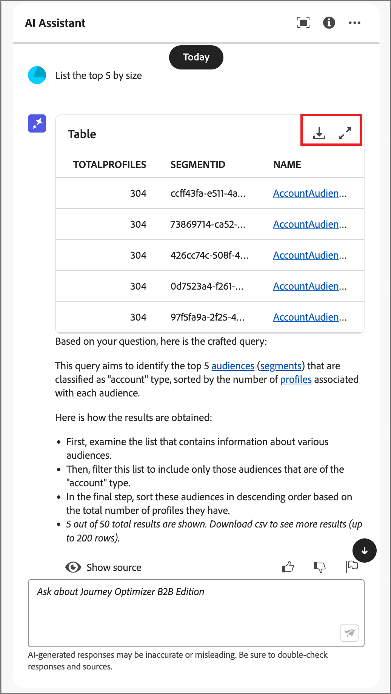

# 在Journey Optimizer B2B edition中使用AI助手

在Journey Optimizer B2B edition中，AI Assistant是一项用户界面功能，可用于了解产品概念、快速导航和了解产品功能，以及获得对环境的操作见解。 Adobe Experience Cloud的多个产品中也提供了此功能。

>[!IMPORTANT]
>
>在使用AI助手之前，需要先签署Adobe Experience Cloud创作AI用户指南协议。 有关此协议和使用准则的更多信息，请参阅[Adobe Experience Cloud Generative AI用户准则](https://www.adobe.com/cn/legal/licenses-terms/adobe-dx-gen-ai-user-guidelines.html)。

要访问AI助手，请单击标题中的图标。 AI助手将在右侧的面板中打开。

{width="420"}

此时将显示AI Assistant界面，它立即为您提供开始使用的信息。 您可以使用&#x200B;_构思下提供的选项开始_&#x200B;并回答问题和命令，例如：

* 发布了哪些历程？
* 产生了哪些解决方案兴趣？
* 告诉我Journey Optimizer B2B edition的主要优势。

在Adobe Journey Optimizer B2B edition中，AI Assistant支持以下用例：

## 提出产品知识问题

产品知识问题涉及Journey Optimizer B2B edition概念和操作方法信息。 产品知识问题的一些示例包括：

* 如何设置短信提供商帐户？
* 如何在历程中发送电子邮件？
* 如何个性化我的电子邮件内容？

要询问产品问题，请在面板底部的字段中输入该问题并按Enter键。 例如，当您需要了解如何在历程中使用购买群组时。 在这种情况下，请输入&#x200B;_如何在历程中使用购买组？_&#x200B;在您提交问题后，AI Assistant会查询其知识库并在几秒钟内编译答案。

{width="420"}

+++查看示例答案

{width="420"}

+++

## 提出操作见解问题

运营见解问题与组织沙盒中的历程对象有关。 您可以询问有关操作对象的问题，如帐户受众、帐户历程、解决方案兴趣和购买群组模板。 操作分析问题或提示的一些示例包括：

* Adobe Journey Optimizer B2B edition中有多少实时历程？
* 给我所有计划历程的列表
* 过去7天内创建了多少历程？

您必须处于AI助手的活动沙盒中，才能对关于您的操作见解的问题提供充分响应。

>[!NOTE]
>
>AI Assistant操作分析问题支持的唯一Adobe Journey Optimizer B2B edition对象在[操作分析域表](./ai-assistant-overview.md#operational-insights)中列出。 它只能访问您当前所在沙盒的数据。

要提出操作见解问题，请在面板底部的字段中输入该问题，然后按Enter键。 例如，当您想要了解沙盒的受众时。 在这种情况下，请输入&#x200B;_有多少受众？_。  AI Assistant提供沙盒中的受众计数以及它如何计算答案的说明。 在以下示例响应中，AI Assistant提供了一个用于访问UI中受众的链接，并概述了识别受众数量所执行的步骤。

{width="420"}

您可以按照初始查询要求列出工件，例如&#x200B;_按大小列出前5项_。 AI Assistant返回一个表，其中包含查询中排名前五的项及其对应的ID。 单击&#x200B;_下载_ （ ）图标以将表下载为CSV文件。

实时历程列表的{width="420"}

要在AI助手中查看整个表，请单击&#x200B;_最大化_ （ ）图标。 在扩展的表视图中，单击&#x200B;**[!UICONTROL 下载CSV]**&#x200B;以将信息保存为CSV文件。

实时历程列表的{width="600" zoomable="yes"}

## 验证响应

AI Assistant包括可用于验证和验证响应的工具。

### 产品知识源

收到产品问题的响应后，选择&#x200B;**[!UICONTROL 显示源]**&#x200B;以查看用于生成AI助手响应的产品知识源引文。

AI Assistant提供可证实初始响应的文档的链接。 它还向响应添加脚注，以指示响应的特定部分，其中引用了链接的文档源。

{width="420"}

### 操作见解源

收到操作分析问题的响应后，单击&#x200B;**[!UICONTROL 显示源]**，然后选择&#x200B;**[!UICONTROL 查看源查询]**。

您可以使用AI Assistant提供的SQL查询验证与操作分析问题相关的每个响应。 当询问操作见解问题时，AI Assistant会提供一个SQL查询，您可以使用它来验证计算答案所花费的过程。 此源查询仅用于验证目的，在查询服务上不受支持。

{width="550" zoomable="yes"}

## 提供反馈

使用&#x200B;_缩略图向上_ （ ）或&#x200B;_缩略图向下_ （ ）图标对响应的实用性和质量进行评级。 根据您的经验填写简短的调查表，然后单击&#x200B;**[!UICONTROL 提交]**。 您提供的信息用于改进AI助手。

如果您发现响应中有问题，请单击&#x200B;_标记_ （  ）图标。 使用表单描述问题，然后单击&#x200B;**[!UICONTROL 提交]**&#x200B;报告问题。

{width="420"}

+++查看表单

>[!BEGINTABS]

>[!TAB 竖起缩略图]

{width="600" zoomable="yes"}

>[!TAB 缩略图已关闭]

{width="600" zoomable="yes"}

>[!TAB 标志]

{width="600" zoomable="yes"}

>[!ENDTABS]

+++
