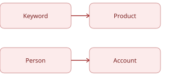

# 意图分数 {#intent-scores}

意图得分测量人员或帐户对关键字、产品或产品类别的兴趣。 Adobe Journey Optimizer B2B edition使用机器学习来计算得分，机器学习衡量的是含义上的相似性，而不是手动规则或定点系统。 每个分数都从0标准化为1，数字越大，意向越强烈。

内容相关性大约每12小时刷新一次，意图得分每天重新计算。 分数从关键字汇总到产品，从人员汇总到帐户。 意图得分显示在[智能仪表板](../dashboards/intelligent-dashboard.md)中，并显示在[帐户详细信息](../accounts/account-details.md)、[_购买群组详细信息_&#x200B;页](../buying-groups/buying-group-details.md)和[个人详细信息](../accounts/person-details.md)页中。

{width="700" zoomable="yes"}

以下部分说明了意图评分背后的核心概念、使得分保持最新的连续过程、每个得分背后的计算逻辑，以及您可以配置的设置。

## 核心概念 {#core-concepts}

意图检测会测量人员与您的产品和关键词的互动密切程度，然后按人员参与量对该相似度进行加权。 此模型由三个实体组成。

| 实体 | 描述 |
|--------|--------------|
| 人员 | 随着时间的推移，通过打开电子邮件、访问网页和参与来与您的内容进行交互的个人。 |
| 内容 | 用户参与的电子邮件和网页。 随着时间的推移，还会添加其他格式，例如网络研讨会和营销活动。 |
| 分类 | 表示要测量的兴趣的关键字、产品和产品类别的结构。 |

### 默认分类和更新 {#taxonomy}

您的分类，即针对其进行测量的关键字、产品和类别，无需设置即可使用。

您可以随时在&#x200B;_[!UICONTROL 意图映射]_&#x200B;页面上查看和更新分类映射。 有关分类设置过程，请参阅[意图数据](../admin/intent-data.md)。

### 内容相关性 {#content-relevance}

Journey Optimizer B2B edition将内容和分类法转换为其含义的数学表示形式，然后使用相似性模型来衡量它们之间的匹配程度。 与关键词或产品几乎匹配的内容会获得较高的相关性分数。 不相关的内容会获得较低的得分。

相似度模型是采用一般语言预先训练的，因此无需进行针对特定客户的训练。

## 评分过程 {#scoring-process}

连续的过程将原始参与转化为完成的意图分数。 每个阶段都基于上一个阶段生成的内容。

{width="700"}

### 参与捕获 {#engagement-capture}

捕获人员拥有的每个有意义的接触点，并将其关联到所涉及的内容。

* 页面访问次数、电子邮件打开次数和点击次数、表单提交次数和类似活动均记录为参与事件。
* 每段独特的内容也都会被记录，以便在下一阶段进行分析。
* **刷新节奏** — 连续，当参与发生时。

### 内容提取 {#content-extraction}

在对内容进行相关性评分之前，Journey Optimizer B2B edition会先提取并读取其文本。

* 对于每个新内容，系统都会提取底层文本，无论其位于网页上还是电子邮件中。
* 某些活动类型（如表单填充）已具有其自己的描述性内容，因而跳过此步骤。
* 以后将记录并排除无法检索的内容，例如断开或删除的链接。
* **刷新节奏** — 发现新内容时。

### 相关性评分 {#relevance-scoring}

每项资产都根据您的分类进行衡量，与参与该分类的人员无关。

* 使用相似度模型，根据您的关键词、产品和类别，分析和比较每个电子邮件和网页。
* 结果是该资产相对于每个相关关键词或产品的相关性得分介于0和1之间。
* **刷新节奏** — 每12小时刷新一次。

### 每日意图计算 {#daily-intent-calculation}

参与和内容相关性合并为每个人员、每个关键词或产品一个每日意图分数。

* 每种活动类型都带有一个可配置的权重。 例如，表单提交的次数可能比页面查看次数严重得多。
* 近期活动比旧活动更重要，因此得分更偏向于某人本周的表现，而不是一个月前的表现。
* 置信度指标反映了一个人的参与有多一致，而不仅仅是数量。
* **刷新节奏** — 每天。

### 得分传递 {#score-delivery}

每日分数总计、接收意图级别并交付到您的仪表板。

* 每个得分都标记为意图级别“高”、“Medium”或“低”。
* 得分链接到正确的帐户，以便销售和营销团队可以同时看到人员级别和帐户级别的意图。
* 只有意图级别发生更改的人员才会更新，因此仪表板会反映最新的有意义的转变。
* **刷新节奏** — 每天。

## 得分计算逻辑 {#score-calculation-logic}

该计算由五个层组成，每个层向原始相关性和参与数据添加更多上下文。

### 内容与主题的相关性 {#relevance-to-topic}

每一条内容和每个主题，即关键字、产品或类别，都会被翻译成其含义的数学表示形式。 与主题具有类似含义的内容在这种表示法中比较靠近。 相关性是衡量有无意义的亲密程度的指标，而不是准确的词语匹配。

### 每日参与权重 {#engagement-weighting}

在给定的某一天，个人的得分是他们参与的所有活动的相关性的加权平均值。 价值较高的活动更多。

>[!BEGINSHADEBOX “示例”]

一个人在同一天内处理三段内容。 页面查看权重为1，表单提交权重为5。

由于他们提交的一个表单数是页面查看次数的五倍，因此即使他们总共与三个项目交互，也会显着影响他们的每日得分。

他们由此得出的该主题的每日得分约为0.70（0到1分）。

>[!ENDSHADEBOX]

### 回访间隔衰减 {#recency-decay}

一个人的分数反映了过去几天的混合，近期活动的权重比早期活动大得多。 大约一周后，旧活动的影响会最小，因此得分始终反映当前的兴趣。 实际上，今天的访问量超过了昨天的访问量，也超过了10天前的访问量。

### 得分标准化和意图级别 {#normalization-intent-levels}

将每个调整后的得分置于与实例中其他人相对的0到1级的一致比例上，然后分段到目的级别。

| 最终得分 | 意图级别 |
|-------------|--------------|
| 高于0.6 | 高 |
| 0.2 - 0.6 | 媒介 |
| 低于0.2 | 低 |

### 得分汇总 {#score-aggregation}

单个分数的总和使您能够在对决策至关重要的级别查看意图，而不仅仅是在最精细的级别。

* **从关键字到产品** — 在关键字级别计算出的分数汇总起来显示对产品的兴趣，而不仅仅是单个搜索词。
* **客户经理** — 客户得分汇总了客户经理的所有人员得分，以便您了解整个购买小组何时展现意图。

{width="500"}

使用产品级别的视图可以查看整体上哪些产品引起了人们的兴趣，而不是哪些单个关键字是趋势所在。 使用帐户级别视图可以查看整个购买集团何时一起表现出兴趣增加，而不是对单个参与人员做出反应。

## 可配置的设置 {#configurable-settings}

大多数评分逻辑是固定的，以保持结果随时间推移而变得可靠和可比较。 产品管理员可以自定义两个设置以满足您的要求：

* **活动权重** — 若要对意图得分应用更大的影响，请增加高价值活动的权重，例如演示请求或定价页面访问。 要完全排除某个活动，请将其权重设置为零，这对于取消订阅等不会有助于实现意图的操作非常有用。 意图计算的活动权重使用的加权模型也驱动[参与度分数](../buying-groups/engagement-scores.md)。 请参阅&#x200B;[_配置参与度得分权重_](../admin/engagement-score-weighting.md)&#x200B;以更改活动权重。

* **分类映射** — 评分所基于的关键字、产品和类别可供使用。 随时在&#x200B;_[!UICONTROL 意图映射]_&#x200B;页面上查看和更新它们。 有关设置过程，请参阅&#x200B;[_意图数据_](../admin/intent-data.md)。

所有其他内容（包括内容相关性、活动衰减以及&#x200B;_高_、_Medium_&#x200B;和&#x200B;_低_&#x200B;阈值）均已固定，因此分数会随着时间的推移保持一致和可比。

## 评分原则 {#scoring-principles}

在审查和处理意图分数时，请牢记以下原则。

### 模型驱动型评分 {#model-driven}

没有要维护的点分配或关键字规则。 该模型可直接从您的内容和分类中学习相关性，从而随着内容库的增长和更改而保持评分的一致性，无需持续进行配置。

### 相对评分 {#relative-scoring}

得分反映了一个人或帐户在您当前其他联系人中的排名，系统会根据当前人口每天重新计算该得分。 使用分数来比较您自己的实例中的人员和帐户，而不是作为固定的通用数字。 得分不能直接在公司之间进行比较。

### 数据新鲜度 {#data-freshness}

当新内容出现时，内容相关性大约每12小时刷新一次。 意图得分每天重新计算一次，因此仪表板反映每天早上前一天的活动。
