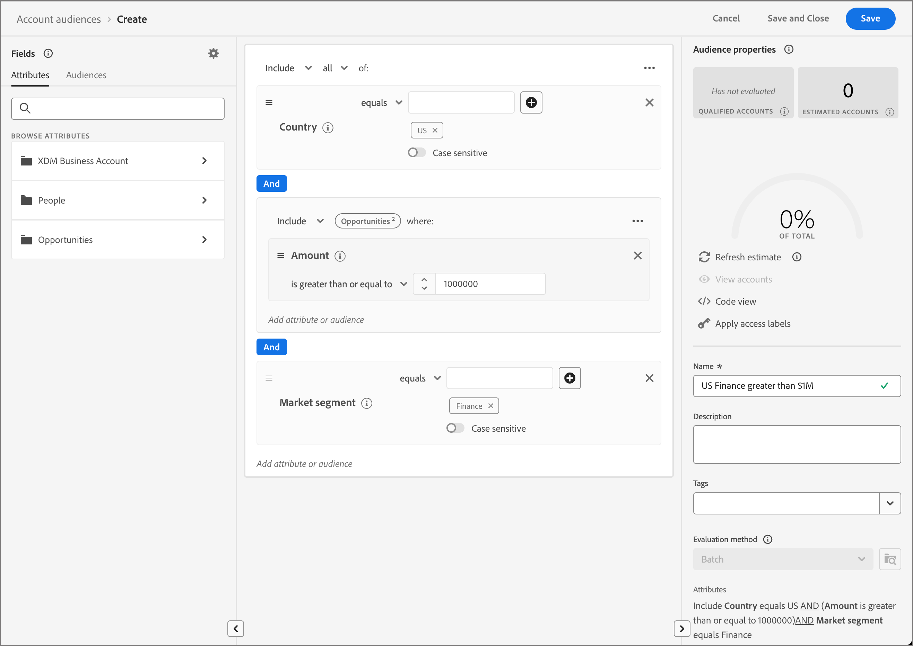

# 帐户受众

受众是指一组具有相似行为和/或特征的人员。 Journey Optimizer B2B版本使用Adobe Real-time Customer Data Platform B2B和B2P版本中的帐户分段功能。 通过帐户分段，用户可以利用来自系统内任何B2B实体的数据来生成帐户受众。 这些帐户受众可作为Journey Optimizer B2B版本帐户历程的输入，促进无缝激活和个性化功能。

在[Adobe Experience Platform Segmentation Service文档](https://experienceleague.adobe.com/en/docs/experience-platform/segmentation/ui/account-audiences)中了解有关帐户受众以及如何定义这些受众的更多信息。

## 帐户受众工作流程

您可以将Journey Optimizer B2B版本视为不显示在目标目录中的Experience Platform(AEP)目标。 使用以下步骤将帐户受众激活到Journey Optimizer B2B版本：

1. 在AEP中为数据创建架构。
1. 将数据摄取到AEP。
1. 创建帐户区段以评估数据。
1. 将评估的数据激活到Journey Optimizer B2B版本。

在Journey Optimizer B2B版本中，帐户受众用作基于帐户的历程的输入，允许您定位这些帐户中的人员。 例如，您可以使用帐户受众检索所有帐户的记录，这些帐户不具有标题为“首席运营官(COO)”或“首席营销官(CMO)”的任何人员的联系信息。

Journey Optimizer B2B版本允许您直接从左侧导航构建Adobe Experience Platform (AEP)帐户受众，并将它们合并到您的帐户历程中。

{width="800" zoomable="yes"}

## 创建帐户受众

通过创建帐户分段来定义帐户受众。 您可以选择直接在Journey Optimizer B2B版本应用程序中创建帐户分段，也可以使用[区段生成器UI](https://experienceleague.adobe.com/en/docs/experience-platform/segmentation/ui/segment-builder)。 以下是可用于在Journey Optimizer B2B版本中创建帐户分段的步骤。

1. 在左侧导航中，选择&#x200B;**[!UICONTROL 帐户]** > **[!UICONTROL 受众]**。

1. 单击右上方的&#x200B;**[!UICONTROL 创建受众]**。

1. 生成区段定义。

   帐户属性和受众将显示在左侧导航栏中。 在&#x200B;_[!UICONTROL 属性]_&#x200B;选项卡下，您可以添加Platform创建和自定义属性。 拖动每个属性以构建区段的逻辑。

   >[!TIP]
   >
   >创建帐户受众时，请注意&#x200B;_[!UICONTROL 人员]_&#x200B;下列出了事件，因为这些属性与人员相关联。 
   >
   >在&#x200B;_[!UICONTROL 受众]_&#x200B;选项卡下，您可以添加之前创建的基于人员的受众，以便在创建您自己的帐户受众时构建。

   以下示例定义了使用`Country Code`、`Revenue Amount`和`Market segment`创建的受众。 英文问答是：“我想了解美国所有收入超过100万美元的Finance Segment客户。”

   {width="700" zoomable="yes"}

1. 单击右上方的&#x200B;**[!UICONTROL 保存并关闭]**。

要激活Journey Optimizer B2B版本的帐户受众，您必须[将其添加到帐户历程](../journeys/journey-overview.md#add-the-account-audience-for-your-journey)和[发布历程](../journeys/journey-overview.md)。
