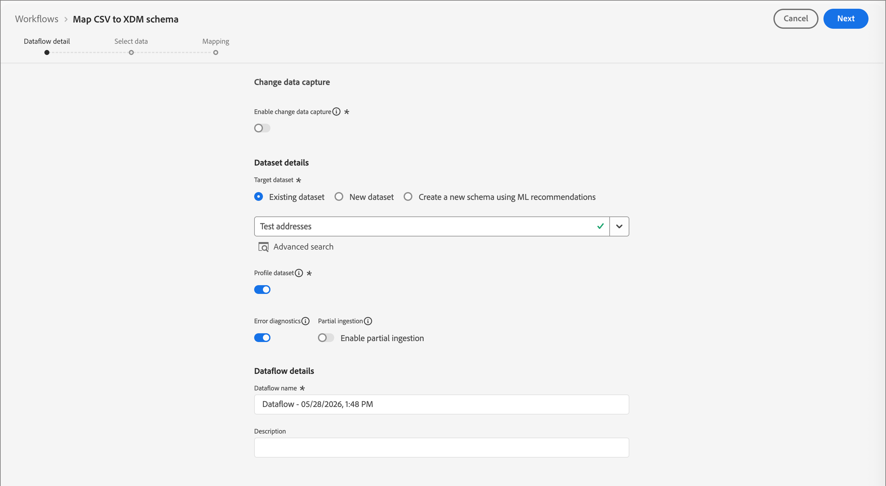
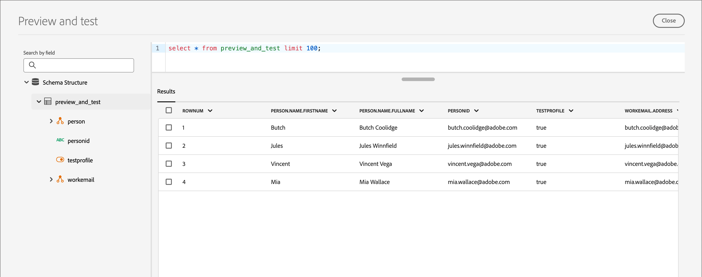

# 测试用户档案 {#test-profiles}

在Journey Optimizer B2B edition中[预览和测试登陆页面内容](../content/landing-pages-create-publish.md#test-landing-page)需要测试配置文件。 您可以通过创建架构、创建数据集并上传CSV文件来定义一组测试用户档案。

<!--
>[!NOTE]
>
>[!DNL Journey Optimizer B2B Edition] allows testing different variants of your content by previewing it and sending proofs using sample input data uploaded from a CSV or JSON file, or added manually. 
-->

创建测试配置文件与在[!DNL Adobe Experience Platform]中创建常规配置文件类似。 有关详细信息，请参阅[实时客户资料文档](https://experienceleague.adobe.com/docs/experience-platform/profile/home.html?lang=zh-Hans){target="_blank"}。


## 创建架构 {#create-schema}

要创建配置文件，您首先需要在[!DNL Journey Optimizer B2B Edition]中创建架构。

1. 展开左侧导航栏中的&#x200B;**[!UICONTROL 数据管理]**，选择&#x200B;**[!UICONTROL 架构]**，然后单击右上方的&#x200B;**[!UICONTROL 创建架构]**。

   {width="800" zoomable="yes"}

1. 选择&#x200B;**[!UICONTROL Standard]**&#x200B;作为架构创建选项。

1. 选择架构类型，例如&#x200B;**[!UICONTROL 手动]**，然后单击&#x200B;**[!UICONTROL 选择]**。

   {width="500"}

1. 选择架构类型，例如&#x200B;**[!UICONTROL 个人资料]**，然后单击&#x200B;**[!UICONTROL 下一步]**。

   {width="700" zoomable="yes"}

1. 输入架构的名称（必需）和描述（可选），然后单击&#x200B;**[!UICONTROL 完成]**。

   {width="700" zoomable="yes"}

   将显示架构结构，左侧为&#x200B;_[!UICONTROL 合成]_&#x200B;面板。

1. 在&#x200B;**[!UICONTROL 字段组]**&#x200B;部分中，单击&#x200B;**[!UICONTROL 添加]**&#x200B;并选择适当的字段组。

   使用搜索工具查找并选择&#x200B;**[!UICONTROL 配置文件测试详细信息]**&#x200B;字段组。

   {width="700" zoomable="yes"}

   完成后，单击&#x200B;**[!UICONTROL 添加字段组]**，架构概述屏幕上将显示字段组列表。

   重复此步骤以添加要用于测试用户档案的其他字段组，如&#x200B;**[!UICONTROL 人员联系人详细信息]**&#x200B;和&#x200B;**[!UICONTROL 工作联系人详细信息]**。

1. 在字段列表中，单击要定义为主标识的字段。

1. 在&#x200B;_[!UICONTROL 字段属性]_&#x200B;右侧窗格中，检查&#x200B;**[!UICONTROL 标识]**&#x200B;和&#x200B;**[!UICONTROL 主标识]**&#x200B;选项并选择命名空间。

   如果希望主标识是电子邮件地址，请选择&#x200B;**[!UICONTROL 电子邮件]**&#x200B;命名空间。

   {width="700" zoomable="yes"}

   单击&#x200B;**[!UICONTROL 应用]**。

1. 选择架构并在&#x200B;**[!UICONTROL 架构属性]**&#x200B;窗格中启用&#x200B;**[!UICONTROL 配置文件]**&#x200B;选项。

   {width="700" zoomable="yes"}

1. 单击&#x200B;**[!UICONTROL 保存]**。

有关架构创建的更多信息，请参阅[XDM文档](https://experienceleague.adobe.com/docs/experience-platform/xdm/ui/resources/schemas.html#prerequisites){target="_blank"}。

>[!IMPORTANT]
>
>创建或替换测试配置文件摄取的数据集时，请确保架构将正确的身份描述符应用于目标命名空间的主身份字段(`/personID`)。 如果标识描述符缺失或配置不正确，则即使摄取过程成功完成，摄取到此数据集的配置文件也可能不会标记为测试配置文件(`testProfile = true`)。
>
>如果您的测试配置文件在摄取后未正确标记：
>
>1. 查看与数据集关联的架构。
>1. 确认主身份字段具有适用于您的命名空间的正确身份描述符。
>1. 如果缺少描述符，请更新架构以添加身份描述符并重新摄取数据。

## 创建数据集 {#create-dataset}

创建架构后，创建用于导入用户档案的数据集。 有关数据集创建的更多信息，请参阅[目录服务文档](https://experienceleague.adobe.com/docs/experience-platform/catalog/datasets/user-guide.html#getting-started){target="_blank"}。

1. 在左侧导航栏中的&#x200B;_[!UICONTROL 数据管理]_&#x200B;下，选择&#x200B;**[!UICONTROL 数据集]**。

1. 单击右上角的&#x200B;**[!UICONTROL 创建数据集]**。

   {width="800" zoomable="yes"}

1. 选择&#x200B;**[!UICONTROL 从架构]**&#x200B;创建数据集。

   {width="500"}

1. 选择以前创建的架构并单击&#x200B;**[!UICONTROL 下一步]**。

1. 选择名称，然后单击&#x200B;**[!UICONTROL 完成]**。

   {width="700" zoomable="yes"}

1. 在右侧面板中，启用&#x200B;**[!UICONTROL 配置文件]**&#x200B;选项。

## 使用CSV文件创建测试配置文件 {#create-test-profiles-csv}

在[!DNL Adobe Experience Platform]中，您可以通过将包含不同配置文件字段的CSV文件上传到数据集来创建配置文件。 这是最简单的方法。

1. 使用电子表格软件创建一个简单的CSV文件。

1. 为每个必填字段添加一列。

   确保添加主标识字段（例如`personID`），并将`testProfile`字段设置为`true`。

1. 为每个用户档案添加一行，并为每个字段添加值。

   包含示例测试配置文件数据的{width="600" zoomable="yes"}

1. 将电子表格另存为csv文件，并确保使用逗号作为分隔符。

1. 在[!DNL Adobe Experience Platform]中，导航到&#x200B;**[!UICONTROL 工作流]**。

1. 选择&#x200B;**[!UICONTROL 将CSV映射到XDM架构]**，然后单击&#x200B;**[!UICONTROL 启动]**。

   {width="800" zoomable="yes"}

1. 选择要用于导入的数据集，然后单击&#x200B;**[!UICONTROL 下一步]**。

   用于CSV导入的{width="700" zoomable="yes"}

1. 单击&#x200B;**[!UICONTROL 选择文件]**&#x200B;并选择CSV文件，或者从系统中拖放该文件。

   文件上传完成后，单击&#x200B;**[!UICONTROL 下一步]**。

   {width="700" zoomable="yes"}

1. 将源csv字段映射到架构字段，然后单击&#x200B;**[!UICONTROL 完成]**。

   {width="700" zoomable="yes"}

   数据导入开始。 状态从&#x200B;_正在处理_&#x200B;移至&#x200B;_成功_。

1. 单击右上角的&#x200B;**[!UICONTROL 预览数据集]**&#x200B;并检查添加到数据集的测试用户档案是否正确。

   {width="700" zoomable="yes"}

   然后，可以使用测试配置文件来[测试登陆页面内容](../content/landing-pages-create-publish.md#test-landing-page)。

>[!NOTE]
>
>有关CSV数据导入的更多信息，请参阅[数据摄取文档](https://experienceleague.adobe.com/docs/experience-platform/ingestion/tutorials/map-a-csv-file.html#tutorials){target="_blank"}。

<!--
## Create test profiles using API calls {#create-test-profiles-api}

You can also create test profiles via API calls. Learn more in [[!DNL Adobe Experience Platform] documentation](https://experienceleague.adobe.com/docs/experience-platform/profile/home.html){target="_blank"}.

You must use a Profile schema that contains the **[!UICONTROL Profile test details]** field group. The `testProfile` flag is part of this field group.
When creating a profile, make sure you pass the value: `testProfile = true`.

You can also update an existing profile to change its `testProfile` flag to `true`.

Here is an example of an API call to create a test profile:

```bash
curl -X POST \
'https://dcs.adobedc.net/collection/xxxxxxxxxxxxxx' \
-H 'Cache-Control: no-cache' \
-H 'Content-Type: application/json' \
-H 'Postman-Token: xxxxx' \
-H 'cache-control: no-cache' \
-H 'x-api-key: xxxxx' \
-H 'x-gw-ims-org-id: xxxxx' \
-d '{
"header": {
"msgType": "xdmEntityCreate",
"msgId": "xxxxx",
"msgVersion": "xxxxx",
"xactionid":"xxxxx",
"datasetId": "xxxxx",
"imsOrgId": "xxxxx",
"source": {
"name": "Postman"
},
"schemaRef": {
"id": "https://example.adobe.com/mobile/schemas/xxxxx",
"contentType": "application/vnd.adobe.xed-full+json;version=1"
}
},
"body": {
"xdmMeta": {
"schemaRef": {
"contentType": "application/vnd.adobe.xed-full+json;version=1"
}
},
"xdmEntity": {
"_id": "xxxxx",
"_mobile":{
"ECID": "xxxxx"
},
"testProfile":true
}
}
}'
```
-->
