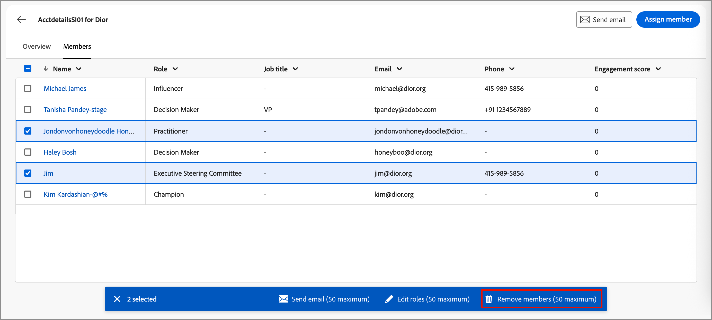

# 购买群组详细信息

在Journey Optimizer B2B edition的任何位置单击购买组名称时，都会显示购买组详细信息。 此概述提供了有关购买组的有用信息，包括创作AI摘要。 还有可为与该帐户关联的联系人执行的[操作](#buying-group-actions)。

{width="800" zoomable="yes"}

使用&#x200B;**[!UICONTROL 概述]**&#x200B;选项卡查看有关帐户的信息，使用&#x200B;**[!UICONTROL 成员]**&#x200B;选项卡访问购买组成员列表。

## Overview 选项卡

“概述”选项卡包含三个主要部分：

### 购买团体摘要

{zoomable="yes"}

购买群组摘要部分包括以下购买群组信息：

* 购买群组名称
* 帐户名称（单击该名称可打开[帐户详细信息](../accounts/account-details.md)）
* 购买组中的成员数
* 参与度评分
* 完整性评分
* 当前购买组阶段
* 角色模板（单击名称以打开[角色模板](buying-groups-role-templates.md#access-and-browse-role-templates)）
* 上次修改/更新日期
* 购买组的创作AI摘要

### 帐户概述

{zoomable="yes"}

帐户概述部分包含以下帐户信息：

* 帐户名称（单击该名称可打开帐户详细信息）
* 帐户中的人数
* 行业
* 打开机会
* 帐户当前正在使用的最新三个帐户历程（单击名称以打开历程详细信息）
* 帐户的创作AI摘要

### 意图数据

在Journey Optimizer B2B edition中，意图检测模型根据购买小组成员的活动，预测具有足够高置信度的感兴趣解决方案/产品。 购买集团成员的意图可以解释为对产品感兴趣的可能性。

{{intent-data-note}}

{width="700" zoomable="yes"}

* 意图级别
* 意图信号类型 — 关键字、产品和解决方案

### 购买群组成员

{width="800" zoomable="yes"}

_[!UICONTROL 购买群成员]_&#x200B;部分显示两个突出显示购买群成员的行：

* **[!UICONTROL 决策者]** — 根据人员参与度得分排名前三的决策者
* **[!UICONTROL 参与次数最多的成员]** — 根据人员参与得分的其他参与次数最多的成员

每个成员卡都包含以下详细信息：

* 名称
* 标题
* 角色
* 商机参与度分数

单击&#x200B;**[!UICONTROL 查看详细信息]**&#x200B;可访问以下成员信息：

* 创作AI摘要
* 上一个有趣的时刻
* 最近活动（两个）
* 潜在客户所属的其他购买组（根据最近添加的数据，仅限于三个购买组）。
* 电子邮件地址
* 电话号码

{width="600" zoomable="yes"}

## “成员”选项卡

选择&#x200B;**[!UICONTROL 成员]**&#x200B;选项卡以查看所有购买组成员列表。 每个成员列表包括姓名、角色、职务、电子邮件地址、电话号码和来源。

{width="700" zoomable="yes"}

您可以从&#x200B;_成员_&#x200B;选项卡执行多个操作：

### 分配新成员

一个帐户可以有一个或多个与其关联的购买组，并且购买组成员通常是该帐户中联系人的子集。 您可以手动将关联帐户中的任何联系人添加到购买组。

1. 单击右上方的&#x200B;**[!UICONTROL 分配新成员]**。

1. 在&#x200B;_[!UICONTROL 分配成员]_&#x200B;对话框中，选择要添加到购买群组的帐户潜在客户，然后单击&#x200B;**[!UICONTROL 下一步]**。

   {width="700" zoomable="yes"}

1. 在&#x200B;_[!UICONTROL 编辑新成员角色]_&#x200B;对话框中，选择要分配给每个新成员的角色。

   {width="700" zoomable="yes"}

1. 单击&#x200B;**[!UICONTROL 保存]**。

### 删除成员

您可以从购买组中删除一个或多个选定的成员（一次最多50个）。

1. 选中要删除的成员对应的复选框。

1. 在底部的选择栏中，单击&#x200B;**[!UICONTROL 删除成员]**。

   {width="700" zoomable="yes"}

1. 在确认对话框中，单击&#x200B;**[!UICONTROL 删除]**。

### 编辑角色

您可以更改购买组的一个或多个选定成员（一次最多50个）的角色。

1. 选中要更改角色的成员的复选框。

1. 在底部的选择栏中，单击&#x200B;**[!UICONTROL 编辑角色]**。

   {width="700" zoomable="yes"}

1. 在&#x200B;_[!UICONTROL 编辑成员角色]_&#x200B;对话框中，选择要分配给每个成员的角色。

   {width="700" zoomable="yes"}

1. 单击&#x200B;**[!UICONTROL 保存]**。

### 发送电子邮件

您可以向购买群组的一个或多个选定成员（一次最多50个）发送营销人员批准的电子邮件。 可用电子邮件的列表仅限于来自连接的Marketo Engage实例的已批准电子邮件。

1. 选中要接收电子邮件的成员的复选框。

1. 单击右上角或底部选择栏中的&#x200B;**[!UICONTROL 发送电子邮件]**。

   {width="700" zoomable="yes"}

1. 在&#x200B;_[!UICONTROL 发送电子邮件]_&#x200B;对话框中，选择Marketo Engage工作区，然后选中要发送的电子邮件的复选框。

   {width="700" zoomable="yes"}

1. 单击&#x200B;**[!UICONTROL 发送]**。
