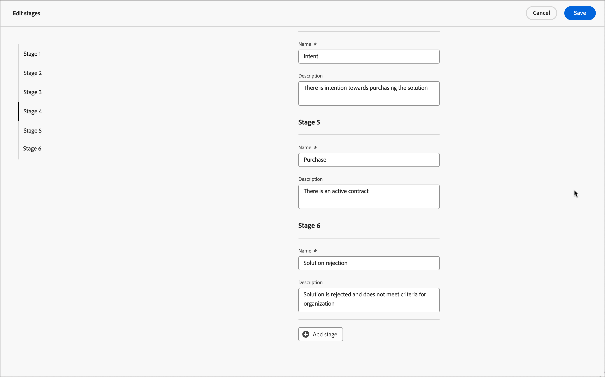

# 购买群组阶段

购买组阶段旨在跟踪购买组在将机会转化为客户方面的进度。 使用此功能跟踪购买团体进度，并确定适合购买团体成员的下一个最佳操作。

在单个分段模型中定义阶段，定义多个阶段以及它们之间的转换流。 一个或多个阶段被指定进入生命周期。 模型还允许非线性渐变，在其中可以指定从一个阶段到另一个阶段的过渡，例如从阶段A到阶段B、C或D。要求将一个阶段指定为成功阶段，例如购买或签署合同。 可选地将另一个阶段指定为失败阶段，例如被拒绝的合同或从另一个供应商处购买竞争解决方案。 这是通过[智能仪表板](../dashboards/intelligent-dashboard.md)实现的，该仪表板可显示购买组在完成销售机会或将机会转化为客户方面的进展情况。

{width="800" zoomable="yes"}

{width="30"} [观看视频概述](#overview-video)

## 定义购买组阶段模型

您可以通过以下方式创建和配置购买组阶段模型：

* 添加生命周期阶段
* 定义过渡流
* 指定登入阶段和目标阶段

仅支持一个模型，因此重要的是在您的营销和销售团队之间合作，以便在Journey Optimizer B2B edition中创建和发布模型之前为组织规划最佳模型。<!-- Initially, only one stage model can be created, but future releases will support multiple stage models, allowing users to select which model to use in a journey. -->

创建购买组阶段模型时，该模型会自动处于&#x200B;_草稿_&#x200B;状态，不能删除或重新命名。 当您定义阶段并配置阶段之间的转换流时，它仍保持此状态。 当模型处于已发布（_实时_）状态时，无法对其进行更改。

### 创建模型

1. 在左侧导航中，转到&#x200B;**[!UICONTROL 帐户]** > **[!UICONTROL 购买群组]**。

1. 在“购买组”页面中，选择&#x200B;**[!UICONTROL 阶段]**&#x200B;选项卡。

   {width="800" zoomable="yes"}

   此&#x200B;_[!UICONTROL 阶段]_&#x200B;选项卡处于&#x200B;_空_&#x200B;状态，直到您创建模型为止。

1. 单击页面中心的&#x200B;**[!UICONTROL 创建模型]**。

1. 在对话框中，输入模型的&#x200B;**[!UICONTROL Name]**（必需）和&#x200B;**[!UICONTROL Description]**（可选）。

   {width="700" zoomable="yes"}

   如果在此对话框中单击&#x200B;_[!UICONTROL 取消]_，则将返回到&#x200B;_空_&#x200B;状态的&#x200B;_[!UICONTROL 阶段]_&#x200B;选项卡。

1. 单击&#x200B;**[!UICONTROL 创建]**。

### 定义阶段

创建模型后，将在工作区中打开该模型，并提示您创建模型的阶段。

1. 单击&#x200B;**[!UICONTROL 编辑阶段]**。

   {width="700" zoomable="yes"}

1. 通过输入&#x200B;**[!UICONTROL Name]**（必需）和&#x200B;**[!UICONTROL Description]**（可选）来定义第一个阶段。

   {width="700" zoomable="yes"}

   不必按特定顺序添加阶段，但可以确定在模型详细信息页面中如何列出阶段。 在定义过渡规则时，可以指定入口阶段和阶段之间的流。

1. 单击&#x200B;**[!UICONTROL 添加阶段]**&#x200B;并重复步骤2以定义另一个阶段。

   重复此步骤，直到拥有模型所需的阶段。

   为模型{width="700" zoomable="yes"}定义的阶段

1. 如果您对已定义的阶段感到满意，请单击&#x200B;**[!UICONTROL 保存]**。

   >[!IMPORTANT]
   >
   >**保存购买组阶段后，无法将其删除。**&#x200B;但是，只要模型仍处于&#x200B;_草稿_&#x200B;状态，您就可以更改任何阶段的名称和描述。

### 配置工作流和过渡规则

保存阶段后，它将返回到模型工作区。 _[!UICONTROL 允许传输到]_&#x200B;列为空，这表示尚未定义模型阶段的过渡规则。

{width="700" zoomable="yes"}

过渡规则确定购买组如何从一个阶段转移到另一个阶段。 例如，它可以从登入阶段移动到中间阶段，并从中间阶段移动到各种其他阶段。 进入阶段是购买组可以从空白状态进入的初始阶段，目标阶段被分类为成功或失败阶段。

1. 单击右上方的&#x200B;**[!UICONTROL 编辑过渡规则]**。

   此操作将打开&#x200B;_[!UICONTROL 编辑阶段规则]_&#x200B;对话框，您可以在其中定义流的逻辑。

   在设置选项时，有一些内置的护栏和消息传送可帮助您避免在流程中发生逻辑错误。 您可以单击&#x200B;_[!UICONTROL 取消]_&#x200B;关闭对话框并返回&#x200B;_[!UICONTROL 阶段]_&#x200B;选项卡页，而不进行任何更改。

1. 在&#x200B;_[!UICONTROL 选择阶段]_&#x200B;部分中，指定流的开始阶段和结束阶段：

   * **[!UICONTROL 进入点阶段]** （必需） — 为购买组商机指定一个或多个进入阶段。

   * **[!UICONTROL 成功阶段]**（必需） — 指定指示购买组机会成功的阶段（目标）。

   * **[!UICONTROL 失败阶段]**（可选） — 指定一个或多个阶段，指示购买组商机已到达失败点（目标）。

   {width="700" zoomable="yes"}

1. 对于每个非目标阶段，定义流中下一个出现的一个或多个阶段（过渡）。

   所有非目标阶段必须至少选择一个&#x200B;**[!UICONTROL 允许传输到]**&#x200B;阶段。 否则，模型逻辑无效，帐户可能会在该阶段陷入&#x200B;_停滞_，无法进入成功或失败状态。

   {width="700" zoomable="yes"}

   您可以选择从失败阶段指定过渡。 例如，您可以将名为&#x200B;_无响应_&#x200B;的阶段指定为失败阶段。 但也指定名为&#x200B;_Resurgence_&#x200B;的阶段作为可能的过渡，以识别重新激活休眠帐户的情况。

1. 单击&#x200B;**[!UICONTROL 保存]**。

   返回到“模型详细信息”页面后，这些阶段将列在一个表中，其中包含允许的过渡以及目标和条目属性。

| 列 | 描述 |
| ------ | ---------- |
| **[!UICONTROL 阶段名称]** | 阶段的名称。 单击信息图标可查看舞台的描述。 |
| **[!UICONTROL 允许传输到]** | 列出对模型中的&#x200B;_移动到_&#x200B;操作有效的阶段。 |
| **[!UICONTROL 入口点阶段]** | 指示阶段是否可用作入口点阶段（[!UICONTROL 是]或[!UICONTROL 否]）。 |
| **[!UICONTROL 目标]** | 指示是否将该阶段指定为目标阶段（[!UICONTROL 成功]或[!UICONTROL 失败]）。 |

{width="700" zoomable="yes"}

## 编辑草稿模型

只要购买组阶段模型仍处于&#x200B;_草稿_&#x200B;状态，您就可以编辑阶段和过渡规则。

_要查看草稿模型：_

1. 在左侧导航中，转到&#x200B;**[!UICONTROL 帐户]** > **[!UICONTROL 购买群组]**。

1. 在&#x200B;_购买组_&#x200B;页面中，选择&#x200B;**[!UICONTROL 阶段]**&#x200B;选项卡。

1. 单击模型名称以打开模型详细信息。

### 更改模型中的阶段

1. 单击&#x200B;**[!UICONTROL 编辑阶段]**。

   在&#x200B;_[!UICONTROL 编辑阶段]_&#x200B;对话框中，您可以添加新阶段或更改现有阶段的名称和描述。

   * 根据需要更改任何阶段的&#x200B;**[!UICONTROL Name]**&#x200B;或&#x200B;**[!UICONTROL Description]**。

   * 滚动到底部，然后单击&#x200B;**[!UICONTROL 添加阶段]**&#x200B;以根据需要为模型定义新阶段。

1. 如果您对已定义的阶段感到满意，请单击&#x200B;**[!UICONTROL 保存]**。

   您还可以单击&#x200B;_[!UICONTROL 取消]_&#x200B;关闭对话框并返回模型详细信息页面，而不做任何更改。

### 编辑模型的过渡规则

1. 单击&#x200B;**[!UICONTROL 编辑过渡规则]**。

1. 在&#x200B;_编辑阶段规则_&#x200B;对话框中，根据需要更改流选项。

   有关这些选项及其对模型流的影响的详细信息，请参阅[配置工作流和过渡规则](#configure-the-workflow-and-transition-rules)。

1. 如果您对定义的过渡规则感到满意，请单击&#x200B;**[!UICONTROL 保存]**。

   您还可以单击&#x200B;_[!UICONTROL 取消]_&#x200B;关闭对话框并返回模型详细信息页面，而不做任何更改。

## 发布购买组阶段模型

如果没有验证错误，则可以发布模型。 发布后，它将更改为&#x200B;_实时_&#x200B;状态，并可用于在帐户历程中继续购买小组阶段。

>[!IMPORTANT]
>
>**模型发布后，无法更新或删除。**&#x200B;在发布模型之前，请确保您拥有的内容正确无误。

1. 仔细查看定义的阶段和过渡。

   如果需要修订，请编辑模型阶段。

1. 单击&#x200B;**[!UICONTROL 发布]**。

1. 在确认对话框中，单击&#x200B;**[!UICONTROL 发布]**。

   返回模型详细信息页面后，模型被指定为&#x200B;_[!UICONTROL 实时]_。 单击左上角的&#x200B;_返回_&#x200B;箭头以返回&#x200B;_[!UICONTROL 阶段]_&#x200B;选项卡页。

{width="700" zoomable="yes"}
<!-- list these later when the Published columns are working correctly

Columns - Name, Status, Created by, Created date, Last updated by, Last update, Published by, Published on.
Name - Name of the stage model, hyperlinked. Clicking on it will navigate to the stage inventory page. 
Info icon beside the name - display the description on click.
Status - Live, Draft. If a draft stage model is Published, then its status is updated to Live. -->

## 删除购买组阶段模型

当购买群组阶段模型处于草稿或已发布状态时，您可以将其删除。如果该文件已发布（实时），则只能在其与解决方案兴趣无关时将其删除。

1. 在左侧导航中，转到&#x200B;**[!UICONTROL 帐户]** > **[!UICONTROL 购买群组]**。

1. 在&#x200B;_购买组_&#x200B;页面中，选择&#x200B;**[!UICONTROL 阶段]**&#x200B;选项卡。

1. 单击阶段模型名称旁边的&#x200B;_更多_&#x200B;菜单图标(**...**)，然后选择&#x200B;**[!UICONTROL 删除]**。

   {width="700"}

1. 在对话框中，单击&#x200B;**[!UICONTROL 删除]**&#x200B;以进行确认。

## 在帐户历程中使用模型

当购买阶段模型处于&#x200B;_实时_&#x200B;状态（已发布）时，将模型添加到您希望用来跟踪购买群组进展的解决方案兴趣中。 在您的帐户历程中，您可以包含将帐户过渡到指定阶段的操作，并将阶段过渡添加为确定帐户如何在历程中移动的事件。

### 解决方案兴趣关联

对于您想要关联购买组阶段模型的每个现有解决方案兴趣，打开解决方案兴趣详细信息并添加模型。 当您[创建感兴趣的解决方案](./solution-interests.md#create-a-solution-interest)时，您还可以将模型添加到属性中。

1. 选择&#x200B;_[!UICONTROL Solution interest]_&#x200B;选项卡。

1. 使用以下方法之一打开感兴趣的解决方案，以打开要编辑的解决方案感兴趣的属性：

   * 单击解决方案的兴趣名称。
   * 单击旁边的省略号(**...**)，然后选择&#x200B;**[!UICONTROL 编辑]**。

   {width="500" zoomable="no"}

1. 选择&#x200B;**[!UICONTROL 购买组阶段模型]**&#x200B;以使用购买组阶段进度（可选）。

   {width="700" zoomable="yes"}

1. 如果需要，请更改&#x200B;**[!UICONTROL 更新现有购买组]**&#x200B;设置。

   启用此选项后，与解决方案相关的所有现有购买组都将通过24小时同步周期进行更新。

1. 单击&#x200B;**[!UICONTROL 保存]**。

### 拆分路径

使用[拆分路径节点](../journeys/journey-nodes.md#split-paths)，可以根据购买组阶段在帐户级别或人员级别进行筛选。 例如，在通过购买组成员拆分路径时，添加购买组阶段作为路径条件。

>[!BEGINTABS]

>[!TAB 帐户级别]

1. 在编辑器中打开帐户历程。

1. 单击路径上的加号( **+** )图标，然后选择&#x200B;**[!UICONTROL 拆分路径]**。

   {width="300"}

1. 在右侧的节点属性中，为拆分选择&#x200B;**[!UICONTROL 帐户]**。

1. 要定义适用于&#x200B;_[!UICONTROL 路径1]_&#x200B;的条件，请单击&#x200B;**[!UICONTROL 应用条件]**。

   {width="500"}

1. 在条件编辑器中，添加购买组筛选器以定义拆分路径。

   * 在左侧，展开底部的&#x200B;**[!UICONTROL 特殊过滤器]**，并将&#x200B;**[!UICONTROL 具有购买群组]**&#x200B;属性拖动到过滤器工作区。

   * 将&#x200B;**[!UICONTROL 解决方案兴趣]**&#x200B;设置为与购买组阶段模型相关联的兴趣。

   * 单击&#x200B;**[!UICONTROL 添加约束]**&#x200B;并选择&#x200B;**[!UICONTROL 购买团体阶段]**。

     {width="700" zoomable="yes"}

   * 单击&#x200B;**[!UICONTROL 完成]**。

   拆分路径在右侧的节点属性中定义。

   {width="600" zoomable="yes"}

1. 继续为拆分节点定义其他路径并保存旅程。

>[!TAB 人员级别]

1. 在编辑器中打开帐户历程。

1. 单击路径上的加号( **+** )图标，然后选择&#x200B;**[!UICONTROL 拆分路径]**。

   {width="300"}

1. 在右侧的节点属性中，为拆分选择&#x200B;**[!UICONTROL 人员]**。

   将用于条件&#x200B;_的_&#x200B;属性的默认值保留为&#x200B;**[!UICONTROL 仅People属性]**。

1. 要定义适用于&#x200B;_[!UICONTROL 路径1]_&#x200B;的条件，请单击&#x200B;**[!UICONTROL 应用条件]**。

   {width="500"}

1. 在条件编辑器中，添加购买组筛选器以定义拆分路径。

   * 在左侧，展开底部的&#x200B;**[!UICONTROL 特殊筛选器]**，并将&#x200B;**[!UICONTROL 购买群组成员]**&#x200B;属性拖到筛选器工作区上。

   * 将&#x200B;**[!UICONTROL 解决方案兴趣]**&#x200B;设置为与购买组阶段模型相关联的兴趣。

   * 单击&#x200B;**[!UICONTROL 添加约束]**&#x200B;并选择&#x200B;**[!UICONTROL 购买团体阶段]**。

     {width="700" zoomable="yes"}

   * 单击&#x200B;**[!UICONTROL 完成]**。

   拆分路径在右侧的节点属性中定义。

   {width="600" zoomable="yes"}

1. 继续为拆分节点定义其他路径并保存旅程。

>[!ENDTABS]

### 更新购买组阶段帐户操作

使用[帐户操作节点](../journeys/journey-nodes.md#add-an-account-action)，您可以更新购买群组阶段。 定义此节点包括选择解决方案兴趣和定义购买组的新阶段。

>[!NOTE]
>
>如果新阶段不是有效的过渡（如模型中的定义），则该操作不会应用于帐户。

1. 在编辑器中打开帐户历程。

1. 单击路径上的加号( **+** )图标，然后选择&#x200B;**[!UICONTROL 执行操作]**。

   {width="400"}

1. 在右侧的节点属性中，为操作选择&#x200B;**[!UICONTROL 帐户]**。

1. 定义操作以更新购买组阶段。

   * 若要对帐户&#x200B;**执行**&#x200B;操作，请选择&#x200B;**[!UICONTROL 更新购买团体阶段]**。

   * 对于&#x200B;**[!UICONTROL 选择解决方案兴趣]**，请选择与购买组阶段模型关联的解决方案。

   * 对于&#x200B;**[!UICONTROL 新阶段]**，请选择阶段以转换帐户。

   操作在右侧的节点属性中定义。

   {width="600" zoomable="yes"}

1. 继续做出其他更改并保存历程。

### 帐户事件

使用发生购买组阶段更改的情况将帐户前进到历程中的下一步。 定义此节点包括选择解决方案兴趣和附加约束以满足事件触发器。

1. 在编辑器中打开帐户历程。

1. 单击路径上的加号( **+** )图标，然后选择&#x200B;**[!UICONTROL 侦听事件]**。

   {width="400"}

1. 在右侧的节点属性中，为事件类型选择&#x200B;**[!UICONTROL 帐户]**。

1. 对于&#x200B;**[!UICONTROL 选择帐户事件]**，请选择&#x200B;**[!UICONTROL 在购买小组阶段中更改]**。

1. 单击&#x200B;**[!UICONTROL 编辑事件]**&#x200B;并定义该事件的详细信息。

   * 对于&#x200B;**[!UICONTROL 解决方案兴趣]**，请匹配与购买组阶段模型关联的解决方案兴趣条件。

   * 单击&#x200B;**[!UICONTROL 添加约束]**&#x200B;并选择要用于触发事件的购买组阶段更改。

     {width="700" zoomable="yes"}

   * 单击&#x200B;**[!UICONTROL 完成]**。

   事件在右侧的节点属性中定义。

   {width="700" zoomable="yes"}

1. 继续做出其他更改并保存历程。

## 概述视频

>[!VIDEO](https://video.tv.adobe.com/v/3448634/?learn=on)
