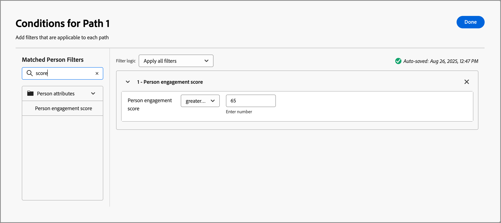

# 参与度评分 {#engagement-scores}

>[!CONTEXTUALHELP]
>id="ajo-b2b_buying_group_engagement_score"
>title="参与度评分"
>abstract="参与度评分决定了购买群组成员的参与度水平。"

参与度得分是一个数字，它指示购买小组成员的参与度级别。 这些得分基于购买组成员活动、加权操作和加权角色。 所得的得分在租户（实例）中进行标准化，以实现一致的比较，并允许可行的分析。 分数计算在您创建购买组后立即开始。 Journey Optimizer B2B edition数据中心系统每天计算得分，并使用引入服务将其上传到多级营销(MLM) MySQL系统。

有两种类型的参与度分数：

* **购买团体参与度分数** — 购买团体参与度分数是介于0到100之间的标准化分数，基于在人员级别计算的参与度分数。

  购买团体参与度分数显示在[购买团体详细信息](./buying-group-details.md)页面中。 您还可以在智能仪表板中查看参与度最高的购买群体。

  {width="700" zoomable="yes"}

* **人员参与度分数** — 人员参与度分数基于个人购买小组成员的活动。

  每个购买群成员的人员参与分数显示在购买群组详细信息页面[_[!UICONTROL 成员&#x200B;]_选项卡](./buying-group-details.md#buying-group-members)中。 这些得分还会显示在页面和仪表板中，其中包括最常参与的成员和重叠的联系人信息。

  {width="550" zoomable="yes"}

>[!BEGINSHADEBOX]

人员参与度得分是一个属性，可用于在[角色模板](./buying-groups-role-templates.md#add-the-template-roles)和[按人员划分历程的路径](../journeys/split-merge-paths-nodes.md#people-path-conditions)节点中进行筛选。

{width="550" zoomable="yes"}

>[!ENDSHADEBOX]

购买组成员在过去30天内执行的任何参与加权活动用于计算得分。 在30天窗口中，活动发生次数会过期，分数可能会向下移动（分数衰减）。 显示的分数会进行四舍五入(例如，75.89999的分数显示为76)。

## 用于参与度评分的活动

购买团体评分不是&#x200B;_基于触发的_。 这是一个每日流程，用于评估购买组所有成员的活动并重新计算得分。 活动使用&#x200B;_权重_&#x200B;根据活动权重模型通知购买团体得分，该模型将确定每个活动的加权方式。

每项活动的每日频率上限为 20 次。如果购买组的成员在一天内执行相同的活动超过20次，则该活动的计数上限为20。

| 活动名称 | 描述 | 参与类型 | 每日最大频率计数 | 默认模型活动权重 |
|---------------|-------------|-----------------|---------------------------|-------------------------------|
| 参加活动 | 成员参加了某个活动 | 活动 | 20 | 60 |
| 电子邮件已点击 | 成员点击电子邮件中的链接 | 电子邮件 | 20 | 30 |
| 电子邮件已打开 | 成员打开一个电子邮件 | 电子邮件 | 20 | 30 |
| 表单已填写 | 成员在某个网页上填写并提交一份表单 | Web | 20 | 40 |
| 重要时刻 | 成员有一个有趣的时刻 | 策划的 | 20 | 60 |
| 链接点击次数 | 成员点击网页上的某个链接 | Web | 20 | 40 |
| Page Views | 成员查看网页 | Web | 20 | 40 |
| 报名参加活动 | 为事件注册的成员 | 活动 | 20 | 60 |

<!-- old list

| Activity name | Description | Engagement type | Max daily frequency count | Activity weight |
| --- | --- | --- | --- | --- |
| [!UICONTROL Visit Webpage]| A member visits a web page | Web | 20 | 40 |
| [!UICONTROL Fill Out Form]| A member fills and submits a form on a web page | Web | 20 | 40 |
| [!UICONTROL Click Link] | A member clicks a link on a web page | Web | 20 | 40 |
| [!UICONTROL Open Email] | A member opens an email | Email | 20 | 30 |
| [!UICONTROL Click Email] | A member clicks a link in an email | Email | 20 | 30 |
| [!UICONTROL Open Sales Email] | A member opens a sales email | Email | 20 | 30 |
| [!UICONTROL Click Sales Email] | A member clicks a link in a sales email | Email | 20 | 30 |
| [!UICONTROL Interesting Moment] | A member has an interesting moment | Curated | 20 | 60 |
| [!UICONTROL Tap Push Notification] | A member receives a push notification | Mobile | 20 | 30 |
| [!UICONTROL Mobile App Activity] | A member performs an activity on a mobile app | Mobile | 20 | 30 |
| [!UICONTROL Mobile App Session] | A member is active on a mobile app session | Mobile | 20 | 30 |
| [!UICONTROL Fill Out Facebook Lead Ads Form] | A member fills and submits a Lead Ads form on a Facebook page | Social | 20 | 30 |
| [!UICONTROL Click RTP Call to Action] | A member clicks a personalized call to action | Web | 20 | 60 |
| [!UICONTROL View In-App Message] | A member views an in-app message | Mobile | 20 | 30 |
| [!UICONTROL Tap In-App Message] | A member taps an in-app message | Mobile | 20 | 30 |
| [!UICONTROL Subscribe SMS] | A member subscribes to SMS communications | SMS | 20 | 90 |
| [!UICONTROL Reply to Sales Email] | A member replies to a sales email | Email | 20 | 30 |
| [!UICONTROL Engaged with a Dialogue] | A member engages with a Dynamic Chat dialogue | Chat | 20 | 90 |
| [!UICONTROL Interacted with Document in Dialogue] | A member interacts with a document in a Dynamic Chat dialogue | Chat | 20 | 90 |
| [!UICONTROL Scheduled Meeting in Dialogue] | A member schedules an appointment in a Dynamic Chat dialogue | Chat | 20 | 90 |
| [!UICONTROL Reached Dialogue Goal] | A member reaches a goal in a Dynamic Chat dialogue |  |20 | 90 |
| [!UICONTROL Responded to a poll in webinar] | A member responds to a poll in a webinar event | Chat | 20 | 90 |
| [!UICONTROL Call to action clicked in webinar] | A member clicks a call-to-action link in a webinar event | Call | 20 | 30 |
| [!UICONTROL Asset downloads in webinar] | A member downloads a file/asset in a webinar event | Event | 20 | 60 |
| [!UICONTROL Asks questions in webinar] | A member asks questions in a webinar event | Event | 20 | 60 |
| [!UICONTROL Has attended event] | A member attended an event | Event | 20 | 60 |
| [!UICONTROL Engaged with an Agent in Dialogue] | A member engages with an agent in a Dynamic Chat dialogue | Chat | 20 | 90 |
| [!UICONTROL Clicked Link in Chat in Dialogue] | A member clicks a link in a Dynamic Chat dialogue | Chat | 20 | 90 |
| [!UICONTROL Engaged with a Conversational Flow] | A member engages with a Dynamic Chat conversational flow | Chat | 20 | 90 |
| [!UICONTROL Scheduled Meeting in Conversational Flow] | A member schedules an appointment in a Dynamic Chat conversational flow | Chat | 20 | 90 |
| [!UICONTROL Reached Conversational Flow Goal] | A member reaches a goal in a Dynamic Chat conversational flow | Chat | 20 | 90 |
| [!UICONTROL Interacted with Document in Conversational Flow] | A member interacts with a document in a Dynamic Chat conversational flow | Chat | 20 | 90 |
| [!UICONTROL Engaged with an Agent in Conversational Flow] | A member engages with an Agent in a Dynamic Chat conversational flow | Chat | 20 | 90 |
| [!UICONTROL Clicked Link in Chat in Conversational Flow] | A member clicks a link in a Dynamic Chat conversational flow | Chat | 20 | 90 |
| [!UICONTROL Click Link in SMS V2] | A member clicks a link in an SMS message | SMS | 20 | 90 | -->

>[!NOTE]
>
>参与度得分活动记录在人员的Marketo Engage活动日志中。 您可以在连接的Marketo Engage实例中访问此日志。 有关详细信息，请参阅Marketo Engage文档中的[查找人员的活动日志](https://experienceleague.adobe.com/zh-hans/docs/marketo/using/product-docs/core-marketo-concepts/smart-lists-and-static-lists/managing-people-in-smart-lists/locate-the-activity-log-for-a-person){target="_blank"}。

## 角色模板权重 {#engagement-score-weighting}

>[!CONTEXTUALHELP]
>id="ajo-b2b_buying_group_engagement_score_weighting"
>title="参与度评分角色权重"
>abstract="使用角色权重来自定义参与度评分计算。"

用户可以为[角色模板](./buying-groups-role-templates.md)中的每个角色分配&#x200B;_权重_，为一个角色分配不同的权重。

{width="700" zoomable="yes"}

每个权重级别都转换为一个值，用于计算参与度评分：

* [!UICONTROL 不重要] = 20
* [!UICONTROL 轻微] = 40
* [!UICONTROL 普通] = 60
* [!UICONTROL 重要] = 80
* [!UICONTROL 必不可少] = 100

角色模板中的三个角色权重分别为&#x200B;_[!UICONTROL 必不可少]_、_[!UICONTROL 重要]_&#x200B;和&#x200B;_[!UICONTROL 普通]_，转化为以下权重百分比：

| 角色 | 权重 | 系统值 | 值计算 | 百分比 |
|-------------- |--------- |------------- |------------------ |---------- |
|               |          |              |                   |           |
| 决策者 | 必不可少 | 100 | 100/240 | 41.67% |
| 影响者 | 重要 | 80 | 80/240 | 33.33% |
| 业务员 | 普通 | 60 | 60/240 | 25% |
|               | 总计 | 240 |                   |           |

## 得分计算示例

以下示例说明了参与度分数的计算。 它使用概述的角色权重百分比、每个购买组成员入站活动计数，以及每个事件发生的每日上限20。

| 角色 | 成员 | 活动类型 | 昨日计数 | 今日计数 | 计算 | 总评分 |
|-------------- |--------- |-------------|-----------------|-------------|------|-----------|
|               |          |             |                 |             |      |           |
| 决策者 | Adam | 访问了网站 | 37 | 15 | 20 + 15 | 35 |
|               |          | 点击了电子邮件 | 1 | 1 | 1 + 1 | 2 |
|               |          |             |                 |             |      |           |
|               | 标记 | 访问了网站 | 5 | 3 | 5 + 3 | 8 |
|               |          | 点击了电子邮件 | 1 | 1 | 1 + 1 | 2 |
|               |          | 下载了发布 | 3 | 2 | 3 + 2 | 5 |
| **决策者总评分** |         |             |                 |             |      | **52** |
|               |          |             |                 |             |      |           |
| 影响者 | John | 访问了网站 | 19 | 9 | 19 + 9 | 28 |
| **影响者总评分** |         |             |                 |             |      | **28** |
|               |          |             |                 |             |      |           |
| 业务员 | Bob | 点击了电子邮件 | 1 | 1 | 1 + 1 | 2 |
|               |          |             |                 |             |      |           |
|               | Paul | 点击了电子邮件 | 1 | 1 | 1 + 1 | 2 |
|               |          |             |                 |             |      |           |
|               | Calvin | 点击了电子邮件 | 1 | 1 | 1 + 1 | 2 |
|               |          | 访问了网站 | 1 | 7 | 1 + 7 | 8 |
|               |          | 下载了发布 | 1 | 2 | 1 + 2 | 3 |
| **业务员总评分** |         |             |                 |             |      | **17** |

最终参与度评分是通过应用每个角色评分的权重计算得出的：

| 角色 | 角色总评分 | 角色权重 % | 评分 X 权重 % |
|-------------- |---------------- |------------- |---------------- |
| 决策者 | 52 | 41.67% | 21.67 |
| 影响者 | 28 | 33.33% | 9.33 |
| 业务员 | 17 | 25% | 4.25 |
| **最终参与度评分** |                |             | **35.25** |

## 评分逻辑

除了计算示例中概述的计算逻辑之外，系统中还有一种非常复杂的得分规范化，它涉及实例中的所有人员、购买组和帐户。 根据以下顺序逻辑，购买组参与度得分与人员参与度得分存在依赖关系：

### 人员参与度得分计算逻辑

1. 识别具有相关权重和每日配额的所有&#x200B;_参与度加权_&#x200B;活动类型，例如网站访问次数、电子邮件点击次数和网络研讨会出席情况。

1. 识别在活动回顾时间范围（当前硬编码为30天）内执行的所有人员&#x200B;_参与加权_&#x200B;操作。

1. 标准化步骤1中确定的所有&#x200B;_参与加权_&#x200B;活动类型权重中的活动类型权重，忽略回顾时间范围内未发生的活动类型权重。

   此步骤利用&#x200B;_最小 — 最大标准化_，并显着减少不利用大部分活动的租户的活动类型权重的人工稀释。

1. 按人员和活动类型应用每日配额筛选。

   此步骤通过避免低值/高容量活动扭曲分数来减少具有非常大的离群值。

1. 计算原始人员参与度得分，方法是合计每个活动类型的每日活动，将其乘以关联的权重，然后合计回顾窗口所有天数的结果。

1. 使用&#x200B;_幂变换_（平方根）变换通过减少可能的异常值来稳定方差。

   此转换有助于减少偏斜，并使数据中的图案更加线性。

1. 应用额外的&#x200B;_缩放标准化_&#x200B;转换以确保分数利用0到100之间的整个范围。

### 购买组参与度分数计算逻辑

1. 根据在角色模板中配置的权重，按角色对每个购买组成员应用规范化的权重。

1. 规范每个购买组的购买组角色权重。

   如果购买组未使用所有角色，则此标准化可避免不必要的角色权重稀释。

1. 通过将人员参与度得分乘以人员的角色标准化角色权重，汇总所有购买组成员人员参与度得分，并将它们相加。

1. 应用&#x200B;_幂变换_（平方根）变换，通过减少可能的异常值来稳定方差，尤其是对于非常大的购买群体。

1. 应用额外的&#x200B;_缩放标准化_&#x200B;转换以确保分数利用0到100之间的整个范围。
