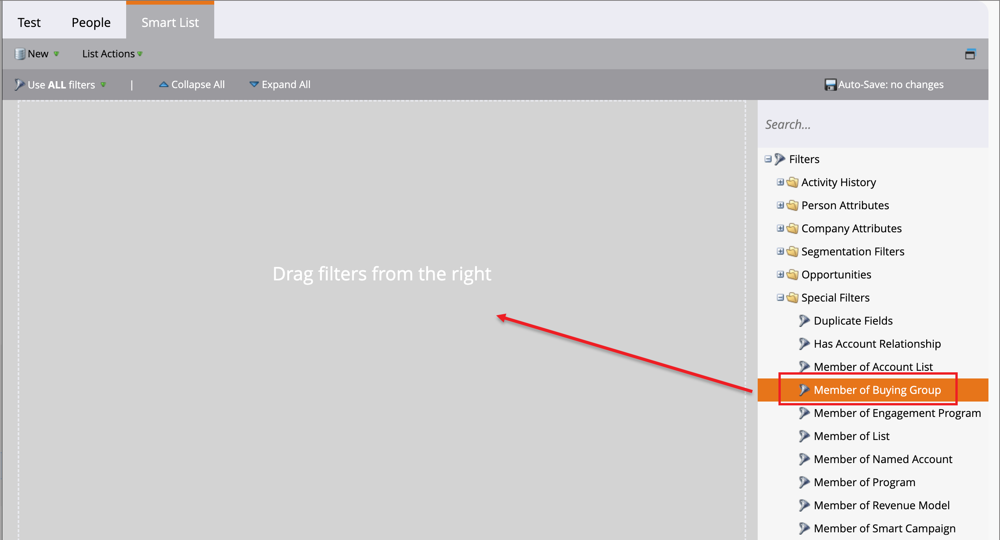

# Market Engage 中的购买群组过滤器

作为营销人员，您可能希望在Marketo Engage中禁止参与在Journey Optimizer B2B edition中购买群组的用户的促销活动。 您还可以使用与购买组关联的潜在客户的相关信息，告知Marketo Engage中的潜在客户评分工作流。 例如：

* 此潜在客户是否为购买群体的一部分？
* 购买团体是否已完成并投入使用？

如果这些条件成立，您可能会选择得分越高，越高。 否则，您可以选择不将其标记为营销资格潜在客户(MQL)。

在连接到Journey Optimizer B2B edition的Marketo Engage实例中，您可以在智能列表中使用&#x200B;_[!UICONTROL 购买组成员列表]_&#x200B;筛选器来根据促销活动策略识别这些潜在客户。

1. 在Marketo Engage[创建智能列表](https://experienceleague.adobe.com/zh-hans/docs/marketo/using/product-docs/core-marketo-concepts/smart-lists-and-static-lists/creating-a-smart-list/create-a-smart-list){target="_blank"}后，选择&#x200B;**[!UICONTROL 智能列表]**&#x200B;选项卡以打开筛选器编辑器。

1. 在右侧的筛选器列表中，向下滚动该列表并展开&#x200B;**[!UICONTROL 特殊筛选器]**&#x200B;文件夹。

1. 单击&#x200B;**[!UICONTROL 购买群组成员]**&#x200B;筛选器并将其拖动到筛选器定义区域。

   {width="700" zoomable="yes"}

1. 将&#x200B;_[!UICONTROL 购买群组成员]_&#x200B;选项设置为&#x200B;**[!UICONTROL true]**&#x200B;或&#x200B;**[!UICONTROL false]**。

   定义需要此约束。

1. （可选）根据您希望如何识别智能列表的商机，将其他与购买群组相关的约束添加到过滤器中。

   * 单击筛选器卡片右上角的&#x200B;**[!UICONTROL 添加约束]**。

     {width="700" zoomable="yes"}

   * 选择要添加的约束，如&#x200B;_完整性分数_&#x200B;或&#x200B;_解决方案兴趣_。

   * 设置要用于匹配的评估。 对于分数，您可以使用完全匹配项，或者使用高于或低于您输入数字的范围。

     对于离散项目(如Journey Optimizer B2B edition中定义的解决方案兴趣)，您可以为该列表选择一个或多个项目。

     {width="600" zoomable="yes"}

     选择第一个选择器并再次单击该选择器以打开&#x200B;_[!UICONTROL 多值选择器]_&#x200B;对话框。

     {width="500" zoomable="yes"}

     将其余任何项目移至右侧，并在有要用于约束的项目列表时单击&#x200B;**[!UICONTROL 确定]**。

   * 重复这些操作可添加所需数量的限制。

   具有多个约束的{width="600" zoomable="yes"}
