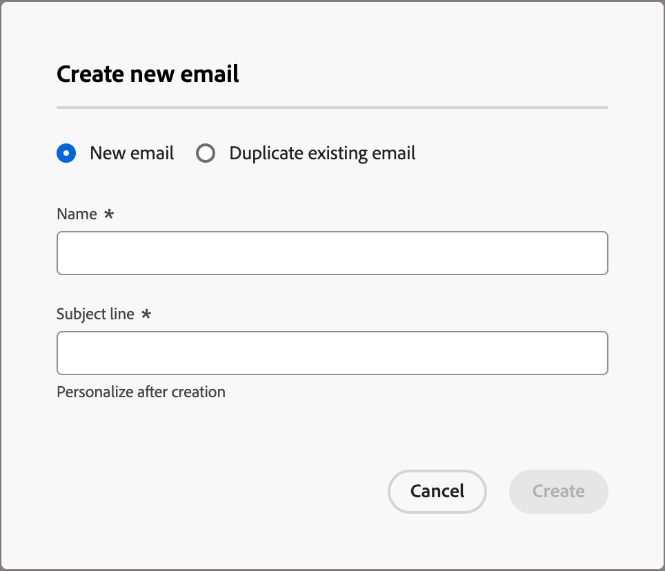

# 向历程添加电子邮件

使用Adobe Journey Optimizer B2B edition通过帐户历程向客户发送电子邮件。 您可以选择在电子邮件设计空间创建、个性化和预览消息。 在电子邮件处于历程中后，在[电子邮件性能报告](../dashboards/email-performance-dashboard.md)中监视发送、投放和参与。

>[!NOTE]
>
>如果您是首次发送电子邮件，请确保已配置电子邮件渠道。 若要了解详细信息，请参阅[跟踪和电子邮件传递的协议](../start/email-protocols.md)。
>
>有关在投放时如何评估电子邮件同意首选项的详细信息，请参阅[同意首选项](./channels-consent-preferences.md)。

## 添加发送电子邮件操作节点 {#send-email-node}

当您[添加&#x200B;_[!UICONTROL 执行操作]_&#x200B;节点](../journeys/action-nodes.md)并执行以下操作时，可以在历程中设置电子邮件投放：

1. _（仅限帐户历程）_&#x200B;对于&#x200B;_目标上的_&#x200B;操作，请选择&#x200B;**[!UICONTROL 人员]**。

1. 对于操作，请选择&#x200B;**[!UICONTROL 发送电子邮件]**。

1. 单击&#x200B;**[!UICONTROL 创建电子邮件]**。

   {width="500"}

1. 在&#x200B;_新建电子邮件_&#x200B;对话框中，选择创建新的电子邮件内容资源或复制现有的电子邮件内容资源。

   * 如果要使用空画布或电子邮件模板创建电子邮件，请选择&#x200B;**[!UICONTROL 新建电子邮件]**&#x200B;选项。

     {width="400"}

     * 为电子邮件输入唯一的&#x200B;**[!UICONTROL 名称]**&#x200B;和&#x200B;**[!UICONTROL 主题行]**。

     * 单击&#x200B;**[!UICONTROL 创建]**。

   * 如果要使用当前历程或其他历程中的现有电子邮件创建电子邮件，请选择&#x200B;**[!UICONTROL 复制现有电子邮件]**&#x200B;选项。

     您可以根据历程节点的目标更改重复的电子邮件。

     * 要复制&#x200B;**[!UICONTROL 现有电子邮件]**，请单击&#x200B;_选择_&#x200B;图标（），然后选择要复制的电子邮件并用于历程节点。

       您可以过滤电子邮件列表，方法是在搜索字段中输入文本字符串以匹配电子邮件名称。 选中要复制的电子邮件的复选框，然后单击&#x200B;**[!UICONTROL 选择]**。

       {width="600" zoomable="yes"}

     * 为电子邮件输入唯一的&#x200B;**[!UICONTROL 名称]**&#x200B;和&#x200B;**[!UICONTROL 主题行]**。

       {width="400"}

     * 单击&#x200B;**[!UICONTROL 创建]**。

1. 单击&#x200B;**[!UICONTROL 编辑电子邮件]**&#x200B;以定义电子邮件[设置](#email-settings)和[内容](./email-authoring.md)。

   {width="500"}

## 定义电子邮件设置 {#email-settings}

在右侧的&#x200B;_摘要_&#x200B;面板中选择&#x200B;**[!UICONTROL 详细信息]**&#x200B;选项卡后，滚动到底部以查看并定义电子邮件设置。

{width="700" zoomable="yes"}

| 选项 | 描述 |
| ------ | ----------- |
| [!UICONTROL 发件人姓名] | 电子邮件标头中使用的发件人名称。 输入您希望向收件人显示的发件人名称。 单击&#x200B;_个性化_&#x200B;图标（）以在字段中使用个性化令牌。 |
| [!UICONTROL 来自电子邮件] | 电子邮件标头中使用的发件人地址。 默认值是从[电子邮件渠道投放设置](../admin/configure-channels-emails.md#delivery-settings)中填充的。 单击&#x200B;_个性化_&#x200B;图标（）以在字段中使用个性化令牌。 |
| [!UICONTROL 回复地址] | 电子邮件标头中使用的发件人地址。 默认值是从[电子邮件渠道投放设置](../admin/configure-channels-emails.md#delivery-settings) （[!UICONTROL 来自标签]）中填充的。 输入当收件人使用回复功能时要填充的电子邮件地址（它可能与发件人地址不同或相同）。 单击&#x200B;_个性化_&#x200B;图标（）以在字段中使用个性化令牌。 |
| [!UICONTROL 主题行] | 电子邮件主题字段中显示的文本。 默认值由您在&#x200B;_[!UICONTROL 新建电子邮件]_&#x200B;对话框中输入的文本填充。 您可以根据需要更改文本。 单击&#x200B;_个性化_&#x200B;图标（）以在字段中使用个性化令牌。<!-- Click the AI Assistant button ( {width="30" zoomable="no"} ) to generate the subject line based on the current email content.--> |
| [!UICONTROL 品牌化域] | 如果系统中定义了多个[品牌化域](../admin/configure-channels-emails.md#branding-domains)，请选择用于发送电子邮件的品牌化域。 使用特定品牌域发送似乎来自您的品牌而非整个公司的电子邮件。 它有助于建立与品牌之间的信任，使电子邮件体验个性化，并提高打开率和响应率。 |
| [!UICONTROL 操作电子邮件] | 如果要将电子邮件指定为可操作的，请选中此复选框。 操作电子邮件从选择退出/取消订阅列表和通信限制中排除。 仅当收件人不能将电子邮件视为未经请求的商业邮件(SPAM)时，才选择此选项。 |
| [!UICONTROL 包括网页形式的视图] | 选中此复选框可包含指向从电子邮件内容生成的网页的链接。 与网页相比，电子邮件的功能更为有限，因此它对于JavaScript、扩展CSS和表单非常有用。 用于生成链接的文本已在[电子邮件渠道投放设置](../admin/configure-channels-emails.md#delivery-settings)中配置（[!UICONTROL 以网页HTML查看]和[!UICONTROL 以网页文本查看]）。 |
| [!UICONTROL 禁用打开跟踪] | 如果不想跟踪电子邮件打开活动，请选中复选框。 禁用此功能后，仅当具有独特身份的用户打开电子邮件时，电子邮件打开活动计数才会递增。 设计电子邮件正文内容时，您可以[管理电子邮件内容链接跟踪](./email-authoring.md#edit-linked-url-tracking)。 |
| [!UICONTROL 预编译标头] | 选中此复选框可包含预编译标头。 邮件引文是简短摘要文本，在某些电子邮件客户端中，显示在主题行之后。 它通常提供电子邮件的简短摘要，通常是单句子。 在字段<!-- , or click the AI Assistant button ( {width="30" zoomable="no"} ) to generate summary text based on the current email content -->中输入摘要文本。 |

<!-- 
Removed, but may reappear elsewhere
| [!UICONTROL Dedicated IP] | If you have more than one dedicated IP addresses defined, select a dedicated IP address to use for sending the email. When you use a specific dedicated IP for your programs, you can track and monitor deliverability more closely and respond quickly to any changes in your delivery metrics. For more information about adding a dedicated IP for the connected Marketo Engage instance, refer to the [Marketo Engage documentation](https://experienceleague.adobe.com/en/docs/marketo/using/product-docs/email-marketing/deliverability/use-your-dedicated-ip-addresses-to-send-emails){target="_blank"}.|
| [!UICONTROL Fields used as CC addresses] | If available, select up to 25 Lead or Company fields that are set up in Marketo Engage using the `Email` type.  |
-->

## 检查警报 {#check-alerts}

在定义电子邮件设置和内容时，如果缺少关键设置，则会在界面（页面右上方）中显示警报。 如果未看到此按钮，则表示没有检测到问题。

{width="600" zoomable="yes"}

警报有两种类型：

* 引用推荐和最佳实践的&#x200B;**_警告_**，例如：

  * `The opt-out link is not present in the email body`：最佳做法是在电子邮件正文中添加取消订阅链接。

    >[!NOTE]
    >
    >营销风格的电子邮件必须包含选择退出链接，这对于事务型消息不是必需的。

  * `Text version of HTML is empty`：定义电子邮件正文的文本版本，在HTML内容无法显示时使用。

  * `Empty link is present in email body`：检查电子邮件中的所有链接是否正确。

  * `Email size has exceeded the limit of 100KB`：若要获得最佳投放，请确保电子邮件大小不超过100KB。

* **_错误_**，阻止您测试或激活历程/营销活动，只要未解决这些错误，例如：

  * `From name is empty`：未定义电子邮件&#x200B;_From_&#x200B;字段（必填）。

  * `The subject line is missing`：未定义电子邮件主题行（必需）。

  * `The email version of the message is empty`：未定义电子邮件内容。
