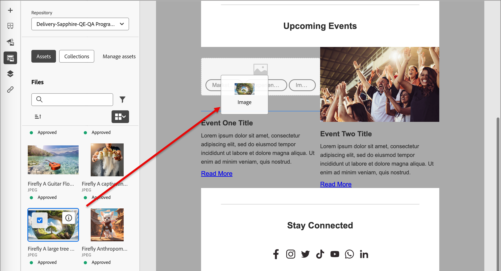

# 使用Experience Manager资源

当Adobe Experience Manager Assetsas a Cloud Service与Adobe Journey Optimizer B2B版本集成时，您可以轻松发现和访问在营销内容中使用的数字资源。 在创作内容时，可从左侧导航栏中的&#x200B;_[!UICONTROL Assets]_&#x200B;项访问资源，以及在创作帐户历程的电子邮件内容时也可访问资源。 您还可以直接从AEM Assets B2B版本将资源上传到连接的Adobe Journey Optimizeras a Cloud Service存储库。

>[!NOTE]
>
>目前，Adobe Journey Optimizer B2B版本仅支持Adobe Experience Manager Assets中的图像资源。 必须在Adobe Experience Manager Assets中央存储库中更改资源。 [了解更多](https://experienceleague.adobe.com/en/docs/experience-manager-cloud-service/content/assets/manage/manage-digital-assets)

当您使用这些数字资源时，Assetsas a Cloud Service中的最新更改会通过链接的引用自动传播到实时电子邮件营销活动中。 如果在Adobe Experience Manager Assetsas a Cloud Service中删除了图像，则这些图像在电子邮件中显示时带有断开的引用。 当帐户历程中当前使用的资产被修改或删除时，历程作者会收到有关图像更改和使用图像的历程列表的通知。 对资源的所有更改必须在Adobe Experience Manager Assets中央存储库中完成。

## 使用AEM Assets作为图像源

如果您的环境具有一个或多个[Assets存储库连接](../admin/configure-aem-repositories.md)，则在创建或查看电子邮件、电子邮件模板或可视片段的详细信息时，可以指定AEM Assets作为资源的来源。

* 创建新内容时，选择`AEM Assets`作为对话框中的&#x200B;**[!UICONTROL Image Source]**&#x200B;项。

  {width="500"}

* 打开现有内容资源时，请在右侧的&#x200B;_[!UICONTROL 正文]_&#x200B;面板中选择`AEM Assets`。

  {width="700" zoomable="yes"}

## 访问资源以进行创作

>[!IMPORTANT]
>
>管理员必须将需要访问Assets的用户添加到Assets Consumer Users或/和Assets Users产品配置文件。 [了解更多](https://experienceleague.adobe.com/en/docs/experience-manager-cloud-service/content/security/ims-support#managing-products-and-user-access-in-admin-console)

在可视内容编辑器中，单击左侧边栏中的&#x200B;_资产选择器_&#x200B;图标。 这会将“工具”面板更改为选定存储库中可用资源的列表。

{width="700" zoomable="yes"}

如果您有多个连接的AEM存储库，请单击&#x200B;**[!UICONTROL 存储库]**&#x200B;的菜单箭头以选择要使用的存储库。

{width="700" zoomable="yes"}

有多种方法可以将图像资产添加到可视画布：

* 从左侧导航中拖放图像缩略图。

  {width="700" zoomable="yes"}

* 将图像组件添加到画布并单击&#x200B;**[!UICONTROL 浏览]**&#x200B;以打开&#x200B;_[!UICONTROL 选择Assets]_&#x200B;对话框。

  从该对话框中，可以从所选存储库中选择图像。

  有多个工具可帮助您找到所需的资源。

  {width="700" zoomable="yes"}

   * 更改右上角的&#x200B;**[!UICONTROL 存储库]**。

   * 单击右上角的&#x200B;**[!UICONTROL 管理资源]**&#x200B;可在其他浏览器选项卡中打开Assets存储库并使用AEM Assets管理工具。

   * 单击右上角的&#x200B;_视图类型_&#x200B;选择器以将显示更改为&#x200B;**[!UICONTROL 列表视图]**、**[!UICONTROL 网格视图]**、**[!UICONTROL 图库视图]**&#x200B;或&#x200B;**[!UICONTROL 瀑布视图]**。

   * 单击&#x200B;_排序顺序_&#x200B;图标可在升序和降序之间更改排序顺序。

   * 单击&#x200B;**[!UICONTROL 排序方式]**&#x200B;菜单箭头以将排序条件更改为&#x200B;**[!UICONTROL 名称]**、**[!UICONTROL 大小]**&#x200B;或&#x200B;**[!UICONTROL 修改时间]**。

   * 单击左上角的&#x200B;_筛选器_&#x200B;图标以根据您的条件筛选显示的项目。

   * 在搜索字段中输入文本，以筛选显示的项目以匹配资源名称。

  {width="700" zoomable="yes"}

<!-- 
## Upload assets

To import files to Assets as a Cloud Service, you first need to browse or create the folder to be used for storage. You can then import an asset and add it to your email content. After assets are uploaded, you can [use the image assets as you author content](./assets-overview.md#add-assets-to-your-content).

1. While authoring your content in the email designer, drag an image element into the canvas. 

   The properties on the right reflect the image element selection. 

1. Click **[!UICONTROL Import media]** to open the _[!UICONTROL Upload image]_ dialog.

1. If your file system is open to your image file, drag and drop the file on the box in the dialog.

   {width="700" zoomable="yes"}

   You can also click the **[!UICONTROL Select a file from your computer]** link and use your file system to locate and select the image file. Click Open and the image file is displayed in the box.

1. Click **[!UICONTROL Import]**.

-->