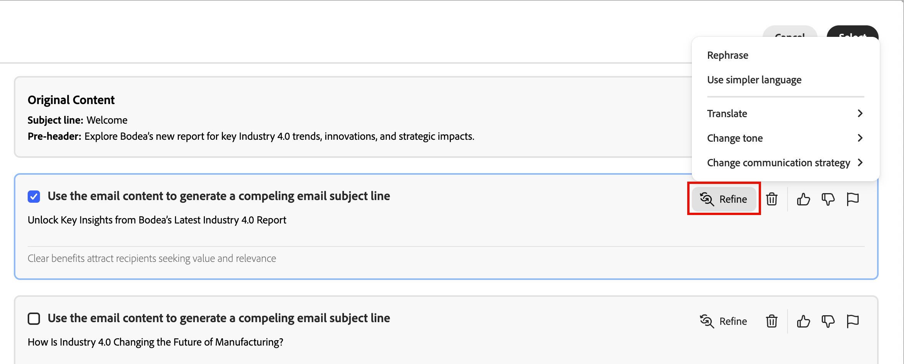
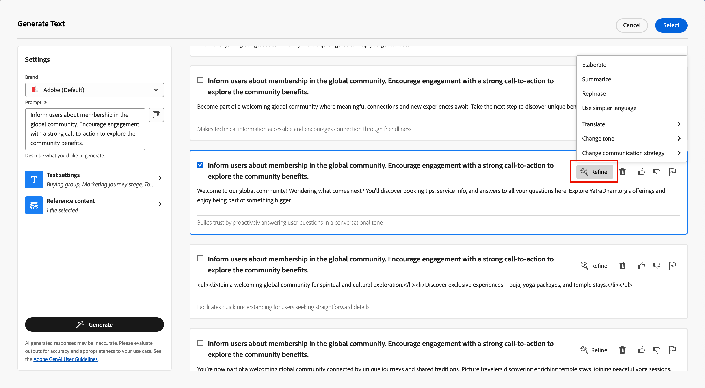

# 电子邮件内容的AI助手

随着营销行业的竞争日益激烈，各大品牌都在寻求高效的方法来快速高效地生成有影响力的内容。 用于[!DNL Adobe Journey Optimizer B2B Edition]中电子邮件创作的AI Assistant是Adobe提供的AI支持的内容生成功能，它彻底改变了营销人员创建专业且品牌一致的电子邮件内容的方式。 借助先进的创作AI模型和对品牌准则的深入了解，AI Assistant可自动生成个性化、吸引人和有效的内容。 它利用您的营销目标并优化品牌概述样式、布局、色调等内容。 AI Assistant使电子邮件营销活动的创建和执行变得直观、简单而轻松。 将此功能添加到工作流可以节省时间、提高效率并取得更好的结果。

这项新功能提供了基于提示的内容生成功能，可用于生成完整的电子邮件或在电子邮件结构组件中对其进行定位。 对于图像，您可以生成新的图像资产，或只需从输入品牌资产的图像目录中生成推荐即可。 您还可以使用此功能生成最佳主题行和预标题，从而影响电子邮件打开率。

>[!IMPORTANT]
>
>要在Adobe Journey Optimizer B2B edition中访问这些功能，您必须具有&#x200B;_[!UICONTROL AI助手]_ > _[!UICONTROL 生成内容]_&#x200B;权限。 有关产品管理员如何授予功能权限的详细信息，请参阅[编辑产品权限的角色](../admin/user-management.md#edit-roles-for-product-permissions)。

## 准则和限制

在开始使用此功能之前，请查看[准则和限制](../ai-assistant/generative-ai-content.md#general-guidelines-and-limitations)。 在[!DNL Journey Optimizer B2B Edition]中使用AI功能之前，还需要用户同意{target="_blank"}。 有关更多信息，请与您的 Adobe 代表联系。

Adobe承诺在媒体创建中使用创作AI工具时提高透明度，有鉴于此，Adobe在下载或导出包含Firefly生成的资源的任何内容或项目时应用[内容凭据](https://helpx.adobe.com/firefly/web/get-started/learn-the-basics/content-credentials-overview.html){target="_blank"}。

以下限制和准则适用于在[!DNL Journey Optimizer B2B Edition]中生成电子邮件内容所使用的AI助手功能：

* 英语是唯一受支持的语言。
* 生成的内容可能不准确 — 请分享您的反馈，以便Adobe工程师可以优化模型。
* 您可以上传多个内容引用资源，但只能为特定层代利用一个。
* 使用特定品牌或自定义模板为完整电子邮件生成内容。 建议使用最多包含8至10个图像的电子邮件模板。
* 选择生成的变体时，请确保使用向上缩略图、向下缩略图或标记图标报告任何有问题的输出。

## 用于内容生成的输入和设置

您可以为电子邮件或电子邮件中的选定组件生成完整内容。 使用AI助手工具生成所需的内容时，需要提供输入（包括提示和引用内容）以及文本和图像的设置。

### 提示

为创作AI模型使用定义良好的提示来准确地解释。 您提供的营销目标/提示会极大地影响所生成内容的质量。

{width="320"}

有关创建有效提示的详细信息，请参阅&#x200B;_[提示最佳实践](../ai-assistant/generative-ai-content.md#generative-ai-prompting-guide)_。

>[!BEGINSHADEBOX]

#### 提示库

有效的提示对于生成最佳内容至关重要。 如果您希望在构建提示方面获得帮助，请单击&#x200B;_提示库_ 图标以访问根据目标整理的提示想法库。 在搜索字段中输入文本以根据关键词字符串查找提示。

{width="600" zoomable="no"}

选择最能反映您预期目标的提示，然后单击&#x200B;**[!UICONTROL 尝试此提示]**。 在&#x200B;_[!UICONTROL 提示]_&#x200B;字段中，将任意占位符（如`[Key Feature/Information]`）替换为指定您的品牌、产品、营销活动和用例所需的值。

>[!ENDSHADEBOX]

### 文本设置

展开右侧面板中的&#x200B;**[!UICONTROL 文本设置]**，并设置生成文本的选项。

* **[!UICONTROL 购买群]** — 选择[购买群角色](../buying-groups/buying-groups-role-templates.md)，以用于定位您的消息传送。 [!DNL Journey Optimizer B2B Edition]提供五个现成的标准B2B购买团体角色。 每个购买团体角色都有不同的消息传递重点：

  | 角色 | 消息传送重点 |
  | ---- | --------------- |
  | 执行指导委员会 | 产品信息 定价 技术集成详细信息 产品特性和功能 |
  | 影响者 | 质量证明 易于实施 主题专业知识 竞争优势 |
  | 决策者 | 投资回报率 财务价值(RoI)  客户案例 |
  | 业务员 | 易用性 产品特性和功能 产品兼容性 产品集成的便利性 |
  | 冠军 | 教育内容 思想领导力内容 客户案例 |

* **[!UICONTROL 营销历程阶段]** — 选择[购买团体阶段](../buying-groups/buying-group-stages.md)，以用于消息传递的定位。
* **[!UICONTROL 通信策略]** — 为生成的文本选择最合适的通信样式。
* **[!UICONTROL 语言]** — 选择所生成内容的语言。
* **[!UICONTROL 音调]** — 该音调应该与您的受众产生共鸣。 例如，您可以将消息调整为提供声音信息、富有趣味或有说服力。

{width="350" zoomable="yes"}

单击左箭头返回主&#x200B;_[!UICONTROL 设置]_。

### 图像设置

要在生成的内容中包含图像，请展开右侧面板中的&#x200B;**[!UICONTROL 图像设置]**&#x200B;并设置选项。

默认情况下，**[!UICONTROL 使用AI生成图像]**&#x200B;选项处于禁用状态。 启用此功能并设置以下选项以在建议的内容变体中包含生成的图像：

* **[!UICONTROL 创成模型]**：从现成的Adobe提供的模型、用于专门功能的合作伙伴模型或根据您的品牌资源训练的配置自定义模型中选择。 有关创成模型的详细信息，请参阅&#x200B;_[用于品牌对齐的创成AI模型](generative-ai-models.md)_。
* **[!UICONTROL 宽高比]**：选择图像组件时，此设置将确定资源的宽度和高度。 您可以选择通用比率，如16:9、4:3、3:2或1:1，也可以输入自定义大小。
* **[!UICONTROL 内容类型]**：该类型对可视元素的性质进行分类，区分不同的可视表示形式，如照片、图形或艺术品。
* **[!UICONTROL 视觉强度]**：通过调整图像的强度来控制其影响。 较低的设置（如2）可创建更柔和、更受限的外观，而较高的设置（如10）则使图像更生动、视觉更强大。
* **[!UICONTROL 颜色和色调]**：图像内颜色的总体外观及其传达的情绪或气氛。
* **[!UICONTROL 照明]**：用于图像的照明样式，它塑造了图像的大气并突出显示特定的元素。
* **[!UICONTROL 合成]**：图像框架中元素的排列。

{width="350" zoomable="yes"}

单击左箭头返回主&#x200B;_[!UICONTROL 设置]_。

### 参考内容

上传参考内容资产以生成准确的品牌内内容。 否则，生成的内容将基于公开可用的信息。 引用内容用作内容生成和图像推荐的源。 有关准则和最佳实践，请参阅&#x200B;_[优化的参考内容](../ai-assistant/generative-ai-content.md#reference-content)_。

从&#x200B;**[!UICONTROL 引用内容]**&#x200B;设置中，单击&#x200B;**[!UICONTROL 上载文件]**&#x200B;以添加包含要用于其他上下文的内容的任何资源。

{width="350" zoomable="yes"}

要上传的文件可以具有以下格式：PDF、JPEG、PNG或ZIP文件（包含支持的文件格式）。 上传的品牌资产的最大大小为50MB。 较大的文件或大量的图像可以工作，但这会增加处理时间。

如果要选择以前上载的文件，请展开&#x200B;**[!UICONTROL 上载的引用内容]**&#x200B;列表，然后启用要用于内容生成的资源。

{width="350" zoomable="yes"}

## 使用AI助手生成电子邮件属性

当您[将电子邮件操作](./add-email.md#add-an-email-action-node-in-a-journey)添加到帐户历程时，您定义了一组用于发送电子邮件的电子邮件属性。 AI助手可以生成电子邮件&#x200B;**_主题行_**&#x200B;和&#x200B;**_预编译标头_**&#x200B;的推荐内容，从而帮助实现更好的电子邮件参与。

从历程创建电子邮件或从历程节点打开现有电子邮件时，电子邮件预览页面会在右侧显示&#x200B;_[!UICONTROL 电子邮件属性]_。 在&#x200B;_[!UICONTROL 摘要]_&#x200B;选项卡中，可以使用AI Assistant内容生成工具生成主题行和/或预标题。

>[!BEGINTABS]

>[!TAB 主题行生成]

以下步骤描述了使用AI Assistant为您的电子邮件生成优化主题行的任务序列：

1. 在选择了&#x200B;_详细信息_&#x200B;选项卡的&#x200B;_摘要_&#x200B;面板中，向下滚动到&#x200B;**[!UICONTROL 主题行]**&#x200B;字段。

1. 单击字段右侧的AI助手图标（{width="30"}）。

   电子邮件主题行](./assets/email-properties-ai-assistant-subject-line-icon.png){width="600" zoomable="yes"}的![AI助手访问权限

   将打开&#x200B;_[!UICONTROL 生成主题行]_&#x200B;对话框，其中包含电子邮件主题行的生成设置。

1. （必需）在&#x200B;**[!UICONTROL 提示]**&#x200B;字段中，输入要生成的内容的描述。

   如果您需要有关创建有效提示的帮助，请使用[提示库](#prompt-library)。

1. （可选）完成内容指南设置，为生成预告提供其他输入：

   * [**[!UICONTROL 文本设置]**](#text-settings) — 为生成的文本内容提供指导。
   * [**[!UICONTROL 引用内容]**](#reference-content) — 提供用作内容生成源的内容资源。

1. 提示和设置就绪后，单击&#x200B;**[!UICONTROL 生成]**。

   生成的变体将显示在对话框中。

   {width="600" zoomable="yes"}

1. 滚动AI助手面板并浏览生成的变体以确定哪个变体最适合。

   您可以通过单击&#x200B;_拇指向上_、_拇指向下_&#x200B;或&#x200B;_标志_&#x200B;图标为生成的变体[提交反馈](#submit-variation-feedback)，并选择最能总结您的反馈的原因。

1. 单击&#x200B;**[!UICONTROL 优化]**&#x200B;选项以访问其他自定义功能：

   * **[!UICONTROL 重写]** — 重写邮件并保留其含义。 此选项可帮助您在不更改核心消息的情况下生成替代措辞或调整用语。

   * **[!UICONTROL 使用更简单的语言]** — 简化语言，确保更广受众的清晰度和可访问性。

   * **[!UICONTROL 翻译]** — 将文本翻译成其他语言。 (目前，英语是唯一受支持的语言。 计划在未来版本中使用其他语言。)

   * **[!UICONTROL 更改音调]** — 调整消息音调以符合您的沟通风格，例如，使消息更友好、更专业、更紧急或更具启发性。

   * **[!UICONTROL 更改沟通策略]** — 根据您的目标修改消息传送方式，如创建紧迫感或强调令人兴奋的吸引力。

   {width="600" zoomable="yes"}

1. 单击&#x200B;**[!UICONTROL 选择]**&#x200B;以使用所选变体替换主题行文本并返回电子邮件属性。

>[!TAB 预标头生成]

电子邮件预告是在收件箱中查看电子邮件时遵循主题行的简短摘要文本。 它是电子邮件的一项可选元素，但也是提高参与度的绝佳机会。 以下步骤描述了使用AI Assistant为您的电子邮件生成优化的预标头的任务序列：

1. 在选择了&#x200B;_详细信息_&#x200B;选项卡的&#x200B;_摘要_&#x200B;面板中，向下滚动并选择&#x200B;**[!UICONTROL 预标题]**&#x200B;复选框。

   {width="600" zoomable="yes"}

   将打开&#x200B;_[!UICONTROL 生成预标头]_&#x200B;对话框，其中包含电子邮件预标头的生成设置。

1. （必需）在&#x200B;**[!UICONTROL 提示]**&#x200B;字段中，输入要生成的内容的描述。

   如果您需要有关创建有效提示的帮助，请使用[提示库](#prompt-library)。

1. （可选）完成内容指南设置，为生成预告提供其他输入：

   * [**[!UICONTROL 文本设置]**](#text-settings) — 为生成的文本内容提供指导。
   * [**[!UICONTROL 引用内容]**](#reference-content) — 提供用作内容生成源的内容资源。

1. 提示和设置就绪后，单击&#x200B;**[!UICONTROL 生成]**。

   生成的变体将显示在对话框中。

   {width="600" zoomable="yes"}

1. 滚动AI助手面板并浏览生成的变体以确定哪个变体最适合。

   您可以通过单击&#x200B;_拇指向上_、_拇指向下_&#x200B;或&#x200B;_标志_&#x200B;图标为生成的变体[提交反馈](#submit-variation-feedback)，并选择最能总结您的反馈的原因。

1. 单击&#x200B;**[!UICONTROL 优化]**&#x200B;选项以访问其他自定义功能：

   * **[!UICONTROL 重写]** — 重写邮件并保留其含义。 此选项可帮助您在不更改核心消息的情况下生成替代措辞或调整用语。

   * **[!UICONTROL 使用更简单的语言]** — 简化语言，确保更广受众的清晰度和可访问性。

   * **[!UICONTROL 翻译]** — 将文本翻译成其他语言。 (目前，英语是唯一受支持的语言。 计划在未来版本中使用其他语言。)

   * **[!UICONTROL 更改音调]** — 调整消息音调以符合您的沟通风格，例如，使消息更友好、更专业、更紧急或更具启发性。

   * **[!UICONTROL 更改沟通策略]** — 根据您的目标修改消息传送方式，如创建紧迫感或强调令人兴奋的吸引力。

   {width="500" zoomable="yes"}

1. 单击&#x200B;**[!UICONTROL 选择]**&#x200B;将预标头替换为所选变体并返回电子邮件属性。

>[!ENDTABS]

## 使用AI助手生成电子邮件正文内容 {#generative-ai-email-design}

在您[创建并个性化您的电子邮件](./email-authoring.md)后，请在[!DNL Journey Optimizer B2B Edition]中使用由创作AI提供支持的AI助手，将您的电子邮件正文内容提升到新的级别。

在电子邮件设计空间中，AI Assistant可以生成与受众产生共鸣的完整电子邮件正文、目标文本内容和图像，从而帮助您优化投放的影响。 这种电子邮件促销活动优化旨在提高参与度。 选择&#x200B;_AI助手_ （{width="25" zoomable="no"} ）以显示可用于当前内容选择的内容生成工具。

电子邮件设计空间中的{width="600" zoomable="yes"}

根据要使用的电子邮件内容生成类型，执行以下步骤：

>[!BEGINTABS]

>[!TAB 生成完整电子邮件]

按照以下步骤使用AI Assistant通过优化现有电子邮件模板生成完整的电子邮件：

1. 在[创建电子邮件](./add-email.md)后，单击&#x200B;**[!UICONTROL 编辑电子邮件内容]**。

1. 选择模板。

   完整内容生成需要模板。 它可以是Adobe提供的标准模板，也可以是保存的模板。 您还可以使用&#x200B;_[!UICONTROL 导入HTML]_&#x200B;选项导入模板。

   有关使用电子邮件模板的详细信息，请参阅&#x200B;_[选择模板](./email-authoring.md#select-a-template)_。

1. 在电子邮件设计空间中，通过单击右侧的图标（{width="25"} ）访问AI助手菜单。

   右侧的AI助手设置反映了&#x200B;_生成电子邮件_。

   {width="600" zoomable="yes"}

1. 选择您的&#x200B;**[!UICONTROL 品牌]**&#x200B;以确保AI生成的内容与您的品牌规格一致。

   如果没有已发布的品牌，请单击&#x200B;**[!UICONTROL 创建品牌]**&#x200B;以定义您的[可重复使用的品牌指南](./brands-overview.md)。

1. 在&#x200B;**[!UICONTROL 提示]**&#x200B;字段中，输入要生成的内容的描述。

   如果您需要有关创建有效提示的帮助，请使用[提示库](#prompt-library)。

   >[!TIP]
   >
   >如果您不熟悉如何提示生成内容，请查看&#x200B;_[提示最佳实践](../ai-assistant/generative-ai-content.md#generative-ai-prompting-guide)_。

1. 完成内容指导设置以定制生成的内容：

   * [**[!UICONTROL 文本设置]**](#text-settings) — 为生成的文本内容提供指导。
   * [**[!UICONTROL 图像设置]**](#image-settings) — 如果要在生成的内容中包含图像，请启用图像生成并提供指导。
   * [**[!UICONTROL 引用内容]**](#reference-content) — 提供用作内容生成源的内容资源。

1. 提示和设置就绪后，单击&#x200B;**[!UICONTROL 生成]**。

   生成的变体将显示在右侧面板中。

1. 浏览生成的变体或单击&#x200B;_全屏_ （ ）图标以打开&#x200B;_[!UICONTROL 生成电子邮件]_&#x200B;对话框。

   该对话框提供了额外的空间来比较变体、调整文本和引用内容设置（如果需要）以及重新生成变体。

   您还可以通过应用细化操作来微调变体，并提交所生成变体的反馈。 有关变体精简和反馈的更多详细信息，请参阅&#x200B;_[预览和内容细化](#preview-and-content-refinement)_。

   {width="700" zoomable="yes"}

1. 单击&#x200B;**[!UICONTROL 选择]**&#x200B;将模板内容替换为选定的变体并返回电子邮件设计空间。

   您可以使用画布上的编辑和格式化工具来更改生成的内容，以及右侧的&#x200B;_[!UICONTROL 设置]_&#x200B;和&#x200B;_[!UICONTROL 样式]_&#x200B;选项。

>[!TAB 仅限文本]

按照以下步骤使用AI助手优化或增强现有电子邮件的文本内容：

1. 在电子邮件设计空间中，选择一个&#x200B;_文本_&#x200B;组件以定位特定内容。

1. 在右侧面板的外边栏上，选择&#x200B;_AI助手_ （ {width="25"} ）图标。

   右侧的设置反映了文本组件的内容生成设置。

1. 选择您的&#x200B;**[!UICONTROL 品牌]**&#x200B;以确保AI生成的内容与您的品牌规格一致。

   如果没有已发布的品牌，请单击&#x200B;**[!UICONTROL 创建品牌]**&#x200B;以[定义可重复使用的品牌指南](./brands-overview.md)。

1. 在&#x200B;**[!UICONTROL 提示]**&#x200B;字段中，输入要生成的内容的描述。

   {width="600" zoomable="yes"}

   如果您需要有关创建有效提示的帮助，请使用[提示库](#prompt-library)。

1. 完成内容指导设置以定制生成的内容：

   * [**[!UICONTROL 文本设置]**](#text-settings) — 为生成的文本内容提供指导。

   * [**[!UICONTROL 引用内容]**](#reference-content) — 提供用作内容生成源的内容资源。

1. 提示和设置就绪后，单击&#x200B;**[!UICONTROL 生成]**。

1. 浏览生成的变体或单击&#x200B;_全屏_ （ ）图标以打开&#x200B;_[!UICONTROL 生成文本]_&#x200B;对话框。

   该对话框提供了额外的空间来比较变体、调整文本和引用内容设置（如果需要）以及重新生成变体。

   您还可以通过应用细化操作来微调变体，并提交所生成变体的反馈。 有关变体精简和反馈的更多详细信息，请参阅&#x200B;_[预览和内容细化](#preview-and-refine-the-content)_。

   {width="700" zoomable="yes"}

1. 获得所需的内容后，单击&#x200B;**[!UICONTROL 选择]**&#x200B;以使用选定的变体替换文本并返回电子邮件设计空间。

   您可以使用画布上的编辑和格式化工具来更改文本，以及右侧的&#x200B;_[!UICONTROL 设置]_&#x200B;和&#x200B;_[!UICONTROL 样式]_&#x200B;选项。

>[!TAB 仅图像]

按照以下步骤使用AI助手优化或增强现有电子邮件的图像内容：

1. 在电子邮件设计空间中，选择&#x200B;_Image_&#x200B;组件以定位特定内容。

1. 在右侧面板的外边栏上，选择&#x200B;_AI助手_ （ {width="25"} ）图标。

   右侧的AI助手设置反映了图像组件的生成设置。

1. 选择您的&#x200B;**[!UICONTROL 品牌]**&#x200B;以确保AI生成的内容与您的品牌规格一致。

   如果没有已发布的品牌，请单击&#x200B;**[!UICONTROL 创建品牌]**&#x200B;以[定义可重复使用的品牌指南](./brands-overview.md)。

1. 在&#x200B;**[!UICONTROL 提示]**&#x200B;字段中输入所需内容的说明。

   {width="600" zoomable="yes"}的提示

   如果您需要有关创建有效提示的帮助，请使用[提示库](#prompt-library)。

1. 完成内容指导设置以定制生成的内容：

   * [**[!UICONTROL 图像设置]**](#image-settings) — 如果要在生成的内容中包含图像，请启用图像生成并使用指导设置。

   * [**[!UICONTROL 引用内容]**](#reference-content) — 提供用作内容生成源的内容资源。

1. 如果对提示和设置感到满意，请单击&#x200B;**[!UICONTROL 生成]**。

   AI Assistant处理请求并根据提示和其他输入生成最合适的图像。

   >[!IMPORTANT]
   >
   >如果参考内容中没有图像，或者没有与输入提示相关的图像，则输出为空。

1. 浏览生成的变体或单击&#x200B;_全屏_ （  ）图标以打开&#x200B;_[!UICONTROL 生成图像]_&#x200B;对话框。

   该对话框提供了额外的空间来比较变体、调整图像和引用内容设置（如果需要）以及重新生成变体。

   您可以选择变体并单击&#x200B;**[!UICONTROL 生成类似]**&#x200B;以生成与所选变体类似的其他图像。 或者，单击&#x200B;**[!UICONTROL 在Adobe Express中编辑]**&#x200B;以自己对图像进行更改。 有关使用Adobe Express优化图像的更多信息，请参阅[Adobe Express中的快速操作](./image-edit-adobe-express.md#quick-actions-in-adobe-express)。

   {width="700" zoomable="yes"}

   您还可以[提交生成的变体的反馈](#submit-variation-feedback)。

1. 突出显示所需的图像，然后单击&#x200B;**[!UICONTROL 选择]**&#x200B;将图像或占位符替换为选定项，并返回到电子邮件设计空间。

   您可以使用画布上的编辑和格式化工具来更改图像，以及右侧的&#x200B;_[!UICONTROL 设置]_&#x200B;和&#x200B;_[!UICONTROL 样式]_&#x200B;选项。

>[!ENDTABS]

## 预览和优化内容 {#refine-finalize}

生成内容变体后，您可以优化结果以确保它们满足您的确切要求。 审查品牌定位，调整语调和语言，并为可审核的草稿准备内容。 您还可以提交变体的反馈，以帮助培训AI Assistant并改进未来输出。

### 打开全屏视图

1. 在初始内容生成后，浏览&#x200B;**[!UICONTROL 变体]**。

1. 识别与您的目标最匹配的变量，然后单击&#x200B;_全屏_ （  ）图标以更深入地查看所选变量。

   {width="700" zoomable="yes"}

1. 如果对所选变量满意，请单击&#x200B;**[!UICONTROL 选择]**&#x200B;以将其应用于画布。

### 优化变体

单击&#x200B;**[!UICONTROL Refine]**&#x200B;选项以访问电子邮件和文本变体的其他自定义功能：

* **[!UICONTROL 精心设计]** - AI助手可以帮助您展开特定主题，提供其他详细信息以便更好地了解和参与。

* **[!UICONTROL 摘要]** — 过长的信息可能会使页面查看者过载。 使用AI Assistant将关键点浓缩为清晰、简洁的摘要，以吸引注意并鼓励他们进一步阅读。

* **[!UICONTROL 重写]** — 重写邮件并保留其含义。 此选项可帮助您在不更改核心消息的情况下生成替代措辞、改善流量或调整词语。

* **[!UICONTROL 使用更简单的语言]** — 简化语言，确保更广受众的清晰度和可访问性。

* **[!UICONTROL 翻译]** — 将文本翻译成其他语言。 (目前，英语是唯一受支持的语言。 计划在未来版本中使用其他语言。)

* **[!UICONTROL 更改音调]** — 调整消息音调以符合您的沟通风格，例如，使消息更友好、更专业、更紧急或更具启发性。

* **[!UICONTROL 更改沟通策略]** — 根据您的目标修改消息传送方式，如创建紧迫感或强调令人兴奋的吸引力。

<!-- is this option coming back? * **[!UICONTROL Use as reference content]** - Select this option to use the variant as the reference content for generating other results. -->

{width="700" zoomable="yes"}

### 提交变量反馈

通过单击&#x200B;_拇指向上_、_拇指向下_&#x200B;或&#x200B;_标记_&#x200B;图标，为生成的变体提供反馈，并选择最能总结您的反馈的原因。

{width="700" zoomable="yes"}

### 检查您的品牌一致性(Beta)

<!-- Are we surfacing scoring here in the future, or will it be a separate post-creation task? 1. Click the percentage icon to view your **[!UICONTROL Brand Alignment Score]** and identify any misalignments with your brand. -->

品牌协调评估和评分可帮助您确保电子邮件促销活动在语气、消息传递和视觉身份方面保持一致，同时在内容上线之前充当质量检查。 电子邮件内容完成后，单击右侧的&#x200B;_品牌对齐方式_ （ ）图标，以打开电子邮件设计空间中的&#x200B;_品牌对齐方式_&#x200B;右侧面板。

{width="600" zoomable="yes"}

有关详细信息，请参阅&#x200B;[_品牌一致性分数_](./content-evaluation.md#brand-alignment-score)
