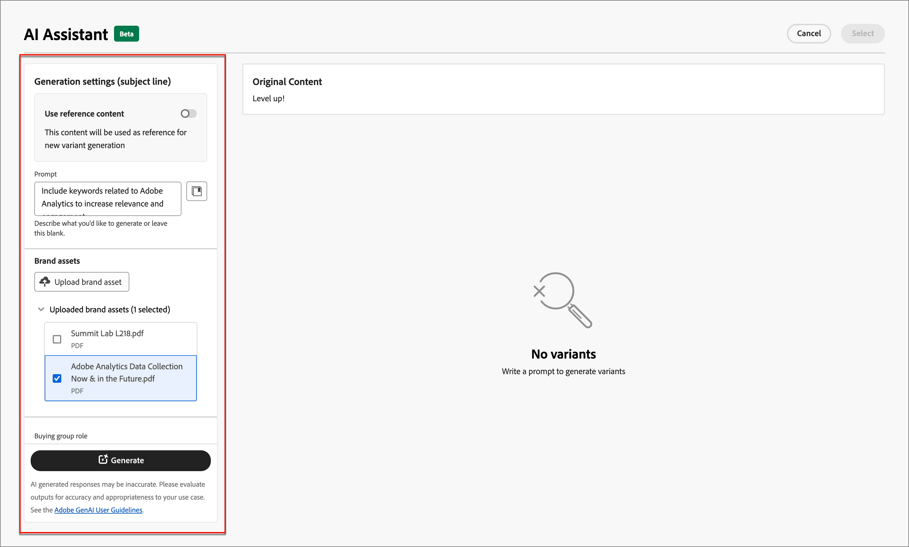

# 用于电子邮件创作的AI助手

随着营销行业的竞争日益激烈，各大品牌都在寻求高效的方法来快速高效地生成有影响力的内容。 用于Adobe Journey Optimizer B2B版本中电子邮件创作的AI Assistant是Adobe提供的AI支持的内容生成功能，它彻底改变了营销人员创建专业且品牌一致的电子邮件内容的方式。 借助高级GenAI模型以及对品牌准则的深入了解，AI Assistant可根据营销目标自动生成个性化、引人入胜且有效的内容，其内容针对品牌概述的样式、布局、色调等进行了优化。 AI Assistant使电子邮件营销活动的创建和执行变得直观、简单而轻松。 将此功能添加到工作流可以节省时间、提高效率并取得更好的结果。

此新功能提供了基于提示的文本生成、完整电子邮件生成以及电子邮件结构中的内容生成。 不会生成图像，但建议从输入品牌资产的图像目录中将图像添加到模型。 您还可以使用此功能生成最佳主题行和预标题来影响打开率。

>[!NOTE]
>
>此功能在其Beta版本中提供，如有更改，恕不另行通知。

## 准则和限制

在开始使用Adobe Journey Optimizer B2B版本中的AI Assistant生成电子邮件内容之前，请查看以下准则：

* 您定义的营销目标/提示是所生成内容质量的关键决定因素。 使用明确定义的GenAI模型提示来准确地解释。
* 上传品牌资产，以根据品牌内容获得准确的信息。 如果没有这些资产，内容将基于公开可用的信息。
   * 上传的资源可以是以下格式：PDF、JPEG、PNG或ZIP文件（包含支持的文件格式）。
   * 上传的品牌资产的最大大小为50 MB。 较大的文件或大量的图像可能会工作，但处理时间会增加。
* 使用Adobe Journey Optimizer B2B Edition创作的电子邮件模板（最好是内置或示例模板）、品牌特定的模板或自定义模板来创建电子邮件内容。 建议使用最多包含八到十张图像的电子邮件模板。
* 确保使用拇指按下或标记图标针对生成的变体报告任何有问题的输出。
* AI助手的使用受[Adobe生成AI用户准则](https://www.adobe.com/cn/legal/licenses-terms/adobe-gen-ai-user-guidelines.html)的约束。

以下限制适用于用于生成电子邮件内容的Adobe Journey Optimizer B2B版本中的AI助手：

* 英语是唯一受支持的语言。
* 它仅适用于电子邮件渠道。
* GenAI内容可能不准确 — 请分享您的反馈，以便Adobe工程师可以优化模型。
* 您可以上传多个品牌资产，但只能为特定的一代利用一个。

>[!BEGINSHADEBOX]

## 提示库

有效的提示对于生成最佳内容至关重要。 如果您需要有关创建提示的帮助，请访问&#x200B;_提示库_。 此库提供了各种提示性想法来改进内容生成。

{width="500" zoomable="no"}

选择最能反映您预期目标的提示，并添加指定您的品牌、产品、营销活动和用例的所需值。

>[!ENDSHADEBOX]

## 购买团体角色

Adobe Journey Optimizer B2B版本提供了五个现成的标准B2B购买团体角色。 每个购买团体角色都有不同的消息传递重点：

| 角色 | 消息传送重点 |
| ---- | --------------- |
| 执行指导委员会 | 产品信息 定价 技术集成详细信息 产品特性和功能 |
| 影响因素 | 质量证明 易于实施 主题专业知识 竞争优势 |
| 决策者 | 投资回报率 财务价值(RoI)  客户案例 |
| 从业者 | 易用性 产品特性和功能 产品兼容性 产品集成的便利性 |
| 冠军 | 教育内容 思想领导力内容 客户案例 |

选择其中一个购买组角色可根据每个购买组角色的特性和感兴趣的主题自动自定义输出。

## 使用AI助手生成电子邮件属性

当您[将电子邮件操作](./email-authoring.md#add-an-email-action-in-an-account-journey)添加到帐户历程时，您定义了一组用于发送电子邮件的电子邮件属性。 AI助手可以生成电子邮件&#x200B;**主题行**&#x200B;和&#x200B;**预编译标头**&#x200B;的推荐内容，从而帮助实现更好的电子邮件参与。

1. 从帐户历程创建电子邮件或从历程节点打开现有电子邮件。

   电子邮件预览页面在右侧显示&#x200B;_[!UICONTROL 电子邮件属性]_。

1. 选择以下任意选项卡，了解如何在电子邮件属性创作中使用AI助手。

>[!BEGINTABS]

>[!TAB 主题行生成]

以下步骤描述了使用AI Assistant为您的电子邮件生成优化主题行的任务序列：

1. 在&#x200B;_[!UICONTROL 电子邮件属性]_&#x200B;中，单击&#x200B;**[!UICONTROL 主题行]**&#x200B;字段右侧的AI助手图标（{width="30" zoomable="no"}）。

   电子邮件主题行](./assets/email-properties-ai-assistant-subject-line-icon.png){width="600" zoomable="yes"}的![AI助手访问权限

   此时将打开AI Assistant弹出窗口，其中包含电子邮件主题行的生成设置。

   根据与电子邮件关联的电子邮件内容，或者您希望使用主题行以满足您的用途的方式，有几个选项可用于生成主题行文本：

   * 您可以在不提示或品牌资产的情况下立即单击&#x200B;**[!UICONTROL 生成]**，以使用现有电子邮件正文作为主题行生成的上下文。

   * （推荐）您可以提供提示、品牌资产和其他设置值，以提供上下文来生成符合您需求的最佳主题行文本。 （步骤2至7）

1. 在&#x200B;**[!UICONTROL 提示]**&#x200B;字段中，输入要生成的内容的描述。

   如果您需要有关创建有效提示的帮助，请使用[提示库](#prompt-library)。

1. 指定包含要用作文本生成源的内容的Brand资产。

   * 从目录中选择资源。

   * 单击&#x200B;**[!UICONTROL 上传品牌资产]**&#x200B;以添加品牌资产文件。

   {width="600" zoomable="yes"}

1. 如果需要，请滚动并选择&#x200B;**[!UICONTROL 购买团体角色]**&#x200B;以用作所生成文本的目标受众。

1. 如果需要，请使用消息传送选项来定制内容：

   * **[!UICONTROL 通信策略]** — 为生成的文本选择最合适的通信样式。
   * **[!UICONTROL 语言]** — 选择您希望生成内容的语言。
   * **[!UICONTROL 音调]** — 选择与受众产生共鸣的音调。 如果您指定希望听起来能够提供信息、富有趣味或有说服力，AI Assistant可以相应地调整消息。

1. 如果需要，请使用滑块设置要生成的文本的所需长度。

1. 根据您的喜好更改&#x200B;**[!UICONTROL 使用表情符号]**&#x200B;选项（打开或关闭）。

1. 提示和设置就绪后，单击&#x200B;**[!UICONTROL 生成]**。

1. 滚动AI助手面板并浏览生成的变体以确定哪个变体最适合。

   * 单击&#x200B;**[!UICONTROL 预览]**&#x200B;可查看所选变体的全屏版本。

   * 通过单击&#x200B;_拇指向上_、_拇指向下_&#x200B;或&#x200B;_标记_&#x200B;图标，为生成的变体提供反馈，并选择最能总结您的反馈的原因。

1. 导航到“预览”窗口中的&#x200B;_优化_&#x200B;选项以访问其他自定义功能：

   * **[!UICONTROL 用作引用内容]** — 选择此选项可将变体用作用于生成其他结果的引用内容。

   * **[!UICONTROL 重新短语]** - AI助手可以通过不同的方式重新短语您的消息，使您的写作保持新鲜，并吸引各种受众。

   * **[!UICONTROL 使用更简单的语言]** — 利用AI Assistant简化您的语言，确保为更广泛的受众提供清晰易懂的语言。

   {width="600" zoomable="yes"}

1. 单击&#x200B;**[!UICONTROL 选择]**&#x200B;以使用所选变体替换主题行文本并返回电子邮件属性。

>[!TAB 预标头生成]

电子邮件预告是在收件箱中查看电子邮件时遵循主题行的简短摘要文本。 它是电子邮件的一项可选元素，但也是提高参与度的绝佳机会。 以下步骤描述了使用AI Assistant为您的电子邮件生成优化的预标头的任务序列：

1. 在电子邮件属性中，选中&#x200B;**[!UICONTROL Preheader]**&#x200B;复选框，然后单击右侧的AI助手图标（ {width="30" zoomable="no"}）。

   {width="600" zoomable="yes"}

   此时将打开AI Assistant弹出窗口，其中包含电子邮件标头的生成设置。

   根据与电子邮件关联的电子邮件内容或要定位电子邮件的方式，有几个选项可用于生成预编译标头：

   * 您可以在不提示或品牌资产的情况下立即单击&#x200B;**[!UICONTROL 生成]**，以使用现有电子邮件正文作为生成预标头的上下文。

   * （推荐）您可以提供提示、品牌资产和其他设置值，以提供上下文来生成符合您需求的最佳预编译标头。 （步骤2至7）

1. 在&#x200B;**[!UICONTROL 提示]**&#x200B;字段中，输入要生成的内容的描述。

   如果您需要有关创建有效提示的帮助，请使用[提示库](#prompt-library)。

1. 指定包含要用作文本生成源的内容的Brand资产。

   * 从目录中选择资源。

   * 单击&#x200B;**[!UICONTROL 上传品牌资产]**&#x200B;以添加品牌资产文件。

   {width="600" zoomable="yes"}

1. 如果需要，请滚动并选择&#x200B;**[!UICONTROL 购买团体角色]**&#x200B;以用作所生成文本的目标受众。

1. 如果需要，请使用消息传送选项来定制内容：

   * **[!UICONTROL 通信策略]** — 为生成的文本选择最合适的通信样式。
   * **[!UICONTROL 语言]** — 选择您希望生成内容的语言。
   * **[!UICONTROL 音调]** — 选择与受众产生共鸣的音调。 如果您指定希望听起来能够提供信息、富有趣味或有说服力，AI Assistant可以相应地调整消息。

1. 如果需要，请使用滑块设置要生成的文本的所需长度。

1. 根据您的喜好更改&#x200B;**[!UICONTROL 使用表情符号]**&#x200B;选项（打开或关闭）。

1. 提示和设置就绪后，单击&#x200B;**[!UICONTROL 生成]**。

1. 滚动AI助手面板并浏览生成的变体以确定哪个变体最适合。

   * 单击&#x200B;**[!UICONTROL 预览]**&#x200B;可查看所选变体的全屏版本。

   * 通过单击&#x200B;_拇指向上_、_拇指向下_&#x200B;或&#x200B;_标记_&#x200B;图标，为生成的变体提供反馈，并选择最能总结您的反馈的原因。

1. 导航到“预览”窗口中的&#x200B;_优化_&#x200B;选项以访问其他自定义功能：

   * **[!UICONTROL 用作引用内容]** — 选择此选项可将变体用作用于生成其他结果的引用内容。

   * **[!UICONTROL 重新短语]** - AI助手可以通过不同的方式重新短语您的消息，使您的写作保持新鲜，并吸引各种受众。

   * **[!UICONTROL 使用更简单的语言]** — 利用AI Assistant简化您的语言，确保为更广泛的受众提供清晰易懂的语言。

   {width="600" zoomable="yes"}

1. 单击&#x200B;**[!UICONTROL 选择]**&#x200B;将预标头替换为所选变体并返回电子邮件属性。

>[!ENDTABS]

## 使用AI助手生成电子邮件正文内容

在您[创建并个性化您的电子邮件](./email-authoring.md#create-the-email-content)后，请使用由创作AI提供支持的Adobe Journey Optimizer B2B版本中的AI助手，将您的电子邮件正文内容提升到新的级别。

在Email Designer中，AI Assistant通过生成完整的电子邮件正文、有针对性的文本内容以及可与受众引起共鸣的图像推荐，帮助您优化投放的影响。 这种电子邮件促销活动优化旨在提高参与度。

1. 从帐户历程创建电子邮件，然后单击&#x200B;**[!UICONTROL 打开电子邮件Designer]**&#x200B;或&#x200B;**[!UICONTROL 添加电子邮件内容]**。

1. 在可视电子邮件设计器中选择并打开电子邮件模板。

1. 根据历程节点的需要个性化电子邮件。

1. 选择以下任意选项卡，了解如何在电子邮件正文内容创作中使用AI助手。

>[!BEGINTABS]

>[!TAB 生成完整电子邮件]

以下步骤描述了使用AI Assistant优化现有电子邮件模板的任务序列：

1. 在电子邮件设计器中，通过单击右侧的图标（{width="30" zoomable="no"} ）访问AI助手菜单。

   电子邮件设计器中的{width="600" zoomable="yes"}

   右侧的AI助手设置反映了&#x200B;_生成设置（完整电子邮件）_。

1. 在&#x200B;**[!UICONTROL 提示]**&#x200B;字段中，输入要生成的内容的描述。

   如果您需要有关创建有效提示的帮助，请使用[提示库](#prompt-library)。

   {width="600" zoomable="yes"}

1. 指定一个品牌资产，该资产包含可为AI助手提供其他上下文的内容。

   * 从目录中选择资源。

   * 单击&#x200B;**[!UICONTROL 上传品牌资产]**&#x200B;以添加品牌资产文件。

   此输入资产用作电子邮件中内容生成和图像推荐的源。

1. 选择&#x200B;**[!UICONTROL 购买团体角色]**&#x200B;作为电子邮件通信的目标受众。

1. 如果需要，请使用消息传送选项来定制内容：

   * **[!UICONTROL 通信策略]** — 为生成的文本选择最合适的通信样式。
   * **[!UICONTROL 语言]** — 选择您希望生成内容的语言。
   * **[!UICONTROL 音调]** — 选择与受众产生共鸣的音调。 如果您指定希望听起来能够提供信息、富有趣味或有说服力，AI Assistant可以相应地调整消息。
   * **内容类型** — 选择反映可视化元素性质的选项。 此设置区分不同形式的可视表示，如照片、图形或艺术品。

1. 提示就绪后，单击&#x200B;**[!UICONTROL 生成]**。

1. 滚动AI助手面板并浏览生成的变体以确定哪个变体最适合。

   * 单击&#x200B;**[!UICONTROL 预览]**&#x200B;可查看所选变体的全屏版本。

   * 通过单击&#x200B;_拇指向上_、_拇指向下_&#x200B;或&#x200B;_标记_&#x200B;图标，为生成的变体提供反馈，并选择最能总结您的反馈的原因。

     {width="600" zoomable="yes"}

1. 单击&#x200B;**[!UICONTROL 选择]**&#x200B;以将模板内容替换为所选变体并返回电子邮件设计器。

   在电子邮件设计器中，您可以使用画布上的编辑和格式化工具来更改内容，以及右侧的&#x200B;_[!UICONTROL 设置]_&#x200B;和&#x200B;_[!UICONTROL 样式]_&#x200B;选项。

>[!TAB 文本生成]

以下步骤描述了使用AI助手优化或增强现有电子邮件的文本内容的任务序列：

1. 在电子邮件设计器中，通过单击右侧的图标（{width="30" zoomable="no"} ）访问AI助手菜单。

   电子邮件设计器中的{width="600" zoomable="yes"}

1. 选择一个&#x200B;_Text_&#x200B;组件以定位特定内容。

   右侧的AI助手设置反映了&#x200B;_生成设置（文本）_。

1. 在&#x200B;**[!UICONTROL 提示]**&#x200B;字段中，输入要生成的内容的描述。

   {width="600" zoomable="yes"}

   如果您需要有关创建有效提示的帮助，请使用[提示库](#prompt-library)。

1. 指定包含要用作文本生成源的内容的Brand资产。

   * 从目录中选择资源。

   * 单击&#x200B;**[!UICONTROL 上传品牌资产]**&#x200B;以添加品牌资产文件。

1. 选择&#x200B;**[!UICONTROL 购买团体角色]**&#x200B;作为所生成文本的目标受众。

1. 如果需要，请使用语言和消息传送选项来定制内容：

   * **[!UICONTROL 通信策略]** — 为生成的文本选择最合适的通信样式。
   * **[!UICONTROL 语言]** — 选择您希望生成内容的语言。
   * **[!UICONTROL 音调]** — 选择与受众产生共鸣的音调。 如果您指定希望听起来能够提供信息、富有趣味或有说服力，AI Assistant可以相应地调整消息。

1. 如果需要，请使用滑块设置要生成的文本的所需长度。

1. 提示就绪后，单击&#x200B;**[!UICONTROL 生成]**。

1. 浏览生成的&#x200B;_变体_&#x200B;并单击&#x200B;**[!UICONTROL 预览]**&#x200B;以查看所选变体的全屏版本。

1. 导航到“预览”窗口中的&#x200B;_优化_&#x200B;选项以访问其他自定义功能：

   * **[!UICONTROL 用作引用内容]** — 选择此选项可将变体用作用于生成其他结果的引用内容。

   * **[!UICONTROL 精心设计]** - AI助手可以帮助您展开特定主题，提供其他详细信息以便更好地了解和参与。

   * **[!UICONTROL 摘要]** — 过长的信息可能会使电子邮件收件人过载。 使用AI Assistant将关键点浓缩为清晰、简洁的摘要，以吸引注意并鼓励他们进一步阅读。

   * **[!UICONTROL 重新短语]** - AI助手可以通过不同的方式重新短语您的消息，使您的写作保持新鲜，并吸引各种受众。

   * **[!UICONTROL 使用更简单的语言]** — 利用AI Assistant简化您的语言，确保为更广泛的受众提供清晰易懂的语言。

   {width="700" zoomable="yes"}

1. 获得所需的内容后，单击&#x200B;**[!UICONTROL 选择]**&#x200B;以使用选定的变体替换文本并返回电子邮件设计器。

   在电子邮件设计器中，您可以使用画布上的编辑和格式化工具来更改文本，以及右侧的&#x200B;_[!UICONTROL 设置]_&#x200B;和&#x200B;_[!UICONTROL 样式]_&#x200B;选项。

>[!TAB 图像推荐]

您可以使用AI Assistant优化和改进资源，并确保获得对用户更友好的体验。 以下步骤描述了使用AI Assistant增强电子邮件图像内容的任务序列：

1. 通过单击右侧的图标（{width="30" zoomable="no"}）访问AI助手菜单。

   电子邮件设计器中的{width="600" zoomable="yes"}

1. 选择&#x200B;_图像_&#x200B;组件以定位特定内容并访问AI助手菜单。

   右侧的设置反映了&#x200B;_[!UICONTROL 生成设置（图像）]_。

1. 要优化资产，请在&#x200B;**[!UICONTROL 提示]**&#x200B;字段中输入所需内容的描述。

   {width="600" zoomable="yes"}

   如果您需要有关创建有效提示的帮助，请使用[提示库](#prompt-library)。

1. 单击&#x200B;**[!UICONTROL 上载品牌资产]**&#x200B;可添加任何包含可为AI助手提供其他上下文的内容的品牌资产。

   如果所需资产已可用，请展开&#x200B;**[!UICONTROL 已上传的品牌资产]**，然后选择该资产。

   您的提示必须始终绑定到现有资源。

1. 使用图像设置优化提示：

   * **[!UICONTROL 宽高比]** — 此设置确定资源的宽度和高度。 您可以选择常用比率，如16:9、4:3、3:2或1:1，也可以输入自定义大小。
   * **[!UICONTROL 颜色和色调]** — 此设置会影响图像内颜色的整体外观及其传达的气氛或氛围。
   * **[!UICONTROL 内容类型]** — 此设置对可视元素的性质进行分类，区分不同的可视表示形式，如照片、图形或艺术品。
   * **[!UICONTROL 照明]** — 此设置可调整图像中存在的闪电，该闪电会塑造图像的大气并突出显示特定元素。
   * **[!UICONTROL 合成]** — 此设置确定图像帧中元素的排列。

1. 如果对提示配置感到满意，请单击&#x200B;**[!UICONTROL 生成]**。

   AI Assistant会处理请求，并根据提示和其他输入从输入品牌资产中推荐最适合的图像。

   >[!IMPORTANT]
   >
   >如果输入品牌资产中没有图像，或者没有与输入提示相关的图像，则输出为空。

1. 浏览&#x200B;_[!UICONTROL 变体]_&#x200B;并选择最适合电子邮件的变体。

   要查看所选变体的全屏版本，请单击&#x200B;**[!UICONTROL 预览]**。

1. 突出显示所需的图像，然后单击&#x200B;**[!UICONTROL 选择]**&#x200B;将图像或占位符替换为选定项，并返回电子邮件设计器。

   在电子邮件设计器中，您可以使用画布上的编辑和格式化工具来更改内容，以及右侧的&#x200B;_[!UICONTROL 设置]_&#x200B;和&#x200B;_[!UICONTROL 样式]_&#x200B;选项。

>[!ENDTABS]
