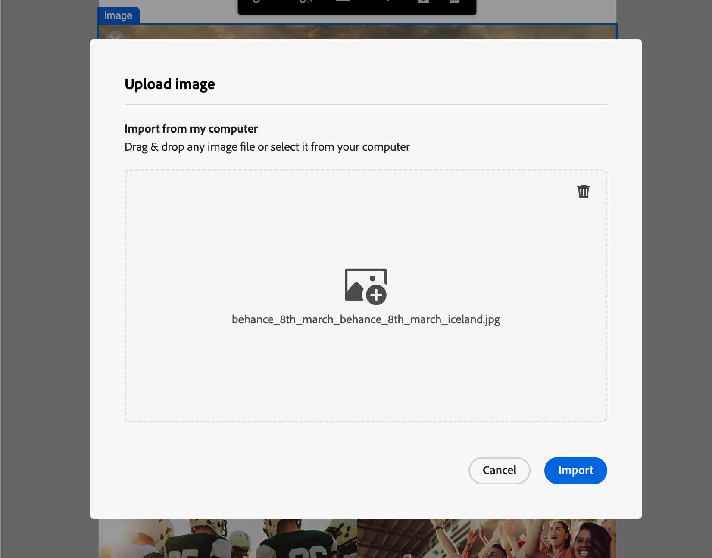

# 资产

在 Adobe Journey Optimizer B2B Edition 中，资产通常是指在设计支持帐户历程的内容时使用的图像。您可以通过资产选择器或可视内容编辑器中的简单拖放界面在电子邮件、电子邮件模板和片段中使用这些图像。

Adobe Journey Optimizer B2B Edition 为营销人员提供两种类型的资产库：Adobe Marketo Engage Design Studio 和 Adobe Experience Manager Assets as a Cloud Service。您可以只使用 Adobe Marketo Engage Design Studio，或者使用同时配置的两种库（基于您拥有的 AEM Assets 许可证）。

## 资产管理

如果您配置了 Adobe Experience Manager as a Cloud Services，当您的用户帐户具有所需的权限时，您就可以访问 Marketo Engage Design Studio 和 Adobe Experience Manager Assets as a Cloud Service 的存储库。这两个存储库是独立的，且不同步。您可以使用两者中任一来源的图像。

### Adobe Marketo Engage 资产

每个 Journey Optimizer B2B Edition 订阅都默认提供 Adobe Marketo Engage Design Studio 资产存储库。这意味着您可以访问存储在 Adobe Marketo Engage（[!UICONTROL Design Studio] > [!UICONTROL 图像和文件]）中的任何图像资产。您可以将该存储库用作您的本地资产库，包含上传和下载资产功能。您还可以在历程内容中使用这些资产。

内置护栏可防止从 Journey Optimizer B2B Edition 对 Marketo Engage 资产进行编辑、删除和移动的操作。这些保护措施可确保源资产（Marketo Engage Design Studio）得到保护，同时允许在 Journey Optimizer B2B Edition 中无缝读取和重复使用。

支持的文件格式：JPG、JPEG、GIF、PNG、EPS、SVG 和 RGB

### Adobe Experience Manager Assets as a Cloud Service

使用 Adobe Experience Manager Assets 将营销和创意工作流结合在一起。它与 Adobe Journey Optimizer B2B Edition 原生集成，因此您可以轻松访问 Assets as a Cloud Service 来发现和使用数字资产。它提供了对 Assets 存储库的访问，您可以使用这些资产来填充您的消息。

Adobe Journey Optimizer B2B Edition 可以连接到 Adobe Experience Manager Assets as a Cloud Service，进行集中资产管理，从而扩展您的创意系统，并为体验投放统一数字资产。Adobe Experience Manager Assets as a Cloud Service 提供了易于使用的云解决方案，有助于高效的数字资产管理和动态媒体运营。它无缝地融合了先进的功能，包括人工智能和机器学习。

更多详情请参阅 [Adobe Experience Manager as a Cloud Service 文档](https://experienceleague.adobe.com/zh-hans/docs/experience-manager-cloud-service/content/assets/overview){target="_blank"}。

{{aem-assets-licensing-note}}

在 Journey Optimizer B2B Edition 中，通过内容设计左侧导航中的 **[!UICONTROL Experience Manager Assets]** 项直接访问 Adobe Experience Manager Assets。您还可以在设计电子邮件、电子邮件模板和可视片段内容时访问资产和文件夹。

目前，您只能在 Adobe Journey Optimizer B2B Edition 中使用来自 Adobe Experience Manager Assets 的图像。

## 使用资产进行内容创作

在创作电子邮件、电子邮件模板和可视片段时使用资产。通过可视内容编辑器可访问所连接资产存储库中的图像。如果您订阅了 Experience Manager Assets as a Cloud Service 以及默认的 Adobe Marketo Engage Design Studio，就可以选择任一来源的图像资产。您还可以上传图像资产，将其放置在所连接的 Marketo Engage Design Studio 存储库的 Journey Optimizer B2B Edition 工作区中。

您可以在编辑图像组件的设置时选择图像源，也可以直接在画布上选择：

* **_图像组件设置_**——如果您在可视设计器中选择了图像组件，就可以在右侧面板中查看和编辑设置。要添加或更改组件中显示的图像文件，请选择源类型，然后选择一个图像文件。

  {width="350"}

* **_空组件_**——当您在可视设计器中添加图像组件，该组件是空的，您可以轻松选择来源和图像文件。

  {width="500"}

* **_图像组件工具栏_**——当您在可视设计器中选择了图像组件，您可以在工具栏中轻松选择来源和图像文件。

  {width="500"}

您可以在创作内容时添加图像资产，具体取决于图像资产来源。您还可以在某个结构组件的背景设置中选择图像资产。

>[!BEGINTABS]

>[!TAB Marketo Engage Assets]

单击 **[!UICONTROL Marketo Engage Assets]** 打开资产选择器，您可以从 Marketo Engage 工作区或 Journey Optimizer B2B Edition 工作区中选择图像。

{width="700" zoomable="yes"}

您可以使用搜索和过滤器来找到所需的图像资产。选择资产，然后单击&#x200B;**[!UICONTROL 选择]**，将其用于图像组件。

有关使用 Marketo Engage 图像资产的详细信息，请参阅[在您的内容中使用资产](./marketo-engage-design-studio.md#use-assets-in-your-content)。

>[!TAB Experience Manager Assets]

单击 **[!UICONTROL Experience Manager Assets]** 打开资产选择器，您可以从 Experience Manage Assets 存储库中选择图像。

{width="700" zoomable="yes"}

您可以使用搜索和过滤器来找到所需的图像资产。选择资产，然后单击&#x200B;**[!UICONTROL 选择]**，将其用于图像组件。

有关使用 Experience Manager Assets 中图像文件的详细信息，请参阅 [Access AEM Assets 图像](./aem-assets.md#access-aem-assets-images)。

>[!TAB 导入媒体]

单击&#x200B;**[!UICONTROL 导入媒体]**，选择图像文件，并将其导入为可用于 Journey Optimizer B2B Edition 内容的资产。

{width="500" zoomable="yes"}

拖放文件或从文件系统中选择文件后，单击&#x200B;**[!UICONTROL 导入]**。导入的资产存储在 Adobe Marketo Engage Design Studio 存储库的 Journey Optimizer B2B Edition 工作区中。

>[!ENDTABS]
