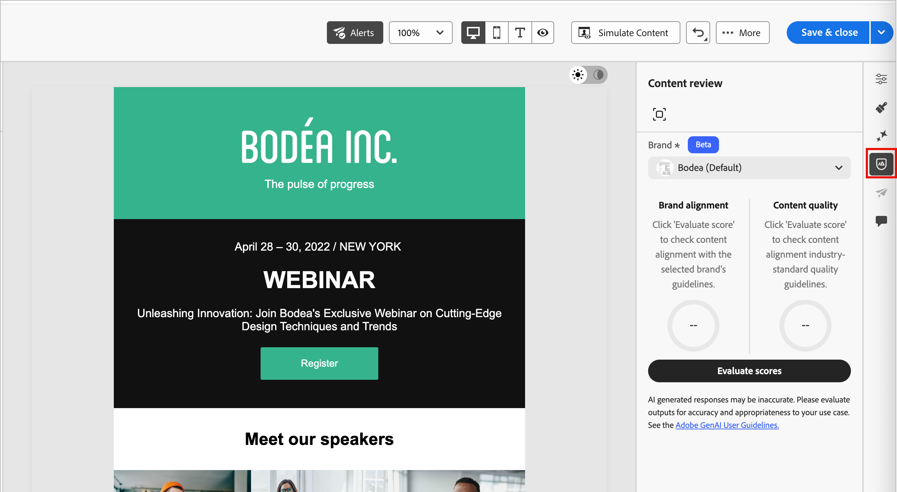
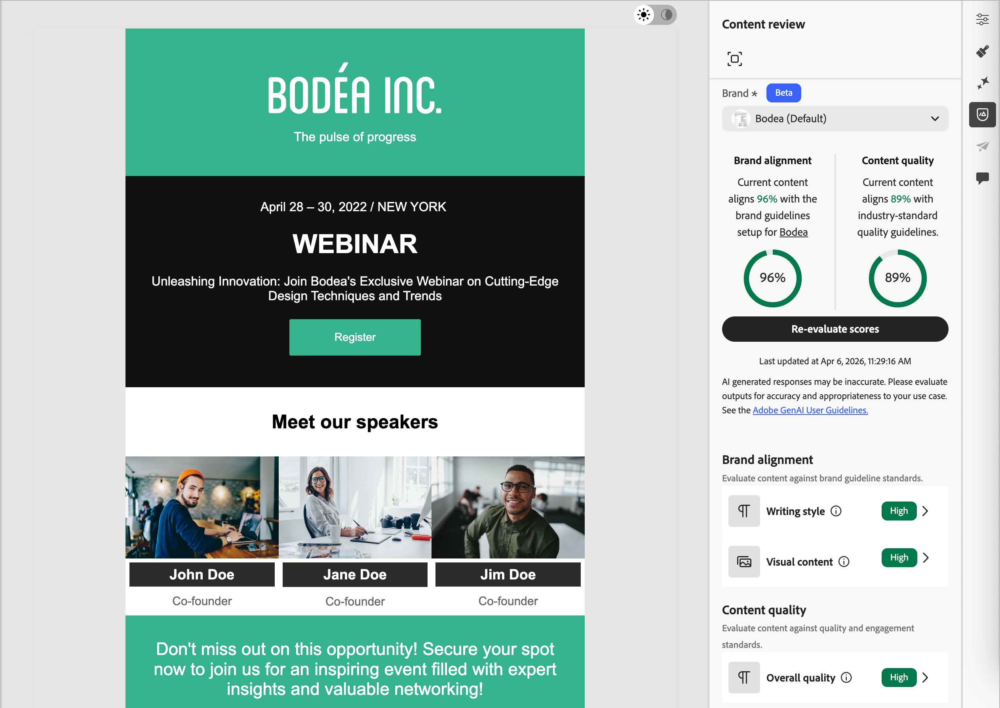
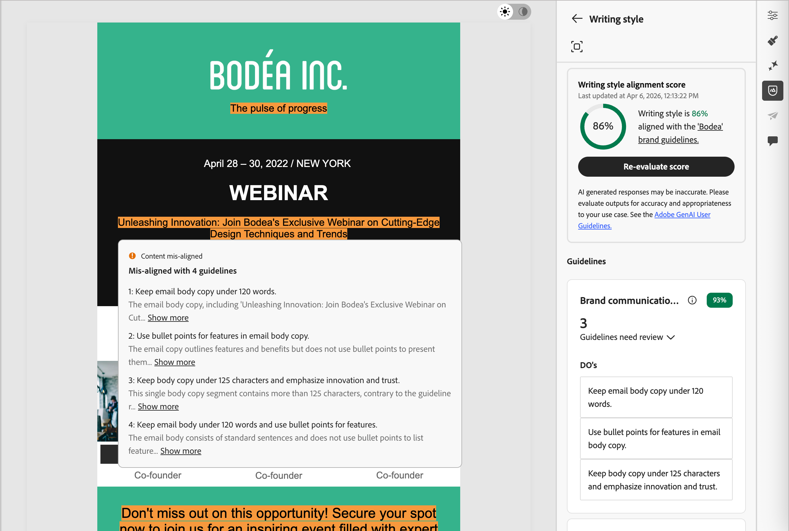

# 品牌一致性评分 {#brand-score}

>[!CONTEXTUALHELP]
>id="ajo-b2b_brand_score_overview"
>title="品牌选择"
>abstract="选择您的品牌，以确保您的内容制作符合其特定的指导方针、标准和身份，从而保持一致性和品牌完整性。"

>[!CONTEXTUALHELP]
>id="ajo-b2b_brand_score"
>title="品牌一致性得分"
>abstract="您的品牌一致性得分衡量了您的内容对品牌指南的遵循程度，旨在确保颜色、字体、徽标、图像和写作风格的一致性。"

>[!CONTEXTUALHELP]
>id="ajo-b2b_brand_colors"
>title="颜色得分"
>abstract="颜色得分"

>[!CONTEXTUALHELP]
>id="ajo-b2b_brand_fonts"
>title="字体得分"
>abstract="字体得分"

>[!CONTEXTUALHELP]
>id="ajo-b2b_brand_logos"
>title="徽标得分"
>abstract="徽标得分"

品牌一致性评估和分数可帮助您创建、审阅和管理符合所选品牌[中定义的准则](./brands-manage-create.md#brand-definitions)的内容。 它可确保电子邮件促销活动在语气、消息传递和视觉身份方面保持一致，同时在内容上线之前用作质量检查。

>[!AVAILABILITY]
>
>此功能目前作为专用测试版提供，计划在未来版本中逐步提供给所有客户。
>
>在Adobe Journey Optimizer B2B edition中使用AI支持的功能之前，需要[用户协议](https://www.adobe.com/cn/legal/licenses-terms/adobe-dx-gen-ai-user-guidelines.html){target="_blank"}。 有关更多信息，请与您的 Adobe 代表联系。
>
>有关产品管理员如何启用这些功能的信息，请参阅[与品牌相关的权限](./brands-overview.md#brand-related-permissions)。

## 验证您的品牌一致性

当您的品牌得到明确定义和发布时，请直接在电子邮件设计空间内评估您的品牌一致性分数，以确保内容符合您的品牌准则：

1. 创建电子邮件内容后，单击右侧的&#x200B;_品牌对齐方式_ （ ）图标，在电子邮件设计空间中打开&#x200B;_品牌对齐方式_&#x200B;右侧面板。

   已自动选择[默认品牌](./brands-manage-create.md#default-brand)。

   {width="600" zoomable="yes"}

   您可以单击面板顶部的&#x200B;_全屏_ （ ）图标，以全屏模式显示品牌对齐工具。

1. 如果需要，请单击&#x200B;**[!UICONTROL 品牌]**&#x200B;菜单箭头（）以选择其他已发布的品牌。

1. 单击&#x200B;**[!UICONTROL 评估得分]**，为内容与选定品牌的对齐程度评分。

   系统会根据选定品牌的指南评估内容，并显示相应的得分。

   {width="600" zoomable="yes"}

## 审查评估

根据评估的电子邮件内容中标识的违规来计算得分：

* 100 =完美 — 未找到违规
* 80-99 =良好 — 仅轻微违规
* 60-79 =公平 — 一些重大违反行为
* 60以下=差 — 严重违规需要注意

您可以更详细地查看评估结果，以帮助您识别违规并提高类别一致性分数(_高_、_Medium_&#x200B;和&#x200B;_低_)并查看详细信息。 对于&#x200B;**[!UICONTROL 写入样式]**&#x200B;或&#x200B;**[!UICONTROL 可视内容]**，单击&#x200B;_展开_ （）箭头以显示评估的详细信息。

{width="600" zoomable="yes"}

选择任意已标记的准则以查看特定反馈和建议。

您可以更改内容，然后单击&#x200B;**[!UICONTROL 重新评估分数]**&#x200B;以运行另一个评估并检查改进的结果。
