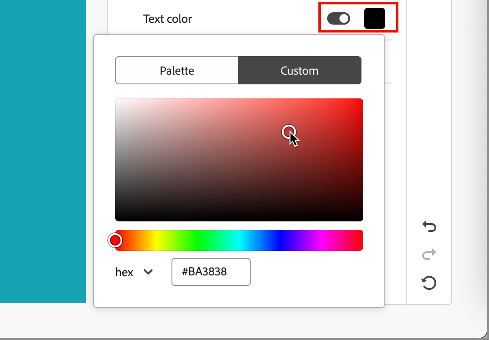
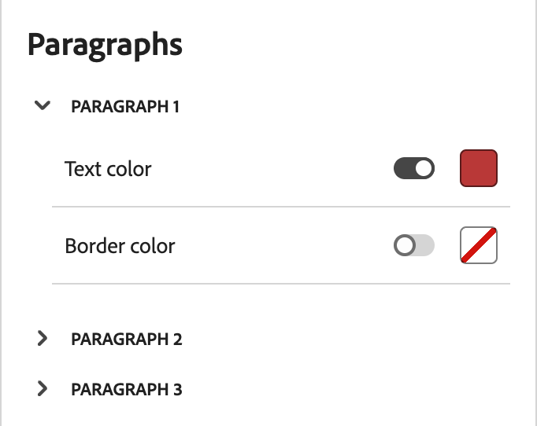
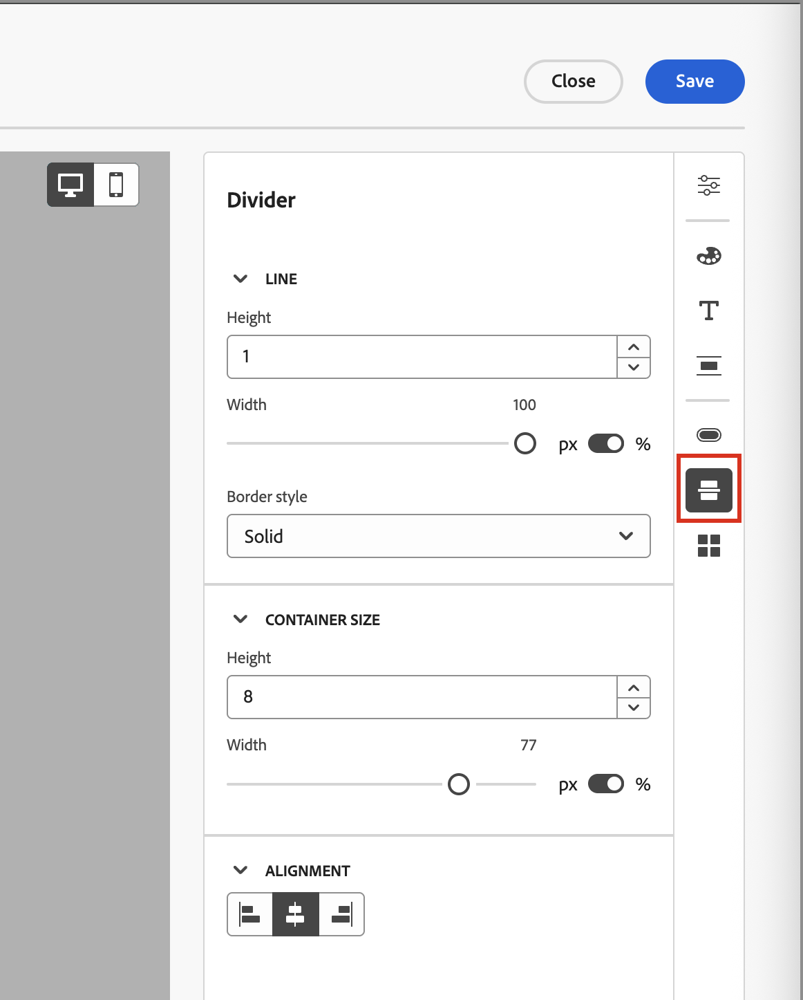

# 为电子邮件内容使用品牌主题 {#email-brand-themes}

>[!CONTEXTUALHELP]
>id="ajo-b2b_email_brand_theme"
>title="在您的电子邮件或电子邮件模板中应用品牌主题"
>abstract="为您的电子邮件或电子邮件模板选择一个主题，应用一种符合您的品牌和设计的样式。"

通过主题，非技术设计人员能够创建符合特定品牌和样式的可重用电子邮件内容设计准则。 主题使营销人员能够更快地利用具有视觉吸引力、品牌一致的电子邮件，而且所需的工作量更少，并提供高级自定义选项以满足独特的设计需求。

## 主题准则和限制 {#themes-guidelines}

在处理主题时，请牢记以下准则和限制：

* 当您从空白画布（_从头开始设计_）创建电子邮件或电子邮件模板时，可以选择&#x200B;_主题模式_&#x200B;以开始使用主题构建内容，以应用符合您的品牌和设计的特定样式。 如果选择&#x200B;_手动模式_，则无法应用主题，除非重置电子邮件或电子邮件模板的设计。

* [片段](./fragments.md)在电子邮件内容中的&#x200B;_主题模式_&#x200B;和&#x200B;_手动模式_&#x200B;之间不交叉兼容。 要在应用主题的电子邮件内容中使用片段，还必须在&#x200B;_主题模式_&#x200B;中创建片段。

* 对自定义主题的更改不会自动级联到已使用该主题的所有电子邮件或电子邮件模板。 编辑每个主题的内容以刷新主题。

* 如果删除主题，则不会影响已应用该主题的任何电子邮件或电子邮件模板。
<!-- 
* If using a content created in HTML, you will be in [compatibility mode](existing-content.md) and you cannot apply themes to this content.
-->

## 创建品牌主题 {#create-theme}

定义您自己的品牌主题，以便将来在电子邮件内容中应用于电子邮件和电子邮件模板内容。

1. 使用下列方法之一访问主题工具：

   * [创建新的电子邮件模板](./email-templates.md#create-an-email-template)，然后单击&#x200B;**[!UICONTROL 编辑电子邮件模板]**&#x200B;以启动&#x200B;_[!UICONTROL 设计您的模板]_&#x200B;页面。

   * 单击&#x200B;**[!UICONTROL ...在电子邮件内容设计空间的右上角显示更多]**，然后选择&#x200B;**[!UICONTROL 更改您的设计]**。

     {width="700" zoomable="yes"}

     在确认对话框中，单击&#x200B;**[!UICONTROL 更改模板]**&#x200B;以打开设计页。

1. 在设计页面中，选择&#x200B;**[!UICONTROL 创建或编辑主题]**。

   {width="800" zoomable="yes"}

1. 选择默认主题，或使用任何Adobe主题作为起点。

   >[!NOTE]
   >
   >如果要使用某个自定义主题（_[!UICONTROL 我的主题]_）作为起点，您可以[复制它](#delete-or-duplicate-a-theme)，并在[编辑主题](#edit-a-theme)时更改主题名称。

1. 单击&#x200B;**[!UICONTROL 创建]**。

   {width="750" zoomable="yes"}

   _[!UICONTROL 创建主题]_&#x200B;页面提供了一个画布，其中包含起始主题中所有类型的文本、按钮和容器的现有元素。

1. 使用正确的导航来访问不同的主题样式选项卡并更改主题设置：

   * [常规设置](#general-settings)
   * [颜色](#colors)
   * [文本设置](#text-settings)
   * [间距和边框](#spacing-and-border)
   * [按钮](#button)
   * [分隔条](#divider)
   * [网格](#grid)

   当您定义新的主题设置时，画布上的可视化元素会发生变化。 如果结果不是您想要的结果，您可以单击右面板底部的&#x200B;_撤消_ （ {width="16"} ）图标。 单击&#x200B;_重做_ （{width="16"} ）图标以重新应用更改。

1. 完成主题定义后，单击&#x200B;**[!UICONTROL 保存]**。

1. 单击&#x200B;**[!UICONTROL 关闭]**&#x200B;以返回&#x200B;_[!UICONTROL 创建主题]_&#x200B;页面，然后单击&#x200B;**[!UICONTROL 取消]**&#x200B;以返回设计页面。

   然后，您可以选择&#x200B;**[!UICONTROL 从头开始设计]**&#x200B;以打开可视化设计空间，并[将主题](#use-your-theme-for-email-content-authoring)用于电子邮件或模板。

### 常规设置

在&#x200B;**[!UICONTROL 常规设置]**&#x200B;选项卡中，定义主题的基本参数：

* 输入唯一的&#x200B;**[!UICONTROL 主题名称]**。

* 调整电子邮件内容（正文）的&#x200B;**[!UICONTROL 视区宽度]**。 使用向上和向下箭头可增加或减少宽度，或者输入值（以像素为单位）。

{width="450"}
<!--  and also export the current theme to [share it across sandboxes](../configuration/copy-objects-to-sandbox.md).-->

### 颜色

选择&#x200B;**[!UICONTROL 颜色]**&#x200B;选项卡，并使用设置定义主题调色板。

{width="450"}

* 单击&#x200B;**[!UICONTROL 编辑]**&#x200B;以显示包含主题颜色的调色板。

  选择&#x200B;**[!UICONTROL 预设]**&#x200B;以使用主题的颜色方案，或调整集合中的每个颜色。 您也可以同时使用这两种方法。

  {width="350"}

  对于顶部的所选颜色方块，您可以通过输入已知的RGB、HSL、HSB或十六进制值来设置颜色。 或者，可以使用颜色滑块和颜色域来选择颜色。

  单击&#x200B;_返回_&#x200B;箭头关闭调色板工具。

* 单击&#x200B;**[!UICONTROL 添加变体]**&#x200B;以创建多个颜色变体，如&#x200B;_浅色_&#x200B;和&#x200B;_深色_&#x200B;模式，其中每个变体都有自己的调色板和细微控件。 您最多可以有6种变体。

  对于每个变体，单击&#x200B;_编辑_ （  ）图标。 您可以使用默认调色板或任何自定义颜色。

  {width="450"}

  对于要为变体更改的每个颜色，将切换开关向左或向右移动以禁用或启用它。 对于启用的颜色设置，单击颜色正方形以选择颜色。

  {width="450"}

  +++变量颜色设置

  这些设置将根据类型进行分组：

  | 类型 | 设置 | 描述 |
  | ---- | -------- | ----------- |
  | [!UICONTROL 常规] | {width="300"} | 这些设置确定主体、结构、容器、背景、链接、网格和边框的颜色。 |
  | [!UICONTROL 标题] | {width="300"} | 这些设置适用于`Heading`元素，您可以在其中为六个标题级别中的每一个设置文本和边框颜色。 展开要为变体设置颜色的每个标题级别。 |
  | [!UICONTROL 段落] | {width="300"} | 这些设置适用于`Paragraph`元素，您可以在其中为三种段落类型中的每种设置文本和边框颜色。 展开要为变体设置颜色的每个段落类型。 |
  | [!UICONTROL 按钮] | 变体的{width="300"} | 这些设置应用于按钮元素，您可以在其中为三个按钮预设中的每一个设置填充颜色、边框颜色和文本颜色： _Primary_、_Secondary_&#x200B;和&#x200B;_Tertiary_。 |

  +++

### 文本设置

在&#x200B;**[!UICONTROL 文本设置]**&#x200B;选项卡中，您可以设置要用于主题的全局字体类型、样式和大小。 要获得更细粒度的控制，您还可以编辑标题和段落类型的这些参数。

{width="450"}

+++文本设置（按类型）

| 类型 | 设置 | 描述 |
| ---- | -------- | ----------- |
| [!UICONTROL 全局] | {width="300"} | 将&#x200B;**[!UICONTROL 字体库]**&#x200B;设置为&#x200B;_[!UICONTROL 标准]_&#x200B;或&#x200B;_[!UICONTROL Google字体]_。 然后，选择要使用的字体系列。 除非您为标题级别和段落类型设置了不同的文本样式，否则将始终应用这些全局文本设置。 |
| [!UICONTROL 标题] | {width="300"} | 对于要设置的标题级别，请选择&#x200B;**[!UICONTROL H1]**、**[!UICONTROL H2]**&#x200B;等。 将&#x200B;**[!UICONTROL 字体库]**&#x200B;设置为&#x200B;_[!UICONTROL 标准]_&#x200B;或&#x200B;_[!UICONTROL Google字体]_。 然后，选择字体系列、大小和样式。 选择&#x200B;**[!UICONTROL 文本对齐方式]**：_左_、_居中_、_右_&#x200B;或&#x200B;_两端对齐_。 |
| [!UICONTROL 段落] | {width="300"} | 对于要设置的标题级别，请选择&#x200B;**[!UICONTROL P1]**、**[!UICONTROL HP]**&#x200B;等。 将&#x200B;**[!UICONTROL 字体库]**&#x200B;设置为&#x200B;_[!UICONTROL 标准]_&#x200B;或&#x200B;_[!UICONTROL Google字体]_。 然后，选择字体系列、大小和样式。 根据需要调整&#x200B;**[!UICONTROL 行高]**。 选择&#x200B;**[!UICONTROL 文本对齐方式]**：_左_、_居中_、_右_&#x200B;或&#x200B;_两端对齐_。 |

+++

### 间距和边框

在&#x200B;**[!UICONTROL 间距]**&#x200B;选项卡中，您可以为不同的元素类型设置边距和边距。 对于&#x200B;**[!UICONTROL 选择类型]**，请选择内容类型。 然后，设置适用于该元素类型的填充、边距、边角和边框。

{width="450"}

+++间距设置

| 类型 | 设置 | 描述 |
| ---- | -------- | ----------- |
| [!UICONTROL 边距] | {width="300"} | 选择&#x200B;_边距_&#x200B;图标以显示复制CSS `margin`参数的设置，该参数控制组件边框外部的空间并将它与其他组件/元素分开。 它会在组件周围创建一个间隙，以影响其定位和周围内容的布局。 根据设计需要设置边距值（像素）。 您可以单独设置组件的所有边、上边框、左右边或每侧的边距。 单击&#x200B;_锁定_&#x200B;和&#x200B;_解锁_&#x200B;图标以同步或取消同步上下和左右边距值。 |
| [!UICONTROL 填充] | {width="300"} | 选择&#x200B;_填充_&#x200B;图标以显示复制CSS `padding`参数的设置，该参数是组件/元素的内容与其边框之间的空间。 内边距提供了内部间距，可用于控制内容与组件边框之间的距离。 根据设计需要设置以像素为单位的填充值。 您可以单独设置组件的所有边、上边框、左右边或每侧的边距。 单击&#x200B;_锁定_&#x200B;和&#x200B;_解锁_&#x200B;图标以同步或取消同步上下和左右填充值。 |
| [!UICONTROL 角] | {width="300"} | 选择&#x200B;_角_&#x200B;图标以显示复制CSS `border-radius`参数的设置，该参数定义组件/元素角的半径。 根据拐角所需的曲线设置数值。 值为0（默认）会产生一个方形角。 |

+++

+++边框设置

将&#x200B;**[!UICONTROL 边框]**&#x200B;切换开关向右移动以启用边框显示选项，并根据您的设计条件进行设置：

* 要设置&#x200B;**[!UICONTROL 边框大小]** （线条宽度），请单击向上和向下箭头图标以增加或减少像素数。

* 若要设置&#x200B;**[!UICONTROL 边框样式]**，请从标准CSS `border-style`值列表中选择一个值，如&#x200B;_实线_、_点线_&#x200B;和&#x200B;_虚线_。

* 要确定显示边框的位置，请选中每个&#x200B;**[!UICONTROL 边框位置]**&#x200B;复选框。

{width="250"}

+++

### 按钮

在&#x200B;**[!UICONTROL 按钮]**&#x200B;选项卡中，可以为按钮元素设置不同的属性（颜色除外），如边框半径（形状）、文本和大小。 您可以更改三个按钮预设中的每一个的设置： _[!UICONTROL 主要]_、_[!UICONTROL 次要]_&#x200B;和&#x200B;_[!UICONTROL 第三]_。

{width="450"}

+++按钮设置

| 类型 | 设置 | 描述 |
| ---- | -------- | ----------- |
| [!UICONTROL 文本] | {width="300"} | 将&#x200B;**[!UICONTROL 字体库]**&#x200B;设置为&#x200B;_[!UICONTROL 标准]_&#x200B;或&#x200B;_[!UICONTROL Google字体]_。 然后，选择字体系列、大小和样式。 选择&#x200B;**[!UICONTROL 文本对齐方式]**：_左_、_居中_、_右_&#x200B;或&#x200B;_两端对齐_。 |
| [!UICONTROL 边框] | {width="300"} | 将&#x200B;**[!UICONTROL 边框]**&#x200B;切换开关向右移动以启用按钮边框显示选项，并根据您的设计条件进行设置。 通过增加或减少像素数来设置&#x200B;**[!UICONTROL 边框大小]**（线条宽度）。 通过从标准CSS **[!UICONTROL 值列表中选择一个值（如]** Solid`border-style`、_点线_&#x200B;和&#x200B;_虚线_）来设置&#x200B;_边框样式_。 |
| [!UICONTROL 大小] | {width="300"} | 对于&#x200B;**[!UICONTROL 高度]**&#x200B;选项，单击向上和向下箭头图标以增加或减少像素数。 缺省值为空值（自动），并根据按钮的内容调整按钮的高度。 对于&#x200B;**[!UICONTROL 宽度]**，请使用切换开关以像素或百分比设置宽度。 对于百分比宽度，使用滑块设置百分比值。 百分比根据包含块的内容框确定按钮大小，其中不包括填充和边框。 例如，值50将按钮宽度设置为其包含的块内容宽度的50%。 对于基于像素的宽度，单击向上和向下箭头图标可增加或减少像素数。 默认值(_Auto_)为空值，并根据按钮的内容调整按钮的宽度。 |

+++

### 分隔条

在&#x200B;**[!UICONTROL 分隔线]**&#x200B;选项卡中，您可以设置分隔线组件的行样式和容器设置。

{width="450"}

+++分隔线设置

| 类型 | 设置 | 描述 |
| ---- | -------- | ----------- |
| [!UICONTROL 行] | {width="300"} | 通过从标准CSS **[!UICONTROL 值列表中选择一个值（如]** Solid`border-style`、_点线_&#x200B;和&#x200B;_虚线_）来设置&#x200B;_边框样式_。 |
| [!UICONTROL 容器大小] | {width="300"} | 对于&#x200B;**[!UICONTROL 高度]**&#x200B;选项，单击向上和向下箭头图标以增加或减少组件/元素的像素数。 缺省值为空值（自动），并根据其内容（行样式）调整高度。 对于&#x200B;**[!UICONTROL 宽度]**，请使用切换开关以像素或百分比设置宽度。 对于百分比宽度，使用滑块设置百分比值。 百分比根据包含块的内容框来确定元素宽度。 例如，如果值为50，则会将分隔符宽度设置为其包含的块内容宽度的50%。 对于基于像素的宽度，单击向上和向下箭头图标可增加或减少像素数。 默认值(_Auto_)为空值，并根据分隔线的内容调整其宽度。 |
| [!UICONTROL 对齐方式] | {width="300"} | 选择包含块中的水平对齐方式： _左_、_居中_&#x200B;或&#x200B;_右_。 |

+++

### 网格

在&#x200B;**[!UICONTROL 网格]**&#x200B;选项卡中，您可以控制网格元素的列和行间距：

* **[!UICONTROL 列间距]** — 单击向上和向下箭头图标以增加或减少网格列之间的间距的像素数。 或者，您可以在字段中输入数字。

* **[!UICONTROL 行间距]** — 单击向上和向下箭头图标，以增加或减少网格行之间的间距的像素数。 或者，您可以在字段中输入数字。

{width="700" zoomable="yes"}

## 编辑主题

您可以使用在创建主题时使用的相同工作流和工具来编辑主题。 不同之处在于，您选择&#x200B;**[!UICONTROL 我的主题]**&#x200B;选项卡，然后选择要更改的自定义主题。

{width="750" zoomable="yes"}

使用右侧的边栏在不同选项卡中导航并更改主题设置：

* [常规设置](#general-settings)
* [颜色](#colors)
* [文本设置](#text-settings)
* [间距和边框](#spacing-and-border)
* [按钮](#button)
* [分隔条](#divider)
* [网格](#grid)

{width="800" zoomable="yes"}

显示的可视化元素会随着您更改设置而改变。 如果画布上的结果不是您想要的结果，您可以单击右面板底部的&#x200B;_撤消_ （ {width="16"} ）图标。 单击&#x200B;_重做_ （{width="16"} ）图标以重新应用更改。

完成主题更改后，单击&#x200B;**[!UICONTROL 保存]**。

>[!NOTE]
>
>保存的更改不会自动级联到当前使用该主题的所有电子邮件或电子邮件模板。 编辑每个主题的内容以刷新主题并匹配更新的样式。

## 管理自定义主题

您可以使用在创建主题时使用的相同工作流和工具来管理自定义主题。 不同之处在于，您选择&#x200B;**[!UICONTROL 我的主题]**&#x200B;选项卡，并在显示的列表中管理您的主题。

如果您有大量的自定义主题，请使用&#x200B;_搜索_&#x200B;字段和其他筛选器来减少显示的列表。 在管理可用主题列表时，您可以随时编辑、删除或复制自定义主题。

{width="750" zoomable="yes"}

### 编辑主题

1. 选择要更改的主题，然后单击右上角的&#x200B;**[!UICONTROL 编辑]**。

   {width="750" zoomable="yes"}

1. 使用右侧的导航以使用不同的样式选项卡并更改主题设置：

   * [常规设置](#general-settings)
   * [颜色](#colors)
   * [文本设置](#text-settings)
   * [间距和边框](#spacing-and-border)
   * [按钮](#button)
   * [分隔条](#divider)
   * [网格](#grid)

   {width="800" zoomable="yes"}

   显示的可视化元素会随着您更改设置而改变。 如果画布上的结果不是您想要的结果，您可以单击右边栏底部的&#x200B;_撤消_&#x200B;图标。 单击&#x200B;_重做_&#x200B;图标以重新应用更改。

1. 完成主题更改后，单击&#x200B;**[!UICONTROL 保存]**。

>[!NOTE]
>
>保存的主题更改不会自动级联到当前使用该主题的所有电子邮件或电子邮件模板。 编辑每个主题的内容以刷新主题并匹配更新的样式。

### 删除或复制主题

找到主题后，单击主题卡右下角的&#x200B;_更多菜单_ (**...**)图标，然后选择要执行的操作：

{width="220"}

* **[!UICONTROL 复制]** — 选择此操作以复制主题。 新主题与附加到原始主题名称的&#x200B;_副本_&#x200B;相同。 您可以在[编辑主题](#edit-a-theme)时更改名称。

* **[!UICONTROL 删除]** — 选择此操作可删除自定义主题。 在确认对话框中单击&#x200B;**[!UICONTROL 删除]**。

  >[!NOTE]
  >
  >删除主题不会影响已应用该主题的任何电子邮件或电子邮件模板。

## 使用主题创作电子邮件内容 {#use-email-theme}

创建新的电子邮件或电子邮件模板时，您可以选择使用品牌主题，以简化内容创作过程并确保设计符合定义的标准。 对于新片段，您还可以在保存片段之前应用主题。 片段从此刻起保留在&#x200B;_主题模式_&#x200B;中，并兼容以添加到也处于&#x200B;_主题模式_&#x200B;的电子邮件和电子邮件模板。

1. 选择以下操作之一：

   * 选择合并主题的电子邮件模板（在&#x200B;_主题模式_&#x200B;中创建）。 系统会自动应用特定于每个模板的主题。

   * 使用&#x200B;_[!UICONTROL 从头开始设计]_&#x200B;选项并选择&#x200B;**[!UICONTROL 使用主题]**&#x200B;以预定义样式主题开始。

     {width="450"}

     >[!IMPORTANT]
     >
     >如果选择&#x200B;_[!UICONTROL 手动样式设置]_&#x200B;模式，则必须重置电子邮件设计以应用主题。
     >
     >如果选择&#x200B;_[!UICONTROL 主题]_&#x200B;模式，则只有也在[主题](./fragments.md)模式下创建的&#x200B;_片段_&#x200B;可用于添加到电子邮件内容。

1. 在电子邮件设计空间中，单击右侧的&#x200B;_主题_ （  ）图标。

   {width="600" zoomable="yes"}

   将显示应用于模板的默认主题或主题。 您可以在此主题的颜色变体之间切换。

1. 单击显示的主题旁边的箭头可查看可用自定义主题和Adobe主题的列表。

1. 单击&#x200B;**[!UICONTROL 我的主题]**&#x200B;并选择您的自定义主题。

   {width="325"}

1. 单击列表外部。

   新选择的自定义主题将样式应用于画布中的所有电子邮件组件。 您可以在颜色变体之间切换。

1. 如果需要覆盖所选组件的主题样式，请单击&#x200B;_解锁组件样式_ （ ）图标。

   {width="600" zoomable="yes"}的主题样式

   在确认对话框中，单击&#x200B;**[!UICONTROL 解锁]**。

   选择右侧面板中的&#x200B;**[!UICONTROL 样式]**&#x200B;选项卡以更改组件的设置。

   {width="600" zoomable="yes"}的主题样式

## 更改电子邮件内容的主题

对于在&#x200B;_主题模式_&#x200B;中创建的电子邮件或电子邮件模板，您可以随时更改主题。 电子邮件内容保持不变，但样式将更新以反映新主题。

1. 在设计空间中打开电子邮件或电子邮件模板。

1. 单击右侧的&#x200B;_主题_ （  ）图标。

   应用的主题显示在右侧面板中。

1. 单击显示的主题旁边的箭头可查看可用自定义主题和Adobe主题的列表。

1. 选择其他主题。

1. 单击列表外部。

   所选主题将样式应用于画布中的所有电子邮件组件。 您可以在颜色变体之间切换。

<!--
>[!NOTE]
> - Themes apply styles globally. Ensure your theme is finalized before applying it to multiple emails.
> - Switching themes may override custom styles applied to individual components.

>[!CAUTION]
> - When using fragments, the email's theme will override the fragment's styles. A warning will be displayed in the editor if there is a conflict.

## Example Use Cases {#example-use-cases}

### 1. Creating a New Theme
- A designer creates a theme with their brand's colors, fonts, and button styles.
- The theme is saved and reused by marketers to author multiple emails.

### 2. Switching Themes
- A marketer applies a holiday-themed design to an existing email by switching to a pre-designed holiday theme.-->
