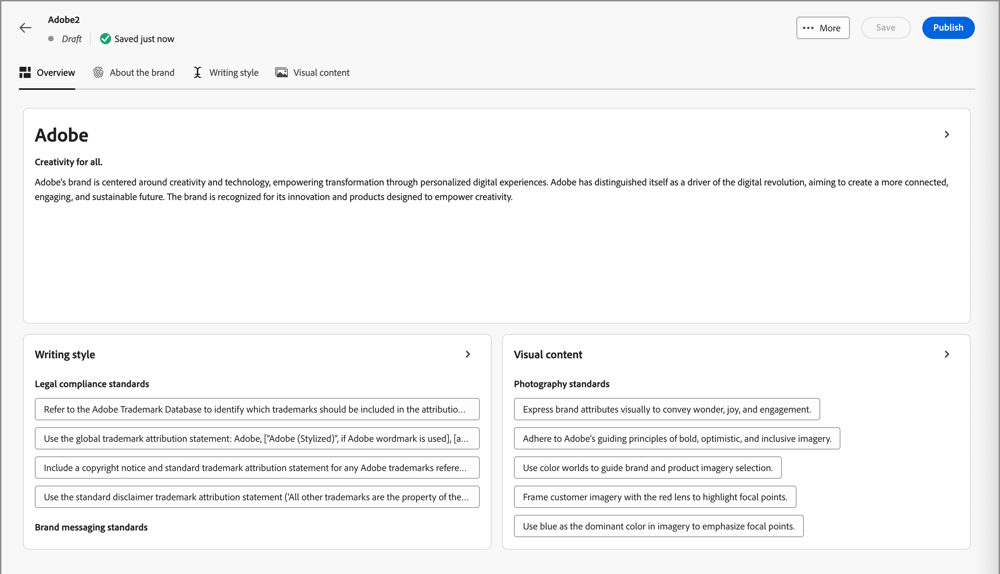
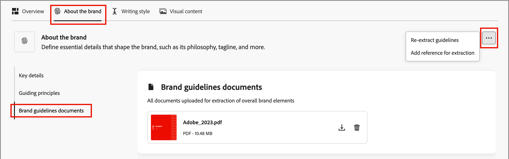

# 创建和管理您的品牌 {#brand-library}

定义品牌以提供一套详细的规则和标准，从而建立可视化和口头化的身份识别。 这些准则为在所有营销和通信平台上保持一致的品牌代表性提供了参考。 通过利用明确定义的品牌准则，组织可以确保所有内容创建工作与战略目标和整体品牌标识保持一致。 这种一致性不仅增强了品牌认知和信任，还有助于在所有接触点营造更具凝聚力和影响力的客户体验。

在Journey Optimizer B2B edition中，您可以手动定义并组织品牌定义和资产，或上传品牌准则文档以自动提取信息和可视资产。

>[!AVAILABILITY]
>
>此功能目前作为专用测试版提供，计划在未来版本中逐步提供给所有客户。
>
> 
>
>在Adobe Journey Optimizer B2B edition中使用AI支持的功能之前，需要[用户协议](https://www.adobe.com/cn/legal/licenses-terms/adobe-dx-gen-ai-user-guidelines.html){target="_blank"}。 有关更多信息，请与您的 Adobe 代表联系。
>
> 
>
>有关产品管理员如何启用这些功能的信息，请参阅[与品牌相关的权限](./brands-overview.md#brand-related-permissions)。

## 访问您的品牌库

要在Adobe Journey Optimizer B2B edition中访问品牌套件，请转到左侧导航并单击&#x200B;**[!UICONTROL 内容管理]** > **[!UICONTROL 品牌]**。 此操作将打开一个页面，其中创建的品牌将显示为卡片。

{width="800" zoomable="yes"}

如果尚未创建任何品牌，则显示单个图形，其中包含用于[创建您的第一个品牌](#create-and-define-a-brand)的按钮。

### 品牌管理操作

对于每个卡片，您可以单击&#x200B;_更多菜单_ （ ）图标并为品牌选择操作：

* **[!UICONTROL 查看品牌]** — 打开品牌页面并显示定义。
* **[!UICONTROL 标记为默认品牌]**（仅限实时模式） - [将品牌标记为默认品牌](#default-brand)以进行内容对齐和生成。
* **[!UICONTROL 编辑]** — 打开品牌页面并编辑品牌指南、排除项和示例。
* **[!UICONTROL 复制]** — 创建一个副本作为新的草稿品牌。
* **[!UICONTROL 发布]** （仅限草稿） - [发布品牌](#publish-the-brand)，使其可用于内容对齐和生成。
* **[!UICONTROL 取消发布]**（仅限实时模式） — 取消发布品牌以将其从用于内容对齐和生成的内容中移除。
* **[!UICONTROL 删除]** — 从品牌库中移除品牌。

{width="440"}

### 默认品牌

您可以在内容创建期间指定在生成内容并计算对齐分数时自动应用的默认品牌。 只有已发布的(_Live_)品牌可以是默认品牌。

在品牌库中，默认品牌卡显示有标志。

{width="200"}

您可以将任何已发布的（_实时_）品牌设置为默认品牌。 在品牌卡上，单击&#x200B;_更多菜单_ （ ）图标，然后选择&#x200B;**[!UICONTROL 标记为默认品牌]**。

{width="350"}

## 创建和定义品牌 {#create-brand}

>[!CONTEXTUALHELP]
>id="ajo-b2b_brands_create"
>title="创建您的品牌"
>abstract="输入您的品牌名称并上传您的品牌指导方针文件。该工具会自动提取关键详细信息，从而更轻松地维护您的品牌识别。"

要创建和定义品牌指南，您可以输入详细信息或上传品牌指南文档以用于自动提取。

### 添加品牌

1. 在&#x200B;_[!UICONTROL 品牌]_&#x200B;页面的右上角，单击&#x200B;**[!UICONTROL 创建品牌]**。

1. 为您的品牌输入&#x200B;**[!UICONTROL 名称]**。

1. 拖放或选择您的文件以上传品牌指南并自动提取相关的品牌信息。

   {width="500"}

   >[!NOTE]
   >
   >如果您没有以PDF格式保存文档，则可以在创建品牌后手动添加准则并上传单个可视资产。

1. 单击&#x200B;**[!UICONTROL 创建品牌]**。

   如果包含一个或多个创建品牌的文件，将开始信息提取过程。 它可能需要几分钟才能完成。

   提取过程完成后，将自动填充您的内容和可视化创建标准。

   {width="700" zoomable="yes"}

### 优化并更新品牌指南

1. 浏览不同的选项卡，以根据需要调整和定义更详细的信息。

   * [!UICONTROL 概述]

   * [[!UICONTROL 关于品牌]](#about-the-brand)

   * [[!UICONTROL 写入样式]](#writing-style)

   * [[!UICONTROL 可视内容]](#visual-content)

   如果在创建品牌时包括一个或多个文档，则信息提取流程会创建选项卡和部分的定义。 完整性取决于任何文档中包含的范围和详细信息。 查看结果时，可以更改或删除任何信息。

   从每个选项卡或类别的&#x200B;_更多菜单_ （ ）中，您可以添加文档以自动提取相关品牌信息。 您还可以清除现有内容。

   {width="500" zoomable="yes"}

   如果要查看子部分中提取信息的源，请单击&#x200B;**[!UICONTROL 查看源]**&#x200B;链接。

   {width="700" zoomable="yes"}

1. 在每个详细信息选项卡中，查看类别并通过添加、删除和更改定义来改进品牌。

   标有&#x200B;**[!UICONTROL Do&#39;s]**&#x200B;的子部分概述了该类别的准则。 使用此区域可添加准则的说明和示例。

   {width="500" zoomable="yes"}

   标记为&#x200B;**[!UICONTROL 不包含]**&#x200B;的子部分概述了排除项。 使用此区域可添加排除项描述和排除项示例。

   {width="500" zoomable="yes"}

   * **添加准则或排除项**。

     在要添加准则的部分，单击右侧的&#x200B;_添加_ （ ）图标。 在弹出对话框中，输入准则并选中相应的复选框，以指定该准则适用的渠道和元素。 然后，单击&#x200B;**[!UICONTROL 添加]**。

     {width="600" zoomable="yes"}

   * **更改准则或排除项**。

     在要删除准则的部分中，单击准则构件。 在弹出对话框中，根据需要更改准则的内容和选定的复选框。 然后，单击&#x200B;**[!UICONTROL 更新]**。

     {width="600" zoomable="yes"}

   * **删除准则或排除项**。

     在要删除准则的部分中，单击准则构件。 在弹出对话框中，单击顶部的&#x200B;_删除_ （ ）图标。

   * **添加或修订您的准则和排除项的示例**。

     在显示的示例拼贴中，单击&#x200B;_编辑_ （ ）以更改示例，或单击&#x200B;_删除_ （ ）图标以将其删除。

1. 定义完所有内容后，单击&#x200B;**[!UICONTROL 保存]**。

   您可以继续对草稿品牌进行更改，直到您决定它准备发布为止。

### 发布品牌

当您的品牌包含完整的定义集并符合您的要求时，请单击&#x200B;**[!UICONTROL 发布]**&#x200B;以使您的品牌准则可用于内容对齐和生成。

已发布的品牌可从AI **[!UICONTROL 品牌一致性]**&#x200B;和内容生成工具中的[品牌](./brand-alignment.md)选项访问。<!-- [Learn more about content generation](gs-generative.md) -->

内容的{width="300"}

## 品牌定义

品牌定义分为三个类别，显示为选项卡。 选择每个选项卡以完成并更新品牌指南。

### 关于品牌 {#about-brand}

使用&#x200B;**[!UICONTROL 关于品牌]**&#x200B;选项卡建立品牌的核心标识。 此信息概述了其目的、个性、标语和其他高级属性。

1. 在&#x200B;**[!UICONTROL 关键详细信息]**&#x200B;类别中添加品牌的基本信息：

   * **[!UICONTROL 品牌套件名称]** — 更新品牌名称。

   * **[!UICONTROL 何时使用]** — 指定应应用此品牌的方案或上下文。

   * **[!UICONTROL 品牌名称]** — 输入品牌的正式名称。

   * **[!UICONTROL 此品牌的说明]** — 提供此品牌代表的概述。

   * **[!UICONTROL 标语（默认）]** — 添加与品牌关联的主要标语。

   {width="600" zoomable="yes"}

1. 在&#x200B;**[!UICONTROL 指导原则]**&#x200B;类别中，阐明品牌的核心方向和理念：

   * **[!UICONTROL 任务]** — 详细描述品牌目的。

   * **[!UICONTROL 愿景]** — 描述长期目标或期望的未来状态。

   * **[!UICONTROL 市场定位]** — 说明品牌在市场中的定位。

   {width="600" zoomable="yes"}

   从&#x200B;**[!UICONTROL 核心品牌价值]**&#x200B;类别中，查看定义的品牌价值并根据需要对其进行调整。

   * 要定义新的核心值，请单击右侧的&#x200B;_添加_ （ ）图标并完成详细信息：

     {width="500" zoomable="yes"}

      * **[!UICONTROL 值]** — 输入核心品牌值的名称。

      * **[!UICONTROL 描述]** — 说明此值对您的品牌意味着什么。

      * **[!UICONTROL 行为]** — 概述在实践中反映此值的操作或态度。

      * **[!UICONTROL 表现形式]** — 提供如何在真实世界品牌中表示此值的示例。

   * 要更改或删除核心值，请单击&#x200B;_编辑_ （ ）图标以更新或删除核心品牌值。

     {width="500" zoomable="yes"}

     更改详细信息，然后单击&#x200B;**[!UICONTROL 更新]**。 或者，单击顶部的&#x200B;_删除_ （ ）图标以删除核心值。

1. 在&#x200B;**[!UICONTROL 品牌准则文档]**&#x200B;类别中，查看用于生成品牌准则的文档。

   单击更多菜单图标，然后选择使用上传的参考文档更新品牌指南的选项：

   * **[!UICONTROL 重新提取准则]** — 选择此操作以使用当前文档运行提取作业。
   * **[!UICONTROL 添加提取引用]** — 选择此操作上传其他文档并运行提取作业。

   {width="600" zoomable="yes"}

您可以继续优化[书写样式](#writing-style)或[视觉内容](#visual-content)指南、排除项和示例，也可以[发布您的品牌](#publish-the-brand)。

### 写作风格 {#writing-style}

>[!CONTEXTUALHELP]
>id="ajo_brand_writing_style"
>title="写作风格一致性得分"
>abstract="写作风格部分定义了语言、格式和结构的标准，以确保内容清晰、一致。一致性得分从高到低，显示您的内容遵循这些指南的程度，并突出显示需要改进的领域。"

_[!UICONTROL 书写样式]_&#x200B;定义概述了书写内容的标准，并详细说明了如何使用语言、格式和结构来保持所有材料的清晰度、一致性和一致性。

选择&#x200B;**[!UICONTROL 写入样式]**&#x200B;选项卡，并查看每个类别。

{width="600" zoomable="yes"}

| 类别 | 子类别 | 准则示例 | 排除项示例 |
|----------------------------|----------------|-----------------------|-----------------------|
| [!UICONTROL 品牌通信样式] | [!UICONTROL 品牌个性特征] | 友好平易近人。 | 别失败了。 |
|                            | [!UICONTROL 正在写入机制] | 保持句子简短并有影响力。 | 不要用过多的行话。 |
|                            | [!UICONTROL 情景色调] | 在危机沟通中保持专业语调。 | 在支持性通信中不要轻视。 |
|                            | [!UICONTROL Word选择准则] | 使用诸如&#x200B;_创新_&#x200B;和&#x200B;_智能_&#x200B;之类的词。 | 避免使用&#x200B;_便宜_&#x200B;或&#x200B;_黑客_&#x200B;之类的词。 |
|                            | [!UICONTROL 语言标准] | 遵循美式英语惯例。 | 不要混用英美两种语言。 |
| [!UICONTROL 品牌讯息标准] | [!UICONTROL 品牌讯息标准] | 强调创新和客户至上的报文传送。 | 不要过度承诺产品功能。 |
|                            | [!UICONTROL 标语用法] | 在所有数字营销资源上的徽标下放置标语。 | 请勿修改或翻译标语。 |
|                            | [!UICONTROL 核心消息] | 强调关键的收益陈述，如提高生产率。 | 请勿使用不相关的值建议。 |
|                            | [!UICONTROL 命名标准] | 使用简单的描述性名称，如&#x200B;_ProScheduler_。 | 请勿使用复杂术语或特殊字符。 |
| [!UICONTROL 法律合规性标准] | [!UICONTROL 商标标准] | 始终使用™或®符号。 | 必要时，请勿忽略法律符号。 |
|                            | [!UICONTROL 版权标准] | 在营销材料中包含版权声明。 | 未经许可，请勿使用第三方内容。 |
|                            | [!UICONTROL 免责声明标准] | 在数字资产上清楚地显示免责声明。 | 请勿隐藏非可见区域中的免责声明。 |

<!-- #### Preferred and avoided terms

Supplement your work choice guidelines by adding preferred and avoided terms. 

#### Primary tagline and variations

#### Brand names and variations

#### Approved and restricted statements
-->

### 视觉内容 {#visual-content}

>[!CONTEXTUALHELP]
>id="ajo-b2b_brand_imagery"
>title="视觉内容一致性得分"
>abstract="视觉内容一致性得分表明您的内容与配置的品牌指南的匹配程度。从高到低进行评分，可以帮助您一目了然地评估一致性。浏览不同的类别以确定需要改进的领域，并找出可能不符合品牌的元素。"

_[!UICONTROL 可视内容]_&#x200B;定义概述了图像和设计的标准，并详细说明了保持统一一致的品牌外观所需的规范。

选择&#x200B;**[!UICONTROL 可视内容]**&#x200B;选项卡，并查看每个类别。

{width="600" zoomable="yes"}

| 类别 | 准则示例 | 排除项示例 |
|------------------------|---------------------|---------------------|
| [!UICONTROL 摄影标准] | 户外拍摄时使用自然光线。 | 避免过度编辑或像素化的图像。 |
| [!UICONTROL 插图标准] | 使用简洁、极简的风格。 | 避免过于复杂。 |
| [!UICONTROL 图标标准] | 使用一致的24像素网格系统。 | 请勿混合图标尺寸、使用不一致的描边粗细或偏离网格规则。 |
| [!UICONTROL 使用指南] | 选择反映真实客户在专业环境中使用该产品的生活方式形象。 | 请勿使用与品牌风格相抵触或看起来与上下文不相干的图像。 |

<!-- #### Styles

To define the overall style for the category, click **[!UICONTROL Add style]**. In the popup dialog, enter the style type and description. 

{width="500" zoomable="yes"}

#### Specifications

-->

#### 示例图像

要添加显示正确或不正确用法的图像，请在&#x200B;**[!UICONTROL 添加准则]**&#x200B;或&#x200B;_[!UICONTROL 添加排除项]_&#x200B;弹出对话框中选择&#x200B;_[!UICONTROL 示例]_。 单击&#x200B;**[!UICONTROL 选择映像]**&#x200B;以从您的系统中选择映像文件。 单击&#x200B;**[!UICONTROL 添加]**&#x200B;以上传图像并显示区域的缩略图。

{width="500" zoomable="yes"}

## 编辑已发布的品牌

您无法修改已发布的（实时）品牌，但可以创建草稿副本进行编辑。 当您使用编辑内容发布草稿时，该版本会替换实时版本。

1. 打开品牌页面，然后单击右上方的&#x200B;**[!UICONTROL 编辑品牌]**。

1. 在确认对话框中，单击&#x200B;**[!UICONTROL 编辑品牌]**。

   此操作创建品牌的草稿副本。

1. 浏览不同的选项卡，以根据需要更新品牌信息。

   * 概述

   * [关于品牌](#about-the-brand)

   * [写作风格](#writing-style)

   * [视觉内容](#visual-content)

1. 在处理草稿更新时单击“保存”**&#x200B;**，在准备好替换&#x200B;**[!UICONTROL Live]**&#x200B;版本时单击“发布”__。
