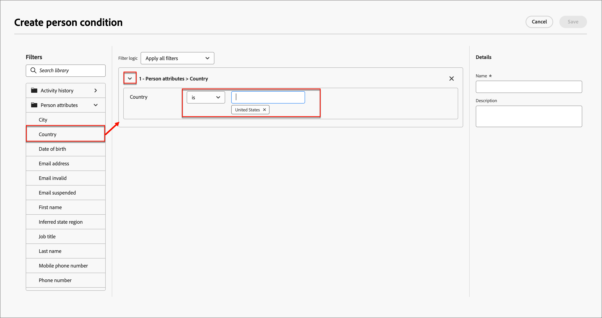

# 条件内容

条件内容允许您根据条件规则调整电子邮件内容。 这些规则是使用配置文件属性或上下文事件定义的。 您可以在规则生成器中创建条件规则，将其存储后可在您的帐户历程中重复使用。

要在电子邮件中添加条件内容，Adobe Journey Optimizer允许您应用存储在&#x200B;_条件_&#x200B;库中的条件规则。 当您[为帐户历程](./email-authoring.md)创作电子邮件内容时，在电子邮件设计空间中应用条件规则。

## 向电子邮件添加条件内容 {#email-content}

>[!CONTEXTUALHELP]
>id="ajo-b2b_conditional_content"
>title="条件内容"
>abstract="使用条件规则创建内容组件的多个变体。如果在发送消息时不满足任何条件，则会显示默认变体中的内容。"

>[!CONTEXTUALHELP]
>id="ajo-b2b_conditional_rule_select"
>title="条件内容"
>abstract="使用保存在库中的条件规则或创建新规则。"

在电子邮件设计空间中为帐户历程创作电子邮件时，请使用条件规则为内容组件定义多个变体。

1. 选择一个内容组件，然后单击组件工具栏中的&#x200B;**[!UICONTROL 启用条件内容]**&#x200B;图标。

   该组件以橙色列出，表示它作为条件组件激活。 **[!UICONTROL 条件内容]**&#x200B;窗格在左侧显示&#x200B;_默认变体_&#x200B;和_Variant - 1。

   {width="700" zoomable="yes"}

   所选和激活的原始内容是默认内容，并在任何条件规则都不符合您定义的任何变体时应用。

   在此窗格中，您可以使用条件规则为所选内容组件定义多个变体。

1. 将鼠标悬停在第一个变体（_变体 — 1_）上，然后单击&#x200B;_选择条件_&#x200B;图标（）。

   {width="700" zoomable="yes"}选择条件

   _[!UICONTROL 选择条件]_&#x200B;对话框打开并显示条件库。

   如果要查看条件的详细信息以确保它是您想要的，请单击&#x200B;_更多菜单_&#x200B;图标(**...**)，然后选择&#x200B;**[!UICONTROL 查看信息]**。

   {width="600" zoomable="yes"}

   如果所需的条件不存在，[通过单击&#x200B;**[!UICONTROL 新建]**&#x200B;创建一个条件规则](#create-condition)。

1. 选择条件规则并单击&#x200B;**[!UICONTROL 选择]**&#x200B;以将其与变体关联。

   您可以通过单击变体的&#x200B;_更多菜单_&#x200B;图标(**...**)并选择&#x200B;**[!UICONTROL 查看条件]**&#x200B;来查看关联的条件。

   {width="600" zoomable="yes"}

   单击右上方的X关闭弹出窗口。

   {width="500"}

1. 为了提高可读性，请单击变体的&#x200B;_更多菜单_&#x200B;图标(**...**)并选择&#x200B;**[!UICONTROL 重命名]**&#x200B;以重命名变体。

   为变体输入一个有意义的名称，以帮助您识别变体及其意图。

   {width="600" zoomable="yes"}

1. 在左窗格中选择变体后，更改组件，以改变它在条件为true时电子邮件中的显示方式。

   在此示例中，文本组件的变体根据收件人的区域使用不同的描述。

   {width="600" zoomable="yes"}

1. 如果需要，单击&#x200B;**[!UICONTROL 添加变体]**&#x200B;以定义另一个变体。

   重复步骤2 - 5以选择条件、重命名变体并更改变体的组件。

   您可以根据内容组件的需要添加任意数量的变体。 可随时在左窗格中更改选定的变体以检查条件中内容组件的显示方式。

   >[!IMPORTANT]
   >
   >条件内容将按照变体的列出顺序根据关联的规则进行评估。 组件的第一个变量具有评估为true的条件。
   >
   >如果在发送电子邮件时，没有已定义的变体条件的计算结果为true，则内容组件将根据&#x200B;**[!UICONTROL 默认变体]**&#x200B;显示。

1. 要删除变体，请单击变体的&#x200B;_更多菜单_&#x200B;图标(**...**)，然后选择&#x200B;**[!UICONTROL 删除]**。

   在确认对话框中，单击&#x200B;**[!UICONTROL 删除]**。

## 条件规则

条件规则是一组条件表达式，可以计算为true或false。 您可以使用这些规则根据各种过滤器（如用户档案属性或上下文事件）确定要在电子邮件中显示的内容变体。

条件规则存储在条件库中，可在组织内的历程内容中重复使用。
<!-- 

>[!NOTE]
>
>You need the [Manage Library Items](../administration/ootb-product-profiles.md) permission to save or delete conditional rules. Saved conditions are available for use by all users within an organization. -->

### 条件过滤器 {#condition-filters}

| 完成情况类型 | 过滤器 | 描述 |
| -------------- | ------- | ----------- |
| **帐户** | 帐户属性 | 帐户个人资料中的属性，包括： <li>年收入</li><li>城市</li><li>国家/地区</li><li>员工人数</li><li>行业</li><li>名称</li><li>SIC代码</li><li>State</li> |
| | [!UICONTROL 特殊筛选器] > [!UICONTROL 有购买群] | 该帐户是否具有购买组的成员。 也可以根据以下一个或多个标准进行评估： <li>解决方案兴趣</li><li>购买组状态</li><li>完整性分数</li><li>参与度评分</li> |
| | [!UICONTROL 特殊筛选器] > [!UICONTROL 具有机会] | 帐户是否与机会相关。 还可以针对以下一个或多个机会属性进行评估： <li>数量<li>关闭日期<li>描述<li>预期收入<li>财政季度<li>会计年度<li>预测类别<li>预测类别名称<li>为关闭<li>赢得了</li><li>上次活动日期</li><li>人员来源<li>名称</li><li>下一步</li><li>概率<li>数量<li>阶段</li><li>类型 |
| **人员** | [!UICONTROL 活动历史记录] > [!UICONTROL 电子邮件] | 与历程关联的电子邮件活动： <li>[!UICONTROL 已单击电子邮件中的链接]</li><li>已打开的电子邮件</li><li>已送达电子邮件</li><li>已发送电子邮件</li> 使用历程中早期的选定电子邮件评估这些条件。 |
|  | [!UICONTROL 人员属性] | 人员配置文件中的属性，包括： <li>城市</li><li>国家/地区</li><li>出生日期</li><li>电子邮件地址</li><li>电子邮件无效</li><li>电子邮件已暂停</li><li>名字</li><li>推断的状态区域</li><li>作业名称</li><li>姓氏</li><li>手机号码</li><li>电话号码</li><li>邮政编码</li><li>State</li><li>退订</li><li>取消订阅的原因</li> |
| | [!UICONTROL 特殊筛选器] > [!UICONTROL 购买团体成员] | 人员是否属于根据以下一个或多个标准评估的购买组成员： <li>解决方案兴趣</li><li>购买组状态</li><li>完整性分数</li><li>参与度评分</li><li>角色</li> |

<!-- 

| | [!UICONTROL Activity history] > [!UICONTROL Data Value Changed] | For a selected person attribute, a value change occurred. These change types include: <li>New value</li><li>Previous value</li><li>Reason</li><li>Source</li><li>Date of activity</li><li>Min. number of times</li> |
| | [!UICONTROL Activity history] > [!UICONTROL Had Interesting Moment] | Interesting moment activity that is defined in the associated Marketo Engage instance. Constraints include: <li>Milestone</li><li>Email</li><li>Web</li>|

| | [!UICONTROL Special filters] > [!UICONTROL Member of List] | The person is or is not a member of one or more Marketo Engage lists. |
| | [!UICONTROL Special filters] > [!UICONTROL Member of Program] | The person is or is not a member of one or more Marketo Engage programs. |
|  [People](#add-a-split-path-by-people-node) > [!UICONTROL Account-person attributes only] | Role in account attributes | The person is or is not assigned a role in the account. Optional constraints: <li>Enter a role name</li> | 
-->

### 创建条件规则 {#create-condition}

>[!CONTEXTUALHELP]
>id="ajo-b2b_conditions_rule_editor"
>title="创建条件"
>abstract="结合属性和上下文事件来构建规则，确定在电子邮件消息中显示哪些内容变体。"

为组件变体选择条件时，您可以从电子邮件设计空间访问条件规则生成器。

1. 在&#x200B;_[!UICONTROL 选择条件]_&#x200B;对话框中，单击&#x200B;**[!UICONTROL 新建]**&#x200B;并选择条件类型：

   * **[!UICONTROL 人员条件]** — 选择此类型可使用人员属性和上下文事件构建条件规则。
   * **[!UICONTROL 帐户条件]** — 选择此类型可使用帐户属性构建条件规则。

   {width="600" zoomable="yes"}

1. 根据需要构建条件规则。

   对于要包含在规则中的每个属性或事件，将该项目拖放到规则画布上。 展开过滤器并完成表达式。

   {width="600" zoomable="yes"}

   如果包含多个筛选器，请设置&#x200B;**[!UICONTROL 筛选器逻辑]**：

   * **[!UICONTROL 应用所有筛选器]** — 如果&#x200B;**所有**&#x200B;筛选器为true，则规则将评估为true。
   * **[!UICONTROL 应用任何筛选器]** — 如果筛选器中的&#x200B;**any**&#x200B;为true，则规则将评估为true。

1. 在右侧，输入规则的&#x200B;**[!UICONTROL Name]**&#x200B;和&#x200B;**[!UICONTROL Description]**（可选）。

   使用有意义的名称和有用的描述来帮助组织中的其他人，以便他们能够重复使用它，而不是创建另一个重复条件。

   {width="600" zoomable="yes"}

1. 完成条件规则后，单击&#x200B;**[!UICONTROL 保存]**。

   条件规则将保存到库中，您可以为当前变体选择该规则。 它也包含在库中，以供帐户历程中的任何其他动态内容变体使用。

### 复制规则

无法修改保存到库的条件规则。 但是，您可以复制现有规则并对其进行更改以创建新规则。

1. 单击变体的&#x200B;_更多菜单_&#x200B;图标(**...**)，然后选择&#x200B;**[!UICONTROL 复制]**。

   将在规则生成器中打开规则的副本。 使用副本作为要构建的规则的起点。

   {width="600" zoomable="yes"}

1. 在规则生成器中，根据需要更改、添加或删除条件。

1. 更改名称和描述以匹配规则中的目的或项目。

1. 完成条件规则后，单击&#x200B;**[!UICONTROL 保存]**。
