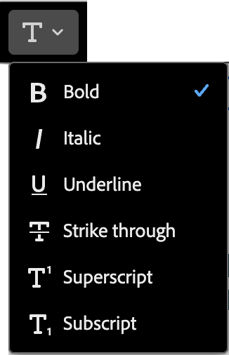
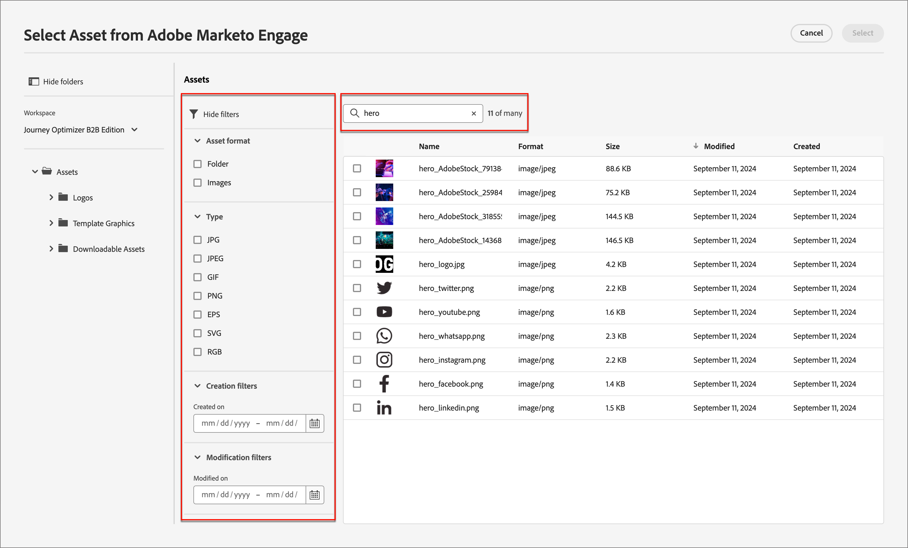

# 内容组件 {#content-components}

>[!CONTEXTUALHELP]
>id="ajo-b2b_content_components_email"
>title="关于内容组件"
>abstract="内容组件是空的内容占位符，可用于设计电子邮件。"

>[!CONTEXTUALHELP]
>id="ajo-b2b_content_components_landing_page"
>title="关于内容组件"
>abstract="内容组件是空的内容占位符，可用于设计登陆页面。"

>[!CONTEXTUALHELP]
>id="ajo-b2b_content_components_fragment"
>title="关于内容组件"
>abstract="内容组件是空的内容占位符，可用于设计片段。"

>[!CONTEXTUALHELP]
>id="ajo-b2b_content_components_template"
>title="关于内容组件"
>abstract="内容组件是空的内容占位符，可用于设计模板。"

设计电子邮件、登陆页、模板和可视化片段的内容时，请使用[!UICONTROL 内容组件]添加可视化设计元素。 您可以根据需要在定义布局的一个或多个结构组件中添加任意数量的内容组件。

## 内容库

组件库底部的&#x200B;**[!UICONTROL Contents]**&#x200B;部分显示可用的内容组件：

| 图标 | 组件 | 描述 |
| --------- | ---- | ----------- |
|  | [容器](#container) | 将此组件添加到您的设计中可包括一个矩形容器，您可以使用该容器对组件进行分组或向区域应用背景或边框样式。 |
|  | [按钮](#button) | 将此组件添加到您的设计以包含一个可单击的按钮元素。 |
|  | [文本](#text) | 将此组件添加到您的设计以包含文本正文。 |
|  | [分隔线](#divider) | 将此组件添加到您的设计中以包含水平线来分隔内容的各个区域。 |
|  | [HTML](#html) | 将此组件添加到您的设计以复制并粘贴现有HTML的各个部分。 使用此组件可创建免费的模块化HTML块以重用某些外部内容。 |
|  | [图像](#image) | 将此组件添加到您的设计以插入图像文件。 |
|  | [社交](#social) | 将此组件添加到您的设计以插入指向社交媒体页面的链接。 |
|  | [表单](#form) | **_仅适用于登陆页面。_**&#x200B;将此组件添加到您的设计以插入已创建的表单。 |

## 内容组件工具栏

在画布中选择每个内容组件类型后，都会显示一个工具栏。 可用的工具因组件类型而异，它们提供了一种在渲染的内容中直接使用组件的简单方法。 它包括适用于组件类型的格式化和功能功能。

{width="450"}

### 格式化工具

+++更改文本样式

<table>
    <tr>
        <th style="width: 30%;">工具</th>
        <th style="width: 50%;">使用情况</th>
        <th style="width: 20%;">组件</th>
    </tr>
    <tr>
        <td></td>
        <td>将粗体、斜体、下划线、删除线、上标或下标应用于所选文本字符串。</td>
        <td><li>按钮 <li>文本</td>
    </tr>
</table>

+++

+++水平对齐方式

<table>
    <tr>
        <th style="width: 30%;">工具</th>
        <th style="width: 50%;">使用情况</th>
        <th style="width: 20%;">组件</th>
    </tr>
    <tr>
        <td></td>
        <td>对组件内容应用水平对齐类型。 选择“左”、“居中”、“右”或“对齐”。 </td>
        <td><li>按钮 <li>文本</td>
    </tr>
</table>

+++

+++创建列表

<table>
    <tr>
        <th style="width: 30%;">工具</th>
        <th style="width: 50%;">使用情况</th>
        <th style="width: 20%;">组件</th>
    </tr>
    <tr>
        <td></td>
        <td>对组件文本应用排序或未排序列表格式。</td>
        <td><li>文本</td>
    </tr>
</table>

+++

+++设置标题

<table>
    <tr>
        <th style="width: 20%;">工具</th>
        <th style="width: 60%;">使用情况</th>
        <th style="width: 20%;">组件</th>
    </tr>
    <tr>
        <td></td>
        <td>将标题级别格式应用到光标位置的段落。</td>
        <td><li>按钮 <li>文本</td>
    </tr>
</table>

+++

+++字体大小

<table>
    <tr>
        <th style="width: 20%;">工具</th>
        <th style="width: 60%;">使用情况</th>
        <th style="width: 20%;">组件</th>
    </tr>
    <tr>
        <td></td>
        <td>将字体大小应用到所选文本。 单击该工具，然后选择尺寸或输入像素值。</td>
        <td><li>按钮 <li>文本</td>
    </tr>
</table>

+++

+++字体颜色

<table>
    <tr>
        <th style="width: 40%;">工具</th>
        <th style="width: 40%;">使用情况</th>
        <th style="width: 20%;">组件</th>
    </tr>
    <tr>
        <td></td>
        <td>将字体颜色应用于所选文本。 从选取器中选择一种颜色，然后使用颜色滑块和颜色字段来选择颜色。 或者，您可以输入已知的RGB、HSL、HSB或十六进制值。 </td>
        <td><li>按钮 <li>文本</td>
    </tr>
</table>

+++

+++插入链接

<table>
    <tr>
        <th style="width: 40%;">工具</th>
        <th style="width: 40%;">使用情况</th>
        <th style="width: 20%;">组件</th>
    </tr>
    <tr>
        <td></td>
        <td>为所选文本或元素创建可单击链接（外部URL或登陆页面）。</td>
        <td><li>按钮 <li>文本 <li>图像 </td>
    </tr>
</table>

+++

+++删除链接

<table>
    <tr>
        <th style="width: 15%;">工具</th>
        <th style="width: 60%;">使用情况</th>
        <th style="width: 25%;">组件</th>
    </tr>
    <tr>
        <td></td>
        <td> 删除所选文本或元素的可单击链接（外部URL或登陆页面）。</td>
        <td><li>按钮 <li>文本 <li>图像 </td>
    </tr>
</table>

+++

### 功能工具

| 工具 | 名称 | 使用情况 |
| ---- | ---- | ----- |
| {width="40"} | 添加个性化 | 使用个性化编辑器在组件内容中插入个性化令牌。 [了解详情](./email-authoring.md#personalize-content) |
| {width="40"} | 显示源代码 | 在只读弹出窗口中显示组件的HTML源代码。  {width="200"} |
| {width="40"} | 启用条件内容 | （电子邮件和片段）为组件启用条件变体。 [了解详情](./conditional-content.md) |
| {width="40"} | 重复 | 创建组件的副本并直接将其添加到下方。 |
| {width="40"} | 删除 | 删除组件。 |

## 将内容组件添加到您的设计

1. 在可视设计空间中，使用现有模板或将所需的结构组件添加到空画布中以定义布局。

1. 在&#x200B;**[!UICONTROL 组件]**&#x200B;库中，获取所选内容组件的&#x200B;_拖动手柄_ ，然后将其拖放到结构组件上。

   可以将多个组件添加到单个结构组件中，并添加到结构组件的每一列中。

   {width="600" zoomable="yes"}

1. 使用右侧的&#x200B;**[!UICONTROL 设置]**&#x200B;和&#x200B;**[!UICONTROL 样式]**&#x200B;选项卡或画布中显示的上下文工具栏调整组件显示。

   例如，可以更改组件的文本样式、填充或边距。

   {width="600" zoomable="yes"}

在处理设计时，您还可以[删除](#remove-a-content-component)或[复制](#duplicate-a-content-component)组件。

## 内容组件设置和样式

添加组件后，将在可视设计空间中选择该组件，其属性将显示在右侧面板中。 您还可以随时选择组件以更改设置和样式。 许多设置和样式都是特定于组件的，但有一些标准设置和样式可应用到任何选定内容组件。

### 显示选项

如果要从桌面或移动设备显示中排除该组件，请更改&#x200B;**[!UICONTROL 显示选项]**&#x200B;设置。 默认值&#x200B;_[!UICONTROL 在所有设备上显示]_，允许在所有设备上显示。 选择其他设置以使组件按设备类型专用：

* _[!UICONTROL 仅在桌面设备上显示]_ — 当您想要在桌面设备上显示组件并为移动设备排除该组件时，请选择此设置。
* _[!UICONTROL 仅在移动设备上显示]_ — 如果要在移动设备（如手机和平板电脑）上显示组件，请选择此设置，并将其排除在桌面设备之外。

{width="400" zoomable="yes"}

### 容器

使用容器将特定样式应用于一组内容组件。 添加[!UICONTROL Container]组件，然后在其内部添加其他内容组件。 此组件类似于您在HTML中使用`div`元素的方式。 您可以对容器应用不同的样式，使其不同于对容器所包含的内容组件应用的样式。

例如，添加一个&#x200B;_[!UICONTROL Container]_&#x200B;组件，然后在该容器中添加一个&#x200B;_[!UICONTROL Button]_&#x200B;组件。 您可以为容器使用特定区域样式，并根据需要为按钮及其背景设置样式。

{width="600" zoomable="yes"}

+++背景

{{styles-background}}

+++

+++边框

{{styles-border}}

+++

+++大小

{{styles-size}}

+++

+++边距

{{styles-margin}}

+++

+++填充

{{styles-padding}}

+++

### 按钮

使用[!UICONTROL Button]组件在内容中插入一个或多个可单击按钮。 使用按钮将页面查看者或电子邮件收件人重定向到支持内容（已发布的登陆页面或外部链接）。

#### 添加按钮文本

在画布中显示按钮组件时，工具栏包含文本格式设置选项以及个性化和条件变体。 有关编辑器工具栏选项的更多信息，请参见#。

在输入按钮标签文本并设置格式时，按钮会调整大小以适应内容。

与工具栏一起显示的{width="500" zoomable="yes"}

#### 设置链接选项

在&#x200B;_[!UICONTROL 设置]_&#x200B;选项卡上，使用&#x200B;**[!UICONTROL 链接]**&#x200B;选项定义按钮文本、链接目标以及用于加载目标页面的浏览器行为。

1. 为链接设置&#x200B;**[!UICONTROL 类型]**：

   * **[!UICONTROL 外部链接]** — 选择此类型以使用标准URL作为链接目标。

     在&#x200B;**[!UICONTROL Url]**&#x200B;中，输入链接目标的URL。 单击&#x200B;_个性化_&#x200B;图标（）以将个性化令牌用作URL中的参数。

     {width="200"}

   * **登陆页面** — 选择此类型可在<!-- Journey Optimizer B2B Edition (_Beta_) or -->连接的Marketo Engage实例中选择已发布的登陆页面。

     对于&#x200B;**[!UICONTROL 登陆页面]**&#x200B;选项，选择已发布的登陆页面。 单击&#x200B;_选择页面_&#x200B;图标（）和[选择已发布的登陆页面](./landing-pages.md#link-to-a-landing-page)。

     {width="200"}

1. 对于&#x200B;**[!UICONTROL 标签]**，输入要显示在按钮中的文本。

   按钮大小会根据设置的文本和样式进行调整。

1. 对于&#x200B;**[!UICONTROL Target**]，请选择如何从电子邮件或页面重定向链接的目标：

   * _[!UICONTROL 无]_ — 使用默认浏览器或客户端行为（默认）打开链接。
   * _[!UICONTROL 空白]_ — 在新窗口或选项卡中打开链接。
   * _[!UICONTROL Self]_ — 在同一帧中打开链接。
   * _[!UICONTROL 父项]_ — 在父框架中打开链接。
   * _[!UICONTROL Top]_ — 在窗口的整个正文中打开链接。

#### 设置样式

在&#x200B;**[!UICONTROL 样式]**&#x200B;选项卡中自定义按钮样式。

+++背景

{{styles-background}}

+++

+++文本

{{styles-text}}

+++

+++边框

{{styles-border}}

+++

+++大小

{{styles-size}}

+++

+++对齐方式

+++

+++按钮边距

+++

+++容器边距

{{styles-margin}}

+++

+++填充

{{styles-padding}}

+++

+++高级

{{styles-advanced}}

+++

### 文本

使用文本组件在内容中插入文本块。 在画布中选择文本组件后，输入文本并使用工具栏选项添加内联格式和选项，包括个性化令牌和条件变体。 有关设计空间中的工艺文本（包括内联样式和选项）的详细信息，请参阅文本创作。

在&#x200B;**[!UICONTROL 样式]**&#x200B;选项卡中自定义文本组件样式。

+++背景

{{styles-background}}

+++

+++文本

这些样式将应用于整个文本块。 可以将内联样式应用于所选文本字符串。

{{styles-text}}

+++

+++边框

{{styles-border}}

+++

+++大小

{{styles-size}}

+++

+++边距

{{styles-margin}}

+++

+++填充

{{styles-padding}}

+++

+++高级

{{styles-advanced}}

+++

### 分隔条

添加&#x200B;_分隔线_&#x200B;组件以在内容的不同部分之间合并线性分隔。

+++背景

{{styles-background}}

+++

+++线形图

+++

+++大小

{{styles-size}}

+++

+++对齐方式

{{styles-alignment-h}}

+++

+++边距

{{styles-margin}}

+++

+++填充

{{styles-padding}}

+++

+++高级

{{styles-advanced}}

+++

### HTML

使用HTML组件可添加部分现有HTML。 此组件提供了一种轻松创建可重复使用外部内容的模块化HTML元素的方法。

1. 在画布上选择组件，然后单击工具栏中的&#x200B;_显示源代码_&#x200B;图标。

   [打开代码编辑器以添加HTML](./assets/content-components-html-show-code.png){width="450"}

1. 将HTML粘贴到文本框中，然后单击&#x200B;**[!UICONTROL 保存]**。

   [编辑HTML对话框](./assets/content-components-html-edit-dialog.png){width="600" zoomable="yes"}

   如果HTML有效，它会在画布上呈现元素。 如果它是一个映射到其他内容组件的元素，则可以根据组件类型更改右侧面板中的设置和样式。 如果不包含，它仍会作为HTML组件存在。

对于HTML组件，您可以在右侧面板中为整个HTML组件设置以下样式：

+++背景

{{styles-background}}

+++

+++边框

{{styles-border}}

+++

+++大小

{{styles-size}}

+++

+++对齐方式

{{styles-alignment-h-v}}

+++

+++边距

{{styles-margin}}

+++

+++填充

{{styles-padding}}

+++

+++高级

{{styles-advanced}}

+++

### 图像

使用[!UICONTROL 图像]组件将图像资源插入到您的内容中。 在画布中选择&#x200B;_图像_&#x200B;组件后，您可以添加或更改显示的图像资源文件。

{width="400" zoomable="yes"}

#### 添加图像资源

选择[资源源类型](./assets-overview.md)并选择图像文件：

* **[!UICONTROL Marketo Engage Assets]** — 选择此类型以浏览并从Journey Optimizer B2B edition库或连接的Market Engage实例中选择图像资源。

  {width="700" zoomable="yes"}

  从该对话框中，您可以从所选存储库和工作区中选择图像。 单击&#x200B;**[!UICONTROL 选择]**&#x200B;以添加资产。

  有多种工具可帮助您找到所需的资源：

   * 单击左上角的&#x200B;_筛选器_&#x200B;图标以根据您的条件筛选显示的项目。

   * 在&#x200B;_搜索_&#x200B;字段中输入文本，以筛选显示的项目以匹配资源名称。

     {width="700" zoomable="yes"}

* **[!UICONTROL Experience Manager Assets]** — 选择此类型以浏览并从[配置的Experience Manage Assets存储库](../admin/configure-aem-repositories.md)中选择图像资源。

  从&#x200B;_[!UICONTROL 选择Assets]_&#x200B;对话框中，使用可用工具选择一个图像以查找所需的资源，然后单击&#x200B;**[!UICONTROL 选择]**：

   * 更改右上角的&#x200B;**[!UICONTROL 存储库]**。

   * 单击右上角的&#x200B;**[!UICONTROL 管理资源]**&#x200B;可在其他浏览器选项卡中打开Assets存储库并使用AEM Assets管理工具。

   * 单击右上角的&#x200B;_视图类型_&#x200B;选择器以将显示更改为&#x200B;**[!UICONTROL 列表视图]**、**[!UICONTROL 网格视图]**、**[!UICONTROL 图库视图]**&#x200B;或&#x200B;**[!UICONTROL 瀑布视图]**。

   * 单击&#x200B;_排序顺序_&#x200B;图标可在升序和降序之间更改排序顺序。

     {width="700" zoomable="yes"}

   * 单击&#x200B;**[!UICONTROL 排序方式]**&#x200B;菜单箭头以将排序条件更改为&#x200B;**[!UICONTROL 名称]**、**[!UICONTROL 大小]**&#x200B;或&#x200B;**[!UICONTROL 修改时间]**。

   * 单击左上角的&#x200B;_筛选器_&#x200B;图标以根据您的条件筛选显示的项目。

   * 在&#x200B;_搜索_&#x200B;字段中输入文本，以筛选显示的项目以匹配资源名称。

  {width="700" zoomable="yes"}

* **[!UICONTROL 导入媒体]** — 选择此类型可从系统中选择文件并将其导入Journey Optimizer B2B edition资源库。

  在&#x200B;_[!UICONTROL 上传图像]_&#x200B;对话框中，将文件从您的系统拖放到文件框中。 最大文件大小为100 MB。

  {width="450"}

  对话框中显示所选图像的文件名。 资源文件名必须是唯一的（跨文件夹），如果具有该名称的文件已存在，则会显示一条消息。 名称最多可包含100个字符，并且不能包含特殊字符（如`;`、`:`、`\`和`|`）。

  单击&#x200B;**[!UICONTROL 导入]**。

可以在右侧面板中为图像添加图像标题和替换文本。

{width="250"}

#### 设置链接选项

在&#x200B;_[!UICONTROL 设置]_&#x200B;选项卡上，使用&#x200B;**[!UICONTROL 链接]**&#x200B;选项将图像链接到目标以及用于加载目标页面的浏览器行为。

1. 为链接设置&#x200B;**[!UICONTROL 类型]**：

   * **[!UICONTROL 外部链接]** — 选择此类型以使用标准URL作为链接目标。

     在&#x200B;**[!UICONTROL Url]**&#x200B;中，输入链接目标的URL。 单击&#x200B;_个性化_&#x200B;图标（）以将个性化令牌用作URL中的参数。

     {width="250"}

   * **登陆页面** — 选择此类型可在<!-- Journey Optimizer B2B Edition (_Beta_) or -->连接的Marketo Engage实例中选择已发布的登陆页面。

     对于&#x200B;**[!UICONTROL 登陆页面]**&#x200B;选项，选择已发布的登陆页面。 单击&#x200B;_选择页面_&#x200B;图标（）和[选择已发布的登陆页面](./landing-pages.md#link-to-a-landing-page)。

     {width="250"}

1. 对于&#x200B;**[!UICONTROL 标签]**，输入要显示在按钮中的文本。

   按钮大小会根据设置的文本和样式进行调整。

1. 对于&#x200B;**[!UICONTROL Target**]，请选择如何从电子邮件或页面重定向链接的目标：

   * _[!UICONTROL 无]_ — 使用默认浏览器或客户端行为（默认）打开链接。
   * _[!UICONTROL 空白]_ — 在新窗口或选项卡中打开链接。
   * _[!UICONTROL Self]_ — 在同一帧中打开链接。
   * _[!UICONTROL 父项]_ — 在父框架中打开链接。
   * _[!UICONTROL Top]_ — 在窗口的整个正文中打开链接。

#### 设置样式

在右侧面板中设置图像组件的样式。

+++背景

{{styles-background}}

+++

+++边框

{{styles-border}}

+++

+++大小

{{styles-size}}

+++

+++对齐方式

{{styles-alignment-h}}

+++

+++边距

{{styles-margin}}

+++

+++填充

{{styles-padding}}

+++

+++高级

{{styles-advanced}}

+++

### 社交

使用&#x200B;_Social_&#x200B;组件将指向社交媒体页面的链接插入到您的内容中。 它包含三种默认社交媒体类型，但您可以根据需要添加或删除这些类型。

{width="600" zoomable="yes"}

* 要添加社交媒体类型，请单击&#x200B;_添加_ ( **+** )图标，然后选择要添加的社交媒体类型。

  {width="250"}

* 要删除社交媒体类型，请单击社交媒体图标旁边的&#x200B;**X**。

选择社交媒体类型后，为该类型设置选项：

* **[!UICONTROL URL]** — 输入要链接到社交媒体图形或图标的社交媒体URL。
* **[!UICONTROL Source]** — 如果要使用自己的图像而不是默认图像，请选择并创建图像资源。 您可以从连接的Marketo Engage资源存储库和Experience Manager Assets存储库（如果已配置）中选择图像，或从系统中导入图像文件。 有关选择和导入图像资产的详细信息，请参阅[图像组件信息](#add-the-image-asset)。
* **[!UICONTROL 替代文本]** — 为显示的图像输入替代文本。

  {width="250"}

若要为所有社交媒体图形定义一致的显示大小，请设置&#x200B;**[!UICONTROL 图像大小]**。

您可以为&#x200B;_Social_&#x200B;组件设置以下样式选项：

+++背景

{{styles-background}}

+++

+++边框

{{styles-border}}

+++

+++大小

{{styles-size}}

+++

+++对齐方式

{{styles-alignment-h}}

+++

+++边距

{{styles-margin}}

+++

+++填充

{{styles-padding}}

+++

+++高级

{{styles-advanced}}

+++

### 表单（登陆页面）

[!BADGE Beta]{type=Informative url="/help/user/content/forms.md" tooltip="Beta功能"}

使用&#x200B;_表单_&#x200B;组件将已发布的表单添加到登陆页面或登陆页面模板。 有关创建和发布表单的更多信息，请参阅[Forms](./forms.md)。

1. 单击组件工具栏中的&#x200B;_表单_&#x200B;工具，或使用右侧的&#x200B;**[!UICONTROL 嵌入表单]**&#x200B;属性选择发布的表单。

   {width="600"}

1. 如果要覆盖表单的默认&#x200B;**[!UICONTROL 跟进类型]**，请根据页面或模板的要求更改设置。

   此页面也称为表单的&#x200B;_感谢页面_，此设置确定访客提交表单时会发生什么情况：

   * **[!UICONTROL 停留在页面]** — 选择此选项可在提交表单时将访客停留在同一页面。

   * **[!UICONTROL 登陆页面]** — 选择此选项可选择任意Journey Optimizer B2B edition或Marketo Engage登陆页面作为跟进。

   * **[!UICONTROL 外部URL]** — 选择此选项可将任何URL指定为后续页面。 访客提交表单后，浏览器会加载指定的URL。

     >[!TIP]
     >
     >如果您希望使用表单下载文件，则可以指定托管文件的URL。 对于此配置，“提交”按钮可用作下载按钮。

     {width="280"}

如果需要，请选择右侧面板中的&#x200B;**[!UICONTROL 样式]**&#x200B;选项卡以设置结构组件中的表单边距。

{{styles-margin}}
