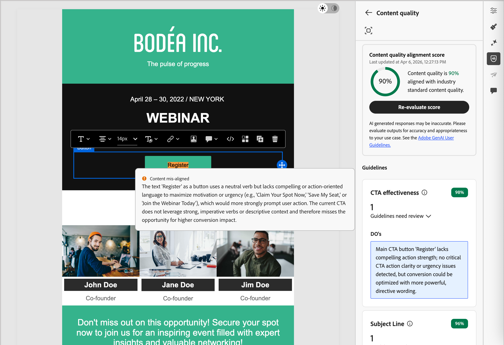

# 内容得分 {#content-scoring}

内容评估和评分可帮助您创建、审查和管理符合选定品牌](./brands-manage-create.md#brand-definitions)中定义的准则[和一般质量标准的内容。 运行评估确保电子邮件促销活动在语气、消息传递和视觉身份方面保持一致，同时在内容上线之前充当质量检查。

>[!AVAILABILITY]
>
>在Adobe Journey Optimizer B2B edition中使用AI支持的功能之前，需要[用户协议](https://www.adobe.com/cn/legal/licenses-terms/adobe-dx-gen-ai-user-guidelines.html){target="_blank"}。 有关更多信息，请与您的 Adobe 代表联系。
>
>有关产品管理员如何启用这些功能的信息，请参阅[与品牌相关的权限](./brands-overview.md#brand-related-permissions)。

## 运行评估

1. 创建电子邮件内容后，单击右侧的&#x200B;_品牌对齐方式_ （ ）图标，在电子邮件设计空间中打开&#x200B;_品牌对齐方式_&#x200B;右侧面板。

   已自动选择[默认品牌](./brands-manage-create.md#default-brand)。

   {width="600" zoomable="yes"}

   您可以单击面板顶部的&#x200B;_全屏_ （ ）图标，以全屏模式显示品牌对齐工具。

1. 如果需要，请单击&#x200B;**[!UICONTROL 品牌]**&#x200B;菜单箭头（）以选择其他已发布的品牌。

1. 单击&#x200B;**[!UICONTROL 评估得分]**，为内容与选定品牌的对齐程度评分。

   系统会根据选定品牌的指南评估内容，并显示相应的得分。

   {width="600" zoomable="yes"}

## 品牌一致性得分 {#brand-score}

>[!CONTEXTUALHELP]
>id="ajo-b2b_brand_score_overview"
>title="品牌选择"
>abstract="选择您的品牌，以确保您的内容制作符合其特定的指导方针、标准和身份，从而保持一致性和品牌完整性。"

>[!CONTEXTUALHELP]
>id="ajo-b2b_brand_score"
>title="品牌一致性得分"
>abstract="您的品牌协调得分衡量您的内容遵守品牌准则的程度，以确保颜色、字体、徽标、图像和书写风格的一致性。"

>[!CONTEXTUALHELP]
>id="ajo-b2b_brand_colors_score"
>title="颜色得分"
>abstract="颜色得分"

>[!CONTEXTUALHELP]
>id="ajo-b2b_brand_fonts_score"
>title="字体得分"
>abstract="字体得分"

>[!CONTEXTUALHELP]
>id="ajo-b2b_brand_logos_score"
>title="徽标得分"
>abstract="徽标得分"

>[!AVAILABILITY]
>
>此功能目前作为公共测试版提供。

当您的品牌得到明确定义和发布时，请直接在电子邮件设计空间内评估您的品牌一致性分数，以确保内容符合您的品牌准则：

根据评估的电子邮件内容中标识的违规来计算得分：

* 100 =完美 — 未找到违规
* 80-99 =良好 — 仅轻微违规
* 60-79 =公平 — 一些重大违反行为
* 60以下=差 — 严重违规需要注意

您可以更详细地查看评估结果，以帮助您识别违规并提高类别一致性分数（_高_、_Medium_&#x200B;和&#x200B;_低_）并查看详细信息。

对于&#x200B;**[!UICONTROL 写入样式]**&#x200B;或&#x200B;**[!UICONTROL 可视内容]**，单击&#x200B;_展开_ （）箭头以显示评估的详细信息。

{width="600" zoomable="yes"}

单击&#x200B;_全屏_ （ ）图标，详细查看insight的每个得分。

选择任意已标记的准则以查看特定反馈和建议。

{width="700" zoomable="yes"}

您可以更改内容，然后单击&#x200B;**[!UICONTROL 重新评估分数]**&#x200B;以运行另一个评估并检查改进的结果。

## 内容质量分数 {#quality-score}

>[!CONTEXTUALHELP]
>id="ajo-b2b_quality_score_overview"
>title="内容质量"
>abstract="评估总体内容质量，以确定可读性、内容一致性和有效性方面的潜在问题。 质量评估与您的品牌指南无关。"

>[!NOTE]
>
>内容质量评估与品牌指南无关。 即使选择了品牌，其准则也不应用于质量检查。 品牌选择仅与品牌关联度评分相关。

除了品牌协调之外，您还可以评估总体内容质量，以确定可读性、内容一致性和有效性方面的潜在问题，而不受品牌指南的影响。

滚动到&#x200B;**[!UICONTROL 内容质量]**&#x200B;部分以查看质量见解和推荐。

{width="600" zoomable="yes"}

选择任意已标记的项目以查看特定反馈和可操作的改进建议。 得分基于以下类别：

* **[!UICONTROL CTA效果]**：评估您的call-to-action在多大程度上促使读者采取所需的操作。
* **[!UICONTROL 主题行]**：评估清晰度、相关性和吸引注意力的质量，以鼓励打开电子邮件。
* **[!UICONTROL 可读性]**：衡量内容对读者来说有多么容易理解和引人入胜。
* **[!UICONTROL 垃圾邮件检查]**：识别可能影响投放能力的常见垃圾邮件触发器。
* **[!UICONTROL 内容一致性]**：确保您的内容流畅处理并停留在主题上。
* **[!UICONTROL 校对]**：检查拼写、语法和清晰度问题。

单击&#x200B;_全屏_（ ）图标获取质量分数的详细视图。

{width="700" zoomable="yes"}

根据推荐，您可以编辑内容以提高可读性、内容一致性和总体质量。 更改质量分数后，单击&#x200B;**[!UICONTROL 重新评估分数]**。
