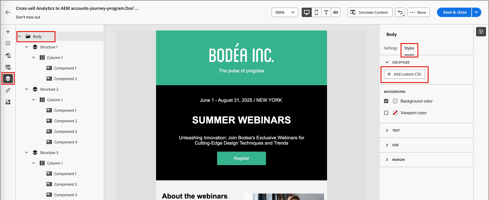

# 为内容添加自定义CSS

您可以直接在电子邮件或登陆页面设计空间中添加自己的自定义CSS。 使用自定义CSS可应用高级和特定的样式，以便更加灵活地控制内容的外观。

使用`<head>`属性将自定义CSS附加到`<style>`标记中的`data-name="global-custom"`部分。 此结构可确保将自定义样式全局应用于内容。

+++ 实施示例

```html
<!DOCTYPE html>
<html>
  <head>
    <meta charset="utf-8">
    <meta name="content-version" content="3.3.31">
    <meta name="x-apple-disable-message-reformatting">
    <meta name="viewport" content="width=device-width,initial-scale=1.0">
    <style data-name="default" type="text/css">
      td { padding: 0; }
      th { font-weight: normal; }
    </style>
    <style data-name="grid" type="text/css">
      .acr-grid-table { width: 100%; }
    </style>
    <style data-name="acr-theme" type="text/css" data-theme="default" data-variant="0">
      body { margin: 0; font-family: Arial; }
    </style>
    <style data-name="media-default-max-width-500px" type="text/css">
      @media screen and (max-width: 500px) {
        body { width: 100% !important; }
      }
    </style>
    <style data-name="global-custom" type="text/css">
      /* Add you custom CSS here */
    </style>
  </head>
  <body>
    <!-- Minimal content -->
  </body>
</html>
```

+++

>[!NOTE]
>
>所选组件的&#x200B;_[!UICONTROL 样式]_&#x200B;面板中未反映或验证自定义CSS。 它是完全独立的，只能通过Body组件级别的[!UICONTROL 添加自定义CSS]选项进行修改。

## 添加您的自定义CSS

1. 在画布中添加了至少一个内容组件后，在左侧导航中选择&#x200B;**[!UICONTROL 正文]**&#x200B;组件。

1. 选择右侧的&#x200B;_样式_&#x200B;选项卡，然后单击&#x200B;**[!UICONTROL 添加自定义CSS]**。

   {width="800" zoomable="yes"}

   >[!NOTE]
   >
   >_[!UICONTROL 添加自定义CSS]_&#x200B;按钮仅在选择了&#x200B;_[!UICONTROL 正文]_&#x200B;组件时可用。 但是，您可以将自定义CSS样式应用于其中的所有组件。

   _[!UICONTROL 添加自定义CSS]_&#x200B;弹出编辑器显示占位符代码注释。

1. 在编辑器中输入CSS代码。

   请确保自定义CSS有效并遵循正确的语法。 如果输入的CSS无效，则会显示一条错误消息，并且无法保存CSS。 若要了解详细信息，请参阅[CSS有效期](#css-validity)。

   {width="450"}

1. 单击&#x200B;**[!UICONTROL 保存]**&#x200B;以保存自定义CSS。

   自定义样式表应用于现有内容。 您可以检查自定义CSS是否已根据您的需求应用。 有关如何进行更改并调整样式表应用程序的信息，请参阅[疑难解答](#troubleshooting)。

   {width="600" zoomable="yes"}

## CSS有效性

>[!CAUTION]
>
>用户负责其自定义CSS的安全性。 确保CSS不会引入漏洞或与现有内容冲突。
>
>避免使用可能无意中破坏内容布局或功能的CSS。

+++ 有效CSS的示例

```css
.acr-component[data-component-id="form"] {
  display: flex;
  justify-content: center;
  background: none;
}

.acr-Form {
  width: 100%;
  padding: 20px 100px;
  border-spacing: 0px 8px;
  box-sizing: border-box;
  margin: 0;
}

.acr-Form .spectrum-FieldLabel {
  width: 20%;
}

.acr-Form.spectrum-Form--labelsAbove .spectrum-FieldLabel,
.acr-Form [data-form-item="checkbox"] .spectrum-FieldLabel {
  width: auto;
}

.acr-Form .spectrum-Textfield {
  width: 100%;
}

#acr-form-error,
#acr-form-confirmation {
  width: 100%;
  padding: var(--spectrum-global-dimension-static-size-500);
  display: flex;
  align-items: center;
  flex-direction: column;
  justify-content: center;
  gap: var(--spectrum-global-dimension-static-size-200);
}

.spectrum-Form-item.is-required .spectrum-FieldLabel:after{
  content: '*';
  font-size: 1.25rem;
  margin-left: 5px;
  position: absolute;
}

/* Error field placeholder */
.spectrum-HelpText {
  display: none !important;
}

.spectrum-HelpText.is-invalid,
.is-invalid ~ .spectrum-HelpText {
  display: flex !important;
}
```

```css
@media only screen and (min-width: 600px) {
  .acr-paragraph-1 {
    width: 100% !important;
  }
}
```

+++

+++ 无效CSS的示例

不接受使用`<style>`标记：

```html
<style type="text/css">
  .acr-Form {
    width: 100%;
    padding: 20px 100px;
    border-spacing: 0px 8px;
    box-sizing: border-box;
    margin: 0;
  }
</style>
```

不接受无效语法，例如缺少大括号：

```css
body {
  background: red;
```

+++

## 导入内容中的CSS

如果要对导入到电子邮件或登陆页面设计空间中的内容使用自定义CSS，请考虑以下事项：

* 如果导入包括CSS的外部HTML内容，则<!-- unless converting that content, -->该内容将在[!UICONTROL 兼容模式]中填充，并且[!UICONTROL CSS样式]部分不可用。

* 如果导入最初在电子邮件或登陆页设计空间中使用[!UICONTROL 添加自定义CSS]选项创建的内容，则应用的CSS将通过同一选项显示和编辑。

## 故障排除

如果自定义CSS未按预期应用，请使用浏览器开发人员工具检查内容，并验证CSS是否针对正确的选择器。 查看样式代码时，请考虑以下事项：

* 检查您的CSS是否有效并且没有语法错误（例如缺少大括号、属性名称不正确）。

* 检查您的CSS是否已添加到具有`<style>`属性的`data-name="global-custom"`标记中。

* 检查`global-custom`样式标记是否已将属性`data-disabled`设置为true，例如：

  `<style data-name="global-custom" type="text/css" data-disabled="true"> body: { color: red; } </style>`

* 检查您的CSS是否未在内容中的某个位置被覆盖，例如应用的内联样式。

* 将`!important`添加到您的声明以确保它们优先，例如：

  ```
  .acr-Form {
  background: red !important;
  }
  ```
