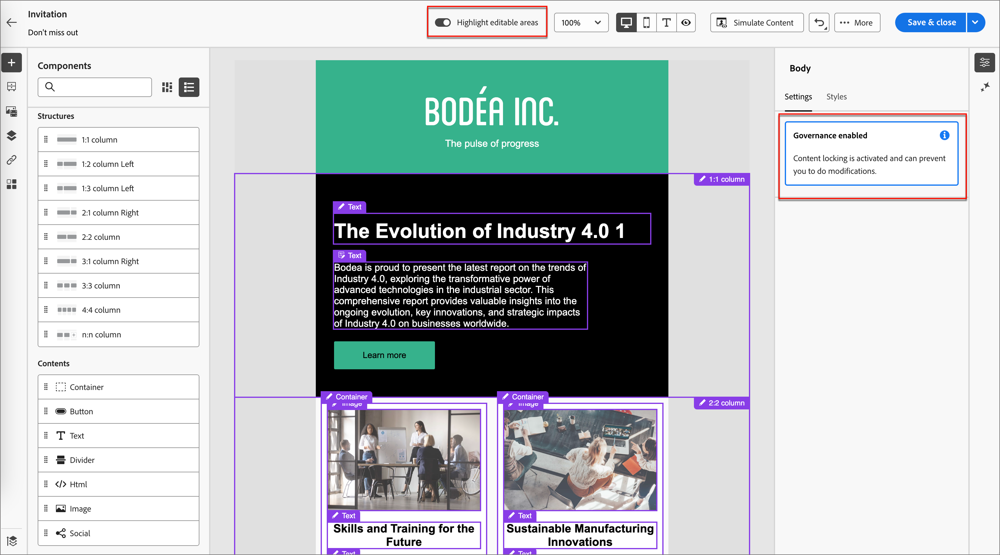

# 从受管辖模板创作

创建电子邮件模板时，内容设计者可以启用[管理（_内容锁定_）](./template-content-governance.md)。 利用治理功能，他们可以指定在帐户历程中使用时无法更改的设计部分。 当您[选择保存的模板](./email-authoring.md#select-a-template)来创作电子邮件时，可视化设计空间将加载该模板，以便您可以将其用作电子邮件的基础。

如果模板启用了管理，则右侧的“属性”面板中会显示警报。 您可以打开画布顶部的&#x200B;**[!UICONTROL 突出显示可编辑区域]**，以查看可在历程中使用的组件和内容元素。

{width="800" zoomable="yes"}

您还可以使用&#x200B;_导航树_&#x200B;确定锁定或可编辑的元素。 单击画布左侧的&#x200B;_导航树_&#x200B;图标（）以显示树。

{width="600" zoomable="yes"}

这些图标指示已应用的内容锁定设置。

| 图标 | 名称 | 描述 |
|------|------|-------------|
|  | 只读 | 组件已锁定，无法编辑。 在根（_[!UICONTROL 正文]_）级别应用时，所有子组件都将被锁定且无法编辑。 |
|  | 内容锁定 | 在组件级别应用内容锁定。 |
|  | 可编辑 | 该组件是完全可编辑的。 但是，您可能无法删除该元素。 |
|  | 可编辑 — 仅内容 | 组件和样式是静态的，但您可以更改内容（如文本或图像）。 |
